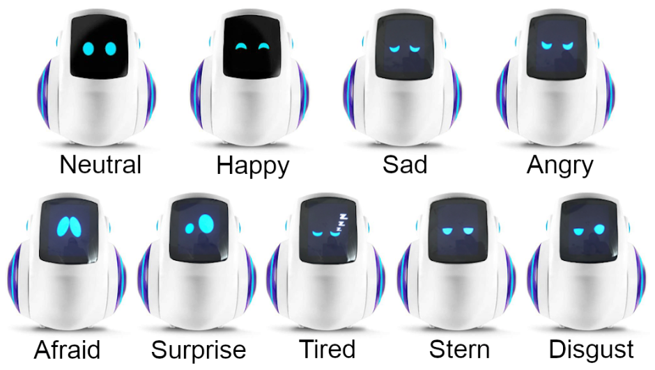

# About The Robot Faces Book

The book is designed to be a fun way to teach concepts in computational thinking by
teaching students how to draw faces on a low-cost OLED display.  
It was designed to use low-cost parts to keep robot kits as low as possible.  
Most classrooms can create projects for under $35 per robot if you purchase parts in a quantity of 10.

## Primary Goals

1. Create hands-on lessons that are fun for students
2. Teach fundamentals of computational thinking such as abstractions, functions and modularity
3. Decompose a complex face into parts (eyes, eyebrows, mouth) with parameters
4. Get students to think about how faces are used to communicate emotions

Sample faces from the Miko Social Robot

