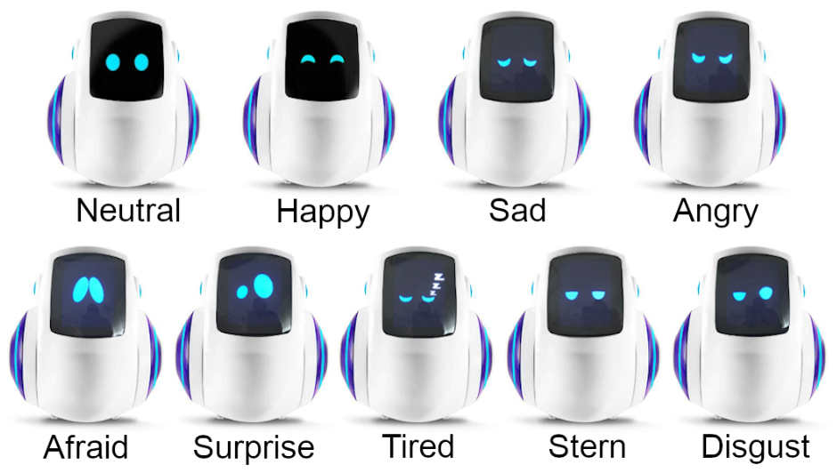

# About This Book

!!! mascot-welcome "Hi again — I'm Pixel!"
    { class="mascot-admonition-img" }
    I'm the round-face robot who shows up whenever there's something worth
    noticing in this book. My whole body is a display, so every eye, eyebrow,
    and mouth you learn to draw here is a part I'm made of too. Stick around —
    every pixel tells a story!

## Where This Book Came From

This book started as a distraction.

Dan McCreary has spent years teaching robotics in coding clubs, where students
build small wheeled robots from a Raspberry Pi Pico, a handful of sensors, and
a breadboard. The lesson plans were about motors, distance sensors, and
navigation. But something kept happening: the moment a student got a tiny OLED
display working, everything else stopped. Kids would spend hours — not minutes,
*hours* — nudging pixels around to get an eyebrow to sit just right, or arguing
about whether a mouth curve read as "happy" or "smug."

They weren't off task. They were doing the hardest and most rewarding work in
the room. Getting a face to communicate a feeling means decomposing a problem,
choosing an abstraction, tuning parameters, testing against a real audience, and
iterating — the entire computational thinking cycle, driven by a student's own
curiosity instead of a worksheet.

Even a one-inch OLED display can hold a genuinely good face. When the robot kits
were upgraded to the larger, brighter 2.42-inch OLED displays, the faces got
better, the students got more ambitious, and the "distraction" clearly needed a
book of its own. So this one was pulled out of the general robotics curriculum
and given its own home — an intelligent textbook dedicated entirely to robot
faces.

Dan sincerely loves teaching this material to students around the world. It
pairs some of the lowest-cost hardware in all of STEM education with real depth
of programming, and that combination is rare. A complete robot face kit costs
under $30. What students learn building it is worth considerably more.

## Why This Intelligent Textbook

Robots that show emotion connect with people more easily, and a small screen
where a face should be is the cheapest way to give a machine a personality. That
one idea sits at an unusual intersection: it is inexpensive enough for any
classroom, visual enough to hook a student in the first five minutes, and deep
enough to carry a full course in abstraction, decomposition, and modularity.

**In the United States:**

- Code.org's 2025 *State of AI + Computer Science Education* report found that
  **60% of U.S. public high schools** now offer a foundational computer science
  course — which means roughly **four in ten still do not**[^1]
- National **participation in CS courses stayed essentially flat** year over
  year, even as access slowly expanded — offering a course and filling it are
  two different problems[^1]
- The clearest gains came from the **12 states with CS graduation
  requirements**, which saw an 18% increase in access and a 5.1% increase in
  participation[^1]

**Worldwide:**

- Nearly **20 million service robots for consumer use** were sold in 2024, an
  11% increase over the prior year, according to the International Federation of
  Robotics' *World Robotics 2025* report[^2]
- The Raspberry Pi Foundation counts **7,494 active Code Clubs across 102
  countries**, plus more than **600 active CoderDojos**, most of them run by
  volunteers working with donated or shoestring budgets[^3]

Those flat participation numbers are the ones that matter here. Access is not
the whole problem — students also have to *want* to walk into the room. A robot
that looks back at you is a very good reason to walk into the room.

This book takes a different approach than a traditional programming text. It is
built on a **learning graph of 293 interconnected concepts** organized into 13
categories and 509 prerequisite relationships, so concepts are introduced only
after the ideas they depend on are already in place. Throughout the chapters
you'll find **48 interactive MicroSims** — browser-based simulations that let
you drag an eyebrow angle, step through a draw order, or pack an RGB565 color
bit by bit, and see the result immediately. Every drawing technique targets real
hardware you can hold: a $20 monochrome OLED and a $10 color round display,
both driven by a Raspberry Pi Pico. And the whole textbook is **open source and
free** — no paywalls, no access codes, no annual editions.

## How to Use This Book

This textbook is designed for self-paced study and for classroom or coding-club
use. Each chapter builds on the ones before it, so reading in order is
recommended. The book includes:

- **16 Chapters** covering hardware and wiring, MicroPython fundamentals,
  coordinate systems and frame buffers, drawing primitives, ellipses and
  polygons, facial anatomy and layout, emotion psychology, expression design and
  human-robot interaction, animation and timing, interactive controls, color
  display porting, and a computational thinking capstone
- **20 Lessons** — short, focused walkthroughs of a single drawing or
  interaction skill, each with rendered sample output so you can check your work
- **48 Interactive MicroSims** embedded throughout the chapters
- **16 Chapter Quizzes** containing 160 questions across Bloom's Taxonomy levels
- **A Learning Graph** visualizing all 293 concepts and how they connect
- **Stories** about the commercial robots that pioneered screen-based faces
- **A Glossary**, a **References** list, and a **Parts List** with current
  sourcing and prices
- **Search**, available from any page

Start with [Getting Started](getting-started.md) to order parts and set up
Thonny, then move to
[Chapter 1: Hardware & Electronics Foundations](chapters/01-hardware-electronics-foundations/index.md).
If you'd rather explore non-linearly or check the prerequisites for a specific
topic, begin at the [Learning Graph](learning-graph/index.md).

Teachers and club mentors: the [Parts List](parts-lists.md) includes bulk
sourcing notes for building a class set of ten kits, and every MicroSim can be
embedded in an external LMS page with a plain `<iframe>`.

## About the Author

{ width="150px" align="right" }

Dan McCreary is a semi-retired AI researcher, solution architect, and educator
who has spent more than three decades helping Fortune 100 organizations reason
over massive datasets. At Optum he founded the Generative AI Center of
Excellence and led the team that built one of the world's largest healthcare
knowledge graphs — spanning over 25 billion vertices — to unify member,
provider, and patient insights. Dan's deep background in knowledge
representation and systems thinking underpins the precise learning graphs and
intelligent textbook workflows used throughout this course.

He is the co-author of *Making Sense of NoSQL* (Manning Publications), the
founding chair of the NoSQL Now! conference, and a frequent keynote speaker on
semantic search, ontology strategy, and AI hardware. Beyond industry, Dan has
mentored students as a STEM volunteer since 2014, teaching robotics and
microcontroller programming in CoderDojo-style coding clubs — which is exactly
where this book began. You can visit the
[Intelligent Textbooks Case Studies](https://dmccreary.github.io/intelligent-textbooks/case-studies/)
to see over 87 textbooks that Dan has created or co-created with other authors.

**Selected Credentials**

- B.A. in Physics and Computer Science from Carleton College
- M.S.E.E. from the University of Minnesota
- MBA coursework at the University of St. Thomas
- Patent holder in semantic search and ontology management techniques
- Advocate for large-scale Enterprise Knowledge Graph adoption across healthcare
  and education
- Long-time promoter of accessible, low-cost AI-powered learning experiences

## How to Cite This Book

If you reference this textbook in academic work, curriculum proposals, lesson
plans, or other publications, please use one of the following citation formats.

**APA (7th edition)**

McCreary, D. (2026). *Robot Faces: Drawing Expressive Displays for STEM Robots*.
https://dmccreary.github.io/robot-faces/

**Chicago (17th edition)**

McCreary, Dan. 2026. *Robot Faces: Drawing Expressive Displays for STEM Robots*.
https://dmccreary.github.io/robot-faces/.

**MLA (9th edition)**

McCreary, Dan. *Robot Faces: Drawing Expressive Displays for STEM Robots*. 2026,
dmccreary.github.io/robot-faces/.

**BibTeX**

```bibtex
@book{mccreary2026robotfaces,
  title     = {Robot Faces: Drawing Expressive Displays for STEM Robots},
  author    = {McCreary, Dan},
  year      = {2026},
  url       = {https://dmccreary.github.io/robot-faces/},
  note      = {Interactive intelligent textbook}
}
```

To cite a specific chapter, append the chapter number and title — for example:

McCreary, D. (2026). Chapter 1: Hardware & Electronics Foundations. In *Robot
Faces: Drawing Expressive Displays for STEM Robots*.
https://dmccreary.github.io/robot-faces/chapters/01-hardware-electronics-foundations/

## License

This work is released under the
[Creative Commons Attribution-NonCommercial-ShareAlike 4.0 International License
(CC BY-NC-SA 4.0)](https://creativecommons.org/licenses/by-nc-sa/4.0/). You are
free to share and adapt the material for non-commercial purposes as long as you
give appropriate credit and share your adaptations under the same license.

Teachers, coding clubs, and after-school programs are explicitly welcome to
fork the [GitHub repository](https://github.com/dmccreary/robot-faces), swap in
their own hardware or branding, and redistribute the result under the same
terms.

## Sample Faces

Sample faces from the Miko social robot — a commercial companion robot that
uses screen-based eyes as its primary emotional interface, and one of the four
robots studied in
[Chapter 2](chapters/02-history-of-robot-faces/index.md).



## References

[^1]: Code.org Advocacy Coalition, CSTA, and ECEP Alliance. (2025). *2025 State of AI + Computer Science Education Report*. https://advocacy.code.org/stateofcs/
[^2]: International Federation of Robotics. (2025). *World Robotics 2025 — Service Robots*. https://ifr.org/ifr-press-releases/news/service-robots-see-global-growth-boom
[^3]: Raspberry Pi Foundation. (2025). *Code Club Annual Survey Report 2025*. https://static.raspberrypi.org/files/about/Code_Club_annual_survey_report_2025.pdf
