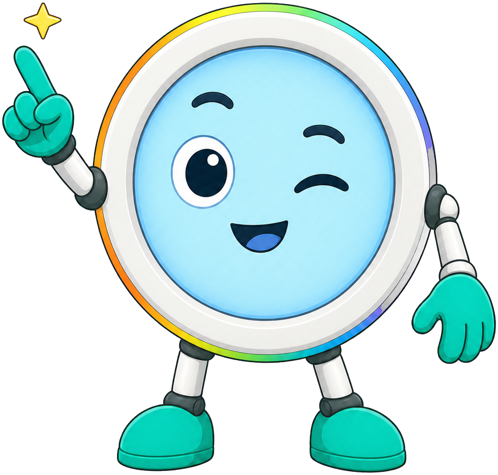
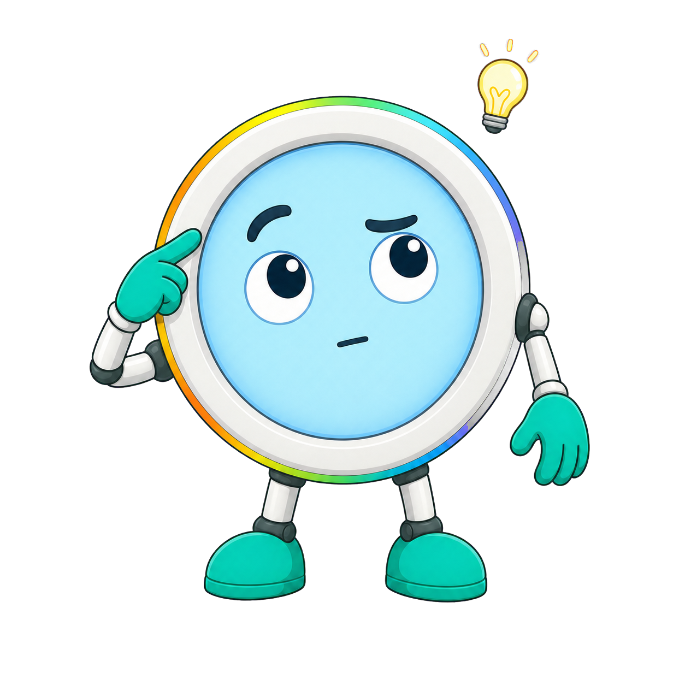
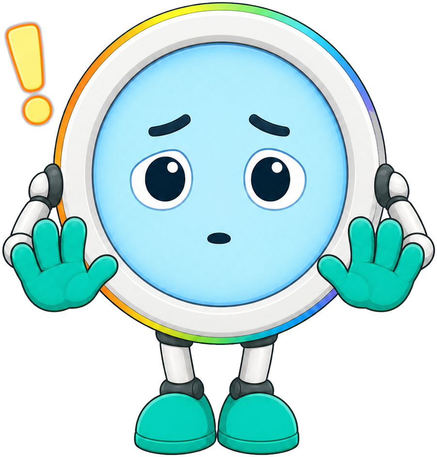

# Porting Faces to a Color Display

## Summary

This chapter adapts everything students have built on the monochrome OLED to the 240x240 color round display, covering the RGB565 color model and the color565() function, named colors and color palettes, round-display layout differences, and the performance, memory, and SPI-speed trade-offs of driving a color display. After completing this chapter, students will be able to port a monochrome face design to the color round display and explain the performance trade-offs involved.

## Concepts Covered

This chapter covers the following 21 concepts from the learning graph:

1. RGB565 Color Model
2. Color565 Function
3. Red Green Blue Channels
4. Color Bit Depth
5. Color Palette
6. Named Color Constants
7. Color Wheel Function
8. Color Cycling Animation
9. Round Display Layout
10. Color Versus Mono Trade-Off
11. Display Driver Porting
12. Cross-Display Code Compatibility
13. Color Contrast Design
14. Color Emotion Association
15. Display Performance Comparison
16. Memory Use Comparison
17. SPI Bus Speed
18. Color Display Init Sequence
19. Color Theory Basics
20. Warm Versus Cool Color
21. Hue Saturation Brightness

## Prerequisites

This chapter builds on concepts from:

- [Chapter 1: Hardware & Electronics Foundations](../01-hardware-electronics-foundations/index.md)
- [Chapter 3: MicroPython Fundamentals I: Syntax, Data & Loops](../03-micropython-fundamentals-1/index.md)
- [Chapter 4: MicroPython Fundamentals II: Functions & the FrameBuf Module](../04-micropython-fundamentals-2/index.md)
- [Chapter 5: Display & Coordinate Systems](../05-display-coordinate-systems/index.md)
- [Chapter 6: Basic Drawing Primitives](../06-basic-drawing-primitives/index.md)
- [Chapter 9: Facial Anatomy & Layout Design](../09-facial-anatomy-layout-design/index.md)
- [Chapter 11: Expression Design, Readability & Human-Robot Interaction](../11-expression-design-readability-hri/index.md)
- [Chapter 12: Animating Expressions: Timing & Motion](../12-animating-expressions/index.md)

---

## Everything You Built Just Learned to Use Color

!!! mascot-welcome "Time to Turn the Lights On"
    { class="mascot-admonition-img" }
    Chapters 6 through 14 built an entire expressive vocabulary on the monochrome OLED — quadrant-filled eyes, symmetric eyebrows, animated blinks, a whole rubric for reading an expression correctly. None of that work gets thrown away here. This chapter hands that same vocabulary a color palette and shows you exactly what changes, and — just as importantly — what doesn't.

Chapter 1 introduced the GC9A01 color round display as a piece of hardware: a 240x240 circular glass driven over the same SPI bus as the OLED. Chapter 5 explained how that display's frame buffer works as a square holding an inscribed circle, and calculated that its 16-bit-per-pixel buffer needs 115,200 bytes compared to the OLED's 1,024. This chapter is where those two threads meet the drawing code you've already written, and where you'll learn exactly how much of it survives the move unchanged.

Before touching any code, it helps to understand what "color" actually means to a computer — not as an art-class idea, but as numbers a display chip can act on.

## Color Theory Basics: Hue, Saturation, and Brightness

**Color theory basics** describe the handful of properties designers use to talk about any color precisely instead of vaguely — "a warmer red" or "a duller blue" are useful phrases, but a program needs exact numbers. The most common way to describe a color breaks it into three separate properties, each answering a different question about that color.

- **Hue** answers "which color, fundamentally?" — it is the base color itself, like red, orange, yellow, green, blue, or purple, often pictured as a position around a circular color wheel.
- **Saturation** answers "how intense or pure is it?" — a fully saturated red looks vivid and rich, while a low-saturation red drifts toward a washed-out, grayish pink.
- **Brightness** (sometimes called *value* or *lightness*) answers "how light or dark is it?" — the same saturated red can range from a nearly black maroon to a pale, glowing pink depending on brightness alone.

Together, these three properties are usually called **hue, saturation, and brightness**, or HSB for short. Knowing all three lets you describe *any* color a screen can display with just three numbers, which turns out to be exactly the kind of precision code needs.

!!! mascot-tip "Three Numbers, Any Color"
    { class="mascot-admonition-img" }
    Try picturing a color wheel like a clock face: hue is which hour hand position you're pointing at, saturation is how far out from the center you are, and brightness is a completely separate dial for how much light is mixed in. Change any one dial and the other two stay put — that independence is what makes HSB such a useful way to think about color.

One especially useful side effect of thinking in hue is that colors group naturally into two emotional families, an idea worth introducing now because it resurfaces later in this chapter.

## Warm Versus Cool Color

**Warm versus cool color** is a long-standing design convention that groups hues by the feeling they tend to evoke rather than by any physical property of light. Reds, oranges, and yellows are considered **warm colors** — they read as energetic, urgent, or exciting, the same colors associated with fire and sunlight. Blues, greens, and purples are considered **cool colors** — they read as calm, quiet, or serious, the same colors associated with water, sky, and shade.

This is a design convention, not a law of physics — nothing about a blue photon is actually "calmer" than a red one. Designers rely on it anyway because it works reliably across most viewers, and it gives a robot-face designer a second tool, beyond shape, for signaling how an expression should feel. Holding onto this warm-versus-cool grouping now sets up a much more specific idea later in the chapter: matching or deliberately clashing a color with the emotion a face's shape already communicates.

With color theory basics established, it's time to see how a computer actually stores one of these colors as bits in memory — starting with the same bit-depth idea Chapter 5 used for monochrome pixels.

## Red, Green, Blue Channels and Color Bit Depth

Every color a screen can display, no matter how it's described in words, is ultimately built by mixing light from three separate sources. **Red green blue channels** — usually just called RGB — are the three component values a display combines to produce any visible color: a red intensity, a green intensity, and a blue intensity, mixed together the way stage lighting blends colored spotlights into a single beam.

Chapter 5 defined **bit depth** as the number of bits used to store each pixel's value, and applied that idea to the OLED's simple 1-bit on/off pixels. Color pixels use bit depth the same way, except now that budget of bits has to be divided three ways, one share for each channel. "True color," the standard used by most computer monitors and phone screens, spends 8 bits on each channel — 24 bits total — which allows 256 possible intensities per channel and about 16.7 million total colors.

The GC9A01 color round display in this book is more modest than that. It uses only 16 bits total to describe a pixel's color, split unevenly across all three channels combined, rather than 24. That's a real design trade-off worth previewing now: fewer bits per pixel means less memory per pixel, but also fewer possible colors than a phone screen can show. The next section explains exactly how those 16 bits get divided.

## The RGB565 Color Model

The **RGB565 color model** is the specific 16-bit color format this display's driver expects: 5 bits for red, 6 bits for green, and 5 bits for blue, packed into a single 16-bit number for every pixel. The name comes directly from that split — "5, 6, 5" — and it is worth noticing immediately that green gets one extra bit compared to red and blue.

That extra green bit is not an accident. Human eyes contain more receptors sensitive to green light than to red or blue light, so human vision can distinguish far more shades of green than it can shades of red or blue at the same bit budget. RGB565 spends its limited 16 bits where human perception can actually tell the difference: 5 bits of red allows 32 red intensities, 6 bits of green allows 64 green intensities, and 5 bits of blue allows 32 blue intensities.

This connects directly back to Chapter 5's frame buffer size formula, now with a different number to plug in for bit depth.

| Display | Bits per Pixel | Bytes per Pixel | Resolution | Total Buffer Size |
|---|---|---|---|---|
| 128x64 monochrome OLED | 1 bit | 1/8 byte | 128 x 64 | 1,024 bytes |
| 240x240 RGB565 color round | 16 bits | 2 bytes | 240 x 240 | 115,200 bytes |

Where the OLED needed 8 pixels to fill a single byte, RGB565 flips that relationship completely — every single pixel now needs 2 whole bytes, one it didn't need to share with anyone. That single change, from a fraction of a byte per pixel to 2 full bytes per pixel, is responsible for nearly all of the difference between 1,024 bytes and 115,200 bytes, a comparison this chapter revisits in detail once every other color concept is in place.

Knowing that a color is "5 bits red, 6 bits green, 5 bits blue" is only useful if you can actually build one of those 16-bit numbers from ordinary color values — which is exactly what the next function does.

## The color565() Function: Packing Three Colors into One Number

Most of the time, a person thinking about color doesn't naturally think in 5-bit or 6-bit chunks — it's far more natural to describe red, green, and blue each on a familiar 0-to-255 scale, the same scale used almost everywhere else in computing. The **color565 function**, `color565(r, g, b)`, bridges that gap: it accepts three ordinary 0-255 channel values and packs them into a single RGB565 integer, using exactly the bitwise operators and bit shifting Chapter 4 introduced.

!!! mascot-thinking "The Trick Chapter 4 Was Warning You About"
    { class="mascot-admonition-img" }
    Remember the tip back in Chapter 4, promising that bit shifting would return in Chapter 15? This is that moment. `color565()` shifts three separate values into three separate slots of one number, then combines them with `|` — the exact same operator you used to combine bits back then. Nothing new to learn here, just a genuinely satisfying use for something you already know.

A bridge before the code: this function first discards the low bits of each channel to fit the 5-bit or 6-bit slot it will occupy, then shifts red and green left so all three values land in their correct positions within the final 16-bit number, and finally combines all three with `|`.

```python
def color565(r, g, b):
    """Pack 0-255 red, green, blue values into one RGB565 integer."""
    r5 = (r >> 3) & 0x1F   # keep top 5 bits of red   (0-255 -> 0-31)
    g6 = (g >> 2) & 0x3F   # keep top 6 bits of green  (0-255 -> 0-63)
    b5 = (b >> 3) & 0x1F   # keep top 5 bits of blue   (0-255 -> 0-31)
    return (r5 << 11) | (g6 << 5) | b5
```

Walking through that arithmetic step by step, using a concrete orange, `color565(255, 165, 0)`, makes the whole process visible:

1. **Shrink red:** `255 >> 3` shifts red right 3 places, discarding its 3 least significant bits and leaving `31` (the maximum a 5-bit value can hold). The `& 0x1F` mask then keeps only those 5 bits, just in case.
2. **Shrink green:** `165 >> 2` shifts green right 2 places, leaving `41` out of a possible 63. Green keeps one more bit of precision than red, exactly as RGB565's "6" promises.
3. **Shrink blue:** `0 >> 3` is still `0` — an empty channel stays empty no matter how far you shift it.
4. **Position red:** `r5 << 11` shifts the 5-bit red value left by 11 places, sliding it all the way into the top 5 bits of a 16-bit number — bit positions 15 down to 11.
5. **Position green:** `g6 << 5` shifts the 6-bit green value left by 5 places, landing it in the middle 6 bits — positions 10 down to 5.
6. **Combine with OR:** blue needs no shift at all, since it already belongs in the bottom 5 bits — positions 4 down to 0. The `|` operator merges all three shifted values into one final integer, because each one occupies its own non-overlapping slot and none of them share a `1` bit with another.

The result, `color565(255, 165, 0)`, is the integer `64160` — or, written in binary to show every slot clearly, `1111110100100000`. Split back into its three fields, that binary string reads `11111` (red, 31 of 31), `101001` (green, 41 of 63), and `00000` (blue, 0 of 31) — precisely the shrunken values calculated above, sitting exactly where the shifting placed them.

The interactive tool below lets you build this same packed value yourself, one channel at a time, and watch every shift happen live instead of on paper.

#### Diagram: RGB565 Bit-Packing Visualizer

<iframe src="../../sims/rgb565-bit-packing-visualizer/main.html" width="100%" height="582px" scrolling="no"></iframe>

<details markdown="1">
<summary>RGB565 Bit-Packing Visualizer</summary>
Type: microsim
**sim-id:** rgb565-bit-packing-visualizer<br/>
**Library:** p5.js<br/>
**Status:** Specified

Bloom Taxonomy Level: Apply (L3)
Bloom Taxonomy Verb: calculate, demonstrate, apply

Learning objective: Apply the color565() bit-shifting process by adjusting red, green, and blue channel sliders (0-255 each) and calculating the resulting 16-bit RGB565 binary layout, packed hex value, and packed integer value.

Canvas layout:
- Top: three sliders (Red, Green, Blue), each 0-255, with a live color swatch showing the mixed result
- Middle: three rows showing each channel's shrink step — original 8-bit value, the shift arrow, and the resulting 5-bit or 6-bit value
- Bottom: a single 16-bit binary strip divided into three color-coded segments (5 red bits, 6 green bits, 5 blue bits), plus the packed value shown as binary, hex, and decimal

Visual elements:
- Red, Green, Blue sliders with numeric readouts, each slider's track tinted its own channel color
- A large color swatch square that updates live to show the actual mixed RGB565 color (quantized to what the display can really show, not the original 8-bit value)
- Three "shrink" rows: e.g. "Red: 255 -> shift right 3 -> 11111 (31)", updating live as the slider moves
- The final 16-bit strip, 16 individual bit boxes, colored red/green/blue by segment, showing 1s and 0s
- Packed value readouts: binary (16 digits), hex (e.g. "0xFAA0"), and decimal (e.g. "64160")

Interactive controls:
- Red slider (0-255)
- Green slider (0-255)
- Blue slider (0-255)
- "Try a Named Color" dropdown that jumps all three sliders to a preset (Red, Orange, Yellow, Green, Cyan, Blue, Purple, White, Black)
- "Reset" button restores R=0, G=0, B=0 (black)

Default parameters: R=255, G=165, B=0 (orange), matching the chapter's worked example

Data Visibility Requirements:
  Stage 1: Show the three raw 0-255 slider values and the true-color swatch they represent
  Stage 2: Show each channel's shift operation and resulting shrunken value (5 or 6 bits)
  Stage 3: Show the three shrunken values placed into their bit positions within the 16-bit strip
  Stage 4: Show the final combined binary, hex, and decimal packed value, plus the quantized color swatch as actually shown on a real RGB565 display

Interaction: Direct manipulation — every slider movement immediately recalculates and redraws all three stages, matching the worked example's step-by-step structure rather than animating a transition

Instructional Rationale: An Apply-level objective (calculate, demonstrate, apply) requires the learner to manipulate real channel values and observe the exact bit-shift arithmetic recalculate, which direct slider control supports far better than a static diagram of one fixed example; letting the learner reproduce the chapter's own orange example builds confidence before exploring new colors.

Responsive design: sliders and swatch stack above the shrink rows and bit strip on narrow viewports; the 16-bit strip shrinks its box width but never wraps to two lines.

Implementation: p5.js for sliders, live swatch rendering, and the bit-strip visualization; the packing math is implemented in JavaScript exactly mirroring the MicroPython color565() function shown in the chapter text.
</details>

## Named Color Constants and a Color Palette

Typing `color565(255, 165, 0)` every time a program needs orange is not just tedious — it hides the color's identity behind an unreadable string of digits. **Named color constants** solve this the same way Chapter 6 solved it for drawing constants: compute the packed value once, store it in a variable with a descriptive all-caps name, and use that name everywhere the color is needed.

A bridge before the code: this example defines a small set of ready-to-use color constants at the top of a program, computed once using `color565()`.

```python
BLACK  = color565(0, 0, 0)
WHITE  = color565(255, 255, 255)
RED    = color565(255, 0, 0)
ORANGE = color565(255, 165, 0)
YELLOW = color565(255, 255, 0)
GREEN  = color565(0, 200, 80)
CYAN   = color565(0, 200, 220)
BLUE   = color565(30, 120, 255)
```

Every one of those names now behaves like a plain number wherever it's used — `display.fill(BLACK)` reads instantly as "clear the screen to black," where `display.fill(0)` on the color display would leave a reader guessing whether `0` even means black here.

A **color palette** takes this a step further: a deliberately chosen, limited set of named colors, grouped together because they were picked to work well as a set for one specific design. Rather than reaching for any of RGB565's 65,536 possible colors at random, a face designer typically settles on a small palette — perhaps a background color, a feature color for eyes and mouth, and one or two accent colors for highlights — the same way the monochrome chapters settled on a small set of drawing constants instead of scattering raw pixel values through the code.

| Palette Role | Constant Name | Example Color | Typical Use |
|---|---|---|---|
| Background | `BG_COLOR` | Deep navy | Fills the screen behind the face |
| Primary feature | `FEATURE_COLOR` | White or cyan | Eyes, eyebrows, mouth outline |
| Accent | `ACCENT_COLOR` | Warm coral | Highlights, glow effects |
| Warning state | `ALERT_COLOR` | Red | Low battery, error state |

Choosing a palette before writing any drawing code keeps a face visually consistent across every expression it can show — exactly the same discipline Chapter 6 taught for shape constants, now applied one level up, to color.

Constants and palettes describe fixed colors. The next idea shows what happens when a color is allowed to change smoothly over time instead.

## Color Wheel Function and Color Cycling Animation

Picture the hue property from earlier in this chapter as a position around a circle, running from red through orange, yellow, green, cyan, blue, purple, and back to red again. A **color wheel function** computes the RGB565 color sitting at any given angle around that circle, treating hue as a single continuous input instead of three separate red, green, and blue sliders.

A bridge before the code: this simplified color wheel function takes an angle from 0 to 360 degrees and returns a fully saturated, full-brightness color at that hue, sweeping smoothly from red to green to blue and back.

```python
def color_wheel(angle):
    """Return an RGB565 color at the given hue angle (0-360 degrees)."""
    angle = angle % 360
    if angle < 120:
        r, g, b = 255 - (angle * 255 // 120), (angle * 255 // 120), 0
    elif angle < 240:
        a = angle - 120
        r, g, b = 0, 255 - (a * 255 // 120), (a * 255 // 120)
    else:
        a = angle - 240
        r, g, b = (a * 255 // 120), 0, 255 - (a * 255 // 120)
    return color565(r, g, b)
```

On its own, `color_wheel()` just answers "what color is at this angle?" — the fun part happens once it's called repeatedly with a slowly changing angle. **Color cycling animation** drives that angle forward a little on every pass through Chapter 12's animation loop, producing a smoothly shifting color instead of a fixed one — a mood-ring-style background, or a glowing accent that drifts through the spectrum while an expression holds still.

Here's the bridge for this next example: it reuses the `ticks_ms()`-based timing pattern from Chapter 12, advancing the hue angle by a small amount on every frame and filling the background with whatever color that angle produces.

```python
import time

hue_angle = 0

while True:
    hue_angle = (hue_angle + 2) % 360
    display.fill(color_wheel(hue_angle))
    # draw_face(...) would go here, on top of the shifting background
    display.show()
    time.sleep_ms(30)
```

This effect is entirely optional — most expressions in this book use a fixed, deliberately chosen palette rather than a constantly shifting one — but it's a fun, low-effort way to give a robot an idle "thinking" glow between expressions, and it costs nothing beyond a single extra variable and one extra function call per frame.

Seeing hue mapped around an actual wheel, alongside the emotional associations from earlier in the chapter, makes the connection between color and feeling far more concrete than a table of hex codes.

#### Diagram: Color Wheel Emotion Picker

<iframe src="../../sims/color-wheel-emotion-picker/main.html" width="100%" height="562px" scrolling="no"></iframe>

<details markdown="1">
<summary>Color Wheel Emotion Picker</summary>
Type: microsim
**sim-id:** color-wheel-emotion-picker<br/>
**Library:** p5.js<br/>
**Status:** Specified

Bloom Taxonomy Level: Understand (L2)
Bloom Taxonomy Verb: classify, interpret, exemplify

Learning objective: Interpret a color's hue, saturation, and brightness by selecting a point on a circular color wheel, and classify the resulting color as warm or cool while exploring its common emotion association.

Canvas layout:
- Left 55%: a circular hue wheel (hue around the ring, saturation from center to edge) with a draggable selector dot, plus a separate vertical brightness slider beside it
- Right 45%: a large color swatch of the current selection, a warm/cool badge, and an emotion-association info panel

Visual elements:
- Full circular color wheel rendered with hue varying by angle and saturation varying by radius, using the same color_wheel() mapping described in the chapter text
- A draggable selector dot showing the currently picked hue and saturation
- A vertical brightness slider from black (bottom) to full brightness (top), separate from the wheel since brightness is a third independent dimension
- A large swatch panel showing the final HSB-derived color, with its packed RGB565 hex value printed beneath it
- A "Warm" or "Cool" badge that updates based on the selected hue's position (roughly reds/oranges/yellows = warm, greens/blues/purples = cool)
- An emotion-association panel listing the closest common association (e.g. "Red -> Anger, Excitement, Urgency", "Blue -> Calm, Sadness, Trust", "Yellow -> Happiness, Energy", "Green -> Calm, Natural, Safe", "Purple -> Mystery, Creativity")

Interactive controls:
- Drag the selector dot anywhere within the wheel to change hue and saturation
- Vertical brightness slider
- "Try a Preset Emotion" dropdown (Anger, Calm, Happiness, Sadness, Excitement) that jumps the selector to a representative color for that emotion
- "Reset" button returns to a mid-gray, unselected state at the wheel's center

Default parameters: selector at the wheel's center (low saturation, neutral gray), brightness slider at 75%

Behavior: dragging the selector dot immediately updates the swatch panel, the warm/cool badge, and the emotion-association text; moving the brightness slider darkens or lightens the swatch without changing hue or saturation; choosing a preset from the dropdown animates the selector dot to that emotion's representative position on the wheel.

Instructional Rationale: An Understand-level objective (interpret, classify, exemplify) is served by direct exploration paired with immediate classification feedback, letting the learner build an intuitive map between a wheel position and both the warm/cool design convention and common emotion associations, rather than memorizing a static lookup table.

Responsive design: the wheel and brightness slider stack above the swatch and info panel on narrow viewports; the wheel remains circular and fully visible by scaling to the smaller of the container's width or height.

Implementation: p5.js for the wheel rendering (drawn once to an offscreen buffer for performance) and drag-based selection; HSB-to-RGB565 conversion mirrors the chapter's color_wheel() function.
</details>

## Color Contrast Design

A color palette only helps a face if the colors inside it stay readable next to each other. **Color contrast design** is the practical discipline of choosing colors with enough visual difference between them that a viewer can still tell features apart, extending the same readability thinking Chapter 11 applied to shapes and sizes — now applied to color choices instead.

Two colors that are technically different but too close in brightness — a mid-gray eye on a mid-gray background, for instance — can be nearly invisible even though their RGB565 values are nowhere near identical. A safe habit is to pick a background color and a feature color that differ sharply in brightness, not just in hue, since brightness contrast is what the eye actually relies on most to separate a shape from its surroundings.

- Check brightness difference first, not just hue difference — two different-colored but similarly bright colors can still blur together.
- Reserve your most saturated, most contrasting color for the feature that must never be missed, like the pupils.
- Test a palette against the actual round display in normal room lighting, not just on a bright code editor screen — the same rubric-style testing habit Chapter 11 taught for shapes applies here too.

## Color Emotion Association

Shape alone already carries emotional meaning in this book's expressions — Chapter 9 and Chapter 11 spent real effort teaching how eyebrow angle and mouth curve signal feeling on their own. **Color emotion association** adds a second, independent channel on top of that shape-based signal: the idea that a color itself carries emotional connotation before a viewer even processes what shape it's painted onto.

The warm-versus-cool grouping from earlier in this chapter maps loosely onto common associations designers rely on:

| Color | Common Emotion Association | Warm or Cool |
|---|---|---|
| Red | Anger, excitement, urgency | Warm |
| Orange | Energy, enthusiasm | Warm |
| Yellow | Happiness, alertness | Warm |
| Green | Calm, safety, "go" | Cool |
| Blue | Calm, sadness, trust | Cool |
| Purple | Mystery, creativity | Cool |

A robot-face designer has two real choices once this table is in hand: **reinforce** an expression's shape-based signal by matching its color, or **contrast** it deliberately. A drawn angry expression — sharp downward eyebrows, a tight frown — reads as even more intense filled in with red, reinforcing the same message twice. But a face colored a soft blue while its shape still reads "excited" sends a mixed signal, which is sometimes exactly the effect a designer wants for something like a gentle, low-key alert that shouldn't feel alarming. Neither choice is automatically correct — it depends entirely on what a specific robot needs to communicate.

!!! mascot-encourage "You're Now Designing With Two Channels at Once"
    { class="mascot-admonition-img" }
    Juggling shape and color together can feel like a lot at first, especially after chapters of focusing on shape alone. Give yourself room to experiment — try the exact same eyebrow-and-mouth shape in three different palette colors and notice how differently each one reads. That comparison teaches this concept faster than any amount of reading about it.

## Round Display Layout

Chapter 5 explained that the color display's frame buffer is a 240x240 square holding a physically visible circle inscribed inside it, with roughly 21 percent of buffer pixels sitting in corners nobody can see. **Round display layout** is the practical consequence of that geometry for face design: every feature — eyes, eyebrows, mouth — needs to be planned so it stays inside that visible circle, a very different constraint from the rectangular OLED.

The OLED's rectangular 128x64 shape let a designer use almost the entire buffer edge to edge, since every pixel in that buffer is physically visible. The round display offers no such guarantee — a bounding box that would be perfectly safe on the OLED can drift straight into an invisible corner here, silently clipping part of a feature with no error or warning at all.

!!! mascot-warning "Don't Draw Into the Corners"
    { class="mascot-admonition-img" }
    This is the round display's version of Chapter 5's Y-axis trap: code that looks completely correct can still fail, because nothing stops you from drawing outside the visible circle. If an eyebrow near the top corner of the screen seems to vanish or get cut off on real hardware, check whether its bounding box drifted outside the inscribed circle — the buffer accepted the coordinates without complaint, but the glass never lit up.

A reliable habit is to keep every feature's bounding box within a **safe area** — a circle slightly smaller than the full 240-pixel visible circle, leaving a comfortable margin so no feature edge ever brushes the true visibility boundary. Planning layout against that safe area, rather than the full square buffer, is the single biggest layout habit this chapter asks you to build.

#### Diagram: Round Display Safe-Area Layout Planner

<iframe src="../../sims/round-display-safe-area-planner/main.html" width="100%" height="562px" scrolling="no"></iframe>

<details markdown="1">
<summary>Round Display Safe-Area Layout Planner</summary>
Type: microsim
**sim-id:** round-display-safe-area-planner<br/>
**Library:** p5.js<br/>
**Status:** Specified

Bloom Taxonomy Level: Analyze (L4)
Bloom Taxonomy Verb: examine, distinguish, differentiate

Learning objective: Examine candidate feature bounding boxes placed on a 240x240 round display buffer, and distinguish safe placements (fully inside the visible circle) from unsafe placements (clipped by the circular boundary), in order to plan facial feature layout.

Canvas layout:
- Left 65% (responsive, roughly 400x400 at default width): the 240x240 square buffer with the inscribed visible circle drawn, plus a smaller dashed "safe area" circle inset from it
- Right 35%: a feature palette (Eye, Eyebrow, Mouth boxes) to drag onto the canvas, plus a status readout listing each placed feature as Safe, At Risk, or Clipped

Visual elements:
- The 240x240 square buffer outline with the full visible circle shaded lightly teal
- A dashed inner "safe area" circle, inset roughly 15 pixels from the visible circle's edge
- Draggable rectangular feature boxes labeled "Eye," "Eyebrow," and "Mouth," each resizable via a corner handle
- Each placed box colored green if fully inside the safe area, yellow if it crosses into the buffer between the safe area and the true visible circle, and red if any part extends outside the visible circle entirely (into "wasted" corner territory)
- A live status list on the right showing each feature's name and current Safe / At Risk / Clipped status

Interactive controls:
- Drag any of the three feature boxes to reposition it anywhere on the canvas
- Drag a box's corner handle to resize it
- "Add Eye" / "Add Eyebrow" / "Add Mouth" buttons to place a new default-sized box near the canvas center
- "Reset Layout" button clears all placed boxes

Default parameters: no boxes placed; safe-area circle and visible circle both shown from the start

Behavior: as a learner drags or resizes a box, its color and the status list update immediately based on whether every corner of the box falls inside the safe-area circle, between the safe area and the visible circle, or outside the visible circle altogether; multiple features can be placed and compared at once to plan a full face layout.

Instructional Rationale: An Analyze-level objective (examine, distinguish, differentiate) is well served by direct manipulation of candidate placements against a geometric boundary, requiring the learner to actively test different positions and correctly categorize each one rather than reading a single static example of a safe versus unsafe placement.

Responsive design: the canvas scales proportionally on window resize, remaining square at every width; the feature palette and status list move below the canvas on narrow viewports.

Implementation: p5.js for the canvas rendering, drag/resize interaction, and the distance-from-center test used to classify each box corner against the two circles.
</details>

## Display Driver Porting and the Color Display Init Sequence

Every drawing chapter from Chapter 6 onward has depended on a display object created through **display initialization**, the step Chapter 5 introduced that builds a frame buffer and connects it to physical SPI pins. **Display driver porting** is the practical work of swapping out the driver code written for the OLED's SSD1306 chip for the driver code the GC9A01 color chip actually needs.

A bridge before the code: this recreates Chapter 5's OLED initialization example for comparison, using the `ssd1306` driver and the OLED's own pin assignments.

```python
from machine import Pin, SPI
import ssd1306

spi = SPI(0, sck=Pin(2), mosi=Pin(3))
display = ssd1306.SSD1306_SPI(
    128, 64, spi,
    dc=Pin(5), res=Pin(4), cs=Pin(6)
)
```

The **color display init sequence** looks structurally similar but calls a different driver module, `gc9a01`, and passes the color display's own resolution and pin assignments instead.

```python
from machine import Pin, SPI
import gc9a01

spi = SPI(1, sck=Pin(10), mosi=Pin(11))
display = gc9a01.GC9A01(
    spi, 240, 240,
    dc=Pin(8), cs=Pin(9), reset=Pin(7)
)
display.init()
```

Underneath that similar-looking constructor call, the two driver modules do meaningfully different work during initialization. The SSD1306 driver sends a short setup sequence suited to a 1-bit monochrome panel, while the GC9A01 driver sends a longer sequence of manufacturer-specific commands that configure color format, gamma correction, and the panel's circular display area — details buried inside the driver module so a program never has to write them by hand. The important habit is simpler than the mechanism: swap the import, swap the constructor, and match the constructor's arguments to the new chip's pins and resolution.

## Cross-Display Code Compatibility

Given how much just changed — a new driver, a new color model, a new circular layout constraint — it would be reasonable to expect an entire face's drawing code needs rewriting from scratch. It doesn't, and the reason is a design decision made all the way back in Chapter 9.

**Cross-display code compatibility** is the payoff of that decision: because Chapter 9 taught you to write feature-drawing code in terms of parameters scaled to the display's width and height, rather than hard-coded pixel positions, most of that code carries over to the color display with only small, predictable changes. A function that placed an eye at `width * 0.3, height * 0.4` never cared whether `width` was 128 or 240 — it simply used whatever value was passed in.

A bridge before the code: this eye-drawing function, written the Chapter 9 way, runs correctly on either display without a single line changing inside its body.

```python
def draw_eye(display, cx, cy, radius, color):
    """Draw one filled circular eye at (cx, cy) with the given radius and color."""
    display.ellipse(cx, cy, radius, radius, color, True)

# On the 128x64 OLED:
draw_eye(display, int(128 * 0.3), int(64 * 0.4), 8, 1)

# On the 240x240 color display, only the call site changes:
draw_eye(display, int(240 * 0.3), int(240 * 0.4), 15, CYAN)
```

`draw_eye()` itself is identical in both cases — only the values handed to it at the call site changed, scaling naturally with each display's own width and height. The two things that genuinely must change during a port are exactly the two things this chapter has spent the most time on: color values, since `1` meant "on" on the OLED but now needs a real RGB565 color, and the driver and init code covered in the previous section. Everything else — the shapes, the parameterized functions, the layout logic — is the direct return on the abstraction habit Chapter 9 built.

Porting a face is real work, but it's a fraction of the work of writing one from scratch, precisely because that scaling discipline was in place from the start.

## Color Versus Mono: Weighing the Trade-Off

Color and a circular shape make a robot's face more expressive, but nothing in engineering is free. **Color versus mono trade-off** is the honest accounting of what a designer gains and gives up by choosing the color display over the simpler monochrome OLED, and it draws directly on the memory and buffer-size math this book has been building since Chapter 5.

**Memory use comparison** starts from the buffer sizes calculated earlier in this chapter: 1,024 bytes for the OLED versus 115,200 bytes for the color display — roughly 112 times more memory for the same basic idea of "a frame buffer." Chapter 5 noted that the color display's buffer alone consumes about 43 percent of the RP2040's entire 264 KB of RAM, leaving far less headroom for everything else a program needs to keep in memory at once.

**Display performance comparison** follows directly from that same size difference. Every time a program calls `.show()`, the entire frame buffer has to travel from the Pico's memory to the display chip over the SPI bus — and a 115,200-byte buffer simply has 112 times more data to send than a 1,024-byte one. More bytes transmitted per frame means a redraw can take measurably longer on the color display, especially for full-screen updates like a color-cycling background.

**SPI bus speed** is the factor that determines exactly how much that extra data costs in time. Chapter 1 introduced SPI's clock line as the signal that paces every bit sent between the Pico and a peripheral chip — the faster that clock runs, the more bytes can move per second. A faster SPI clock speed can help offset the color display's larger buffer, but it can't erase the underlying gap: sending 112 times more data will always take meaningfully longer than sending a small monochrome buffer, no matter how the clock is tuned.

| Factor | 128x64 Mono OLED | 240x240 RGB565 Color |
|---|---|---|
| Buffer size | 1,024 bytes | 115,200 bytes |
| Bytes sent per full-screen `.show()` | 1,024 bytes | 115,200 bytes |
| Approx. % of RP2040's 264 KB RAM | <1% | ~43% |
| Expressive range | On/off shapes only | 65,536 possible colors |
| Physical shape | Rectangular, edge-to-edge usable | Circular, ~21% of buffer unused |

None of this makes the color display a worse choice — it makes it a *different* choice, better suited to some designs than others. A robot meant to communicate quickly and cheaply, running on a tight memory budget or needing the fastest possible redraw for rapid blinking animation, may be genuinely better served by the simpler, faster, lower-memory monochrome OLED. A robot whose whole purpose depends on rich, colorful emotional expression — where the extra memory, slightly slower redraws, and circular layout constraint are worth it — is exactly the situation this chapter has been preparing you for.

## Chapter Summary

You now know how to describe a color as hue, saturation, and brightness; how a display packs that color into 16 bits using RGB565; how the color565() function performs that packing with bit shifting; and how to port a scaled, parameterized face design onto the round color display while managing its real memory and speed costs.

- Color theory basics — hue, saturation, and brightness — describe any color with three independent numbers; warm colors (reds, oranges, yellows) and cool colors (blues, greens, purples) carry different emotional connotations by convention.
- Red, green, and blue channels combine to build any displayable color; color bit depth divides a limited bit budget across those three channels, and this display uses 16 bits total rather than 24-bit "true color."
- RGB565 splits those 16 bits as 5 bits red, 6 bits green, 5 bits blue — green gets an extra bit because human eyes are more sensitive to green light.
- The color565(r, g, b) function shrinks each 0-255 channel to its RGB565 bit width with a right shift and mask, then positions and combines all three with left shifts and the `|` operator — 2 bytes per pixel, versus the OLED's fraction of a byte.
- Named color constants and a small, deliberately chosen color palette keep face-drawing code readable, the same discipline Chapter 6 taught for drawing constants.
- A color wheel function computes a color at any hue angle; color cycling animation advances that angle each frame for a shifting, mood-ring-style effect, using Chapter 12's animation loop pattern.
- Color contrast design and color emotion association extend Chapter 11's readability thinking and the shape-based emotion signals from Chapters 9-11 into the color domain — colors can reinforce or deliberately contrast an expression's shape.
- Round display layout requires planning every feature inside the visible inscribed circle, not the full square buffer, since corner pixels are never physically visible.
- Display driver porting swaps the SSD1306 driver and init sequence for the GC9A01 driver and its own init sequence; cross-display code compatibility means most drawing code, written in terms of scaled parameters since Chapter 9, ports with only color values and driver code needing to change.
- The color versus mono trade-off weighs 115,200 bytes against 1,024 bytes of buffer memory, slower full-screen redraws over the same SPI bus, and a circular layout constraint against a dramatically larger expressive color range.

!!! mascot-celebration "You Just Ported a Whole Face"
    { class="mascot-admonition-img" }
    Look at everything that just survived the jump from monochrome to color: your eyes, your eyebrows, your mouth, your whole layout logic. Only the colors and the driver code had to change, because you built everything else the right way from the start. Every pixel really does tell a story — and now yours can tell it in 65,536 colors.

??? question "Self-Check: Why does color565(r, g, b) shift the red channel left by 11 and the green channel left by 5, but leave the blue channel unshifted? — Click to reveal"
    RGB565 packs a 16-bit number as 5 bits of red, then 6 bits of green, then 5 bits of blue, read from the most significant bit down to the least significant bit. Red occupies bit positions 15 down to 11, so its 5-bit value must be shifted left by 11 places to land there. Green occupies positions 10 down to 5, so it needs a left shift of 5. Blue occupies positions 4 down to 0 — the very bottom of the number — so it needs no shift at all before being combined with `|`.
