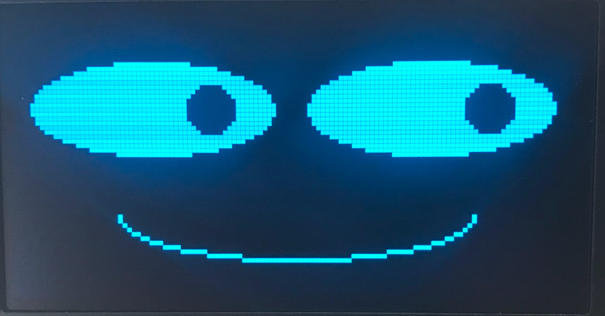

# Getting Started with Robot Faces

Here are the steps you can use to get started drawing your own robot faces.

## Step 1: Getting Hardware

You can order the parts online or work with one of our programs that supply parts for classrooms.
The minimal drawing kit contains:

1. A [Raspberry Pi Pico](../docs/parts-lists/#raspberry-pi-pico)
2. A mini solderless [Breadboard]../docs/parts-lists/#solderless-breadboard)
3. An OLED display
4. M-F jumper wires

## Step 2: Installing Software


We use the "Thonny" editor to program our faces.  To use it you will need to:

1. Download and install [Thonny](http://thonny.org)
2. Initialize the runtime by using the Thonny Tools -> Options -> Interpreter and select the Raspberry Pi Pico option
3. Press the Install Runtime button
4. Press the Stop/Reset and you should see the prompt:

```txt
>>> 
─────────────────────────────────────────────────────────────────────────────────
MicroPython v1.19.1-854-g35524a6fd on 2023-02-07; Raspberry Pi Pico with RP2040
Type "help()" for more information.
>>> 
```

## Drawing Your Fist Face

You can now copy our "simple-face.py" program into your microcontroller into your Thonny program and
press the green "Run" button.  You will see the following on your display:




