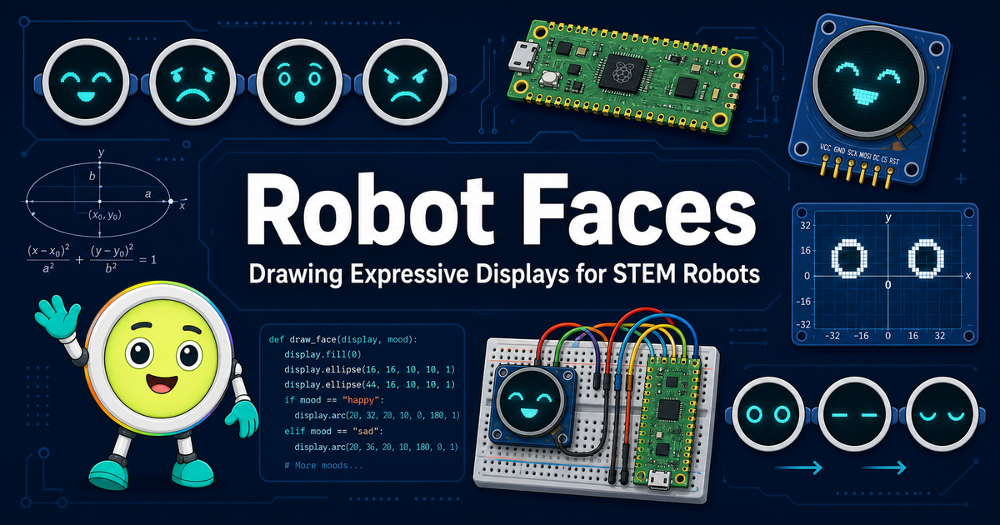

# Welcome

<figure markdown>
  { width="100%" }
</figure>

!!! mascot-welcome "Hi, I'm Pixel!"
    { class="mascot-admonition-img" }
    Communicating feelings between robots and people is a robot designer's superpower — and you're about to learn it. Every pixel tells a story!

## About This Book

Robots that show emotion connect with people more easily, and one of the cheapest ways to give a
robot personality is to put a small screen where its face would be. This course teaches you to
program expressive robot faces on two low-cost hardware targets: a $20 monochrome OLED display
and a $10 color round display, both powered by a Raspberry Pi Pico running MicroPython.

You'll learn to decompose a face into independently parameterized parts — eyes, pupils, eyebrows,
and a mouth — and combine those parts into recognizable emotional expressions, starting from Paul
Ekman's research on universal human emotions. Along the way, you'll practice the same computational
thinking skills used by commercial social robots like Anki's Cozmo and Vector, Emotix's Miko, and
Blue Frog Robotics' Buddy.

## Who This Book Is For

- High school students (grades 9-12) in STEM, robotics, or coding clubs
- Advanced middle-school students and CoderDojo-style after-school programs with adult mentorship
- Anyone curious about embedded displays, MicroPython, and expressive robot design

No prior programming or electronics experience is required. MicroPython syntax — variables,
functions, loops — is introduced from scratch in the early chapters.

## How to Use This Book

Use the navigation menu to explore:

- **[Getting Started](getting-started.md)** — Order parts and set up your development environment
- **[Chapters](chapters/index.md)** — 16 chapters covering hardware, MicroPython, drawing, and expression design
- **[Lessons](lessons/index.md)** — Short, focused lessons on individual drawing and interaction skills
- **[Stories](stories/index.md)** — The history of commercial screen-faced robots like Cozmo and Vector
- **[Learning Graph](learning-graph/index.md)** — An interactive map of the concepts this course teaches and how they connect
- **[Glossary](glossary.md)** — Key terms and definitions
- **[Parts List](parts-lists.md)** — Everything you need to build a robot face kit for under $30

## Getting Started

Ready to build your first expressive robot face? Start with
[Chapter 1: Hardware & Electronics Foundations](chapters/01-hardware-electronics-foundations/index.md).
