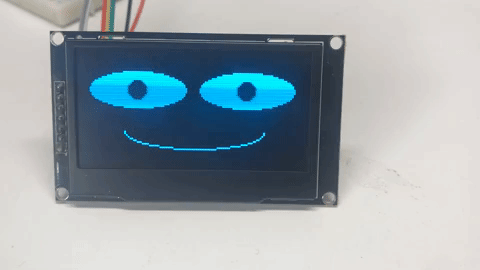

# Welcome to Robot Faces

This guide will help you learn how to draw fun faces on your robots.  We use bright
128x64 OLED displays that cost about $20.  We use simple MicroPython code so
students can create their own personalized robot faces.

