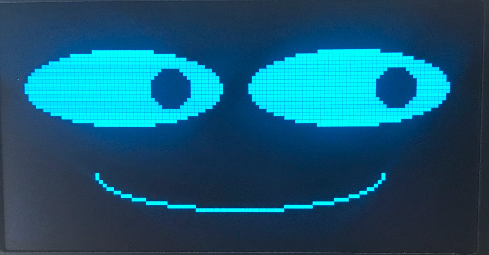

# Basic Face Layouts



A face is not one drawing command — it is several simple shapes, placed with care, that read as a face the moment your eye lands on them. This lesson builds the four components every expression in this book starts from: a **face outline**, two **eyes**, two **eyebrows**, and a **mouth**. Once you can place these four pieces, every later lesson is really about moving them.

!!! mascot-welcome "Let's Build a Face from Scratch"
    { class="mascot-admonition-img" }
    Four shapes, one function, a whole face. Every pixel tells a story!

## Drawing Constants

Naming your numbers before you use them is what makes a face layout easy to adjust later. `HALF_WIDTH` and `HALF_HEIGHT` locate the center of the display, and the `QUARTER_*` constants give you a quick way to place features a quarter of the way across or down the screen.

```py
WIDTH = 128
HEIGHT = 64

HALF_WIDTH = int(WIDTH / 2)
QUARTER_WIDTH = int(WIDTH / 4)
HALF_HEIGHT = int(HEIGHT / 2)
QUARTER_HEIGHT = int(HEIGHT / 4)

WHITE = 1  # 1 is for pixel on
BLACK = 0  # 0 is for pixel off

NO_FILL = 0  # 0 is for only drawing the outline
FILL = 1     # 1 for filling all the pixels in a shape

TOP_HALF = 3     # upper-right (1) + upper-left (2) quadrants
BOTTOM_HALF = 12  # lower-left (4) + lower-right (8) quadrants
```

## The Face Outline

Start with a wide white ellipse on a black background as the face itself. You do not strictly need this step — people will happily read the whole display as a face without a visible outline — but it is a gentle way to get comfortable with the `ellipse()` function before the smaller, trickier shapes.

```py
FACE_WIDTH = 100   # 50 pixels left of center, 50 to the right
FACE_HEIGHT = 60   # 20 pixels above center, 20 below
```

Recall the six main parameters of `ellipse()`:

```py
display.ellipse(x, y, horz_radius, vert_radius, color, fill)
```

Here is a sample face outline:

```py
oled.ellipse(HALF_WIDTH, HALF_HEIGHT, int(FACE_WIDTH / 2), int(FACE_HEIGHT / 2), WHITE, FILL)
```

Here is what each parameter is doing:

1. **Center of the face** — `HALF_WIDTH, HALF_HEIGHT` puts the ellipse dead center on the display.
2. **Width and height** — half of `FACE_WIDTH` and half of `FACE_HEIGHT`, because `ellipse()` takes a *radius*, not a full width.
3. **Draw with white** — the `WHITE` color parameter.
4. **Fill, not outline** — the `FILL` parameter.

## Eyes

Eyes can start out as nothing more than two filled circles, drawn about a third to a half of the way down the face. That vertical position is often called the **eye height**, measured from the top of the display.

```py
EYE_SIZE = 10
# eyes - black circles on the white face
oled.ellipse(QUARTER_WIDTH + 10, QUARTER_HEIGHT + 10, EYE_SIZE, EYE_SIZE, BLACK, FILL)
oled.ellipse(QUARTER_WIDTH * 3 - 10, QUARTER_HEIGHT + 10, EYE_SIZE, EYE_SIZE, BLACK, FILL)
```

Placing the eyes at exactly `QUARTER_WIDTH` and `QUARTER_WIDTH * 3` looks too spread out on a real display, so the code nudges each eye 10 pixels toward the center. `QUARTER_HEIGHT` alone also sat a little too high, so both eyes get an extra 10 pixels of drop as well. That kind of small, deliberate adjustment — measure, look, nudge — is normal, not a mistake.

## Eyebrows

Eyebrows are the single most expressive feature on a robot face, and the good news is that a basic pair only needs the `line()` function you already know. Each eyebrow is one short diagonal line sitting just above an eye.

!!! mascot-thinking "One Small Slope Changes Everything"
    { class="mascot-admonition-img" }
    Remember that `y` grows downward on this display. Slope the inner end of each eyebrow *down* toward the nose and the face reads as angry; slope it *up* and the same two lines read as worried. Flat brows read as calm.

```py
EYEBROW_DROP = 8        # how far above the eye the eyebrow sits
EYEBROW_HALF_WIDTH = 8  # half the length of each eyebrow
EYEBROW_TILT = 3        # how much the inner end dips down toward the nose

left_eye_x = QUARTER_WIDTH + 10
right_eye_x = QUARTER_WIDTH * 3 - 10
eye_y = QUARTER_HEIGHT + 10
eyebrow_y = eye_y - EYEBROW_DROP

# left eyebrow: outer end higher, inner end lower (angled toward the nose)
oled.line(left_eye_x - EYEBROW_HALF_WIDTH, eyebrow_y - EYEBROW_TILT,
          left_eye_x + EYEBROW_HALF_WIDTH, eyebrow_y + EYEBROW_TILT, WHITE)

# right eyebrow: mirror image of the left
oled.line(right_eye_x + EYEBROW_HALF_WIDTH, eyebrow_y - EYEBROW_TILT,
          right_eye_x - EYEBROW_HALF_WIDTH, eyebrow_y + EYEBROW_TILT, WHITE)
```

This straight-line version is enough to give a face real personality, and it is the fastest way to draw an eyebrow. When you are ready for eyebrows with a bend in them — the shape a real, expressive eyebrow actually has — the [Eyebrows](../eyebrows/index.md) lesson shows you how to build the same feature out of the `poly()` function instead.

## Mouth

A mouth reuses a trick you have already seen: the `ellipse()` function's optional seventh parameter, a **quadrant fill code**, lets you draw only part of an ellipse. `BOTTOM_HALF` (a value of 12) draws just the lower half, which curves upward at the ends like a simple smile.

```py
oled.ellipse(HALF_WIDTH, HALF_HEIGHT + 10, 30, 10, BLACK, FILL, BOTTOM_HALF)
```

This mouth sits 10 pixels below center, is 60 pixels wide (twice the horizontal radius of 30), and is 20 pixels tall at its full height (twice the vertical radius) before the bottom-half mask cuts it down to a curve.

!!! mascot-tip "Same Trick, Different Feature"
    { class="mascot-admonition-img" }
    Quadrant fill codes are not just for mouths. `TOP_HALF` on the same ellipse call gives you a closed, squinting eye — you will use exactly that trick in the [Winking with a Smile](../wink/index.md) lesson.

## Full Face Function

Here is a complete Python function that draws all four components — outline, eyes, eyebrows, and mouth — on your robot's display:

```py
def draw_face():
    # clear the display to all black
    oled.fill(BLACK)

    # face outline
    oled.ellipse(HALF_WIDTH, HALF_HEIGHT, int(FACE_WIDTH / 2), int(FACE_HEIGHT / 2), WHITE, FILL)

    # eyes - black circles on the white face
    oled.ellipse(left_eye_x, eye_y, EYE_SIZE, EYE_SIZE, BLACK, FILL)
    oled.ellipse(right_eye_x, eye_y, EYE_SIZE, EYE_SIZE, BLACK, FILL)

    # eyebrows - short diagonal lines angled toward the nose
    oled.line(left_eye_x - EYEBROW_HALF_WIDTH, eyebrow_y - EYEBROW_TILT,
              left_eye_x + EYEBROW_HALF_WIDTH, eyebrow_y + EYEBROW_TILT, BLACK)
    oled.line(right_eye_x + EYEBROW_HALF_WIDTH, eyebrow_y - EYEBROW_TILT,
              right_eye_x - EYEBROW_HALF_WIDTH, eyebrow_y + EYEBROW_TILT, BLACK)

    # mouth - black bottom-half arc on the white face
    oled.ellipse(HALF_WIDTH, HALF_HEIGHT + 10, 30, 10, BLACK, FILL, BOTTOM_HALF)
    oled.show()
```

Notice the eyebrows switch from `WHITE` to `BLACK` here. The earlier eyebrow example was drawn straight onto a black background; inside `draw_face()`, the eyebrows sit on top of the white face outline, so they need to be black to stay visible — the same lesson the mouth and eyes already taught you.

Here is the face that function draws:


!!! mascot-celebration "That's a Complete Face"
    { class="mascot-admonition-img" }
    Outline, eyes, eyebrows, mouth — every part a robot face needs is now on the screen, and every one of them is a named constant you can tune. Great expression!

## Things to Try

1. **Move `EYEBROW_TILT` to a negative number.** The eyebrows now angle up and away from the nose instead of down toward it — watch the face go from stern to worried.
2. **Set `EYEBROW_TILT` to 0.** Flat eyebrows read as calm and neutral, which is a useful resting expression between other emotions.
3. **Shrink `EYE_SIZE` to 4.** Small eyes on the same face outline can make a robot look surprised or startled, even with the mouth unchanged.
4. **Change the mouth's fill code from `BOTTOM_HALF` (12) to `TOP_HALF` (3).** A smile becomes a frown with one number.
5. **Skip the face outline entirely.** Comment out the first `ellipse()` call in `draw_face()` and see whether the eyes, eyebrows, and mouth alone are still enough to read as a face.

## References

- [MicroPython Framebuf Documentation](https://docs.micropython.org/en/latest/library/framebuf.html) — the full signatures for `ellipse()`, `line()`, and `poly()`
- [Ellipse Lesson](../ellipse/index.md) — a deeper look at quadrant fill codes
- [Drawing Lines](../line/index.md) — the eyebrow rule that explains why sloped lines carry so much emotion
- [Eyebrows](../eyebrows/index.md) — building curved, more expressive eyebrows with `poly()`
- [Winking with a Smile](../wink/index.md) — reusing the quadrant-mask trick from this lesson's mouth on an eye
