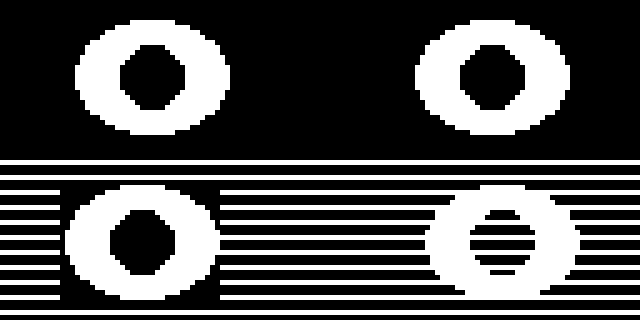

# Blitting Buffers

Here is the trick that makes complex faces fast. Instead of redrawing an eye from scratch every single frame, you draw it **once** into a small off-screen buffer and then stamp that finished picture onto the display wherever you need it. That stamping operation is called a **blit** — short for "block image transfer."

```py
display.blit(source_buffer, x, y, key)
```

The `source_buffer` is another `FrameBuffer` object, and `x` and `y` say where its top-left corner should land on the display. The optional `key` marks one color as transparent, which we will come back to below.

## Making an Off-Screen Buffer

A `FrameBuffer` is just a block of memory plus the drawing commands you already know. You create one by handing it a `bytearray` big enough to hold the pixels, along with the width, height, and pixel format:

```py
import framebuf

eye_bytes = bytearray(32 * 24 // 8)
eye = framebuf.FrameBuffer(eye_bytes, 32, 24, framebuf.MONO_HLSB)
```

That `// 8` is doing real work. In a monochrome buffer each pixel is one **bit**, and a byte holds 8 bits, so a 32 by 24 buffer needs `32 * 24 / 8 = 96` bytes. `MONO_HLSB` names the layout — monochrome, packed horizontally, most significant bit on the left.

The important part is what comes next: `eye` now responds to `fill()`, `ellipse()`, `line()`, and every other drawing command, exactly like the display does. The only difference is that nothing you draw into it is visible until you blit it.

!!! mascot-thinking "The Display Is Just a Buffer That Happens to Be Visible"
    { class="mascot-admonition-img" }
    Your `oled` object is a frame buffer too — it simply has a screen attached. Once that clicks, blitting stops feeling exotic. You're copying one rectangle of pixels into another.

## Sample Program Code

This program builds one eye in a 32 by 24 buffer, stamps it twice to make a matching pair, then blits it two more times over a striped background — once normally, and once with transparency turned on.

```py
# Test of the micropython blit function
# oled.blit(source_buffer, x, y, key)

from machine import Pin
import framebuf
import ssd1306

WIDTH = 128
HEIGHT = 64

clock=Pin(2) #SCL
data=Pin(3) #SDA
RES = machine.Pin(4)
DC = machine.Pin(5)
CS = machine.Pin(6)

spi=machine.SPI(0, sck=clock, mosi=data)
oled = ssd1306.SSD1306_SPI(WIDTH, HEIGHT, spi, DC, RES, CS)

WHITE = 1
BLACK = 0
FILL = 1
TRANSPARENT = 0

# build one eye in an off-screen 32 x 24 buffer
EYE_WIDTH = 32
EYE_HEIGHT = 24
eye_bytes = bytearray(EYE_WIDTH * EYE_HEIGHT // 8)
eye = framebuf.FrameBuffer(eye_bytes, EYE_WIDTH, EYE_HEIGHT, framebuf.MONO_HLSB)

eye.fill(BLACK)
eye.ellipse(16, 12, 15, 11, WHITE, FILL)
eye.ellipse(16, 12, 6, 6, BLACK, FILL)

oled.fill(BLACK)

# top: stamp the same eye buffer twice to get a matching pair
oled.blit(eye, 14, 3)
oled.blit(eye, 82, 3)

# bottom: a striped background so you can see what each blit covers up
for y in range(32, HEIGHT, 3):
    oled.hline(0, y, WIDTH, WHITE)

# left, no key: the eye's black background paints over the stripes
oled.blit(eye, 12, 36)

# right, key=0: black pixels are skipped so the stripes show through
oled.blit(eye, 84, 36, TRANSPARENT)

oled.show()
```

Here's what that program draws on the display:



## Reading the Output

The two eyes across the top are identical, and they cost one `ellipse()` pair to build plus two cheap copies to place. Change the buffer once and both eyes change together — that is the whole reason to work this way.

The bottom half is where transparency shows itself. Both shapes came from the same buffer, but they behave completely differently against the stripes:

| Call | What lands on the display |
|--|--|
| `blit(eye, 12, 36)` | All 768 pixels, black ones included — the stripes get wiped out inside a 32 by 24 rectangle |
| `blit(eye, 84, 36, 0)` | Only the white pixels — every black pixel is skipped, so the stripes survive |

Look at the pupil on the right-hand eye. It was drawn in black, so with `key=0` it became transparent too, and the stripes run straight through it. That is not a bug — it is exactly what you asked for.

!!! mascot-warning "Transparency Applies to Every Pixel of That Color"
    { class="mascot-admonition-img" }
    A key doesn't know the difference between a background you wanted to hide and a pupil you wanted to keep. If a detail vanishes after you add a key, check whether that detail was drawn in the key color.

## Typing a Sprite by Hand

You do not have to draw a sprite with shape commands. For small icons it is often easier to type the bits directly, one row per line, using Python's binary notation:

```py
sparkle_bytes = bytearray([
    0b00011000,
    0b00011000,
    0b00011000,
    0b11111111,
    0b11111111,
    0b00011000,
    0b00011000,
    0b00011000,
])
sparkle = framebuf.FrameBuffer(sparkle_bytes, 8, 8, framebuf.MONO_HLSB)
```

Each `0b` value is one row of 8 pixels, and every `1` is a lit dot. Squint at those eight lines and you can see the plus sign right there in the source code — which makes hand-typed sprites surprisingly easy to edit.

!!! mascot-celebration "You Now Have Every Drawing Tool the FrameBuf Offers"
    { class="mascot-admonition-img" }
    Pixels, lines, rectangles, ellipses, polygons, text, scrolling, and now blitting. Everything from here on is combining these eight ideas into faces worth looking at. Every pixel tells a story!

!!! Challenge
    1. Build a second buffer holding a closed eye, and blink by blitting whichever one matches the current state.
    2. Draw a mouth into its own buffer and blit it at several vertical positions to make the face "talk."
    3. Type an 8 by 8 sprite of your own by hand and blit it across the screen in a row.
    4. Measure how long it takes to draw 10 eyes with `ellipse()` versus blitting the same eye 10 times. Which wins, and why?

## References

[MicroPython Framebuf Documentation](https://docs.micropython.org/en/latest/library/framebuf.html)

[MicroPython FrameBuffer Constructor](https://docs.micropython.org/en/latest/library/framebuf.html#constructors)
