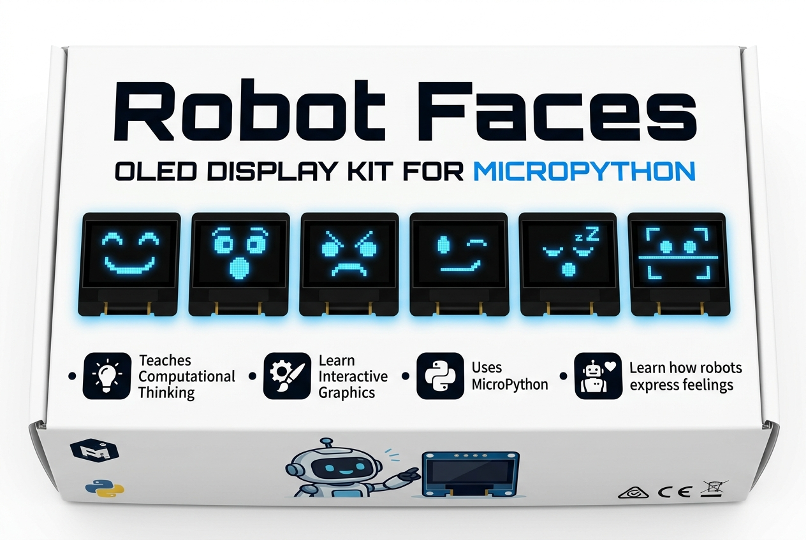

# Robot Faces OLED Kit — Box Cover Design (Ink-Friendly Edition)

This page provides the official printable box cover packaging template for the **Robot Faces OLED Kit**, designed with a **white, ink-friendly background** and high-contrast typography to save printer ink and toner.

## Available Printable Cover Templates

| Template Size | Layout | Output | File Link |
|--|--|--|--|
| **9" × 6" Box Front** | Single Cover centered on 8.5" × 11" Landscape sheet | 1 Cover per sheet | [Open 9" × 6" Cover HTML](../box-cover.html) |
| **6" × 4" Box Front** | **Dual Covers** stacked on a single 8.5" × 11" Portrait sheet | **2 Covers per sheet** | [Open 6" × 4" Dual Cover HTML](../box-cover-2.html) |

---

## Box & Printing Specifications

- **6" × 4" Dual Template (`box-cover-2.html`)**: Two complete 6" × 4" box panels stacked on a single 8.5" × 11" Portrait US Letter page with corner crop/trim lines.
- **9" × 6" Single Template (`box-cover.html`)**: One 9" × 6" box panel centered on an 8.5" × 11" Landscape US Letter page with corner crop/trim lines.
- **OLED Screen Specification**: Large 2.42" 128 × 64 Monochrome OLED Display

---

## Design Features & Audience Highlights

The box cover is designed to appeal to **students**, **bookstore and library visitors**, **makers**, and **coding club members**:

1. **Title**: **Robot Faces**
2. **Subtitle**: *OLED Display & Expression Kit*
3. **Target Badges**:
   - Ages 8+ to Adult
   - Students • Libraries • Coding Clubs
   - No Soldering Required
4. **Key Feature Highlights**:
   - **Teaches Computational Thinking**
   - **Learn Interactive Graphics**
   - **Uses MicroPython**
   - **Learn how robots express feelings**
5. **Real OLED Expression Showcase**:
   - Direct sample graphics from `@[docs/lessons]`: *Happy*, *Surprised*, *Angry*, *Winking*, *Sleeping*, and *Sad*.

---

## How to Print the Box Cover

1. Open the [Printable Box Cover HTML Template](../box-cover.html) in your web browser.
2. Press `Ctrl + P` (or `Cmd + P` on macOS) or click the **Print Box Cover** button at the top.
3. In the print dialog, select:
   - **Destination**: Printer or Save as PDF
   - **Orientation**: **Landscape**
   - **Paper Size**: **Letter (8.5 × 11 in)**
   - **Scale**: **100% (Actual Size)** — *Do not select "Fit to Printable Area"*
   - **Background Graphics**: **Checked / Enabled**
4. Cut along the dashed corner trim marks to obtain the exact **9" × 6"** box cover panel.
