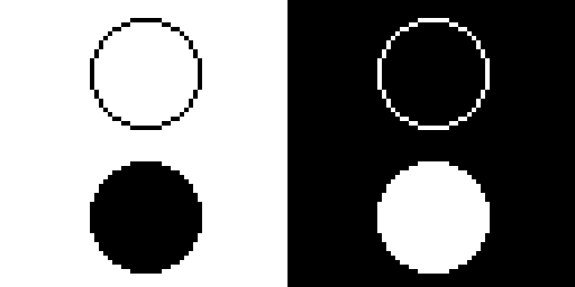

# Drawing Circles

A circle is just a special case of the framebuf [ellipse](../ellipse/index.md) function where the horizontal and vertical radii are equal. Circles can be drawn as an outline or filled, and in either color, which lets you place a dark shape on a light background or a light shape on a dark background.

# Sample Program Code

This program draws four circles, one in each quadrant of the screen, so you can compare all four combinations at once:

```py
# Test of the micropython ellipse function drawing circles
# A circle is just an ellipse with equal horizontal and vertical radii

from machine import Pin
import ssd1306

WIDTH = 128
HEIGHT = 64

clock=Pin(2) #SCL
data=Pin(3) #SDA
RES = machine.Pin(4)
DC = machine.Pin(5)
CS = machine.Pin(6)

spi=machine.SPI(0, sck=clock, mosi=data)
oled = ssd1306.SSD1306_SPI(WIDTH, HEIGHT, spi, DC, RES, CS)

WHITE = 1
BLACK = 0
NO_FILL = 0
FILL = 1

RADIUS = 12

QUARTER_WIDTH = int(WIDTH / 4)
HALF_WIDTH = int(WIDTH / 2)
QUARTER_HEIGHT = int(HEIGHT / 4)
HALF_HEIGHT = int(HEIGHT / 2)

# start with a black screen
oled.fill(BLACK)

# top-left: black circle outline on a white background
oled.fill_rect(0, 0, HALF_WIDTH, HALF_HEIGHT, WHITE)
oled.ellipse(QUARTER_WIDTH, QUARTER_HEIGHT, RADIUS, RADIUS, BLACK, NO_FILL)

# top-right: white circle outline on a black background
oled.ellipse(HALF_WIDTH + QUARTER_WIDTH, QUARTER_HEIGHT, RADIUS, RADIUS, WHITE, NO_FILL)

# bottom-left: black filled circle on a white background
oled.fill_rect(0, HALF_HEIGHT, HALF_WIDTH, HALF_HEIGHT, WHITE)
oled.ellipse(QUARTER_WIDTH, HALF_HEIGHT + QUARTER_HEIGHT, RADIUS, RADIUS, BLACK, FILL)

# bottom-right: white filled circle on a black background
oled.ellipse(HALF_WIDTH + QUARTER_WIDTH, HALF_HEIGHT + QUARTER_HEIGHT, RADIUS, RADIUS, WHITE, FILL)

oled.show()
```

Here's what that program draws on the display:



## The Four Combinations

|Quadrant|Background|Circle Color|Fill|
|--|--|--|--|
|Top-left|White|Black|Outline|
|Top-right|Black|White|Outline|
|Bottom-left|White|Black|Filled|
|Bottom-right|Black|White|Filled|

The whole display starts out black, so the two right-hand circles need no background fill at all. To put a white background behind a circle, use ```fill_rect()``` to paint that quadrant white before drawing the black circle on top of it.

## References

[MicroPython Framebuf Documentation](https://docs.micropython.org/en/latest/library/framebuf.html)
