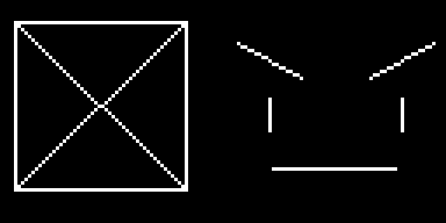

# Drawing Lines

A straight line is the cheapest way to put emotion on a screen. Tilt two short lines above a pair of eyes and your robot goes from calm to furious — no curves, no fills, no extra memory. The framebuffer gives you three line commands, and picking the right one matters more than you might expect.

## Three Ways to Draw a Line

The general `line()` command can draw any line at all, so you might wonder why the other two exist. The answer is speed: horizontal and vertical lines are so common that MicroPython includes shortcuts that skip the angle math entirely.

```py
display.hline(x, y, width, color)
display.vline(x, y, height, color)
display.line(x1, y1, x2, y2, color)
```

Notice that the three commands take different arguments. `hline()` and `vline()` start at a point and take a **length** — how many pixels to run. `line()` takes two full points and connects them.

| Command | Arguments | Use it for |
|--|--|--|
| `hline(x, y, w, c)` | start point plus a width | Flat mouths, dividers, box tops and bottoms |
| `vline(x, y, h, c)` | start point plus a height | Narrow eyes, box sides, tally marks |
| `line(x1, y1, x2, y2, c)` | two end points | Angled eyebrows, zigzag mouths, anything diagonal |

!!! mascot-tip "Reach for hline and vline When You Can"
    { class="mascot-admonition-img" }
    `hline(0, 20, 128, 1)` and `line(0, 20, 127, 20, 1)` draw the same row of dots, but the first one is faster. In an animation loop running 30 times a second, those savings add up.

## Sample Program Code

This program draws two things at once. On the left, a box built from two `hline()` calls and two `vline()` calls, with an X of general `line()` calls inside it. On the right, an angry face made from nothing but lines.

```py
# Test of the micropython line functions
# oled.hline(x, y, width, color)
# oled.vline(x, y, height, color)
# oled.line(x1, y1, x2, y2, color)

from machine import Pin
import ssd1306

WIDTH = 128
HEIGHT = 64

clock=Pin(2) #SCL
data=Pin(3) #SDA
RES = machine.Pin(4)
DC = machine.Pin(5)
CS = machine.Pin(6)

spi=machine.SPI(0, sck=clock, mosi=data)
oled = ssd1306.SSD1306_SPI(WIDTH, HEIGHT, spi, DC, RES, CS)

WHITE = 1
BLACK = 0

oled.fill(BLACK)

# left half: a box built from two hlines and two vlines, with an X of general lines inside
oled.hline(4, 6, 50, WHITE)
oled.hline(4, 54, 50, WHITE)
oled.vline(4, 6, 49, WHITE)
oled.vline(53, 6, 49, WHITE)
oled.line(4, 6, 53, 54, WHITE)
oled.line(4, 54, 53, 6, WHITE)

# right half: an angry face made only of lines
# eyebrows angled down toward the nose
oled.line(68, 12, 86, 22, WHITE)
oled.line(124, 12, 106, 22, WHITE)
# eyes as short vertical lines
oled.vline(77, 28, 10, WHITE)
oled.vline(115, 28, 10, WHITE)
# a flat, unimpressed mouth
oled.hline(78, 48, 36, WHITE)

oled.show()
```

Here's what that program draws on the display:



## The Eyebrow Rule

That face on the right is five lines and it still reads as angry. The reason is entirely in the eyebrows: both of them slope **down toward the nose**. The left brow runs from `(68, 12)` down to `(86, 22)`, and the right one mirrors it.

Remember that `y` grows downward on this display, so a larger `y` means lower on the screen. The inner ends of both eyebrows have the larger `y` values, which puts them closer to the nose and closer to the mouth.

Flip those numbers and the whole feeling flips with them:

| Inner ends of the eyebrows | Reads as |
|--|--|
| Lower than the outer ends | Angry, focused, determined |
| Higher than the outer ends | Sad, worried, pleading |
| Level with the outer ends | Neutral, calm, idle |

!!! mascot-encourage "Diagonal Lines Look Chunky, and That's Normal"
    { class="mascot-admonition-img" }
    Your diagonals will come out as little stair steps, because a pixel can only sit on the grid — it can't land halfway between two rows. Every screen does this. Step back a foot and the stairs vanish.

## Watch the Off-by-One

Here is the mistake that catches almost everyone. `hline(0, 20, 128, 1)` draws 128 pixels starting at column 0, so it covers columns 0 through **127** — exactly the full width of the display. Write `hline(0, 20, 129, 1)` and that last pixel has nowhere to go.

The same logic applies to `line()`, but with a twist: `line()` takes end *points*, not lengths. To span the full width you write `line(0, 20, 127, 20, 1)`, using 127 rather than 128, because the rightmost column is numbered 127.

!!! Challenge
    1. Change the two eyebrow lines so the face reads as sad instead of angry.
    2. Rebuild the box on the left using only `line()` calls. Does it look any different?
    3. Draw a frowning mouth from two `line()` calls that meet in the middle.
    4. Animate a single `hline()` moving down the screen to make a scanning effect, clearing with `fill(0)` between frames.

## References

[MicroPython Framebuf Documentation](https://docs.micropython.org/en/latest/library/framebuf.html)
