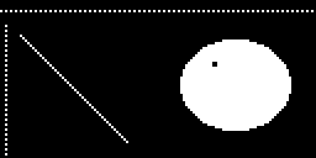

# Drawing Pixels

Every shape in this book — every eye, eyebrow, and mouth — is built from one thing: a single lit dot called a **pixel**. The `pixel()` method is the smallest drawing tool the framebuffer gives you, and it turns exactly one dot on or off.

You will not draw a whole face one pixel at a time. But `pixel()` is worth learning first, because it shows you what every other command is really doing underneath.

```py
display.pixel(x, y, color)
```

The `x` and `y` values pick the dot, and `color` sets it to 0 for off or 1 for on. Leave the color off entirely and `pixel()` does the opposite job — it *reads* the dot and tells you whether it is currently lit:

```py
if display.pixel(64, 32) == 1:
    print('the center dot is on')
```

!!! mascot-thinking "One Pixel Is the Whole Unit of Measure"
    { class="mascot-admonition-img" }
    My screen is 128 dots across and 64 down — that's 8,192 pixels total, and I control every one of them. Every pixel tells a story!

## Sample Program Code

This program uses `pixel()` three ways: to build dotted rulers along the top and left edges, to draw a diagonal one dot at a time, and to punch a tiny highlight out of a finished eye.

```py
# Test of the micropython pixel function
# oled.pixel(x, y, color)

from machine import Pin
import ssd1306

WIDTH = 128
HEIGHT = 64

clock=Pin(2) #SCL
data=Pin(3) #SDA
RES = machine.Pin(4)
DC = machine.Pin(5)
CS = machine.Pin(6)

spi=machine.SPI(0, sck=clock, mosi=data)
oled = ssd1306.SSD1306_SPI(WIDTH, HEIGHT, spi, DC, RES, CS)

WHITE = 1
BLACK = 0
FILL = 1

oled.fill(BLACK)

# a dotted ruler across the top: one pixel on, one pixel off
for x in range(0, WIDTH, 2):
    oled.pixel(x, 4, WHITE)

# a dotted ruler down the left edge
for y in range(10, HEIGHT, 2):
    oled.pixel(2, y, WHITE)

# a diagonal drawn one pixel at a time
for i in range(0, 44):
    oled.pixel(8 + i, 14 + i, WHITE)

# an eye with a two-by-two catchlight punched out in black pixels
oled.ellipse(95, 34, 22, 18, WHITE, FILL)
oled.pixel(86, 25, BLACK)
oled.pixel(87, 25, BLACK)
oled.pixel(86, 26, BLACK)
oled.pixel(87, 26, BLACK)

oled.show()
```

Here's what that program draws on the display:



## The Catchlight Trick

Look closely at the eye on the right. Those four black pixels in the upper-left of the white shape are a **catchlight** — the small bright reflection you see in a real eye. Four dots is all it takes to make a flat white blob start reading as something alive and looking at you.

This is also your first look at drawing in **layers**. The `ellipse()` call ran first and filled the whole shape white. The four `pixel()` calls ran second, so they overwrote what was already there. Later commands always win.

| Goal | Approach |
|--|--|
| Turn one dot on | `display.pixel(x, y, 1)` |
| Turn one dot off | `display.pixel(x, y, 0)` |
| Ask if a dot is lit | `display.pixel(x, y)` returns 0 or 1 |
| Erase a detail from a filled shape | Draw the shape, then set pixels back to 0 |

!!! mascot-warning "Off-Screen Pixels Just Disappear"
    { class="mascot-admonition-img" }
    Ask for `pixel(200, 90, 1)` and nothing happens — no dot, no error message. When a detail goes missing, check your coordinates against the 128 by 64 limit first.

## Speed Matters

Setting one pixel is fast. Setting thousands of them in a Python loop is slow, because every trip through the loop costs interpreter time. Drawing a filled circle with `ellipse()` is far quicker than drawing the same circle with a loop of `pixel()` calls, since `ellipse()` does its work in compiled C code.

So the rule is simple: reach for `pixel()` for small details and single dots, and reach for the shape commands for everything bigger.

!!! Challenge
    1. Draw a dotted border all the way around the screen using only `pixel()`.
    2. Add a second catchlight to the eye and see how it changes where the eye seems to be looking.
    3. Write a loop that reads every pixel in a small region with `pixel(x, y)` and counts how many are lit.
    4. Time a filled circle drawn with `ellipse()` against the same circle drawn with a `pixel()` loop. Which is faster, and by how much?

## References

[MicroPython Framebuf Documentation](https://docs.micropython.org/en/latest/library/framebuf.html)
