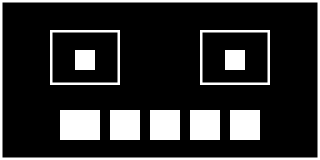

# Drawing Rectangles

Rectangles are the workhorses of a robot face. They give you blocky retro eyes, status bars along the bottom of the screen, and — most usefully of all — a fast way to erase just one part of the display without redrawing everything else.

## Two Commands, One Shape

There are two ways to draw a rectangle, and the difference is whether the inside gets painted:

```py
display.rect(x, y, width, height, color, fill_flag)
display.fill_rect(x, y, width, height, color)
```

The `x` and `y` values set the **top-left corner** — not the center, which is where `ellipse()` measures from. From that corner the rectangle extends `width` pixels to the right and `height` pixels down.

The optional `fill_flag` on `rect()` is 0 for a one-pixel outline and 1 for a solid block. That means `rect(x, y, w, h, c, 1)` and `fill_rect(x, y, w, h, c)` do exactly the same thing; `fill_rect()` is just the shorter way to say it.

!!! mascot-warning "Corner, Not Center"
    { class="mascot-admonition-img" }
    Switching between `ellipse()` and `rect()` trips up everyone at first, because `ellipse()` measures from the middle and `rect()` measures from the top-left. If a shape lands up and to the left of where you wanted it, this is why.

## Sample Program Code

This program draws a border around the whole display, then a blocky retro face: square eye sockets with filled pupils inside, and a wide mouth bar with black gaps erased out of it to look like teeth.

```py
# Test of the micropython rectangle functions
# oled.rect(x, y, width, height, color, fill_flag)
# oled.fill_rect(x, y, width, height, color)

from machine import Pin
import ssd1306

WIDTH = 128
HEIGHT = 64

clock=Pin(2) #SCL
data=Pin(3) #SDA
RES = machine.Pin(4)
DC = machine.Pin(5)
CS = machine.Pin(6)

spi=machine.SPI(0, sck=clock, mosi=data)
oled = ssd1306.SSD1306_SPI(WIDTH, HEIGHT, spi, DC, RES, CS)

WHITE = 1
BLACK = 0
NO_FILL = 0
FILL = 1

oled.fill(BLACK)

# a border one pixel in from every edge
oled.rect(0, 0, WIDTH, HEIGHT, WHITE, NO_FILL)

# a retro blocky face
# square eye sockets with a smaller filled pupil inside each
oled.rect(20, 12, 28, 22, WHITE, NO_FILL)
oled.fill_rect(30, 20, 8, 8, WHITE)

oled.rect(80, 12, 28, 22, WHITE, NO_FILL)
oled.fill_rect(90, 20, 8, 8, WHITE)

# a wide filled mouth bar with black teeth erased out of it
oled.fill_rect(24, 44, 80, 12, WHITE)
oled.fill_rect(40, 44, 4, 12, BLACK)
oled.fill_rect(56, 44, 4, 12, BLACK)
oled.fill_rect(72, 44, 4, 12, BLACK)
oled.fill_rect(88, 44, 4, 12, BLACK)

oled.show()
```

Here's what that program draws on the display:



## Erasing with a Black Rectangle

Those teeth are the most useful trick on this page. There is no "erase" command in the framebuffer — but drawing in black *is* erasing, because black is simply the color of an unlit pixel.

That gives you a much faster way to animate. Instead of clearing the whole screen with `fill(0)` and rebuilding the entire face every frame, you can erase just the rectangle around one feature and redraw only that:

```py
# blink: erase only the region around the left eye, then redraw it closed
display.fill_rect(20, 12, 28, 22, 0)
display.hline(22, 22, 24, 1)
display.show()
```

The rest of the face never gets touched, so it never flickers.

| Goal | Command |
|--|--|
| Outline only | `rect(x, y, w, h, 1, 0)` |
| Solid block | `fill_rect(x, y, w, h, 1)` |
| Erase a region | `fill_rect(x, y, w, h, 0)` |
| Clear the whole screen | `fill(0)` |

!!! mascot-thinking "fill() Is Just a Rectangle the Size of the Screen"
    { class="mascot-admonition-img" }
    `fill(0)` and `fill_rect(0, 0, 128, 64, 0)` do the same job. Once you see that, "clear the screen" stops being a special command and becomes one more rectangle.

## Sizing a Border Correctly

The border in the sample is `rect(0, 0, 128, 64, 1, 0)` — the full width and height, not 127 and 63. That is because `rect()` takes a *size*, not an end point. Starting at column 0 and running 128 pixels wide covers columns 0 through 127, which is exactly the screen.

This is the opposite of `line()`, which takes end points and needs 127. Getting these two mixed up produces a border with one edge missing, and it is worth checking first whenever that happens.

!!! Challenge
    1. Change the number of teeth in the mouth by adding or removing black `fill_rect()` calls.
    2. Make the eyes blink by erasing each socket with a black rectangle and drawing a horizontal line in its place.
    3. Build a battery indicator: an outlined rectangle with a filled rectangle inside whose width tracks a charge level from 0 to 100.
    4. Draw a rectangle that is deliberately too big for the screen. What happens to the parts that fall off the edge?

## References

[MicroPython Framebuf Documentation](https://docs.micropython.org/en/latest/library/framebuf.html)
