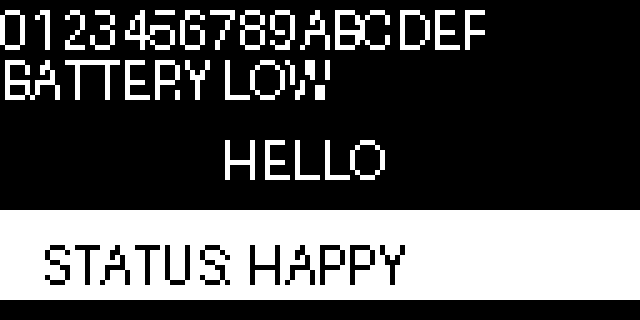

# Drawing Text

Sometimes a face is not enough. A robot that needs to say `BATTERY LOW` or `CONNECTED` needs letters, and the framebuffer has one command for that:

```py
display.text(string, x, y, color)
```

MicroPython ships with a single built-in font. Every character is exactly **8 pixels wide and 8 pixels tall**, and there is no way to change the size or the typeface with this command. That sounds limiting, but it is actually a gift — because every character is the same fixed size, you can calculate exactly where text will land before you draw it.

## Doing the Layout Math

Two numbers follow directly from that 8 by 8 grid, and they let you plan a screen without guessing.

A 128-pixel-wide display fits `128 / 8 = 16` characters per line. A 64-pixel-tall display fits `64 / 8 = 8` lines. That is 128 characters total if you pack the screen completely full.

| Question | Math | Answer |
|--|--|--|
| Characters per line | 128 ÷ 8 | 16 |
| Lines per screen | 64 ÷ 8 | 8 |
| Width of a string | `len(text) * 8` | pixels |
| `x` to center a string | `(128 - len(text) * 8) / 2` | pixels |

!!! mascot-tip "The y Value Is the Top of the Letters"
    { class="mascot-admonition-img" }
    `text('HI', 0, 0, 1)` puts the *top* of the letters at row 0, so they fill rows 0 through 7. Ask for `y = 60` and the bottom two rows of your letters fall off the screen.

## Sample Program Code

This program shows four things: a full 16-character line, a second line placed one character height below the first, a string centered by measuring its width, and black text drawn on a white bar.

```py
# Test of the micropython text function
# oled.text(string, x, y, color)

from machine import Pin
import ssd1306

WIDTH = 128
HEIGHT = 64

clock=Pin(2) #SCL
data=Pin(3) #SDA
RES = machine.Pin(4)
DC = machine.Pin(5)
CS = machine.Pin(6)

spi=machine.SPI(0, sck=clock, mosi=data)
oled = ssd1306.SSD1306_SPI(WIDTH, HEIGHT, spi, DC, RES, CS)

WHITE = 1
BLACK = 0
FILL = 1

CHAR_WIDTH = 8
CHAR_HEIGHT = 8

oled.fill(BLACK)

# 16 characters is exactly one full row on a 128 pixel wide display
oled.text('0123456789ABCDEF', 0, 0, WHITE)

# a second line, one character height below the first
oled.text('BATTERY LOW', 0, CHAR_HEIGHT + 2, WHITE)

# center a short label by measuring it: 8 pixels per character
label = 'HELLO'
label_width = len(label) * CHAR_WIDTH
oled.text(label, int((WIDTH - label_width) / 2), 26, WHITE)

# black text on a white bar for an inverted caption
oled.fill_rect(0, 42, WIDTH, 18, WHITE)
oled.text('STATUS: HAPPY', 8, 47, BLACK)

oled.show()
```

Here's what that program draws on the display:



## Inverted Text

That bottom caption is worth a closer look. There is no "highlight" option on `text()`, so you build one out of two commands you already know: paint a white rectangle, then draw the text in black on top of it.

```py
display.fill_rect(0, 42, 128, 18, 1)   # white bar first
display.text('STATUS: HAPPY', 8, 47, 0) # black letters second
```

Order matters. Draw the text first and the rectangle will paint straight over it.

!!! mascot-encourage "Text Is for Debugging, Not for Feelings"
    { class="mascot-admonition-img" }
    Printing a sensor value on screen is the fastest way to figure out why a face is misbehaving. But when you want someone to *feel* something, an eyebrow beats a word every time.

## What the Font Can and Cannot Do

The built-in font covers the printable ASCII characters — letters, digits, and common punctuation. It does not include accented characters or emoji, and anything outside its range will come out as garbage rather than raising an error.

Text also gets clipped, not wrapped. A 20-character string starting at `x = 0` simply loses everything past column 127; MicroPython will not move the extra characters to a second line for you. If you need wrapping, you have to slice the string yourself and call `text()` once per line.

!!! Challenge
    1. Write a `center_text()` function that takes a string and a `y` value and centers it for you.
    2. Fill the entire screen with 8 lines of 16 characters each.
    3. Write a wrapping function that breaks a long string into 16-character chunks and prints each on its own line.
    4. Add a text label under a robot face that names the emotion currently being displayed.

## References

[MicroPython Framebuf Documentation](https://docs.micropython.org/en/latest/library/framebuf.html)
