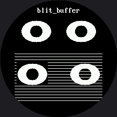

# Lab 9: Blitting Buffers

`display.blit_buffer(buffer, x, y, width, height)` stamps a whole block of pre-computed pixels onto the display in one shot. Build a sprite once into an off-screen buffer, then copy it wherever — and however many times — you need it.

## Sample Program Code

One eye built into a sprite, stamped twice for a matching pair, then stamped over a striped background two ways — opaque and with the background key skipped:

```py
# Lab 09: Blitting Buffers
# display.blit_buffer(buffer, x, y, width, height) stamps a block of
# pixels onto the display in one shot. Draw a sprite once into a buffer,
# then copy it wherever (and however many times) you need it.
#
# This is where the color display's memory budget shows up for the first
# time. On the OLED, a sprite was one BIT per pixel. Here it is two
# BYTES per pixel -- sixteen times bigger. A 64x48 eye costs 6,144 bytes,
# and a full-screen 240x240 buffer would cost 115,200, which is most of
# the RAM MicroPython has on an RP2040. That is the real reason this
# driver has no frame buffer, and the reason there is no show().
#
# The other difference: blit_buffer() is OPAQUE. framebuf's blit() took a
# `key` color to skip, so you could stamp a sprite over a background.
# This driver has no such option, so shapes.blit_keyed() does it the hard
# way -- finding the runs of non-key pixels and sending those. Read it
# and you will know exactly what framebuf was doing for you.

import config
import shapes

display = config.init_display()
WHITE = config.WHITE
BLACK = config.BLACK
FILL = config.FILL
FONT = config.SMALL_FONT
TRANSPARENT = BLACK

# --- build one eye in an off-screen buffer ---------------------------
#
# shapes.sprite() hands back a bytearray of RGB565 pixels. To draw into
# it we need something that behaves like a display, so Sprite below wraps
# the buffer and offers the three calls shapes.ellipse() actually uses.

EYE_WIDTH = 64
EYE_HEIGHT = 48


class Sprite:
    """A tiny stand-in for the display that draws into a buffer instead.

    shapes.ellipse() only ever calls hline(), so that is all this needs.
    Passing this to a drawing function instead of the real display is a
    trick worth remembering -- the drawing code cannot tell the
    difference, and does not need to."""

    def __init__(self, width, height, background=BLACK):
        self.width = width
        self.height = height
        self.buffer = shapes.sprite(width, height, background)

    def hline(self, x, y, length, color):
        if y < 0 or y >= self.height:
            return
        for column in range(max(0, x), min(self.width, x + length)):
            shapes.sprite_pixel(self.buffer, self.width, column, y, color)

    def pixel(self, x, y, color):
        if 0 <= x < self.width and 0 <= y < self.height:
            shapes.sprite_pixel(self.buffer, self.width, x, y, color)


eye = Sprite(EYE_WIDTH, EYE_HEIGHT)
shapes.ellipse(eye, 32, 24, 30, 22, WHITE, FILL)
shapes.ellipse(eye, 32, 24, 12, 12, BLACK, FILL)

display.fill(BLACK)
display.text(FONT, "blit_buffer", 76, 14, WHITE, BLACK)

# top: stamp the same eye buffer twice to get a matching pair. One buffer,
# two trips down the wire, and no ellipse math either time.
display.blit_buffer(eye.buffer, 42, 40, EYE_WIDTH, EYE_HEIGHT)
display.blit_buffer(eye.buffer, 134, 40, EYE_WIDTH, EYE_HEIGHT)

# bottom: a striped background so you can see what each blit covers up
for y in range(110, 210, 6):
    display.hline(30, y, 180, WHITE)

# left, plain blit_buffer: the eye's black background paints over the
# stripes, because the sprite is a solid rectangle of pixels
display.blit_buffer(eye.buffer, 34, 128, EYE_WIDTH, EYE_HEIGHT)

# right, blit_keyed: black pixels are skipped, so the stripes show
# through. Watch how much slower it is -- that is the price of asking
# about every pixel instead of shipping the whole block.
shapes.blit_keyed(display, eye.buffer, 142, 128,
                  EYE_WIDTH, EYE_HEIGHT, TRANSPARENT)

# Things to try:
#
# 1. Work out the byte cost of the eye sprite: 64 * 48 * 2. Then work out
#    what a full-screen buffer would cost, and compare that to the 264 KB
#    of RAM on an RP2040 -- most of which MicroPython is already using.
#
# 2. Time the two bottom blits. The plain one sends one command and 6,144
#    bytes. The keyed one sends a command per run, per row.
#
# 3. Make the sprite's background RED instead of BLACK and pass that as
#    the key. Transparency is not a property of a color -- it is whichever
#    color you point at.
```

Here's what that program draws:



## Color Costs Memory, and Here's Where You Feel It

On the OLED kit, a sprite was one **bit** per pixel. Here it's two **bytes** — sixteen times more. A 64x48 eye sprite costs 6,144 bytes; a full-screen 240x240 buffer would cost 115,200, which is most of what MicroPython leaves free on an RP2040's 264 KB of RAM. That arithmetic is the real reason this driver keeps no frame buffer at all.

It's also why `blit_buffer()` is **opaque** — it has no transparency key the way `framebuf.blit()` did. `shapes.blit_keyed()` in this kit rebuilds that feature the hard way, scanning each row of the sprite for runs of non-key pixels and sending only those. Reading it once is the fastest way to understand exactly what `framebuf` was quietly doing for you on the OLED kit.
