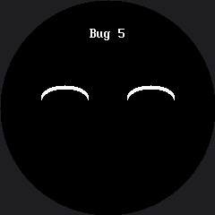

# Five Broken Faces

Every face in this lab is broken on purpose, each by one bug that real people make on this exact
hardware all the time. Your job is to fix all five.

Three of the five are **different bugs from the OLED kit's version**, and that is the lesson hiding
inside the lesson: change the hardware and you change the bugs. There is no forgotten `show()` here,
because there is no `show()`. What replaces it are two failures that display could never have —
work that gets erased the instant after you draw it, and a face drawn perfectly onto glass you
cannot see.

!!! mascot-encourage "Broken code is normal, not shameful"
    { class="mascot-admonition-img" }
    Every programmer alive spends more time fixing things than writing them. This is the lab where that stops being frustrating and starts being a skill you own.

## Debugging Has a Method

Guessing and editing random lines is not it. Do this instead, for each face:

1. **READ** the docstring. It says what the face is *supposed* to look like.
2. **PREDICT** what you think will happen before you press the button.
3. **OBSERVE** what actually happens, and describe the difference out loud in one sentence: "it
   should smile but it frowns."
4. **LOCATE** the smallest piece of code that could cause that difference.
5. **FIX** one thing, then run it again. One change at a time — if you change three lines and it
   works, you have not learned which one mattered.

Step 3 is the one people skip, and it is the one that does the most work. Naming a symptom
precisely is most of the way to finding its cause.

## The Five Faces

Button A goes to the next face, button B goes back. The bug number also prints to the Thonny shell,
which matters for bug 1 — when the screen shows nothing at all, the shell is the only thing telling
you the program is alive and doing what you asked.

| Bug | Symptom | What is different about this display |
|---|---|---|
| 1 | Nothing appears | Every call lands immediately, so a wipe in the wrong place erases finished pixels |
| 2 | The dot smears into a stripe | There is no frame buffer to forget to clear — the glass just keeps everything |
| 3 | The eyes are missing | The coordinates are legal, addressable, and outside the circle |
| 4 | The smile is upside down | The quadrant mask is inverted |
| 5 | The button stops working | Something in the loop is blocking |

```py
def bug_1():
    """SHOULD SHOW: a plain happy face -- two eyes, two brows, and a wide
    smile. ACTUALLY SHOWS: predict it before you press A.

    Every drawing call below is correct, and every one of them runs. Look
    at the shell to confirm that. Then look at the ORDER."""
    face.eyes(24, 24)
    face.eyebrows(0, 0, lift=5)
    face.mouth(face.SMILE, 50, 24)
    face.label("Bug 1")
    face.clear()
```

Here's the fifth face, which is the one on screen when the program has cycled to the end:



Each bug is a separate screen, so one picture shows one of the five. Press the buttons to walk them.

## The Symptom Table

Read this only after you have tried. It doubles as a standing troubleshooting reference for every
other lab in the kit, which is why this is the lab to reach for when a class is stuck.

| What you see | What causes it |
|---|---|
| A black screen, but the shell keeps printing | **Two** different causes produce this exact symptom, and telling them apart is the skill. See below. |
| Old pixels stay behind and pile up into a smear | Nothing erased the previous frame. There is no frame buffer here — the glass keeps whatever you last sent it, forever, until you paint over it. |
| A shape is simply not there, and no error was raised | It was drawn **outside the circle**. The controller addresses a 240×240 square; the glass is the circle inscribed in it. `config.inside_circle(x, y)` is the check you have to run yourself. |
| A curve bends the wrong way | The quadrant mask is inverted. `TOP_HALF` (3) frowns, `BOTTOM_HALF` (12) smiles. |
| Button presses get ignored some of the time | Something in the loop is blocking. While `sleep()` runs, nothing else does — and on this display a slow **draw** blocks the same way. |

### The Black Screen Has Two Causes

**(a) Something erased your work after you drew it.** On a buffered display the order of a clear
was hidden until `show()`. Here every call lands immediately, so a wipe in the wrong place wipes
finished pixels off the glass.

**(b) The backlight is off.** A GC9A01 is a transmissive LCD: it does not make light, it filters a
lamp sitting behind it. With the backlight low, the pixels are set correctly and there is nothing to
see them by. This is the number one "my display is dead" report, and it is not a display problem.

!!! mascot-tip "Rule Out the Backlight in One Line"
    { class="mascot-admonition-img" }
    If `config.BL_PIN` is `None` — which it is on the kit's default wiring, where BL is tied to 3V3 — cross cause (b) off immediately and go look for cause (a). On a board that can dim its backlight, `config.set_backlight(True)` is the one line that rescues you.

## Bug 3 Is the Round Screen's Signature

It has a nasty property: **the same code on a rectangular 240×320 display would look perfect.**

```py
# Where you would put the eyes if you were laying out a RECTANGULAR
# 240x240 display: a comfortable margin in from the top two corners.
BAD_EYE_X = 30
BAD_EYE_Y = 30
```

Every coordinate there is one the display accepts without complaint. There is no error, no warning,
and no exception. There is just nothing there.

## Bug 5 Is About Time

It is the only one you cannot see in a screenshot. Nothing looks wrong in a picture of the screen;
the program is just too slow to notice a finger. Bugs like that are the hardest kind, which is
exactly why the [next lab](../trace-and-watch/index.md) builds a tool for watching them.

!!! mascot-celebration "You now have a method"
    { class="mascot-admonition-img" }
    Predict, observe, name the difference, change one thing. That works on code you have never seen, in languages you have not learned yet. Great expression!

## Things to Try

1. **Break one on purpose in a new way** and hand the file to a partner. Writing a bug that produces
   a *specific* symptom proves you understand the cause, not just the cure.
2. **Write down the symptom for each bug in your own words** before checking the table above.
3. **Walk bug 3 home.** Move `BAD_EYE_X` and `BAD_EYE_Y` ten pixels at a time toward the center and
   note exactly where each eye appears. That number is your real safe area.
4. **Fix bug 5 twice** — once by removing the blocking sleep, and once by pacing it with
   `ticks_ms()` from the [no-blocking lab](../no-blocking/index.md). Compare the two fixes.

## References

- [Trace and Watch](../trace-and-watch/index.md) — the instrument for bugs you cannot photograph
- [Screen Coordinates](../screen-coordinates/index.md) — why a legal coordinate can still be invisible
- [Drawing Ellipses](../ellipse/index.md) — the quadrant masks behind bug 4
