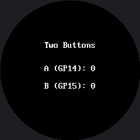

# Reading Two Buttons

Two buttons is all it takes to give a robot face a user interface. One steps forward, one steps
back, and suddenly every list you can write becomes a menu. This lab reads both buttons
independently and shows a running count for each, so you can prove your wiring works before you
build anything on top of it.

## Both Buttons Work Like the First One

They are wired exactly the way the single button in the [Blinking](../blink/index.md) lab was:
`PULL_UP` inputs that read 1 when idle and 0 when pressed, because the other leg of each button
goes to GND.

```py
button_a, button_b = config.init_buttons()
```

Button A is **GP14** and button B is **GP15**, set in `config.py` as `BUTTON_A_PIN` and
`BUTTON_B_PIN`. Those two pins are the standard across every kit in this book, so a student who has
built the OLED kit keeps their wiring habits when they swap displays.

## Text Has To Be Centered Here

On the OLED, a status line started at `x=4` and that was that. On a round screen a left margin is
not a straight line: **how far in the text has to start depends on how far down the screen it is.**

```py
def centered(string, y):
    x = HALF_WIDTH - (len(string) * FONT_WIDTH) // 2
    # Erase the whole strip first, so a shorter number does not leave a
    # digit from the longer one behind it.
    display.fill_rect(0, y, config.WIDTH, FONT_HEIGHT, BLACK)
    display.text(FONT, string, x, y, WHITE, BLACK)
```

!!! mascot-warning "Text Overprints — It Does Not Replace"
    { class="mascot-admonition-img" }
    With no frame buffer, drawing "9" where "10" was leaves the "1" sitting there forever. That `fill_rect()` is not tidiness — it is the only thing standing between you and a counter that turns into gibberish somewhere past nine.

## Sample Program Code

```py
# Lab 17: Reading Two Buttons

import config
from utime import sleep

display = config.init_display()
button_a, button_b = config.init_buttons()

WHITE = config.WHITE
BLACK = config.BLACK
FONT = config.SMALL_FONT
FONT_WIDTH = FONT.WIDTH
FONT_HEIGHT = FONT.HEIGHT
HALF_WIDTH = config.WIDTH // 2

TITLE_Y = 70
A_ROW_Y = 110
B_ROW_Y = 140


def centered(string, y):
    x = HALF_WIDTH - (len(string) * FONT_WIDTH) // 2
    # Erase the whole strip first, so a shorter number does not leave a
    # digit from the longer one behind it.
    display.fill_rect(0, y, config.WIDTH, FONT_HEIGHT, BLACK)
    display.text(FONT, string, x, y, WHITE, BLACK)


def pressed(button):
    if button.value() == 1:
        return False
    sleep(0.02)              # debounce: let the contacts settle
    return button.value() == 0


def wait_for_release(button):
    while button.value() == 0:
        sleep(0.01)


def show_counts(a_count, b_count):
    centered("A (GP14): " + str(a_count), A_ROW_Y)
    centered("B (GP15): " + str(b_count), B_ROW_Y)


display.fill(BLACK)
centered("Two Buttons", TITLE_Y)

a_count = 0
b_count = 0
show_counts(a_count, b_count)

while True:
    if pressed(button_a):
        a_count += 1
        show_counts(a_count, b_count)
        wait_for_release(button_a)

    if pressed(button_b):
        b_count += 1
        show_counts(a_count, b_count)
        wait_for_release(button_b)

    sleep(0.01)
```

Here's the starting screen, before either button has been pressed:



## The Counters Are Your Wiring Test

Press A ten times and B five times. If the two numbers on screen match what your fingers did, your
buttons are wired correctly, your pull-ups are working, and your debounce is doing its job — all
confirmed before you build anything that depends on them.

If a count runs ahead of your presses, the debounce is too short. If it lags behind, something in
the loop is blocking. Both are much easier to diagnose here, on a screen with nothing else on it,
than inside a menu three labs from now.

!!! mascot-tip "Two Buttons Is a Whole Interface"
    { class="mascot-admonition-img" }
    Forward and back is enough to walk any list — seven emotions, five modes, ten animations. Everything from here to the end of the kit is built on the two buttons you just tested.

## Things to Try

1. **Take the `fill_rect()` out of `centered()`** and count past 9. The "1" from "10" sits on top of
   the old digit, because nothing erased it.
2. **Pass `WHITE` as the background color** for one row instead of `BLACK`. The driver really does
   paint that background behind each character, and now you can see it.
3. **Build the caption from `config.BUTTON_A_PIN`** instead of the hard-coded `"A (GP14): "`. It
   prints the same thing today, and it keeps printing the truth if the pins ever move.
4. **Count how many presses you can register in ten seconds.** Then remove `wait_for_release()` and
   try again. The second number is not a measure of your finger.

## References

- [Blinking](../blink/index.md) — the same button pattern with one button and a face
- [Mode Switching](../modes/index.md) — where forward and back become a real menu
- [Trace and Watch](../trace-and-watch/index.md) — where button state becomes part of an on-screen instrument
