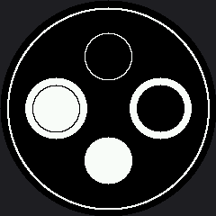

# Drawing Circles

A circle is just an ellipse whose horizontal and vertical radii are equal, so `shapes.circle()` is
a two-line wrapper around [`shapes.ellipse()`](../ellipse/index.md). Circles can be drawn as an
outline or filled, in either color, which lets you put a dark shape on a light background or a
light shape on a dark one.

```py
shapes.circle(display, x, y, radius, color, fill_flag)
shapes.ring(display, x, y, radius, color, thickness)
```

That second one is new, and it is the shape a round display was made for.

## Sample Program Code

This program draws all four combinations of background and fill so you can compare them at once —
and it lays them out in a **diamond** rather than a 2 by 2 grid, because the four corners of a grid
on a round screen are exactly the four places you cannot see.

```py
# Lab 07: Drawing Circles

import config
import shapes

display = config.init_display()
WHITE = config.WHITE
BLACK = config.BLACK
NO_FILL = config.NO_FILL
FILL = config.FILL

CENTER_X = config.CENTER_X
CENTER_Y = config.CENTER_Y
RADIUS = 26
OFFSET = 58

display.fill(BLACK)

# top: white circle outline on black
shapes.circle(display, CENTER_X, CENTER_Y - OFFSET, RADIUS, WHITE, NO_FILL)

# bottom: white filled circle on black
shapes.circle(display, CENTER_X, CENTER_Y + OFFSET, RADIUS, WHITE, FILL)

# left: black circle outline on a white patch
shapes.circle(display, CENTER_X - OFFSET, CENTER_Y, RADIUS + 8, WHITE, FILL)
shapes.circle(display, CENTER_X - OFFSET, CENTER_Y, RADIUS, BLACK, NO_FILL)

# right: black filled circle on a white patch
shapes.circle(display, CENTER_X + OFFSET, CENTER_Y, RADIUS + 8, WHITE, FILL)
shapes.circle(display, CENTER_X + OFFSET, CENTER_Y, RADIUS, BLACK, FILL)

# The one shape a round display was made for: a ring that follows the rim.
shapes.ring(display, CENTER_X, CENTER_Y, config.SAFE_RADIUS, WHITE, 2)
```

Here's what that program draws on the display:



## The Four Combinations

The whole display starts out black, so the top and bottom circles need no background at all. To put
a white background behind a black circle, draw a slightly larger filled white circle first and then
draw the black one on top of it.

| Position | Background | Circle color | Fill |
|---|---|---|---|
| Top | Black | White | Outline |
| Bottom | Black | White | Filled |
| Left | White patch | Black | Outline |
| Right | White patch | Black | Filled |

!!! mascot-thinking "A Diamond, Not a Grid"
    { class="mascot-admonition-img" }
    Four shapes in a 2 by 2 grid would put one in each corner — and my screen has no corners. Rotate the whole arrangement 45 degrees and every shape lands where there is glass. Round screens want radial layouts.

## The Ring Around the Rim

That thin outer circle is `shapes.ring()` drawn at `config.SAFE_RADIUS`, and it is the one shape in
this kit that could not have existed on a rectangular display. It follows the bezel exactly, which
makes it useful as more than decoration: anything that crosses it is in danger, and anything well
inside it is safe.

!!! mascot-tip "Do the Arithmetic Before You Move Anything"
    { class="mascot-admonition-img" }
    A circle at `OFFSET` with radius `RADIUS` reaches `OFFSET + RADIUS` pixels from the center. Compare that sum to `config.SAFE_RADIUS` — 112 — before you run it, and you will stop being surprised by disappearing shapes.

## Things to Try

1. **Push `OFFSET` from 58 up to 80** and run it again. The circles start crossing the rim, and each
   one loses its outer edge first.
2. **Work out the largest safe radius** a circle at `OFFSET = 58` can have. (Add the two numbers and
   compare with `config.SAFE_RADIUS`.) Then check your answer on the glass.
3. **Make the ring thicker.** Change the last argument from 2 to 8 and see how much the face inside
   it seems to shrink. A heavy bezel changes the feel of everything it surrounds.
4. **Build an eye.** A filled white circle with a smaller black circle on top of it is an eye — you
   have already drawn one twice in this lab without calling it that.

## References

- [Drawing Ellipses](../ellipse/index.md) — the general case, and where the quadrant codes come from
- [Your First Face](../happy-face/index.md) — the first lab that turns two circles into a pair of eyes
- [Screen Coordinates](../screen-coordinates/index.md) — where `SAFE_RADIUS` comes from
