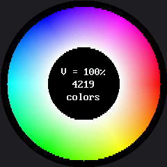

# The Color Wheel

Every color this display can make, arranged in one circle. This is a demo more than an exercise —
there is nothing to fill in — but it earns its lab number, because it is the kit's best worked
example of **measuring before you optimize**.

It is also the one program in the kit whose shape and the screen's shape are the same shape. A color
wheel *is* a circle: hue is an **angle**, and an angle has no beginning or end, which is exactly why
red appears at both "ends" of a rainbow. On a 128×64 rectangle this demo could not have existed —
not for want of color, but because a rectangle is the wrong container for the idea.

!!! mascot-welcome "The one demo my screen was made for"
    { class="mascot-admonition-img" }
    Round screen, round idea. Run it once and look at it before you read another word — this is the prettiest thing in the kit and it has two surprises hiding in it.

## How a Color Gets Its Place

| Axis | Maps to | Meaning |
|---|---|---|
| Angle around the ring | **Hue** | Which color it is |
| Distance from center | **Saturation** | How much of that color |
| Button A | **Value** | How bright, in three steps |

Those three axes are called **HSV**, and they are how people describe color. The display does not
think that way at all — it wants red, green, and blue amounts. `hsv_to_rgb()` is the translator
between the two, and writing that translator is most of what this program does.

Here's the wheel at full brightness:

## Surprise One: This Wheel Is a Slice

Color here has three dimensions, and a screen has two. **Every color wheel you have ever seen is one
flat cut through a solid**, at a single brightness. Press button A to move the cut and a whole new
sheet of colors appears.

## Surprise Two: You Cannot Show All 65,536 at Once

Not "it would be hard" — you cannot. The visible circle is 240 pixels across, so it holds about
45,239 pixels. There are more colors than there are places to put them, and no arrangement fixes
that.

When the wheel finishes, it counts how many **distinct** colors actually landed on the glass and
prints the number. At full brightness it is about **4,986** on a real board. Guess before you look;
nearly everyone guesses far too high.

And it drops as you dim the wheel, for a reason worth understanding: scaling a channel down *before*
the encoder truncates its low bits makes more values collapse onto each other. **Dim colors are
coarser colors.**

## Where the Time Goes

The demo prints a full timing report — start, end, drawing, counting, rate, microseconds per pixel.
A `FAST` flag switches between two drawing functions that produce the identical wheel. Both numbers
below were measured on a Pico:

| `FAST` | Time | Per pixel |
|---|---|---|
| `False` — written to be read | 18.3 s | 616 µs |
| `True` — written to be quick | 2.2 s | 74 µs |

The 8.3× splits into about **4×** from computing one color per 2×2 block, and about **2.1×** from
inlining two function calls and binding globals to locals — no change to *what* is computed, only to
how the interpreter reaches it.

**That second figure is the lesson: roughly half the cost of the original loop was never arithmetic
at all.**

!!! mascot-thinking "This Program Has the Opposite Bottleneck"
    { class="mascot-admonition-img" }
    Every other program in this kit is limited by the wire. This one is limited by math — an `atan2`, a `sqrt`, and an HSV conversion for every pixel, on a chip with no floating-point unit. Same hardware, opposite bottleneck, and the only reason you can tell them apart is that both measured themselves.

## Why the Math Is Slow: the RP2040 Has No FPU

Every `atan2`, `sqrt`, and float multiply is emulated in software. That is why the usual "batch your
drawing calls" instinct did nothing here — the drawing was already batched into about 480
`blit_buffer()` calls instead of 30,000 pixel calls, and the wheel was still slow.

If you had optimized without measuring, you would have optimized the wrong thing. That is the entire
argument for the measuring step, in one program.

## Two Dead Ends Kept in the File

Both are still in the source next to the working code, because they teach more than the successes:

| Attempt | Reasoning | What happened |
|---|---|---|
| Merge same-colored blocks into single `fill_rect` calls | The demo's own measurement says 25,591 pixels repeat a color already on screen | Display calls went **up**, from 324 to 6,359. The repeats are real but scattered, not adjacent. |
| `blit_buffer(line * BLOCK, ...)` to send a whole strip | Works fine in CPython | `TypeError` on the board — MicroPython repeats a `bytes` with `*` but not a `bytearray` |

That second one is worth remembering as a general warning: `check-labs.py` cannot catch it, because
the difference only exists on the real interpreter.

!!! mascot-tip "Read the Report, Not the Clock in Your Head"
    { class="mascot-admonition-img" }
    Guess where the time goes before you look at the shell — drawing, or counting the colors? Write your guess down. Being wrong here is the most useful thing that can happen to you in this lab.

## Things to Try

1. **Guess the distinct-color count** before you run it, then compare. Then guess again for the
   dimmest setting and see whether you correctly predicted the direction.
2. **Flip `FAST` to `False`** and run it again. Time both with a watch — you do not need
   instrumentation to feel an 8× difference.
3. **Change `BLOCK` from 2 to 4.** Four times fewer color computations. Where does the wheel start
   looking blocky, and is that trade worth it on this screen?
4. **Widen the ring** by lowering `INNER_R`. The middle of a wheel is where saturation is near zero
   and every hue collapses to the same gray — which is why the hole is there in the first place.

## References

- [Color and Bits](../color-bits/index.md) — the RGB565 encoding this wheel is exploring the limits of
- [How Fast Is a Face?](../draw-speed-timing/index.md) — the other optimization lab, with the opposite bottleneck
- [Design Your Own Emotion](../design-your-own/index.md) — where picking a color becomes a design decision with consequences
