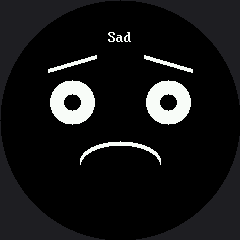

# Demo Reel

A self-running showcase that needs no buttons at all — the right program for a science fair table,
an open house, or a classroom shelf. It cycles through all seven emotions, blinking briefly between
each one so the transitions read as **alive** instead of as a slideshow.

## The Blink Between Faces

That blink is the whole design idea. Cut straight from one expression to the next and the face
looks like a PowerPoint deck. Close the eyes for 120 milliseconds in between and the same sequence
looks like a creature changing its mind.

```py
def blink_transition():
    display.fill(BLACK)
    for x in (LEFT_EYE_X, RIGHT_EYE_X):
        for offset in range(STROKE):
            shapes.ellipse(display, x, EYE_Y + offset, 26, BLINK_RADIUS_Y,
                           WHITE, NO_FILL, TOP_HALF)
    sleep(0.12)
```

!!! mascot-thinking "Animators Have Known This for a Century"
    { class="mascot-admonition-img" }
    A blink between poses hides the change and gives your eye something to do while my whole face rearranges itself. It costs one function and 120 milliseconds, and it is the difference between a machine cycling images and a robot thinking.

## This Is Where a Full Wipe Is Right

After all the warnings about `display.fill(BLACK)`, this lab uses one on every transition — and
that is the correct call here. It happens once every two seconds, not sixty times a second, and it
guarantees no leftovers from the previous face.

| Program | Wipes per second | Full wipe acceptable? |
|---|---|---|
| [Eye scanner](../eye-scanner/index.md) | ~100 | No — flickers badly |
| [Mode menu](../modes/index.md) | a few per minute | Yes |
| This demo reel | 0.5 | Yes |
| [Partial redraw](../partial-redraw/index.md) benchmark | ~50 | No — and it measures why |

Judgment about *when* an optimization matters is worth as much as knowing how to do it.

## Sample Program Code

The seven expression functions are identical to the ones in the
[expression menu](../emotion-modes/index.md). What is new is the loop at the bottom, which is only
five lines.

```py
# Lab 20: Demo Reel (excerpt -- the reel itself)

def show_emotion(name, draw):
    display.fill(BLACK)
    draw()
    x = HALF_WIDTH - (len(name) * FONT.WIDTH) // 2
    display.text(FONT, name, x, LABEL_Y, WHITE, BLACK)


def blink_transition():
    display.fill(BLACK)
    for x in (LEFT_EYE_X, RIGHT_EYE_X):
        for offset in range(STROKE):
            shapes.ellipse(display, x, EYE_Y + offset, 26, BLINK_RADIUS_Y,
                           WHITE, NO_FILL, TOP_HALF)
    sleep(0.12)


while True:
    for name, draw in EMOTIONS:
        show_emotion(name, draw)
        sleep(2)
        blink_transition()
```

The full program is `20-demo.py` in the kit.

Here's one frame from the middle of the reel:



The reel shows one emotion at a time, so a single picture catches whichever face was up when the
image was made. Run it and you get all seven, two seconds apart.

## Things to Try

1. **Delete the blink transition** and watch the same seven faces without it. The difference is
   larger than 120 milliseconds has any right to be.
2. **Change the hold** from 2 seconds to 4. Longer holds feel calm and a little sad; shorter ones
   feel manic. Find the timing that suits the personality you want.
3. **Reorder the emotions** so the reel tells a story — bored, curious, surprised, happy. A sequence
   is a narrative, not just a list.
4. **Add a fade.** Show each face, then redraw it with `face`-sized shapes in a dimmer color before
   the blink. You will need a color from `config.color565()`; the
   [color bits lab](../color-bits/index.md) explains how to pick one that stays visible.

## References

- [The Expression Menu](../emotion-modes/index.md) — the same seven expressions, driven by buttons
- [Standalone main.py](../sample-main-demo/index.md) — the demo reel plus a button menu, ready to run with no computer attached
- [Blinking](../blink/index.md) — where the closed-eye arc used in the transition comes from
