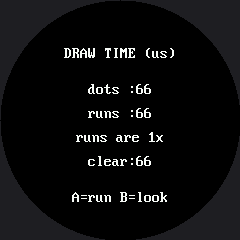

# How Fast Is a Face?

The OLED kit ran this lab to compare a hand-written ellipse against `framebuf`'s built-in one, and
the built-in won by a mile because it was compiled into the firmware and the hand-written one was
not. That is a fair race, and it has an obvious answer.

You cannot run that race here, because **this display has no built-in ellipse.** `shapes.ellipse()`
is MicroPython, written in a file you can open. So the question changes into a better one:

> Both versions are MicroPython. Both walk the same math. One of them is roughly ten times faster
> anyway. **Why?**

!!! mascot-welcome "Same language, same math, ten times the speed"
    { class="mascot-admonition-img" }
    This is my favorite result in the whole kit, because the answer is not "the fast one is written in C." Both of these are written in the same Python. Something else entirely is going on.

## Dots Against Runs

| Version | How it draws | Calls per filled eye |
|---|---|---|
| **Dots** | `display.pixel()`, one call per pixel | ~1,800 |
| **Runs** | `shapes.ellipse()`, one `hline()` per row | 49 |

Both send exactly the same 3,600 bytes of actual color. The difference is how many separate
**conversations** each one has with the display.

## The Ellipse Equation, Without Division

The dots version is worth reading on its own, because it contains a trick worth keeping. The ellipse
equation says a point is inside when:

$$\frac{dx^2}{r_x^2} + \frac{dy^2}{r_y^2} \le 1$$

Division is slow and inexact, so multiply both sides out first. The same test becomes whole-number
arithmetic with no division at all:

$$dx^2 \cdot r_y^2 + dy^2 \cdot r_x^2 \le r_x^2 \cdot r_y^2$$

```py
def dot_ellipse(cx, cy, rx, ry, colour, fill, bottom_half=False):
    rx2 = rx * rx
    ry2 = ry * ry
    limit = rx2 * ry2

    for dy in range(-ry, ry + 1):
        if bottom_half and dy < 0:
            continue
        dy2_rx2 = dy * dy * rx2
        for dx in range(-rx, rx + 1):
            if dx * dx * ry2 + dy2_rx2 > limit:
                continue                      # outside the ellipse
            display.pixel(cx + dx, cy + dy, colour)
```

Everything else in that function is just that one test, run on every pixel in the shape's bounding
box.

## A Benchmark You Can Trust

Two rules make a benchmark trustworthy, and both are in the code:

```py
def time_drawing(draw, repeats):
    """Return the average microseconds one call to draw() takes.

      1. Run it once first and throw that result away. The first call has
         to allocate things the later ones reuse, so it is never typical.
      2. Time several runs and average them. One reading of anything this
         fast is mostly noise; an average is a measurement.
    """
    draw()                                    # warm-up, not counted

    started = ticks_us()
    for _ in range(repeats):
        draw()
    return ticks_diff(ticks_us(), started) // repeats
```

The full-screen wipe is timed **separately**, because both faces pay it and leaving it inside the
comparison would hide the difference you are actually looking for.

Here's the report on screen:



The numbers in that picture came from a simulated run with a fake clock, so they are not meaningful
— the timings that matter are the ones your own board prints. Press A to run the benchmark and B to
flip between the report and the two faces, so you can confirm you are comparing like with like.

!!! mascot-warning "Trust Your Board, Not a Screenshot"
    { class="mascot-admonition-img" }
    Every timing number in this lab is a measurement of *your* hardware, at *your* baud rate, with *your* wiring. That is the whole point of building the instrument — so write down what your board says, not what a picture says.

## Why Runs Win

Both versions are interpreted MicroPython. Both do about the same arithmetic. The difference is
almost entirely in what they say to the display.

**1. Fewer conversations.** Setting a drawing window costs two commands and eight bytes, and it
happens on *every* `display.pixel()` call. A filled eye is roughly 1,800 pixels, so the dots version
pays that overhead 1,800 times to send 3,600 bytes of color. The runs version pays it 49 times —
once per row — and sends exactly the same 3,600 bytes.

**2. Fewer Python function calls.** A MicroPython method call is not free. 1,800 calls to `pixel()`
versus 49 calls to `hline()` is a real saving on its own, before a single byte reaches the wire.

Reason 1 is the big one, and it generalizes: **on any device you talk to over a bus — a display, an
SD card, a sensor, a network — batching your requests usually beats optimizing the work inside
them.**

## There Is a Third Tier

This kit does not use it, and you should know it exists. Russ Hughes also publishes
[`gc9a01_mpy`](https://github.com/russhughes/gc9a01_mpy) — the same driver written in C and compiled
into a custom MicroPython firmware, with pre-built images for the Waveshare RP2040-LCD-1.28. It has
a real `ellipse()`, and it is roughly the jump the OLED kit measured between hand-written and
built-in code.

This kit deliberately uses the Python driver so you can open it and read it. Reach for the C one
after this lab has shown you what you are buying.

## Things to Try

1. **Predict the ratio before you run it.** Write your guess down. Almost nobody guesses high enough.
2. **Compare both drawing times to `face.clear()`.** Which dominates a frame for the dots face?
   Which for the runs face? The answer flips, and that flip is exactly why
   [partial redraw](../partial-redraw/index.md) mattered so much.
3. **Make the eyes bigger** — change `EYE_R` from 24 to 40 — and run again. The dots time grows with
   the **area** of the eye; the runs time grows with its **height**, because that is how many
   `hline()` calls it makes. Growth rate matters more than any single measurement.
4. **Turn the fast version into the slow one.** Open `lib/shapes.py` and change the fill branch of
   `ellipse()` to use `display.pixel()` in a loop. Three lines, and you have located exactly where
   the speed was living.
5. **Time the other calls the same way.** How long does one `fill_rect()` take compared to drawing
   the same block with an `hline()` per row? You now own a method that answers questions like that
   in two minutes.

## References

- [Only Redraw What Changed](../partial-redraw/index.md) — the other big speed lever on this display
- [Drawing Ellipses](../ellipse/index.md) — the function whose implementation this lab is racing
- [Drawing Pixels](../pixel/index.md) — where the cost of one `pixel()` call was first described
