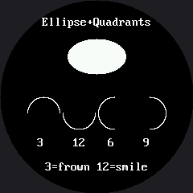

# Lab 6: Ellipse and Quadrant Fill Codes

`shapes.ellipse(display, x, y, horz_radius, vert_radius, color, fill_flag, quad_code)` draws every eye, eyebrow arc, and mouth curve in this kit. The quadrant codes are unchanged from the OLED kit's `framebuf.ellipse()`: 1 for top-right, 2 for top-left, 4 for bottom-left, 8 for bottom-right, added together to combine quarters — so `TOP_HALF` (3) still frowns and `BOTTOM_HALF` (12) still smiles.

## Sample Program Code

A filled reference ellipse, then the four quadrant combinations that matter most for a face:

```py
# Lab 06: Ellipse and Quadrant Fill Codes
# shapes.ellipse(display, x, y, horz_radius, vert_radius, color, fill_flag,
#                quad_code)
#
# The optional quad_code restricts drawing to one or more quarters of the
# ellipse: 1=top-right, 2=top-left, 4=bottom-left, 8=bottom-right. Add the
# numbers together to combine quarters. Those are the same numbers the
# OLED used, and they still mean the same thing.
#
# WHAT CHANGED: the call now starts with shapes.ellipse(display, ... )
# instead of oled.ellipse( ... ). The GC9A01 driver has no ellipse at all.
# framebuf's version was compiled into the MicroPython firmware; this one
# is written in MicroPython, in shapes.py, and you can open it and read
# the whole thing. Do that at some point -- it is fifty lines, and one of
# them is the ellipse equation you already know.

import config
import shapes

display = config.init_display()
WHITE = config.WHITE
BLACK = config.BLACK
NO_FILL = config.NO_FILL
FILL = config.FILL
FONT = config.SMALL_FONT

display.fill(BLACK)
display.text(FONT, "Ellipse+Quadrants", 52, 20, WHITE, BLACK)

# a plain filled ellipse for reference
shapes.ellipse(display, 120, 70, 36, 22, WHITE, FILL)

# four quadrant fill codes, drawn as outlines so each arc stands out
QUADRANTS = (
    (3, "top half"),
    (12, "bottom half"),
    (6, "left half"),
    (9, "right half"),
)

x = 54
for code, name in QUADRANTS:
    shapes.ellipse(display, x, 140, 20, 20, WHITE, NO_FILL, code)
    display.text(FONT, str(code), x - 8, 170, WHITE, BLACK)
    x += 44

display.text(FONT, "3=frown 12=smile", 56, 200, WHITE, BLACK)

# Things to try:
#
# 1. Codes 3 and 12 are the two that matter for a face: 3 is the frown,
#    12 is the smile. Two characters apart in the code, opposite feelings
#    on the robot's face. Lab 25 plants that exact bug on purpose.
#
# 2. Open shapes.py and find the loop in ellipse(). It walks one row at a
#    time and draws a horizontal run. Change the fill branch to use
#    display.pixel() in a loop instead and run this lab again -- the same
#    picture, drawn visibly slower.
```

Here's what that program draws:



## This Ellipse Doesn't Come From the Firmware

The OLED kit's `ellipse()` was compiled into MicroPython's `framebuf` module. This driver has no such thing, because it isn't built on `framebuf` at all — so `shapes.ellipse()` is ordinary MicroPython, living in `shapes.py`, and you can open that file and read the whole implementation. It walks the shape one row at a time and sends each row as a single run of pixels, which is what keeps a filled eye fast on a display with no buffer to hide the cost of drawing slowly.

Codes 3 and 12 are the two that matter most on a face: 3 is a frown, 12 is a smile. Two characters apart in the code, opposite feelings on the robot's face — and Lab 25 plants exactly that bug on purpose, later, once you already know what correct looks like.

!!! mascot-thinking "Worth Thinking About"
    { class="mascot-admonition-img" }
    1 + 2 + 4 + 8 = 15, every quadrant on. Add just the ones you want and the code tells the shape exactly how much of itself to draw.
