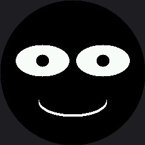

# Eye Scanner

A pupil that sweeps slowly back and forth is one of the cheapest, most convincing signals a robot
can send: it looks like the machine is **thinking**. This lab builds it by looping an `x` offset
and redrawing the pupils on every step.

It is also the lab where the color display changes the rules, and the change is big enough that
the rest of the kit is built around it.

!!! mascot-welcome "Watch me look around"
    { class="mascot-admonition-img" }
    Moving eyes are the first thing that makes a screen feel like a face instead of a picture of one. Let's make some pixels move.

## Why This Lab Can't Wipe the Screen

On the OLED, every frame started with `oled.fill(BLACK)` and nobody noticed, because the wipe
happened in RAM and the screen only ever saw the finished picture.

**Here there is no RAM copy.** A full wipe is 115,200 bytes going down the wire, and you *watch it
happen*. Do that on every frame and the animation flickers hard and crawls.

So this lab erases only the two eye boxes instead:

| Approach | Pixels repainted per frame | Result |
|---|---|---|
| Wipe the whole screen | 57,600 | Visible flicker, low frame rate |
| Erase two eye boxes | 10,304 | Smooth, no flicker, identical picture |

Under a fifth of the work for the same result. On this hardware that is not an optimization you
save for later — it is the price of admission, which is why it arrives at lab 11 instead of lab 29.

## Sample Program Code

Notice the split: `draw_static_parts()` runs once, and `draw_eyes()` runs on every frame and
touches nothing but the eyes.

```py
# Lab 11: Eye Scanner

import config
import shapes
from utime import sleep

display = config.init_display()
ON = config.WHITE
OFF = config.BLACK
FILL = config.FILL
NO_FILL = config.NO_FILL

HALF_WIDTH = config.WIDTH // 2

PUPIL_RANGE = 30
EYE_Y = 100
EYE_WIDTH = 44
EYE_HEIGHT = 26
PUPIL_RADIUS = 10
LEFT_EYE_X = 70
RIGHT_EYE_X = 170
MOUTH_Y = 168
MOUTH_WIDTH = 56
STROKE = 4

# The box each eye lives in. Erasing this much and no more is what keeps
# the animation smooth.
EYE_BOX_X = EYE_WIDTH + 2
EYE_BOX_Y = EYE_HEIGHT + 2

# Erasing paints black on black, so the most important thing this program
# does is invisible. Change this to config.RED and run it again.
ERASE_COLOR = OFF


def draw_eye(x, offset):
    shapes.ellipse(display, x, EYE_Y, EYE_WIDTH, EYE_HEIGHT, ON, FILL)
    shapes.ellipse(display, x + offset, EYE_Y, PUPIL_RADIUS, PUPIL_RADIUS,
                   OFF, FILL)


def draw_mouth():
    # bottom half of an ellipse (mask 12 = 4 + 8)
    for offset in range(STROKE):
        shapes.ellipse(display, HALF_WIDTH, MOUTH_Y - offset,
                       MOUTH_WIDTH, 24, ON, NO_FILL, 12)


def draw_static_parts():
    """Everything that does not move. Drawn once, then left alone."""
    display.fill(OFF)
    draw_mouth()


def draw_eyes(offset):
    """Only the part that changes: erase the two eye boxes and rebuild
    them. The mouth is already correct on the glass from before."""
    for x in (LEFT_EYE_X, RIGHT_EYE_X):
        display.fill_rect(x - EYE_BOX_X, EYE_Y - EYE_BOX_Y,
                          EYE_BOX_X * 2, EYE_BOX_Y * 2, ERASE_COLOR)
        draw_eye(x, offset)


draw_static_parts()

delay = 0.01
while True:
    for offset in range(-PUPIL_RANGE, PUPIL_RANGE):
        draw_eyes(offset)
        sleep(delay)
    for offset in range(PUPIL_RANGE, -PUPIL_RANGE, -1):
        draw_eyes(offset)
        sleep(delay)
```

Here is one frame of the animation, with both pupils sitting near the center of their sweep:



The mouth in that picture was drawn exactly once, before the loop started. Every frame after that
touched only the two rectangles around the eyes.

## Make the Invisible Visible

Here is the best trick in this kit. Erasing paints black onto black, so the single most important
thing your program does is completely invisible.

Change one line:

```py
ERASE_COLOR = config.RED
```

Now every box your program repaints lights up as a red rectangle with the eyes drawn on top of it,
and everything the program leaves alone stays black. You can *see* your optimization working.

!!! mascot-thinking "Color Is Free Here"
    { class="mascot-admonition-img" }
    A red pixel and a black pixel are both two bytes of RGB565. Making my program explain itself costs exactly nothing — and a bug you can see beats a bug you can only reason about.

## Things to Try

1. **Break it the OLED way.** Replace `draw_eyes()` with a version that calls `display.fill(OFF)`
   and redraws everything. Run it. The flicker and the frame rate together are the answer to "why
   does this kit care about partial redraw so early?"
2. **Shrink the erase box** to just the pupil's travel and see whether it still looks right. It
   will not, quite — and finding out why is the point.
3. **Change `EYE_WIDTH` to 50** without touching `EYE_BOX_X` and watch leftovers pile up at the
   edges. An erase box has to be sized for the largest thing that can appear in it.
4. **Do exercise 3 again with `ERASE_COLOR = config.RED`.** Now the leftover pixels are visibly
   *outside* a rectangle you can see the edges of. That is debugging made easy, for free.

## References

- [Drawing Rectangles](../rect/index.md) — where `fill_rect()` as an eraser was introduced
- [Only Redraw What Changed](../partial-redraw/index.md) — the same idea, measured in microseconds
- [Five Broken Faces](../broken-faces/index.md) — where a missing erase becomes a bug to diagnose
