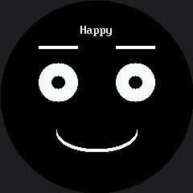

# The Face Module

Open the [expression menu](../emotion-modes/index.md) and the
[live tuning lab](../face-parameters/index.md) side by side. Both define a function that draws an
eye. Both define one that draws an eyebrow. Both define a mouth. The definitions are nearly
identical, and every program you have written that draws a face has been carrying its own private
copy.

That duplication is about to become a superpower, because getting rid of it is the single
highest-leverage move in programming.

!!! mascot-welcome "Time to clean up the workshop"
    { class="mascot-admonition-img" }
    You already know how to draw every part of my face. This lesson is about writing it down once, in one place, so you never have to write it again. Every pixel tells a story!

## Two Ideas With Real Names

This lab does not teach a single new drawing command. It teaches two ways of thinking that computer
scientists named a long time ago, because they matter that much.

**Decomposition** means breaking a problem into parts small enough to name. A face is not one thing
you draw — it is eyes, plus eyebrows, plus a mouth. Once each part has a name, you can work on one
without holding the other two in your head.

**Abstraction** means hiding *how* a part works behind *what* it is called. After this lab you will
write `face.eyes(24, 24)` and stop thinking about ellipses entirely. The ellipse is still there;
you just do not have to look at it anymore.

| Idea | The question it answers | What it looks like in code |
|---|---|---|
| Decomposition | What are the pieces? | Separate functions for eyes, eyebrows, and mouth |
| Abstraction | What do I call this piece, and what can I forget? | `face.eyes(24, 24)` instead of four `shapes.ellipse()` calls |

## Where the Facts Live Now

Your kit already had one shared file, `config.py`, holding the **hardware** facts — which pin the
clock is on, how many pixels wide the screen is, where the circle's center sits.

`face.py` does the same job for the **face** facts: how far apart the eyes sit, how long an eyebrow
is, how to draw each style of mouth, and what color it all draws in.

| File | What it knows | Lives at |
|---|---|---|
| `config.py` | Pins, screen size, circle geometry | The kit root |
| `face.py` | Eye spacing, brow length, mouth styles, colors | The kit root |
| `lib/shapes.py` | Generic geometry — ellipse, poly, ring | `lib/` |

That split is about what each file knows. `config.py` and `face.py` describe *this* kit.
`shapes.py` never mentions the kit at all, which is why it lives in `lib/` and why it moved to a
second round-display kit unchanged.

## Three Expressions in Nine Lines

Here is the payoff. The expression menu spends about 70 lines defining face parts before it draws
anything. With `face.py` doing that work, three complete expressions take nine.

```py
# Lab 23: The Face Module

import face
from utime import sleep


def happy():
    face.eyes(24, 24)
    face.eyebrows(0, 0, lift=5)
    face.mouth(face.SMILE, 50, 24)


def sad():
    face.eyes(22, 22)
    face.eyebrows(-7, -7, lift=0)
    face.mouth(face.FROWN, 40, 20)


def surprised():
    face.eyes(32, 32)
    face.eyebrows(0, 0, lift=14)
    face.mouth(face.OPEN, 20, 26)


# A list of (name, function) pairs, the same shape lab 18 used for modes.
EXPRESSIONS = (
    ("Happy", happy),
    ("Sad", sad),
    ("Surprised", surprised),
)


def show(name, draw):
    """The one place that knows the clear-draw-label sequence. Every
    expression above trusts this function to handle it."""
    face.clear()
    draw()
    face.label(name)


while True:
    for name, draw in EXPRESSIONS:
        show(name, draw)
        sleep(1.5)
```

Here's the first expression in the cycle:



## Notice What Is Missing

There is no `show()` call in that `show()` function. There is not one on this display at all.
`face.clear()` paints black, the drawing calls go straight to the glass, and that is the entire
cycle.

Compare the two kits and you can see the abstraction absorbing a hardware difference:

| | OLED kit's `face.py` | This kit's `face.py` |
|---|---|---|
| Draw a shape | Pokes bits in a RAM buffer | Sends bytes over SPI |
| End of a frame | `oled.show()` — required | Nothing — already on the glass |
| Erase | `oled.fill(0)`, essentially free | `face.erase(x, y, w, h)`, sized to the change |
| What the lab code looks like | `face.eyes(10, 10)` | `face.eyes(24, 24)` |

The last row is the point. Two different displays, two very different drivers, and the lab code is
the same shape either way. That is what abstraction is *for*.

!!! mascot-thinking "Moved, Not Rewritten"
    { class="mascot-admonition-img" }
    Refactoring means changing how code is organized without changing what it does. If my face looks different after this lab, something went wrong — a clean refactor is invisible from the outside.

## One Mouth Function Instead of Six

Faces need more than one kind of mouth, and `face.py` gives you one function plus a **style** name
that picks the shape:

```py
SMILE = "smile"
FROWN = "frown"
FLAT = "flat"
OPEN = "open"
SMIRK = "smirk"
SNEER = "sneer"


def mouth(style, size_x, size_y=0, color=None):
    """Draw whichever mouth `style` names."""
```

That single function is what makes the next lab possible. Because the mouth style is now a *value*
you can pass around, an entire expression can be written as a row of data instead of a block of
code.

## The Trade You Are Making

Abstraction is not free, and pretending otherwise would be dishonest. When you hide the
`shapes.ellipse()` calls behind `face.eyes()`, you hide them from yourself too. A beginner reading
your program can no longer see how an eye is drawn without opening a second file.

That trade is almost always worth it, and here is the rule of thumb: **hide a detail once you have
written it correctly three times.** Before then, writing it out teaches you something. After then,
writing it out just gives you three places to make the same typo.

| Before `face.py` | After `face.py` |
|---|---|
| Every program has its own `draw_eye()` | One copy, in one file |
| Fixing an eyebrow means editing 8 programs | Fixing an eyebrow means editing 1 file |
| You can see the `ellipse()` call right there | You have to open `face.py` to see it |
| New expression: copy 70 lines, then edit | New expression: 3 lines |

!!! mascot-celebration "One file to rule them all"
    { class="mascot-admonition-img" }
    Your face parts now live in one place, which means every program you write from here on starts with a face already built. Great expression!

## Things to Try

1. **Add a fourth expression.** You should not need to write a single `shapes.ellipse()` call — only
   `face.eyes()`, `face.eyebrows()`, and `face.mouth()` with different numbers.
2. **Change `face.EYE_SPACING` from 48 to 60** and run again. One edit just moved the eyes on every
   expression at once. (Go too far and they start hitting the bezel, which is the round screen
   reminding you it has opinions.)
3. **Break it on purpose.** Set `face.EYE_Y` to 220. Because every expression shares one definition,
   every expression breaks the same way — which is exactly what makes the bug easy to find.
4. **Compare file sizes.** This lab against lab 19: same three expressions, a fifth of the code, and
   every number you can still see is a number about *feeling* rather than about pixels.

## References

- [The Expression Menu](../emotion-modes/index.md) — the duplicated drawing code this lab consolidates
- [The Emotion Table](../emotion-table/index.md) — what becomes possible once a mouth style is a value
- [Your First Face](../happy-face/index.md) — where the eye spacing and mouth position numbers came from
