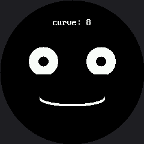

# Live Face Parameters

Every expression so far has used fixed numbers baked into the code. This lab makes one number
**live**: button A widens the smile, button B narrows it and then bends it into a frown, and the
face redraws instantly so you can watch a single parameter bend the whole mood in real time.

It is the fastest way to develop an intuition for how faces actually work, and it turns a
programming exercise into an experiment you can run on people.

!!! mascot-welcome "Turn the knob and watch me change my mind"
    { class="mascot-admonition-img" }
    One number controls the curve of my mouth. Push it up and I'm delighted; push it down and I'm disappointed. Somewhere in between is a value where nobody can tell — and finding that number is a real discovery.

## One Number, Two Mouths

The curve value does double duty. Positive means smile, negative means frown, and the sign picks
the quadrant mask:

```py
    # a positive curve smiles (BOTTOM_HALF), a negative curve frowns (TOP_HALF)
    if mouth_curve >= 0:
        mask = BOTTOM_HALF
        radius_y = mouth_curve + 4
    else:
        mask = TOP_HALF
        radius_y = -mouth_curve + 4
```

| `mouth_curve` | Mask | What you see |
|---|---|---|
| +32 | `BOTTOM_HALF` | A deep, delighted grin |
| +8 | `BOTTOM_HALF` | A gentle, pleasant smile |
| 0 | `BOTTOM_HALF` | A nearly flat line — neutral |
| −24 | `TOP_HALF` | A deep frown |

## "Instantly" Is Doing Real Work

The eyes never change, so they are drawn once and never touched again. Only the mouth's box and the
readout strip are erased and rebuilt on a press. Redraw the whole screen instead and the response
stops feeling instant — it starts feeling like a page loading.

```py
# The box the mouth can never escape: widest radius, deepest curve in
# either direction, plus a margin. Work this out from the numbers above
# rather than guessing, or you will be chasing leftovers all afternoon.
MOUTH_BOX_X = HALF_WIDTH - MOUTH_WIDTH - 4
MOUTH_BOX_Y = MOUTH_Y - MOUTH_CURVE_MAX - STROKE - 4
MOUTH_BOX_W = (MOUTH_WIDTH + 4) * 2
MOUTH_BOX_H = (MOUTH_CURVE_MAX + STROKE + 4) * 2
```

Read those four lines carefully. Every one of them is **derived** from the limits the program
already declares, rather than typed in as a guess. That is how you size an erase box correctly the
first time.

## Sample Program Code

```py
# Lab 22: Face Parameters -- Live Tuning (excerpt)

MOUTH_CURVE_MIN = -24
MOUTH_CURVE_MAX = 32
MOUTH_CURVE_STEP = 4


def draw_mouth(mouth_curve):
    display.fill_rect(MOUTH_BOX_X, MOUTH_BOX_Y,
                      MOUTH_BOX_W, MOUTH_BOX_H, BLACK)

    if mouth_curve >= 0:
        mask = BOTTOM_HALF
        radius_y = mouth_curve + 4
    else:
        mask = TOP_HALF
        radius_y = -mouth_curve + 4

    for offset in range(STROKE):
        shapes.ellipse(display, HALF_WIDTH, MOUTH_Y - offset,
                       MOUTH_WIDTH, radius_y, WHITE, NO_FILL, mask)


def draw_readout(mouth_curve):
    text = "curve: " + str(mouth_curve)
    display.fill_rect(0, LABEL_Y, config.WIDTH, FONT.HEIGHT, BLACK)
    x = HALF_WIDTH - (len(text) * FONT.WIDTH) // 2
    display.text(FONT, text, x, LABEL_Y, WHITE, BLACK)


def update(mouth_curve):
    draw_mouth(mouth_curve)
    draw_readout(mouth_curve)


display.fill(BLACK)
draw_eyes()

mouth_curve = 8
update(mouth_curve)

while True:
    if pressed(button_a):
        mouth_curve = min(MOUTH_CURVE_MAX, mouth_curve + MOUTH_CURVE_STEP)
        update(mouth_curve)
        wait_for_release(button_a)

    if pressed(button_b):
        mouth_curve = max(MOUTH_CURVE_MIN, mouth_curve - MOUTH_CURVE_STEP)
        update(mouth_curve)
        wait_for_release(button_b)

    sleep(0.01)
```

The full program is `22-face-parameters.py` in the kit.

Here's the starting state, at `curve: 8`:



## The Readout Is the Point

That `curve: 8` on screen is not decoration. It means every discovery you make is a **number** you
can write down, hand to somebody else, and put straight into the
[emotion table](../emotion-table/index.md).

!!! mascot-tip "You Are Doing Real Human-Factors Research"
    { class="mascot-admonition-img" }
    Find the exact curve where the face stops reading as happy and starts reading as neutral. Then find where neutral becomes sad. Those two numbers are a genuine finding about how people read faces — and you measured them yourself.

## Things to Try

1. **Find the two thresholds** described in the tip above, then ask three other people to find them
   too. Do you all agree? Where you disagree is the interesting part.
2. **Shrink `MOUTH_BOX_H` by twenty** and run to the extremes. The old mouth's ends survive the
   erase and pile up. The box has to be big enough for the **largest** thing that can appear in it,
   not the current one.
3. **Make a second parameter live.** Put the eyebrow lift on a third button, or let button B hold
   change what button A adjusts. Two knobs is a much richer instrument than one.
4. **Set `MOUTH_CURVE_STEP` to 1** and step slowly through the middle of the range. The transition
   from happy to neutral is not as sudden as you would guess.

## References

- [The Expression Menu](../emotion-modes/index.md) — where those fixed numbers came from
- [The Emotion Table](../emotion-table/index.md) — where the numbers you discover here belong
- [Design Your Own Emotion](../design-your-own/index.md) — the capstone, where tuning becomes designing
