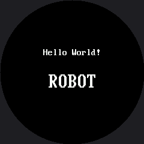

# Lab 1: Hello World

The classic first program, adapted for a driver with no built-in font. `config.init_display()` starts the SPI bus and the GC9A01 in one call, and then this lab writes two lines of text in the kit's two font sizes — proof that the wiring, the driver, and both fonts are all reachable before anything more interesting is asked of them.

## Sample Program Code

Run this and you should see two lines of white text on a black circle:

```py
# Lab 01: Hello World
# Confirms the display is wired correctly and MicroPython can run code on it.
#
# One line here does not look like the OLED kit's version, and it is the
# line that trips up everyone porting code to this driver:
#
#     display.text(FONT, "Hello!", x, y, WHITE, BLACK)
#            ^^^^^^
# There is no built-in font. framebuf gave the SSD1306 a fixed 8x8 font
# for free; this driver has none, so text() takes a font MODULE as its
# first argument. config.py imports two of them for you.

import config

display = config.init_display()

display.fill(config.BLACK)

# The small font: 8 pixels wide, 16 tall, so 30 characters fit across the
# widest part of the screen.
display.text(config.SMALL_FONT, "Hello World!", 72, 80,
             config.WHITE, config.BLACK)

# The big font: 16 x 32, readable from across the room, 15 characters max.
display.text(config.BIG_FONT, "ROBOT", 80, 120,
             config.WHITE, config.BLACK)

# Nothing else to do. There is no show() on this display -- both lines
# were already on the glass before this comment was reached.
```

Here's what that program draws on the display:



## There Is No Built-In Font

`framebuf`, the module behind the OLED kit's SSD1306 driver, ships a fixed 8-by-8 font for free. This driver is not built on `framebuf`, and it has no font of its own at all — `text()` takes a font **module** as its first argument, so `display.text("Hi", x, y, WHITE)` simply does not work here. `config.py` imports two font modules and hands them to you as `config.SMALL_FONT` (8x16) and `config.BIG_FONT` (16x32) so every later lab can just ask for one.

The call shape is `display.text(font, string, x, y, fg, bg)` — six arguments where the OLED kit needed four. The two new ones are not optional, and forgetting the font is the single most common first mistake anyone makes porting OLED code to this driver.
