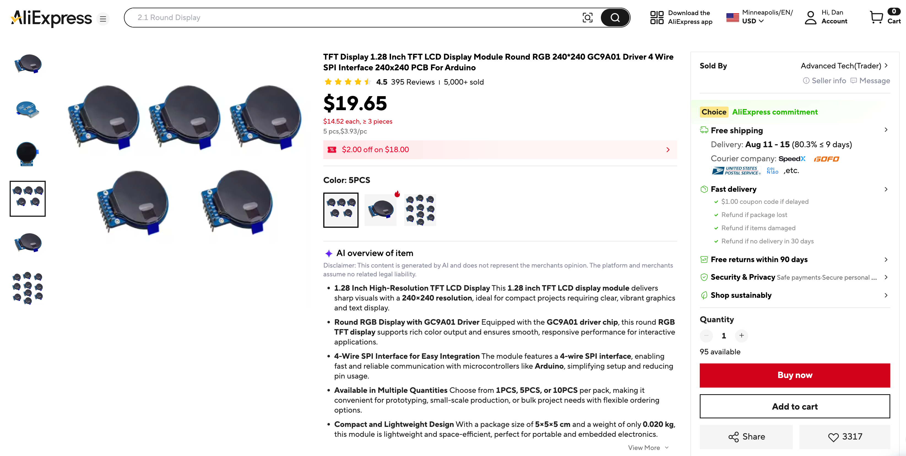
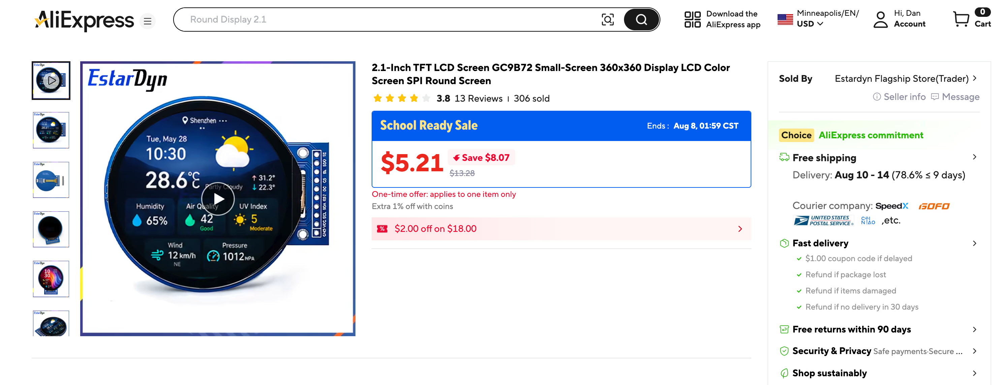

# Robot Faces Smartwatch Kit — List of Hands-On Labs

This kit is similar to the [OLED Two Button Kit](../oled/index.md) but it uses a 1.2 inch 240x240 round color display — the same panel used in cheap smartwatches and round dev boards.  The displays cost around $4 each and have bright colors that can be viewed from wide angles.



You can also larger get 2.1" versions for around $6.




Every lab number below means the same thing it does in the OLED kit, and the two are worth reading side by side: the differences between them are most of the lesson.

**Board:** Raspberry Pi Pico wired to a bare GC9A01 module (also runs unchanged on a Waveshare RP2040-LCD-1.28). **Display:** GC9A01A, 240x240, round IPS, SPI, 16-bit RGB565 color. See the kit's own [README](https://github.com/dmccreary/robot-faces/tree/main/src/kits/smartwatch) for wiring, uploading, and troubleshooting.

Every image on this site is a **simulated** screen — rasterized from the lab's real, current source using a tool that reproduces this driver's drawing calls pixel for pixel, masked to the circle a real GC9A01 actually shows. It is not a photograph. Always confirm on real hardware before handing a lab to students.

## Why the Code Looks Different From the OLED Kit

This isn't the OLED kit's code with new pin numbers. Almost every lab was rewritten, because three real differences in the hardware underneath it force different code on top of it — not stylistic choices, but things that will crash, clip, or silently do nothing if you port OLED code here by find-and-replace.

| | OLED kit | Smartwatch kit | What that changes in the code |
|---|---|---|---|
| **Shape** | 128x64, rectangular | 240x240, **round** | The driver addresses a 240x240 square, but the glass only shows the circle inscribed in it — a coordinate can be perfectly legal and still land somewhere nobody will ever see. Every layout in this kit was worked out against `config.SAFE_RADIUS`, not just the screen's width and height. See [Screen Coordinates](screen-coordinates/index.md) and [Five Broken Faces](broken-faces/index.md). |
| **Color** | 1 bit per pixel | 16-bit RGB565 | `WHITE` and `BLACK` are no longer `1` and `0` — they're `0xFFFF` and `0x0000`, and every other color is built with `config.color565(r, g, b)`. That also means a sprite costs 16x the memory it did on the OLED kit, which is most of the reason this driver keeps no frame buffer at all (next row). See [Blitting Buffers](blit/index.md) and [Color and Bits](color-bits/index.md). |
| **Frame buffer** | Kept the whole screen in RAM; `show()` pushed it to the glass | **None at all** | Every drawing call goes straight down the SPI wire the instant you make it. There is no `show()` anywhere in this kit — and clearing the whole screen, free on the OLED kit, is now the single most expensive thing a lab can do. Animations erase only the box that changed, starting as early as [Lab 11](eye-scanner/index.md) instead of waiting for a dedicated optimization lab. See [Don't Block the Loop](no-blocking/index.md) and [Only Redraw What Changed](partial-redraw/index.md). |

The driver itself is different too: this kit's GC9A01 has no built-in `ellipse()`, `poly()`, or font, so `shapes.py` rebuilds the first two in plain MicroPython and `config.py` imports two font modules to stand in for the third. Nothing about the *shapes* this kit draws is new — every eye, eyebrow, and mouth is the same idea as the OLED kit's — but almost everything about *how* they get onto the glass had to change to get there.

## Uploading Your Code

[`upload-code.sh`](https://github.com/dmccreary/robot-faces/blob/main/src/kits/smartwatch/upload-code.sh) copies everything this kit needs onto the board, in the order that matters: `lib/` first — the GC9A01 driver and the two font modules, since `config.py` fails to import without them — then `config.py` itself, then every lab. **Quit or disconnect Thonny first**; only one program can hold the Pico's serial port at a time, and `mpremote` fails outright if Thonny is still connected to it.

Run it from inside the kit's own directory:

```sh
cd robot-faces/src/kits/smartwatch
./upload-code.sh
```

A real run looks like this:

```text
NOTE: Quit or disconnect Thonny first — only one program can use the
      Pico's serial port at a time.

Checking for connected Pico...
Multiple serial devices found; using the first:
  /dev/cu.usbmodem14401
  /dev/tty.usbmodem14401
Override with: PORT=/dev/your-device ./upload-code.sh
Using device: /dev/cu.usbmodem14401
Uploading 3 file(s) to Pico :lib/ ...
  -> lib/gc9a01.py
  -> lib/vga1_8x16.py
  -> lib/vga1_bold_16x32.py
Uploading 38 file(s) to Pico...
  -> config.py
  -> 00-blink-onboard-led.py
  -> 01-hello.py
  ...
  -> 33-color-wheel.py
Done. Files on Pico:
```

That last line is followed by two `mpremote ls` listings — the board's root, then `:lib` — so you can confirm everything you expected actually landed before you disconnect and open a lab in Thonny.

A few things worth knowing before you run it:

- **It uploads *every* `.py` file in the directory, with no allowlist.** A stray tool or test script left in this folder gets copied onto the board along with the labs, and a Pico only has about 1.4 MB of filesystem to hold it all. Development tools belong in `src/utils/`, which is never uploaded — see the kit's own [README](https://github.com/dmccreary/robot-faces/tree/main/src/kits/smartwatch#uploading-the-code) for the full rule.
- **`config-cytron-rp2040.py` is not imported by anything and still gets uploaded**, because the script has no way to tell an alternate config file apart from a lab. It's harmless taking up a few kilobytes on the board, just not automatic to enable.
- **It auto-detects the port** by globbing `/dev/cu.usbmodem*`/`/dev/tty.usbmodem*` (macOS) or `/dev/ttyACM*`/`/dev/ttyUSB*` (Linux), and picks the first match if more than one shows up — which is exactly what happened in the transcript above. Override it with `PORT=/dev/your-device ./upload-code.sh` if it picks the wrong one.
- **It requires [`mpremote`](https://docs.micropython.org/en/latest/reference/mpremote.html)** (`pip install mpremote`) and fails fast with a clear message if it isn't installed.

## Getting Oriented

Confirm the board, the display, and the coordinate system before anything else depends on them.

| Lab | What you'll learn |
|--|--|
| [Blink Something](blink-onboard-led/index.md) | Before any display, any driver, any font, run this. |
| [Hello World](hello/index.md) | The classic first program, adapted for a driver with no built-in font. |
| [Screen Coordinates on a Round Display](screen-coordinates/index.md) | The coordinate system itself hasn't changed from the OLED kit: (0, 0) is the upper-left corner, x grows right, y grows down. |

## The Drawing Primitives

Every drawing command `shapes.py` and the driver together offer, one at a time.

| Lab | What you'll learn |
|--|--|
| [Drawing Pixels](pixel/index.md) | `display.pixel(x, y, color)` is the smallest drawing command there is — one dot, on or off. |
| [Drawing Lines](lines/index.md) | `hline()` and `vline()` take a start point and a length; `line()` takes two full end points and walks a diagonal. |
| [Drawing Rectangles](rect/index.md) | This driver splits what `framebuf` combined into one command. |
| [Ellipse and Quadrant Fill Codes](ellipse/index.md) | `shapes.ellipse(display, x, y, horz_radius, vert_radius, color, fill_flag, quad_code)` draws every eye, eyebrow arc, and mouth curve in this kit. |
| [Drawing Circles](circle/index.md) | A circle is an ellipse whose two radii happen to match, so `shapes.circle()` is a two-line wrapper around `shapes.ellipse()`. |
| [Drawing Polygons](poly/index.md) | `shapes.poly(display, x, y, point_array, color, fill_flag)` draws any shape you can list points for — triangles, stars, a rocket, whatever you can describe as a sequence of offsets from a center point. |
| [Blitting Buffers](blit/index.md) | `display.blit_buffer(buffer, x, y, width, height)` stamps a whole block of pre-computed pixels onto the display in one shot. |

## Building Faces

Eyes, eyebrows, mouths, and the first animations built out of them.

| Lab | What you'll learn |
|--|--|
| [Happy Face](happy-face/index.md) | The first complete expression: two eyes, two eyebrows, and a curved smile, built from three small functions. |
| [Eye Scanner](eye-scanner/index.md) | Sweeps both pupils back and forth by looping an x offset and redrawing on every step — the kit's first real animation, and the first lab where this display's missing frame buffer changes how you're allowed to write the code.. |
| [Winking with a Smile](wink/index.md) | A closed eye is an arc — the top half of an ellipse, drawn with quadrant mask `TOP_HALF` (3) instead of a full circle. |
| [Blinking](blink/index.md) | Waits for a press on button A (GP14, `PULL_UP`) and closes both eyes at once — two eyes shutting together reads as a blink, not a wink. |
| [Eyebrows with poly()](eyebrows/index.md) | Builds a curved eyebrow out of a six-point polygon instead of a single straight line — a bend that reads as far more expressive than a flat diagonal ever could.. |
| [Don't Block the Loop](no-blocking/index.md) | Every earlier animated lab paced itself with `sleep()`, which freezes the entire program while it waits. |
| [Sleeping Face](sleepy/index.md) | Closed eyes, drooping eyebrows, a quiet round mouth, and three drifting `Zzz` characters that bob up and down as if floating away.. |

## Menus, Buttons, and Live Control

Reading buttons, building menus, and tuning a face live.

| Lab | What you'll learn |
|--|--|
| [Reading Two Buttons](buttons/index.md) | Both buttons are wired exactly like the single button in the blinking lab. |
| [Mode Switching](modes/index.md) | Button A moves forward through a list of demo shapes; button B moves back. |
| [Expression Menu](emotion-modes/index.md) | The mode-switching pattern from Lab 18, applied to all seven Ekman emotions instead of demo shapes. |
| [Demo Reel](demo/index.md) | A self-running showcase that needs no buttons at all — good for a science fair table or an open house. |
| [Sample main.py — Self-Advancing Demo + Button Menu](sample-main-demo/index.md) | Rename this file to `main.py`, copy it to the root of the board's filesystem, and the watch face becomes a standalone device — no computer, no Thonny, just power. |
| [Face Parameters — Live Tuning](face-parameters/index.md) | Every expression up to this point has used fixed numbers. |

## Thinking About Your Code

The four habits that transfer to every program you'll ever write, taught on code you already understand: decomposition, pattern recognition, debugging, and algorithms.

| Lab | What you'll learn |
|--|--|
| [The Face Module — Decomposition and Abstraction](face-module/index.md) | Open Lab 19 and Lab 22 side by side. |
| [The Emotion Table — Pattern Recognition](emotion-table/index.md) | Look hard at Lab 19 again. |
| [Five Broken Faces — Debugging](broken-faces/index.md) | Every face in this lab is broken on purpose, each by one bug real people make on this exact hardware all the time. |
| [Trace and Watch — Debugging by Measurement](trace-and-watch/index.md) | Some bugs are invisible in a photograph. |
| [Keyframes — An Animation Is Just Data](keyframes/index.md) | Lab 24 turned seven expressions into seven rows of a table. |
| [A Face With a Memory](state-machine/index.md) | Lab 19's menu had no memory — press A and you get the next emotion, forever, the same way no matter what happened ten seconds ago. |
| [Only Redraw What Changed](partial-redraw/index.md) | Ask the decomposition question that matters most on this hardware: **which pixels actually change?** This lab animates a mouth two ways — wiping and rebuilding the whole face every frame, or erasing and redrawing only the mouth's box — and reports the timing difference in microseconds, live, on screen.. |
| [Design Your Own Emotion — The Capstone](design-your-own/index.md) | The last lab that follows a script, and the only one that doesn't tell you what to draw. |
| [How Fast Is a Face?](draw-speed-timing/index.md) | The OLED kit's version of this lab compared a hand-written ellipse against `framebuf`'s compiled built-in, and the built-in won by roughly the gap between interpreted and compiled code. |

## Color

What RGB565 actually is, and what it costs.

| Lab | What you'll learn |
|--|--|
| [Color and Bits — What a Number Has to Give Up](color-bits/index.md) | On the OLED kit a pixel was one bit — on or off, nothing to ask about it. |
| [The Color Wheel](color-wheel/index.md) | Every color this display can make, arranged in one ring — hue as the angle around it, saturation as the distance outward, and button A stepping through three brightness levels. |
