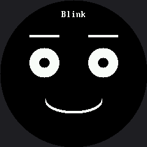

# Keyframes

The [emotion table](../emotion-table/index.md) turned seven expressions into seven rows of data.
This lab does the same trick to **motion**.

Every animation so far has been hand-written: a blink was some drawing, a sleep, some more drawing.
Change the timing and you edit code. But an animation is really just a list of poses and how long
each one holds — which is a table. Animators have called those poses **keyframes** for a hundred
years, and the idea works exactly as well on a $4 microcontroller as it does in a cartoon studio.

!!! mascot-welcome "Motion is data too"
    { class="mascot-admonition-img" }
    Write the player once and every animation becomes three lines of numbers that anyone on your team can tune without touching a single drawing call.

## One Frame Is Three Numbers

```py
#                eye  brow   ms
BLINK = (
    (24,  5,  60),
    (14,  5,  40),
    (2,   5,  70),
    (14,  5,  40),
    (24,  5,   0),
)
```

| Column | Meaning | Range that matters |
|---|---|---|
| `eye_height` | How tall the eyes are | 24 is open, 2 is shut |
| `eyebrow_lift` | How far the brows rise above resting | −7 droops, 18 is startled |
| `hold_ms` | How long to sit on this pose | 0 means "this is the last one" |

Read `BLINK` down the first column: 24, 14, 2, 14, 24. Open, half, shut, half, open. The animation
is right there in the numbers, and you can see it without running anything.

## The Player Knows Nothing About Blinking

Four variables are the player's entire memory. It does not know what a blink is, or what surprise
looks like. It only knows how to walk a list of poses in time — which is why it can play all four
animations in the lab, and every one you invent later.

```py
def update():
    """Advance the animation if the current pose has held long enough."""
    global playing, frame_index, frame_started

    if playing is None:
        return

    hold_ms = playing[frame_index][2]
    if ticks_diff(ticks_ms(), frame_started) < hold_ms:
        return

    frame_index += 1
    if frame_index >= len(playing):
        playing = None      # animation finished; last pose stays on screen
        return

    frame_started = ticks_ms()
    draw_frame(playing[frame_index])
```

That function returns instantly when there is nothing to do, so the main loop stays free to watch
the buttons — the lesson from the [no-blocking lab](../no-blocking/index.md), applied to something
more interesting than a single blink.

## Animations Built From Other Animations

Because the animations are data, ordinary list operations work on them:

```py
DOUBLE_BLINK = BLINK[:-1] + BLINK   # two blinks, built from the first one
```

That single line trims the last frame off `BLINK` and glues another `BLINK` onto it. No new drawing
code, no new player logic. Try building that from a hand-written animation and you will appreciate
the difference.

!!! mascot-thinking "Data Composes; Code Does Not"
    { class="mascot-admonition-img" }
    You can slice a table, reverse it, glue two together, or sort it. None of those things make sense on a block of hand-written drawing calls — and that is the whole argument for keeping motion in a list.

## Sample Program Code

```py
# Lab 27: Keyframes (excerpt -- the animations and the drawing)

SURPRISE = (
    (24,  5,  80),
    (34, 18, 500),
    (30, 14, 180),
    (24,  5,   0),
)

DOZE_OFF = (
    (24,  2, 350),
    (17,  0, 350),
    (10, -5, 400),
    (2,  -7, 900),
    (24,  2,   0),
)

ANIMATIONS = (
    ("Blink", BLINK),
    ("Blink x2", DOUBLE_BLINK),
    ("Surprise", SURPRISE),
    ("Doze off", DOZE_OFF),
)


def draw_frame(frame):
    """Erase the eye box, draw this pose into it, and stop. The mouth and
    the label are already correct on the glass from start(), so redrawing
    them would be pure wasted wire time -- and on this display, wasted
    wire time is the only kind of slowness there is."""
    eye_height, brow_lift, hold_ms = frame
    face.erase(BOX_X, BOX_Y, BOX_W, BOX_H)
    face.eyes(EYE_WIDTH, eye_height)
    face.eyebrows(0, 0, brow_lift)
```

The full program is `27-keyframes.py` in the kit.

Here's the first animation, at rest:



## A Real Bug the Erase Box Caused

There is a comment in this lab worth reading in full, because it documents a bug that a rendered
screenshot caught and a person did not:

```py
# face.py's default LABEL_Y (30) puts the caption's bottom edge at row 46
# -- ten rows INSIDE this animation's own erase box, which starts at
# BOX_Y (36). Every draw_frame() erase call was quietly biting the
# bottom third off the name on screen ... the geometry never triggers an
# error, it just eats the tails of every letter.
LABEL_Y = 16
```

That is the failure mode of partial redraw in one paragraph. The erase box has to know about
everything it overlaps, and nothing warns you when it does not. Moving the box down would not have
worked either — `SURPRISE` lifts the eyebrows by 18, reaching row 44 — so the **label** had to move
instead.

## Things to Try

1. **Make the blink slower** by changing only numbers — turn the 70 in the middle of `BLINK` into
   400. A snappy reflex becomes a heavy, tired droop, and you never touched the player.
2. **Build a `TRIPLE_BLINK`** in one line, the same way `DOUBLE_BLINK` was built.
3. **Add a fourth number to every frame** — a mouth width — so the mouth animates too. You change
   `draw_frame()` once and every animation gains a moving mouth. You will also need a second erase
   box, and working out where it goes is most of the work.
4. **Play an animation backward** by reversing the list. Does `DOZE_OFF` reversed read as waking up?
   Some motions are reversible and some are not, which is a real animation-design question.
5. **Put `face.clear()` at the top of `draw_frame()`** instead of `face.erase()`. Same picture, and
   the animation turns into a flickering slideshow. That single line is the difference between this
   kit's display and the OLED kit's.

## References

- [The Emotion Table](../emotion-table/index.md) — the same data-over-code move, applied to appearance
- [Don't Block the Loop](../no-blocking/index.md) — why the player checks the clock instead of sleeping
- [Only Redraw What Changed](../partial-redraw/index.md) — the erase-box discipline this lab depends on
