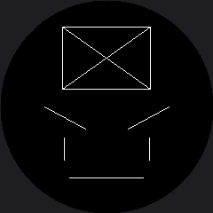

# Drawing Lines

Lines are the fastest way to put an idea on a screen, and on a robot face they carry more emotion
per pixel than anything else you can draw. The driver gives you three commands:

```py
display.hline(x, y, length, color)   # horizontal, from a start point
display.vline(x, y, length, color)   # vertical, from a start point
display.line(x1, y1, x2, y2, color)  # any angle, between two end points
```

The first two take a start point plus a **length**. The third takes two full **end points**. That
difference is worth noticing, because mixing them up is a bug that draws something plausible
instead of raising an error.

## Reach for hline and vline When You Can

They skip the angle math, and on this display they do something better: they send one continuous
run of pixels instead of walking the line a dot at a time. A horizontal line is the single cheapest
shape this hardware can draw, which is why `shapes.py` builds everything else out of them.

| Command | What it costs on this display |
|---|---|
| `hline()` | One drawing window, then the whole row of color |
| `vline()` | One window, then the whole column |
| `line()` at an angle | A walk down the line, roughly one window per pixel |

!!! mascot-thinking "The Eyebrow Rule"
    { class="mascot-admonition-img" }
    Angle the inner ends of my eyebrows *down* toward my nose and I look angry. Angle them *up* and I look sad or worried. Two lines, four numbers, and a stranger across the room knows how I feel — that is the superpower this whole book is about.

## Sample Program Code

The top half of this program is a box with an X through it, which shows all three commands next to
each other. The bottom half is an entire angry face made of nothing but lines.

```py
# Lab 04: Drawing Lines

import config

display = config.init_display()
WHITE = config.WHITE
BLACK = config.BLACK

display.fill(BLACK)

# top: a box built from two hlines and two vlines, with an X of general
# lines inside. It is centered, because a box in the corner of a round
# screen is a box you cannot see.
BOX_X = 70
BOX_Y = 30
BOX_W = 100
BOX_H = 70
display.hline(BOX_X, BOX_Y, BOX_W, WHITE)
display.hline(BOX_X, BOX_Y + BOX_H, BOX_W, WHITE)
display.vline(BOX_X, BOX_Y, BOX_H, WHITE)
display.vline(BOX_X + BOX_W - 1, BOX_Y, BOX_H, WHITE)
display.line(BOX_X, BOX_Y, BOX_X + BOX_W - 1, BOX_Y + BOX_H, WHITE)
display.line(BOX_X, BOX_Y + BOX_H, BOX_X + BOX_W - 1, BOX_Y, WHITE)

# bottom: an angry face made only of lines
# eyebrows angled down toward the nose -- the eyebrow rule
display.line(50, 120, 96, 145, WHITE)
display.line(190, 120, 144, 145, WHITE)
# eyes as short vertical lines
display.vline(72, 155, 26, WHITE)
display.vline(168, 155, 26, WHITE)
# a flat, unimpressed mouth
display.hline(78, 200, 84, WHITE)
```

Here's what that program draws on the display:



Look at how little that face is. Five lines, no curves, no fills — and it still reads as annoyed.
The eyebrows are doing almost all of the work.

## Every Line Here Stays Inside the Circle

That was a deliberate choice, and it is the constraint you will feel on every layout in this kit.
The box is centered at 70 to 170 rather than pushed to the screen edges, and the mouth stops well
short of the rim.

!!! mascot-warning "The Ends Vanish Before the Middle Does"
    { class="mascot-admonition-img" }
    Move the mouth down to y=228 and run it again. The ends disappear under the bezel while the middle is still fine — that lopsided failure is the round screen's signature, and once you have seen it you will recognize it instantly.

## Things to Try

1. **Flip the eyebrow rule.** Swap the two y-values on each eyebrow line so the inner ends angle
   *up*. The same face goes from angry to worried without touching anything else.
2. **Move the mouth to y=228** and watch the ends get eaten first, as in the warning above.
3. **Draw the box out at the edges** of the square, with x running from 0 to 239. You get four
   arcs instead of a box, because only the middles of the sides fall inside the glass.
4. **Thicken a line.** Draw the mouth four times at y, y+1, y+2, and y+3. One-pixel lines look like
   scratches on a screen this size, which is why every stroke in this kit is drawn several times.

## References

- [Eyebrows](../eyebrows/index.md) — the same rule, drawn with curved polygons instead of straight lines
- [Drawing Rectangles](../rect/index.md) — where `hline` and `vline` get bundled into one call
- [Screen Coordinates](../screen-coordinates/index.md) — why the ends of a long line go first
