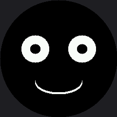

# Don't Block the Loop

Every animation so far has paced itself with `sleep()`, which is simple and completely freezes the
program while it waits. This lab swaps `sleep()` for `ticks_ms()` so the face can blink on its own
schedule while the main loop stays free to do other things — like watch a button.

It is the single most important structural idea in embedded programming, and this kit has a second
version of it that the OLED kit never needed.

## The Pattern

Instead of *waiting* for time to pass, you *check whether* it has passed and keep going either way.

```py
while True:
    now = ticks_ms()

    if not blinking and ticks_diff(now, last_blink) >= BLINK_EVERY_MS:
        blinking = True
        blink_started = now
        set_eyes(True)

    if blinking and ticks_diff(now, blink_started) >= BLINK_HOLD_MS:
        blinking = False
        last_blink = now
        set_eyes(False)

    # this loop never calls sleep(), so this spot is free for a button
    # check, a second animation, or anything else that needs to run often
```

Use `ticks_diff(now, then)` rather than plain subtraction. MicroPython's millisecond counter wraps
around when it runs out of room, and `ticks_diff()` handles that correctly while `now - then` gives
you a large negative number at the worst possible moment.

| Approach | While waiting, the program can… | Cost |
|---|---|---|
| `sleep(4)` | nothing at all | Missed buttons, frozen animations |
| `ticks_ms()` check | do anything else in the loop | A few lines of bookkeeping |

!!! mascot-thinking "A Slow Draw Blocks Exactly As Hard As a Sleep"
    { class="mascot-admonition-img" }
    Here is the part the OLED kit never had to think about. `display.fill(BLACK)` pushes 115,200 bytes and takes real milliseconds, and nothing else in my program runs while it does. Non-blocking timing and small redraws are two halves of one idea — neither is enough on its own.

## Sample Program Code

The face blinks by itself every four seconds. Nothing in the loop ever sleeps.

```py
# Lab 15: Don't Block the Loop

import config
import shapes
from utime import ticks_ms, ticks_diff

display = config.init_display()
WHITE = config.WHITE
BLACK = config.BLACK
NO_FILL = config.NO_FILL
FILL = config.FILL

TOP_HALF = 3
BOTTOM_HALF = 12

HALF_WIDTH = config.WIDTH // 2
EYE_SPACING = 48
LEFT_EYE_X = HALF_WIDTH - EYE_SPACING
RIGHT_EYE_X = HALF_WIDTH + EYE_SPACING
EYE_Y = 100
EYE_RADIUS = 28
PUPIL_RADIUS = 10
BLINK_RADIUS_Y = 14
BLINK_Y = EYE_Y + 7
STROKE = 4
MOUTH_Y = 168
MOUTH_RADIUS_X = 48
MOUTH_RADIUS_Y = 24

EYE_BOX = EYE_RADIUS + 4

BLINK_EVERY_MS = 4000  # how often the face blinks on its own
BLINK_HOLD_MS = 150    # how long the eyes stay shut


def draw_open_eye(x):
    shapes.ellipse(display, x, EYE_Y, EYE_RADIUS, EYE_RADIUS, WHITE, FILL)
    shapes.ellipse(display, x, EYE_Y, PUPIL_RADIUS, PUPIL_RADIUS, BLACK, FILL)


def draw_closed_eye(x):
    for offset in range(STROKE):
        shapes.ellipse(display, x, BLINK_Y + offset, EYE_RADIUS,
                       BLINK_RADIUS_Y, WHITE, NO_FILL, TOP_HALF)


def draw_smile():
    for offset in range(STROKE):
        shapes.ellipse(display, HALF_WIDTH, MOUTH_Y - offset,
                       MOUTH_RADIUS_X, MOUTH_RADIUS_Y,
                       WHITE, NO_FILL, BOTTOM_HALF)


def set_eyes(blinking):
    for x in (LEFT_EYE_X, RIGHT_EYE_X):
        display.fill_rect(x - EYE_BOX, EYE_Y - EYE_BOX,
                          EYE_BOX * 2, EYE_BOX * 2, BLACK)
        if blinking:
            draw_closed_eye(x)
        else:
            draw_open_eye(x)


display.fill(BLACK)
draw_smile()
set_eyes(False)

blinking = False
last_blink = ticks_ms()
blink_started = 0

while True:
    now = ticks_ms()

    if not blinking and ticks_diff(now, last_blink) >= BLINK_EVERY_MS:
        blinking = True
        blink_started = now
        set_eyes(True)

    if blinking and ticks_diff(now, blink_started) >= BLINK_HOLD_MS:
        blinking = False
        last_blink = now
        set_eyes(False)
```

Here's the face between blinks:



## Two Ways to Block, One Symptom

This is the idea worth carrying out of the lab. A program can be too slow for two completely
different reasons, and they look identical from the outside:

| Cause | What it looks like | Where you meet it |
|---|---|---|
| A `sleep()` in the loop | Buttons get ignored, animation stutters | This lab, and lab 25's bug 5 |
| A draw call that sends too many pixels | Buttons get ignored, animation stutters | Every full-screen wipe on this display |

Identical symptoms, unrelated causes. That is exactly why the [Trace and Watch](../trace-and-watch/index.md)
lab builds an instrument instead of asking you to guess.

## Things to Try

1. **Break it the interesting way.** Replace `set_eyes()` with a version that does
   `display.fill(BLACK)` and redraws the smile too. The loop still never sleeps — and it is now
   blocked for tens of milliseconds on every blink. Time it and see.
2. **Add a second timer** that nudges the mouth wider every 1.5 seconds. Two independent animations
   in one loop, with no threads and no interrupts, is the payoff for this whole pattern.
3. **Add a button check** in the free spot at the bottom of the loop. It will respond instantly,
   which the [blinking lab](../blink/index.md) could not manage.
4. **Print `ticks_ms()` once per loop** for a second and count the lines. That number is your real
   frame rate, and it is about to become the subject of its own lab.

## References

- [Blinking](../blink/index.md) — the blocking version of the same animation
- [Trace and Watch](../trace-and-watch/index.md) — an on-screen instrument for measuring what this lab describes
- [Only Redraw What Changed](../partial-redraw/index.md) — the other half of staying responsive on this display
