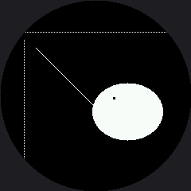

# Drawing Pixels

Every shape in this book — every eye, eyebrow, and mouth — is built from one thing: a single dot
called a **pixel**. The `pixel()` method is the smallest drawing tool the driver gives you, and it
sets exactly one dot.

```py
display.pixel(x, y, color)
```

On the OLED, `color` was 0 or 1. Here it is a 16-bit RGB565 number, and this lab uses two of them:
`config.WHITE` (0xFFFF) and `config.BLACK` (0x0000). Drawing in black is still how you erase.

!!! mascot-thinking "One Pixel Is the Whole Unit of Measure"
    { class="mascot-admonition-img" }
    My screen addresses 240 dots across and 240 down — 57,600 pixels, and about 45,000 of them are actually under the glass. Every one of them is two bytes and I control all of them. Every pixel tells a story!

## The Warning You Will Feel Immediately

Here is the difference that changes how you write code on this display. **Every `pixel()` call is
a separate conversation with the hardware.** Setting one dot means sending a command that opens a
drawing window, four bytes of coordinates, and then two bytes of color.

On the OLED, `pixel()` poked a byte in RAM and cost almost nothing. Run this lab and watch the
dotted rulers appear one dot at a time. That visible crawl is not your imagination — it is the
whole reason `shapes.py` works in horizontal runs, and it is what the
[How Fast Is a Face?](../draw-speed-timing/index.md) lab measures.

| Job | Cheap way | Expensive way |
|---|---|---|
| A row of 100 dots | one `hline()` | 100 `pixel()` calls |
| A filled eye | one `shapes.ellipse()` | a loop over the bounding box |
| A 3 by 3 catchlight | one `fill_rect()` | nine `pixel()` calls |
| A single highlight dot | `pixel()` — this is what it is for | anything else |

## Sample Program Code

This program uses `pixel()` three ways: to build dotted rulers, to draw a diagonal one dot at a
time, and to punch a small highlight out of a finished eye.

```py
# Lab 03: Drawing Pixels

import config
import shapes

display = config.init_display()
WHITE = config.WHITE
BLACK = config.BLACK
FILL = config.FILL
CENTER_X = config.CENTER_X
CENTER_Y = config.CENTER_Y

display.fill(BLACK)

# a dotted ruler across the middle: one pixel on, one pixel off
for x in range(20, 220, 2):
    display.pixel(x, 40, WHITE)

# a dotted ruler down the middle
for y in range(50, 200, 2):
    display.pixel(30, y, WHITE)

# a diagonal drawn one pixel at a time
for i in range(0, 90):
    display.pixel(45 + i, 60 + i, WHITE)

# an eye with a catchlight punched out in black pixels. The eye is one
# shapes.ellipse() call -- fast, because it works in rows -- and the
# catchlight is nine individual pixels, which is fine because there are
# only nine of them.
shapes.ellipse(display, 160, 140, 44, 36, WHITE, FILL)
for dy in range(3):
    for dx in range(3):
        display.pixel(142 + dx, 122 + dy, BLACK)
```

Here's what that program draws on the display:



## The Catchlight Trick

Look closely at the eye. Those nine black pixels in its upper left are a **catchlight** — the
small bright reflection you see in a real eye. Nine dots is all it takes to make a flat white blob
start reading as something alive and looking at you.

This is also your first look at drawing in **layers**. The `ellipse()` call ran first and filled
the whole shape white. The nine `pixel()` calls ran second, so they overwrote what was already
there. On a display with no frame buffer, later commands always win — and they win immediately,
right on the glass.

!!! mascot-warning "Off-Screen Pixels Just Disappear"
    { class="mascot-admonition-img" }
    Ask for `pixel(300, 90, WHITE)` and nothing happens — no dot, no error. Worse, ask for `pixel(10, 10, WHITE)` and it is *accepted*, drawn, and still invisible, because that corner is behind the bezel. Check your coordinates against the circle, not just the 240 by 240 range.

## Things to Try

1. **Time the dotted ruler.** Wrap the first loop in `ticks_us()` readings and print the total.
   Then draw the same 100 dots with one `hline()` and time that. The gap is the cost of talking to
   the display 100 times instead of once.
2. **Replace the catchlight** with a single `fill_rect(142, 122, 3, 3, BLACK)`. Same picture, one
   trip down the wire instead of nine.
3. **Move the catchlight** to the other side of the eye and see how it changes where the eye seems
   to be looking. Two pixels of position carry a surprising amount of meaning.
4. **Push a ruler outward.** Change the horizontal ruler's `y` from 40 to 10 and watch both ends
   get eaten by the bezel while the middle survives.

## References

- [Screen Coordinates](../screen-coordinates/index.md) — why a valid coordinate can still be invisible
- [How Fast Is a Face?](../draw-speed-timing/index.md) — the lab that measures dots against runs and finds a 10x gap
- [MicroPython machine.SPI Documentation](https://docs.micropython.org/en/latest/library/machine.SPI.html) — the bus every one of those pixel calls travels down
