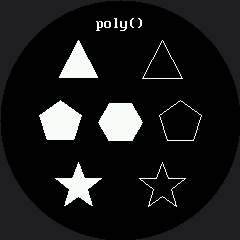

# Drawing Polygons

`poly()` draws any shape you can list points for — triangles, pentagons, stars, and the curved,
angled eyebrows that make a robot face expressive. It is the one drawing command that can point in
a **direction**, which is exactly why the eyebrow lab reaches for it.

```py
shapes.poly(display, x, y, point_array, color, fill_flag)
```

`point_array` is a MicroPython `array('h', [x0, y0, x1, y1, ...])` of signed shorts. The `'h'`
matters: the OLED kit used `array('B')` — unsigned bytes, maximum 255 — which still fits this
screen, but signed shorts let the offsets go **negative**, and negative offsets are what let you
write a shape around its own center instead of from a corner.

## How the Fill Works

This driver has no `poly()` of its own, so `shapes.poly()` fills polygons itself using a
**scanline fill**: for each row, find where the shape's edges cross it, sort the crossings, and
fill between them in pairs.

Open `lib/shapes.py` and read it. It is the same algorithm every 2-D graphics library on earth
uses, and it fits on one screen.

!!! mascot-thinking "One Array, Four Positions"
    { class="mascot-admonition-img" }
    Every shape below is written once, as offsets from a center point, and then placed by moving that center. Change the anchor and the shape moves; change the array and the shape changes. Keeping those two ideas separate is most of what makes drawing code readable.

## Sample Program Code

Four shapes, each drawn filled on one side and outlined on the other so you can compare them.

```py
# Lab 08: Drawing Polygons

import config
import shapes
from array import array

display = config.init_display()
ON = config.WHITE
BLACK = config.BLACK
NO_FILL = config.NO_FILL
FILL = config.FILL
FONT = config.SMALL_FONT

display.fill(BLACK)
display.text(FONT, "poly()", 96, 16, ON, BLACK)

# Every shape below is written as offsets from a center point, then
# placed by moving that center. Same array, four positions.
TRIANGLE = array('h', [0, -22, 20, 16, -20, 16])
PENTAGON = array('h', [0, -22, 21, -7, 13, 18, -13, 18, -21, -7])
HEXAGON = array('h', [-11, -19, 11, -19, 22, 0, 11, 19, -11, 19, -22, 0])
STAR = array('h', [0, -24, 6, -8, 23, -8, 9, 3, 14, 20,
                   0, 10, -14, 20, -9, 3, -23, -8, -6, -8])

# row one: filled on the left, outlined on the right
shapes.poly(display, 78, 62, TRIANGLE, ON, FILL)
shapes.poly(display, 162, 62, TRIANGLE, ON, NO_FILL)

# row two
shapes.poly(display, 60, 122, PENTAGON, ON, FILL)
shapes.poly(display, 120, 122, HEXAGON, ON, FILL)
shapes.poly(display, 180, 122, PENTAGON, ON, NO_FILL)

# row three
shapes.poly(display, 78, 186, STAR, ON, FILL)
shapes.poly(display, 162, 186, STAR, ON, NO_FILL)
```

Here's what that program draws on the display:



Notice the middle row is three shapes wide and the outer rows are two. That is the circle deciding
your layout for you — the screen is widest across its middle, so that is where the most shapes fit.

## Filled or Outlined Costs Different Amounts

This is worth knowing before you start drawing brows. A filled polygon sends one `hline()` per row
it covers. An outline sends one `line()` per edge. Which one is cheaper depends entirely on the
shape:

| Shape | Filled cost | Outline cost |
|---|---|---|
| A short, wide eyebrow (12 rows, 6 edges) | 12 runs | 6 angled walks |
| A tall star (48 rows, 10 edges) | 48 runs | 10 angled walks |
| A big filled pentagon | grows with **area** | grows with **perimeter** |

!!! mascot-tip "An Outlined Brow Reads as a Scratch"
    { class="mascot-admonition-img" }
    Try drawing an eyebrow with `NO_FILL` and you get a thin wire frame that looks like a scuff on the glass. Filled polygons are what make brows read as brows on a screen this size.

## Things to Try

1. **Add a point to `STAR`** and see what happens. Scanline fill does not care how many points you
   give it, or whether the shape is convex — but it does assume the outline does not cross itself.
2. **Make it cross itself on purpose** and look at the result. The pattern you get is not a bug in
   your code; it is what "inside" means when a shape overlaps itself.
3. **Time the filled star against the outlined one** with `ticks_us()`. Predict which is faster
   first, then find out whether the shape or your intuition was in charge.
4. **Turn a triangle into an eyebrow.** Squash `TRIANGLE` flat — change the ±22 and ±16 to ±4 and
   ±20 — and put it above an eye. You have just built the [eyebrow lab](../eyebrows/index.md).

## References

- [Eyebrows](../eyebrows/index.md) — where `poly()` becomes the most expressive tool on the face
- [Drawing Lines](../lines/index.md) — the straight-line version of the same idea, and its limits
- [MicroPython array Documentation](https://docs.micropython.org/en/latest/library/array.html) — what `array('h', ...)` actually builds
