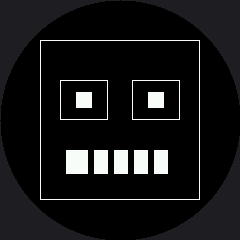

# Lab 5: Drawing Rectangles

This driver splits what `framebuf` combined into one command. `display.rect(x, y, w, h, color)` always draws an outline — there is no fill flag. `display.fill_rect(x, y, w, h, color)` is the separate call for a solid block. There's still no "erase" command anywhere in this kit: drawing in black **is** erasing, since black is just an unlit pixel.

## Sample Program Code

A border, a blocky retro face, and a mouth bar with teeth erased out of it in black:

```py
# Lab 05: Drawing Rectangles
# This driver splits what framebuf combined. rect() always draws an
# outline and takes no fill flag; fill_rect() draws the solid block:
#
#     display.rect(x, y, w, h, color)              <- outline only
#     display.fill_rect(x, y, w, h, color)         <- solid
#
# There is still no "erase" command. Drawing in black is erasing, and on
# this display fill_rect(..., BLACK) is the fastest eraser you have --
# it is the one call that sends a long run of identical pixels.

import config

display = config.init_display()
WHITE = config.WHITE
BLACK = config.BLACK

display.fill(BLACK)

# a border. On a round screen a rectangular border gets its corners
# clipped, so this one is pulled well inside the safe radius.
display.rect(40, 40, 160, 160, WHITE)

# a retro blocky face: square eye sockets with a filled pupil inside each
display.rect(60, 80, 48, 40, WHITE)
display.fill_rect(76, 92, 16, 16, WHITE)

display.rect(132, 80, 48, 40, WHITE)
display.fill_rect(148, 92, 16, 16, WHITE)

# a wide filled mouth bar with black teeth erased out of it
display.fill_rect(66, 150, 108, 24, WHITE)
for tooth_x in range(88, 174, 20):
    display.fill_rect(tooth_x, 150, 6, 24, BLACK)

# Things to try:
#
# 1. Widen the border to display.rect(10, 10, 220, 220, WHITE) and run it
#    again. The corners disappear and you are left with four arcs.
#
# 2. Erase just the mouth: fill_rect(66, 150, 108, 24, BLACK). One call
#    takes it back, and nothing else on screen moves. That is the trick
#    lab 29 is built on.
```

Here's what that program draws:



## The Fastest Eraser You Have

`fill_rect(..., BLACK)` sends one long run of identical pixels, which makes it the cheapest way to take something back on a display with no frame buffer to simply overwrite in RAM. That single fact — erasing is just filling with black, and filling a rectangle is the fastest thing this driver does — is what makes later labs like partial redraw (Lab 29) possible at all.

Try widening the border to span nearly the whole square (say, `rect(10, 10, 220, 220, WHITE)`) and run it again. The corners disappear and you're left with four disconnected arcs — the same round-screen lesson from Lab 2, now showing up in a shape you built yourself.
