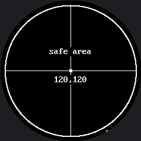

# Screen Coordinates

The coordinate system on this display works exactly the way it did on the OLED. The origin `(0,0)`
is the upper-left corner, `x` grows to the right, and `y` grows **downward** — the opposite of the
graphs you draw in math class.

What is new is much stranger: **the upper-left corner is not there.**

## A Square of Pixels Behind a Circle of Glass

The GC9A01 controller addresses a 240 by 240 **square** of pixels. The glass in front of it is the
circle inscribed in that square. Pixel `(0,0)` is a real, addressable, paid-for pixel — and you
will never see it. Nothing warns you.

!!! mascot-thinking "x and y Are No Longer Independent"
    { class="mascot-admonition-img" }
    On a rectangle, any x from 0 to 127 worked with any y from 0 to 63. Here, whether an x is usable depends entirely on the y you pair it with. That one sentence explains most of the surprises in this kit.

These are the landmarks worth memorizing before you place anything:

| Landmark | Value |
|---|---|
| Center of the screen and of the circle | `(120, 120)` |
| Physical edge of the glass | radius 120 |
| `config.SAFE_RADIUS` — comfortably inside the bezel | 112 |
| Corner of the addressable square | radius ≈ 170 — never visible |

That last row is the whole lesson. A corner of the square sits 120 × 1.414 ≈ 170 pixels from the
center, and the glass stops at 120. Fifty pixels of your drawing surface simply do not exist.

When you are placing something near the rim and are not sure whether it will survive,
`config.inside_circle(x, y)` does the arithmetic for you:

```py
if config.inside_circle(x, y):
    display.pixel(x, y, config.WHITE)
```

## Sample Program Code

This program draws proof. The four corner dots and their labels go exactly where the OLED kit put
them, and then a ring shows you which of them survived.

```py
# Lab 02: Screen Coordinates on a Round Display

import config
import shapes

display = config.init_display()
WHITE = config.WHITE
BLACK = config.BLACK
WIDTH = config.WIDTH
HEIGHT = config.HEIGHT
FONT = config.SMALL_FONT

display.fill(BLACK)

# axis lines through the CENTER, not along the edges -- on a round screen
# the edges of the square are the part you cannot see
display.hline(8, HEIGHT // 2, WIDTH - 16, WHITE)
display.vline(WIDTH // 2, 8, HEIGHT - 16, WHITE)

# the four corners of the addressable square. Watch how many appear.
display.fill_rect(0, 0, 6, 6, WHITE)
display.text(FONT, "0,0", 8, 8, WHITE, BLACK)

display.fill_rect(WIDTH - 6, 0, 6, 6, WHITE)
display.text(FONT, "239,0", WIDTH - 48, 8, WHITE, BLACK)

display.fill_rect(0, HEIGHT - 6, 6, 6, WHITE)
display.text(FONT, "0,239", 8, HEIGHT - 20, WHITE, BLACK)

display.fill_rect(WIDTH - 6, HEIGHT - 6, 6, 6, WHITE)
display.text(FONT, "239,239", WIDTH - 60, HEIGHT - 20, WHITE, BLACK)

# the exact center of the display, which on this screen is also the
# center of the circle
CENTER_X = config.CENTER_X
CENTER_Y = config.CENTER_Y
display.fill_rect(CENTER_X - 2, CENTER_Y - 2, 5, 5, WHITE)
display.text(FONT, "120,120", CENTER_X - 28, CENTER_Y + 8, WHITE, BLACK)

# The safe area: everything inside this ring is visible, everything
# outside it is either under the bezel or gone entirely.
shapes.ring(display, CENTER_X, CENTER_Y, config.SAFE_RADIUS, WHITE, 2)
display.text(FONT, "safe area", CENTER_X - 36, CENTER_Y - 40, WHITE, BLACK)
```

Here's what that program draws on the display:



Count the corner labels you can read. The program asked for four of them, in the four places a
rectangular display would have had corners, and the circle kept almost nothing.

## Why the Axes Run Through the Middle

Notice that the horizontal and vertical rules are drawn through the **center**, not along the
edges. On a round screen the edges of the square are exactly the part you cannot see, so a ruler
along the top edge would be a ruler nobody can read.

That is the general rule this kit follows everywhere: **on a round display, work outward from the
center, not inward from a corner.**

| Rectangular habit | Round-screen version |
|---|---|
| Put a label at `(2, 2)` | Center it near the top of the circle |
| Lay out a 2 by 2 grid of shapes | Lay them out in a diamond |
| Draw a border at the screen edge | Draw a ring at `config.SAFE_RADIUS` |
| Assume any `(x, y)` in range is visible | Check `config.inside_circle(x, y)` |

!!! mascot-tip "Find Your Own Safe Radius"
    { class="mascot-admonition-img" }
    Move one corner label toward the center, ten pixels at a time, until it appears. The distance you land on is the real edge of your usable area — and it is what `config.SAFE_RADIUS` is set to.

## Things to Try

1. **Do the arithmetic, then check it.** A corner of the square is 170 pixels from the center and
   the glass stops at 120. Predict how much of each corner marker survives before you look.
2. **Walk a label inward** ten pixels at a time until it is fully readable, as in the tip above.
3. **Break the independence rule on purpose.** Pick `y = 20` and find the smallest and largest `x`
   that are still visible at that height. Then do it again at `y = 120`. The two answers are
   nothing alike, and that gap is the shape of your screen.

## References

- [Drawing Pixels](../pixel/index.md) — the next lab, and the smallest thing you can put at a coordinate
- [Five Broken Faces](../broken-faces/index.md) — where "drawn outside the circle" shows up as a bug with no error message
- [OLED Screen Coordinates](../../oled/screen-coordinates/index.md) — the same idea on a rectangle, where every pixel is visible
