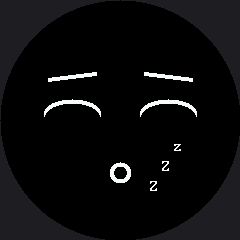

# Sleeping Face

Closed eyes, drooping eyebrows, a small quiet mouth, and three `Z` characters drifting up and away.
This lab is where the round screen stops being a constraint you work around and starts making
design decisions **for** you.

!!! mascot-welcome "Time for a nap"
    { class="mascot-admonition-img" }
    A sleeping robot is one of the friendliest things a machine can be. It says "I'm fine, I'm just resting" — which is exactly what you want a robot to say when it has nothing to do.

## The Zzz Had Nowhere to Go

On the OLED, the `Zzz` sat in the top-right **corner**. This screen has no corners.

The obvious replacement — up beside the right eye, where the OLED put them — is already occupied.
On a 240×240 circle the eyebrow reaches out to x=192 at that height, and the first `Z` lands right
on top of it. There is no free corner to retreat to.

So the `Z`s drift up and to the right from **beside the mouth**, rising into the empty quarter
below the right eye. That is not a stylistic preference; it is the only clear space left.

| Screen shape | Where the Zzz can live |
|---|---|
| 128 × 64 rectangle | The top-right corner, away from everything |
| 240 × 240 circle | Beside the mouth, rising into the gap under the right eye |

## Sample Program Code

Only the `Z`s move, so only the `Z` box is erased between frames. Everything else is drawn once.

```py
# Lab 16: Sleeping Face

import config
import shapes
from utime import sleep

display = config.init_display()
WHITE = config.WHITE
BLACK = config.BLACK
NO_FILL = config.NO_FILL
FILL = config.FILL
FONT = config.SMALL_FONT

TOP_HALF = 3  # 1 (top right) + 2 (top left)

HALF_WIDTH = config.WIDTH // 2
EYE_SPACING = 48
LEFT_EYE_X = HALF_WIDTH - EYE_SPACING
RIGHT_EYE_X = HALF_WIDTH + EYE_SPACING
EYE_Y = 106
EYE_RADIUS = 28
SLEEP_RADIUS_Y = 14
SLEEP_Y = EYE_Y + 7
STROKE = 4

EYEBROW_HALF_WIDTH = 24
EYEBROW_Y = EYE_Y - 34
EYEBROW_DROOP = 6  # outer corners sag, the way real brows relax before sleep

MOUTH_Y = 172
MOUTH_RADIUS = 10

ZZZ_X = 150
ZZZ_Y = 174
ZZZ_STEP_X = 12
ZZZ_STEP_Y = 20
BOB_RANGE = 5

# The rectangle the three Z's live in, with room for the bob at both
# ends. Get this box wrong and the old Z's stay on screen forever.
ZZZ_BOX_X = ZZZ_X - 4
ZZZ_BOX_Y = ZZZ_Y - ZZZ_STEP_Y * 2 - BOB_RANGE - 2
ZZZ_BOX_W = ZZZ_STEP_X * 2 + 16
ZZZ_BOX_H = ZZZ_STEP_Y * 2 + BOB_RANGE * 2 + 20


def draw_closed_eye(x):
    for offset in range(STROKE):
        shapes.ellipse(display, x, SLEEP_Y + offset, EYE_RADIUS,
                       SLEEP_RADIUS_Y, WHITE, NO_FILL, TOP_HALF)


def draw_eyebrows():
    for offset in range(STROKE):
        display.line(LEFT_EYE_X + EYEBROW_HALF_WIDTH, EYEBROW_Y + offset,
                     LEFT_EYE_X - EYEBROW_HALF_WIDTH,
                     EYEBROW_Y + EYEBROW_DROOP + offset, WHITE)
        display.line(RIGHT_EYE_X - EYEBROW_HALF_WIDTH, EYEBROW_Y + offset,
                     RIGHT_EYE_X + EYEBROW_HALF_WIDTH,
                     EYEBROW_Y + EYEBROW_DROOP + offset, WHITE)


def draw_mouth():
    for offset in range(STROKE):
        shapes.circle(display, HALF_WIDTH, MOUTH_Y, MOUTH_RADIUS - offset,
                      WHITE, NO_FILL)


def draw_zzz(bob):
    display.fill_rect(ZZZ_BOX_X, ZZZ_BOX_Y, ZZZ_BOX_W, ZZZ_BOX_H, BLACK)
    display.text(FONT, 'Z', ZZZ_X, ZZZ_Y + bob, WHITE, BLACK)
    display.text(FONT, 'Z', ZZZ_X + ZZZ_STEP_X,
                 ZZZ_Y - ZZZ_STEP_Y + bob, WHITE, BLACK)
    display.text(FONT, 'z', ZZZ_X + ZZZ_STEP_X * 2,
                 ZZZ_Y - ZZZ_STEP_Y * 2 + bob, WHITE, BLACK)


def draw_sleeping_face():
    """The parts that never move, drawn once."""
    display.fill(BLACK)
    draw_closed_eye(LEFT_EYE_X)
    draw_closed_eye(RIGHT_EYE_X)
    draw_eyebrows()
    draw_mouth()


draw_sleeping_face()

while True:
    for bob in range(-BOB_RANGE, BOB_RANGE):
        draw_zzz(bob)
        sleep(0.15)
    for bob in range(BOB_RANGE, -BOB_RANGE, -1):
        draw_zzz(bob)
        sleep(0.15)
```

Here's one frame of the animation:



## Three Signals Saying the Same Thing

Sleep is one of the few expressions where redundancy is the point. Each of these on its own is
ambiguous; together there is no mistaking it:

| Feature | On its own it could mean | Together they mean |
|---|---|---|
| Closed eyes (arcs) | Blinking, winking, laughing | |
| Drooping outer brows | Sad, tired, relaxed | **Asleep** |
| Small round mouth | Surprised, whistling, neutral | |
| Drifting `Zzz` | Only one thing | |

That is a design lesson worth keeping: when an expression has to survive being glanced at, give the
viewer more than one clue.

!!! mascot-warning "Comment Out the Erase and Watch It Smear"
    { class="mascot-admonition-img" }
    Take the `fill_rect()` out of `draw_zzz()` and the Z's pile into a solid white block within seconds. There is no frame buffer here — the glass keeps whatever you last sent it, forever, until you paint over it. That is the bug you will meet most often on this display.

## Things to Try

1. **Break the erase**, as in the warning above, and watch how fast it happens. Then put it back
   and appreciate how much work one rectangle is doing.
2. **Use `config.BIG_FONT` for the Z's** and adjust the box. Bigger Z's read better from a distance
   but need more room inside the circle than you expect.
3. **Slow the bob down** from 0.15 to 0.4 seconds. Breathing rate is a personality trait — a fast
   bob reads as restless, a slow one as deeply asleep.
4. **Add a fourth `Z`** further up and to the right. Check that it is still inside the circle with
   `config.inside_circle()` before you run it.

## References

- [Blinking](../blink/index.md) — where the closed-eye arc was introduced
- [Screen Coordinates](../screen-coordinates/index.md) — why there is no corner to put the Zzz in
- [A Face With a Memory](../state-machine/index.md) — where falling asleep becomes something the robot decides on its own
