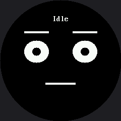

# A Face With a Memory

The [expression menu](../emotion-modes/index.md) had no memory. Press A and you get the next
emotion, over and over, and the face reacts to your finger the same way no matter what happened ten
seconds ago.

Real creatures are not like that. Poke someone who is already annoyed and you get a different answer
than poking someone who is asleep.

!!! mascot-welcome "Give me a mood I can carry around"
    { class="mascot-admonition-img" }
    Button A pokes me. Button B calms me down. Leave me alone long enough and I get bored, then fall asleep on my own — and what a poke means depends entirely on what I was doing when it arrived.

## Two Tables Are the Whole Idea

A **state machine** is one of the most useful abstractions in all of computing — vending machines,
traffic lights, game characters, and network protocols are all built on it. It needs only two
things:

| Part | The question it answers |
|---|---|
| **States** | What situations can this thing be in, one at a time? |
| **Transitions** | For each state, which event moves you where? |

Write both as tables and the main loop shrinks to "look up what happens next, then do it." Adding a
whole new mood becomes two rows of data instead of another branch tangled into a growing pile of
`if` statements.

## What Each State Looks Like

This first table is the [emotion table](../emotion-table/index.md)'s column format, reused without
change:

```py
#           eye_rx  eye_ry  brow_L  brow_R  lift  mouth        x   y
POSES = {
    "Idle":    (24, 22,   0,   0,   0, face.FLAT,  30,  0),
    "Curious": (26, 29,  -7,   5,  10, face.SMIRK, 30,  0),
    "Happy":   (24, 24,   0,   0,   5, face.SMILE, 50, 24),
    "Annoyed": (24, 12,  12,  12,  -5, face.FLAT,  26,  0),
    "Asleep":  (24,  2,   0,   0,  -7, face.FLAT,  14,  0),
}
```

Notice Curious: one brow at −7 and the other at 5. That single mismatch is what makes it read as
interested rather than merely awake.

## What Each State Does

This is a different question, and it gets its own table. Read a row like a sentence: *"from Idle, A
leads to Curious, B leads to Annoyed, and after 8000 ms of nobody touching anything, we fall
Asleep."*

```py
#          state         A -> ...     B -> ...     after ms -> ...
TRANSITIONS = {
    "Idle":    {"a": "Curious", "b": "Annoyed", "timeout": (8000, "Asleep")},
    "Curious": {"a": "Happy",   "b": "Idle",    "timeout": (5000, "Idle")},
    "Happy":   {"a": "Happy",   "b": "Idle",    "timeout": (4000, "Idle")},
    "Annoyed": {"a": "Asleep",  "b": "Idle",    "timeout": (6000, "Idle")},
    "Asleep":  {"a": "Curious", "b": "Curious", "timeout": None},
}
```

Three kinds of event drive the machine, and the third one is what makes the robot feel alive:

| Event | Where it comes from | What it models |
|---|---|---|
| `a` | Button A | Somebody poked the robot |
| `b` | Button B | Somebody calmed it down |
| `timeout` | The clock | Nothing happened for long enough to matter |

A robot that changes on its own, with nobody touching it, is doing something no menu can do.

## The Loop Just Follows the Tables

```py
while True:
    rules = TRANSITIONS[state]

    if face.pressed(button_a):
        face.wait_for_release(button_a)
        go_to(rules["a"], "poke")

    elif face.pressed(button_b):
        face.wait_for_release(button_b)
        go_to(rules["b"], "calm")

    elif rules["timeout"] is not None:
        after_ms, next_state = rules["timeout"]
        if ticks_diff(ticks_ms(), entered_at) >= after_ms:
            go_to(next_state, "waited " + str(after_ms) + "ms")

    sleep_ms(10)
```

Notice what that loop does **not** contain: the word "Happy", the word "Asleep", or any knowledge of
what a poke means. All of that lives in the tables.

!!! mascot-thinking "One Door In, One Door Out"
    { class="mascot-admonition-img" }
    `go_to()` is the only place in the program that changes state, and it prints every change to the shell. Funnelling every change through one function means there is exactly one line to watch when I end up somewhere you did not expect.

```py
def go_to(next_state, because):
    global state, entered_at
    print(state, "--", because, "->", next_state)
    state = next_state
    entered_at = ticks_ms()
    draw_state(state)
```

Here's the starting state:



Press a button — or wait eight seconds — and the machine moves somewhere else.

## Draw It on Paper First

Five circles, one per state. Fourteen arrows, one per transition, each labelled A, B, or its
timeout. That drawing **is** the two tables above, and it is how engineers design this kind of code
before writing any of it.

Doing it on paper will also show you something the code hides: which states are hard to reach, and
which ones you can never leave.

!!! mascot-tip "Find the Trap"
    { class="mascot-admonition-img" }
    From Happy, button A leads back to Happy forever. Is that a bug or a personality? Change it to "Annoyed" and see whether a robot that gets tired of being poked feels more alive.

## Things to Try

1. **Draw the machine on paper** — five circles, fourteen arrows — before you change anything.
2. **Add a "Startled" state:** eyes wide, brows way up, mouth open. Give it a 700 ms timeout back to
   Curious, and make Asleep + A go to Startled instead. Two rows of data, no new logic — waking a
   sleeping robot should surprise it.
3. **Decide about the Happy trap** described in the tip above.
4. **Watch the shell while you play.** Every transition prints, so you get a written history of the
   robot's mood — the technique from [Trace and Watch](../trace-and-watch/index.md), aimed at
   behavior instead of speed.
5. **Optimize the redraw.** `draw_state()` calls `face.clear()` on every transition, and you can see
   the wipe. Because states change at most a few times a second, that is defensible. Rewrite it to
   erase only the boxes that differ between the old pose and the new one, then decide for yourself
   whether the extra bookkeeping earned its keep. There is no single right answer, and knowing that
   is the skill.

## References

- [The Emotion Table](../emotion-table/index.md) — the pose format this lab reuses for `POSES`
- [Mode Switching](../modes/index.md) — the memoryless menu this lab is an answer to
- [Sleeping Face](../sleepy/index.md) — the expression the Asleep state is heading toward
