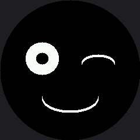

# Winking with a Smile

A wink is the smallest piece of social signaling a robot can perform, and it takes exactly two
shapes: one eye closed, one eye open. Close **both** and you have a blink, which means something
completely different. That asymmetry is the whole trick.

## A Closed Eye Is an Arc

A closed eye is the top half of an ellipse — quadrant mask `TOP_HALF` (3) — rather than a full
shape. Draw it a few pixels below where the open eye's center was and it reads as a lid coming
down over the eye.

```py
def draw_winking_eye(x):
    for offset in range(STROKE):
        shapes.ellipse(display, x, WINK_Y + offset, EYE_RADIUS,
                       WINK_RADIUS_Y, WHITE, NO_FILL, TOP_HALF)
```

| Eye state | Shape | Mask |
|---|---|---|
| Open | Filled circle with a pupil punched out | none |
| Closed | Thickened arc, curving down | `TOP_HALF` (3) |

!!! mascot-thinking "Only One Eye Ever Changes"
    { class="mascot-admonition-img" }
    My left eye and my smile are drawn once, when the program starts, and then never touched again for as long as it runs. Everything after that is one small rectangle around my right eye. That is what makes this animation cost almost nothing.

## Sample Program Code

Watch the structure: `draw_resting_face()` lays down the whole picture once, and `set_right_eye()`
is the only thing the loop ever calls.

```py
# Lab 12: Winking with a Smile

import config
import shapes
from utime import sleep

display = config.init_display()
WHITE = config.WHITE
BLACK = config.BLACK
NO_FILL = config.NO_FILL
FILL = config.FILL

TOP_HALF = 3      # 1 (top right) + 2 (top left)
BOTTOM_HALF = 12  # 4 (bottom left) + 8 (bottom right)

HALF_WIDTH = config.WIDTH // 2
EYE_SPACING = 48
LEFT_EYE_X = HALF_WIDTH - EYE_SPACING
RIGHT_EYE_X = HALF_WIDTH + EYE_SPACING
EYE_Y = 100
EYE_RADIUS = 28
PUPIL_RADIUS = 10

WINK_RADIUS_Y = 14
WINK_Y = EYE_Y + 7
STROKE = 4

MOUTH_Y = 168
MOUTH_RADIUS_X = 48
MOUTH_RADIUS_Y = 24

# Big enough to cover an open eye, which is the largest thing that ever
# appears in this box.
EYE_BOX = EYE_RADIUS + 4


def draw_open_eye(x):
    shapes.ellipse(display, x, EYE_Y, EYE_RADIUS, EYE_RADIUS, WHITE, FILL)
    shapes.ellipse(display, x, EYE_Y, PUPIL_RADIUS, PUPIL_RADIUS, BLACK, FILL)


def draw_winking_eye(x):
    for offset in range(STROKE):
        shapes.ellipse(display, x, WINK_Y + offset, EYE_RADIUS,
                       WINK_RADIUS_Y, WHITE, NO_FILL, TOP_HALF)


def draw_smile():
    for offset in range(STROKE):
        shapes.ellipse(display, HALF_WIDTH, MOUTH_Y - offset,
                       MOUTH_RADIUS_X, MOUTH_RADIUS_Y,
                       WHITE, NO_FILL, BOTTOM_HALF)


def erase_eye(x):
    display.fill_rect(x - EYE_BOX, EYE_Y - EYE_BOX,
                      EYE_BOX * 2, EYE_BOX * 2, BLACK)


def draw_resting_face():
    """Everything, once. After this only the right eye is ever touched."""
    display.fill(BLACK)
    draw_open_eye(LEFT_EYE_X)
    draw_open_eye(RIGHT_EYE_X)
    draw_smile()


def set_right_eye(winking):
    erase_eye(RIGHT_EYE_X)
    if winking:
        draw_winking_eye(RIGHT_EYE_X)
    else:
        draw_open_eye(RIGHT_EYE_X)


draw_resting_face()

while True:
    set_right_eye(True)    # eye snaps shut
    sleep(0.35)            # hold the wink just long enough to be seen
    set_right_eye(False)   # eye opens again
    sleep(2.5)             # normal face until the next wink
```

Here's the winking frame:



## The Timing Carries As Much Meaning As the Shapes

Look at the two `sleep()` calls in the loop. They are not arbitrary:

| Duration | What it does |
|---|---|
| 0.35 s wink hold | Long enough to be noticed, short enough to read as deliberate |
| 2.5 s resting face | Long enough that the next wink feels like a choice, not a twitch |

Make the hold 2 seconds and the robot looks like it has something in its eye. Make it 0.05 seconds
and nobody sees it at all. Expression is as much about **time** as about shape, which is the idea
the [keyframes lab](../keyframes/index.md) turns into data.

!!! mascot-tip "Size the Erase Box for the Biggest Thing"
    { class="mascot-admonition-img" }
    `EYE_BOX` is `EYE_RADIUS + 4` — sized for the *open* eye, because that is the largest thing that ever appears in that rectangle. Size it for the arc instead and the open eye leaves crumbs behind every time it comes back.

## Things to Try

1. **Time a frame.** Put `ticks_ms()` readings around `set_right_eye()` and print the difference.
   Two small rectangles of work is dramatically less than two whole screens.
2. **Close the left eye instead.** On a face, left and right are not interchangeable — try both on
   a few people and ask which reads as friendlier.
3. **Tune the hold.** Find the shortest wink that people still notice, and the longest one that
   still reads as a wink rather than a squint.
4. **Add a second wink** 0.2 seconds after the first. A double wink is a completely different
   social signal, and it costs two more lines.

## References

- [Blinking](../blink/index.md) — the same arc on *both* eyes, triggered by a button
- [Drawing Ellipses](../ellipse/index.md) — where the `TOP_HALF` mask comes from
- [Keyframes](../keyframes/index.md) — where the timing above becomes a column in a table
