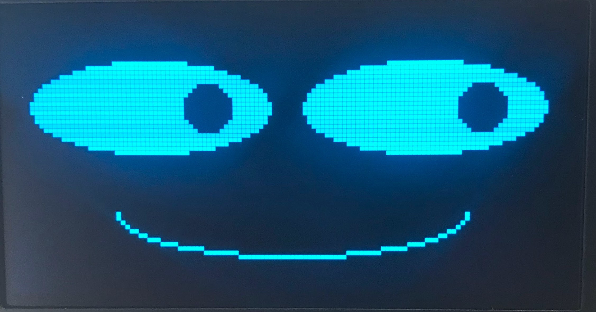

# Basic Face Layouts



## Drawing Constants

```py
HALF_WIDTH = int(WIDTH / 2)
QUARTER_WIDTH = int(WIDTH / 4)
HALF_HEIGHT = int(HEIGHT / 2)
QUARTER_HEIGHT = int(HEIGHT / 4)

WHITE = 1 # 1 is for pixel on
BLACK = 0 # 0 is for pixel off

NO_FILL = 0 # 0 is for only drawing the outline
FILL = 1 # 1 for filling all the pixels in an ellipse

BOTTOM_HALF = 12 # this is for drawing the lower half of an ellipse
```

## The Face Outline

Let's start out by drawing an outline of the face as a wide white ellipse on a black background.  
You don't **really** need to do this part because people can assume the entire screen is the face.
We are mostly doing it to get you familiar with drawing with the *ellispe()* function.

# if our screen is 128 pixels wide, make the face be 100 wide
FACE_WIDTH = 100 # 50 over for the left and 50 to the right
# if our screen is 64 pixels high, make our face be 60 high 
FACE_HEIGHT = 60 # 20 up and 20 down

Remember that the six main parameters of the ellipse function are:

```py
display.ellipse(x, y, width, hight, color, fill)
```

Here is a sample face outline:

```py
oled.ellipse(HALF_WIDTH, HALF_HEIGHT, int(FACE_WIDTH/2), int(FACE_HEIGHT/2), WHITE, FILL)
```

Here are the parameters in detail:

1. **Center of Face** - the x,y of the ellipse are HALF_WIDTH, HALF_HEIGHT so it is drawn in the center of the display
2. **Width and Height of the Face** - this is the interger values of half the FACE_WIDTH and half the FACE_HEIGHT
3. **Draw with White** - this is the WHITE parameter
4. **Fill not Outline** - this is the FILL parameter

## Eyes

Our eyes can start out by just being two circles.  They need to be drawn about 1/3 to 1/2 of the way down the face.  This is called the "eye height" and is measured from the top of the display.

```py
EYE_SIZE = 10
# eyes - black on a white face
# eye on the left side of the display
oled.ellipse(QUARTER_WIDTH+10, QUARTER_HEIGHT+10, EYE_SIZE, EYE_SIZE, BLACK, FILL)
# eye on the right side of the display
oled.ellipse(QUARTER_WIDTH*3-10, QUARTER_HEIGHT+10, EYE_SIZE, EYE_SIZE, BLACK, FILL)
```

Note that here, when I draw the eyes at 1/4 and 3/4 of the width, they seemed too far apart.  So I
added 10 to the left eye and subtracted 10 from the right eye.

I also didn't quite like the eyes at 1/4 of the height so I add 10 to each of the eyes distance from the top.

## Mouth

To draw a black mouth on a white face we will use the ellipse drawing option to only draw the bottom half of the ellipse.  To
do this we just add one more parameter which has a value of 12.

```py
oled.ellipse(HALF_WIDTH, HALF_HEIGHT+10, 30, 10, BLACK, FILL, BOTTOM_HALF)
```

In this case, I moved the vertical distance down 10 from the center of the display. I made the mouth be 60 pixels wided (twice the horizontal radius of 30), and I made the height of the mouth be 20 (twice the vertical radius).

## Full Face Function

Here is a full Python function that draws all four components of a face on your robot:

```py
def draw_face():
    # clear the display to make all pixels black
    oled.fill(0)

    # draw the face outline
    oled.ellipse(HALF_WIDTH, HALF_HEIGHT, FACE_WIDTH, FACE_HEIGHT, WHITE, FILL)
    
    # eyes - black ellipses on a white face
    oled.ellipse(QUARTER_WIDTH+10, QUARTER_HEIGHT+10, EYE_SIZE, EYE_SIZE, BLACK, FILL)
    oled.ellipse(QUARTER_WIDTH*3-10, QUARTER_HEIGHT+10, EYE_SIZE, EYE_SIZE, BLACK, FILL)
    
    # mouth - black on a white face
    oled.ellipse(HALF_WIDTH, HALF_HEIGHT+10, 30, 10, BLACK, FILL, BOTTOM_HALF)
    oled.show()
```

Try to adjust the parameters as you see fit.  See how they change the layout.

## Eyebrows

Drawing eyebrows are a little more complicated since they can't easily be drawn by simple shapes like
a rectangle, circle or ellipse.  But they are very important for signaling different emotions like surprise
or anger.

As an exercise, do a web search for faces with different emotions and note the shape of the eyebrows.

## Using the Polygon Functiont to draw eyebrows.

To draw a decent eyebrow we will use the powerful and slightly more complicated polygon function.  Firs

