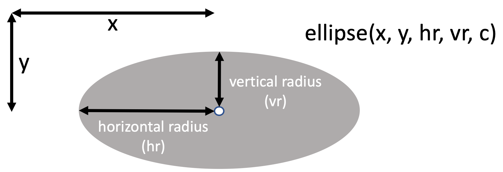
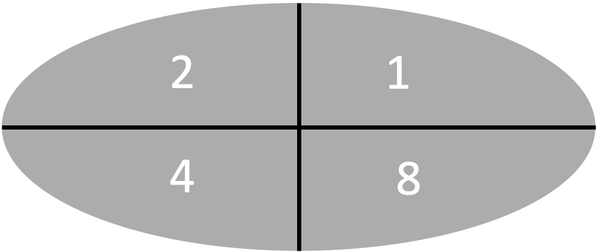

# Drawing Ellipses

Since version 1.19.1-724 of the MicroPython runtime was released in February 2023 we have support for the framebuf [Ellipse](https://docs.micropython.org/en/latest/library/framebuf.html?highlight=ellipse#framebuf.FrameBuffer.ellipse) function.  This
function allows us to draw circles and ellipses that are both filled and un-filled.

We can also draw into one or more quadrants so we can do 1/4, 1/2, or 3/4 filled ellipses.

## Ellipse Parameters



```display.ellipse(x, y, HORZ_RADIUS, VERT_RADIUS, COLOR, FILL_FLAG, QUAD_CODE)```

Draw an ellipse at the given location. Radii ```HORZ_RADIUS``` and ```VERT_RADIUS``` define the geometry.

If ```HORZ_RADIUS``` equal the ```VERT_RADIUS``` a circle is drawn. The ```COLOR``` parameter defines the color.  0 for OFF and 1 for ON.

The optional ```FILL_FLAG``` parameter can be set to True to fill the ellipse. Otherwise, just a single pixel outline is drawn.

## Quadrant Fill Codes



The optional ```QUAD_CODE``` parameter enables drawing to be restricted to certain quadrants of the ellipse.

You can add the following numbers to figure out the quadrant code:

* 1 - upper right
* 2 - upper left
* 4 - lower left
* 8 - lower right

For example for the lower half of the ellipse on you add 4 + 8 = 12.

Here is a complete list of the 16 possible values of the code:

|Code|Description|
|--|--|
|0|all off|
| 1 | upper right on|
| 2 | upper left on|
| 3 | top half on|
| 4 | lower left on|
| 5 | lower left and upper right on|
| 6 | left side on|
| 7 | lower right off | rest on|
| 9 | right side on|
| 10 | upper left and lower right are on|
| 11 | all but lower left are on|
| 12 | lower half on|
| 13 | all but upper left are on|
| 14 | all but upper right are on|
| 15 | all four quadrants are drawn|

## References

[MicroPython Framebuf Documentation](https://docs.micropython.org/en/latest/library/framebuf.html)