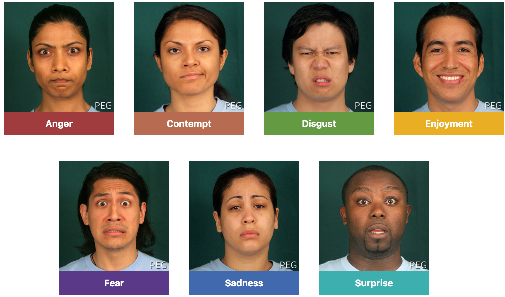
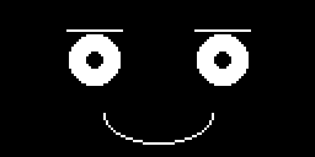
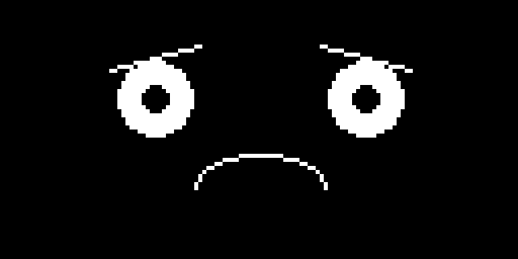
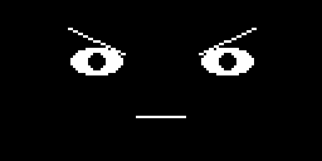
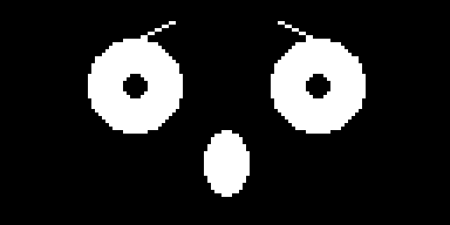
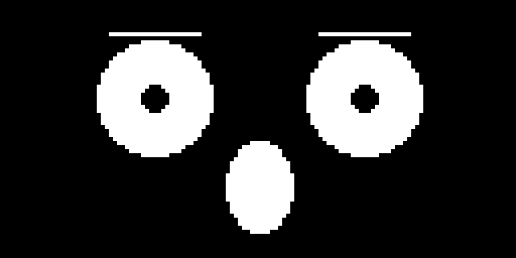
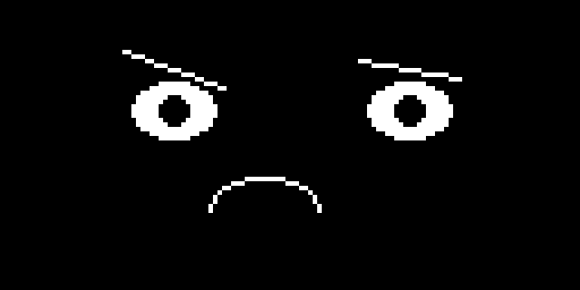
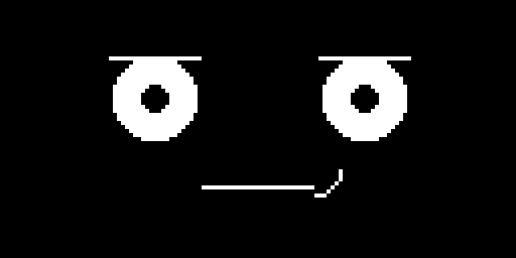

# Emotion Types

This project puts a focus on using MicroPython and OLED displays to generate [about seven primary emotions](https://www.paulekman.com/universal-emotions/).

Here are the seven faces that [Paul Ekman](https://www.paulekman.com/universal-emotions/) describes in his research:

1. happy
2. sad
3. angry
4. afraid
5. surprise
6. disgust
7. contempt

The feeling of tired or sleepy can also be shown on a robot's face.

Here are photos of these seven emotions on people:



!!! mascot-welcome "Seven Faces, One Robot"
    { class="mascot-admonition-img" }
    Every one of these seven feelings comes from the exact same three parts of a face — eyebrows, eyes, and a mouth — just moved. Let's draw all seven and watch one face turn into seven completely different robots. Every pixel tells a story!

## Inside Out Emotions

The Pixar movie [Inside Out](https://en.wikipedia.org/wiki/Inside_Out_(2015_film)) focused on only five
emotions in its characters:

1. Joy
2. Sadness
3. Fear
4. Disgust
5. Anger

## Emotion Recognition Accuracy

Some of these emotions are easy for people to recognize.  Here is this list sorted by confidence
take from a table in [Emotive Response to a Hybrid-Face Robot and
Translation to Consumer Social Robots]():

OVERALL EMOTION RECOGNITION ACCURACIES

1. Sad: 88%
2. Happy: 84.8
3. Surprise: 79.6
4. Tired: 69.0
5. Angry: 68.5
6. Disgust: 63.8
7. Stern: 59.2

Note that the emotion of contempt was not scored in this paper.

Notice that sad and happy sit at the top of the list, while surprise is not far behind. Afraid does not even appear in this particular study, but other research consistently finds it gets confused with surprise more than any other pair on the list — both expressions share raised eyebrows, wide eyes, and an open mouth, and the difference between them comes down to just how far each feature moves.

## Building Blocks: Eyes, Eyebrows, and Mouths

Every one of the seven faces below is built from the same three helper functions, just called with different numbers. Get comfortable with these three functions first, and every expression that follows is just a different set of arguments.

```py
WHITE = 1
BLACK = 0
NO_FILL = 0
FILL = 1

TOP_RIGHT = 1
TOP_LEFT = 2
BOTTOM_LEFT = 4
BOTTOM_RIGHT = 8
TOP_HALF = 3      # frown
BOTTOM_HALF = 12  # smile

HALF_WIDTH = int(WIDTH / 2)

EYE_SPACING = 26
LEFT_EYE_X = HALF_WIDTH - EYE_SPACING
RIGHT_EYE_X = HALF_WIDTH + EYE_SPACING
EYE_Y = 24
PUPIL_RADIUS = 3

EYEBROW_HALF_WIDTH = 11
EYEBROW_Y = EYE_Y - 10

MOUTH_Y = 46
```

**Eyes** are a filled circle with a smaller black pupil on top, the same pattern from [Basic Face Layouts](../basic-face-layouts/index.md). The only new idea here is that `rx` and `ry` are separate, so an eye can be stretched wide for surprise or squeezed flat for anger.

```py
def draw_eye(x, rx, ry):
    oled.ellipse(x, EYE_Y, rx, ry, WHITE, FILL)
    oled.ellipse(x, EYE_Y, PUPIL_RADIUS, PUPIL_RADIUS, BLACK, FILL)


def draw_eyes(rx, ry):
    draw_eye(LEFT_EYE_X, rx, ry)
    draw_eye(RIGHT_EYE_X, rx, ry)
```

**Eyebrows** use the tilted `line()` trick from [Eyebrows](../eyebrows/index.md), but wrapped in a function with two new controls: `tilt` and `lift`. A positive `tilt` angles the nose-side end of the eyebrow *down*, which is what a furrowed, angry brow looks like. A negative `tilt` raises that same nose-side end *up*, the shape of a worried or frightened brow. `lift` just slides the whole eyebrow up or down, independent of its angle.

```py
def draw_eyebrow(x, side, tilt, lift):
    # side: 1 for the left eyebrow (nose to the right), -1 for the right eyebrow
    y = EYEBROW_Y - lift
    outer_x = x - (EYEBROW_HALF_WIDTH * side)
    inner_x = x + (EYEBROW_HALF_WIDTH * side)
    oled.line(outer_x, y - tilt, inner_x, y + tilt, WHITE)


def draw_eyebrows(tilt_left, tilt_right, lift=0):
    draw_eyebrow(LEFT_EYE_X, 1, tilt_left, lift)
    draw_eyebrow(RIGHT_EYE_X, -1, tilt_right, lift)
```

!!! mascot-thinking "Two Numbers, Every Eyebrow Shape"
    { class="mascot-admonition-img" }
    `tilt` and `lift` are independent. A steep positive `tilt` with a low `lift` reads as furious. That same steep tilt with a high `lift` would read as something closer to intense focus. Small changes to the same two numbers cover a surprising amount of emotional ground.

**Mouths** get four different shapes, because a single curved line cannot cover everything from a grin to a gasp. `draw_mouth_curve()` reuses the quadrant-mask trick from [Ellipse](../ellipse/index.md) and [Winking with a Smile](../wink/index.md) — `BOTTOM_HALF` curves up into a smile, `TOP_HALF` curves down into a frown. `draw_mouth_flat()` draws a tight, neutral line. `draw_mouth_open()` fills a small oval for a startled, open mouth. `draw_mouth_smirk()` draws a flat line with just one corner curled up, for the subtlest expression in this lesson.

```py
def draw_mouth_curve(radius_x, radius_y, mask):
    oled.ellipse(HALF_WIDTH, MOUTH_Y, radius_x, radius_y, WHITE, NO_FILL, mask)


def draw_mouth_flat(half_width):
    oled.hline(HALF_WIDTH - half_width, MOUTH_Y, half_width * 2, WHITE)


def draw_mouth_open(radius_x, radius_y):
    oled.ellipse(HALF_WIDTH, MOUTH_Y, radius_x, radius_y, WHITE, FILL)


def draw_mouth_smirk(half_width, side):
    oled.hline(HALF_WIDTH - half_width, MOUTH_Y, half_width * 2, WHITE)
    corner_x = HALF_WIDTH + (half_width * side)
    mask = BOTTOM_RIGHT if side > 0 else BOTTOM_LEFT
    oled.ellipse(corner_x, MOUTH_Y - 4, 6, 6, WHITE, NO_FILL, mask)
```

## Drawing the Seven Core Expressions

With those helpers in place, every expression below is a three-line recipe: call `draw_eyes()`, call `draw_eyebrows()`, then call one of the mouth functions. Each one starts with `oled.fill(BLACK)` to clear the previous face and ends with `oled.show()` to send the new one to the display.

### Happy

Happy needs the least effort of any expression here — relaxed, slightly lifted eyebrows, normal round eyes, and a wide smiling mouth. That simplicity is exactly why it topped the recognition chart above: nothing about a happy face is subtle.

```py
def draw_happy_face():
    oled.fill(BLACK)
    draw_eyes(10, 10)
    draw_eyebrows(0, 0, lift=2)
    draw_mouth_curve(22, 12, BOTTOM_HALF)
    oled.show()
```



### Sad

Sad flips happy's mouth from a smile to a frown with `TOP_HALF`, and adds a gentle negative `tilt` so each eyebrow's nose-side end lifts slightly — the same "worried" shape from the [Basic Face Layouts](../basic-face-layouts/index.md) "Things to Try" section, just kept mild.

```py
def draw_sad_face():
    oled.fill(BLACK)
    draw_eyes(9, 9)
    draw_eyebrows(-3, -3, lift=0)
    draw_mouth_curve(16, 8, TOP_HALF)
    oled.show()
```



### Angry

Angry pushes that same eyebrow tilt hard in the *opposite* direction — a steep positive `tilt` that drags both nose-side ends down into a furrow, dropped low with a negative `lift`. The eyes get flattened into a narrow slit instead of a full circle, and the mouth stays a tight, flat line. Anger reads through the eyebrows and eyes here, not the mouth.

```py
def draw_angry_face():
    oled.fill(BLACK)
    draw_eyes(10, 5)
    draw_eyebrows(5, 5, lift=-2)
    draw_mouth_flat(10)
    oled.show()
```



### Afraid

Afraid raises the eyebrows instead of lowering them, using the same worried `tilt` direction as sad but much steeper, paired with wide eyes and a small round open mouth from `draw_mouth_open()`. This is one of the two expressions the accuracy research above warns you about.

```py
def draw_afraid_face():
    oled.fill(BLACK)
    draw_eyes(13, 13)
    draw_eyebrows(-5, -5, lift=3)
    draw_mouth_open(6, 9)
    oled.show()
```



### Surprised

Surprised is afraid's neighbor in the confusion table above, and the code shows exactly why: nearly the same ingredients — wide eyes, a raised open mouth — pushed to their absolute extreme, with flat (rather than tilted) eyebrows shooting straight up. Every feature moves in the same dramatic direction at once, which is exactly what minimal-feature robot research says makes an expression unmistakable.

```py
def draw_surprised_face():
    oled.fill(BLACK)
    draw_eyes(14, 14)
    draw_eyebrows(0, 0, lift=6)
    draw_mouth_open(8, 11)
    oled.show()
```



!!! mascot-tip "Afraid vs. Surprised: Look at the Eyebrows"
    { class="mascot-admonition-img" }
    Compare the code for afraid and surprised side by side. Afraid's eyebrows are *tilted* (`-5, -5`); surprised's are *flat but very high* (`lift=6`). On a small display those two brow shapes are the single biggest clue telling the two expressions apart.

### Disgusted

Disgusted is the first expression here to deliberately break symmetry — the two eyebrows get different `tilt` values instead of a matching pair, giving a lopsided, scrunched look. The mouth shifts a few pixels off center and curls into a small frown, like it is pulling away from something.

```py
def draw_disgusted_face():
    oled.fill(BLACK)
    draw_eyes(9, 6)
    draw_eyebrows(4, -2, lift=-1)
    oled.ellipse(HALF_WIDTH - 6, MOUTH_Y, 12, 7, WHITE, NO_FILL, TOP_HALF)
    oled.show()
```



### Contempt

Contempt is the most subtle face in this whole lesson, and Ekman himself considered it a more debated addition to the list. Everything stays close to neutral — level eyebrows, normal round eyes — except one corner of the mouth, which lifts in a small one-sided smirk built by `draw_mouth_smirk()`.

```py
def draw_contempt_face():
    oled.fill(BLACK)
    draw_eyes(10, 10)
    draw_eyebrows(0, 0, lift=0)
    draw_mouth_smirk(14, 1)
    oled.show()
```



!!! mascot-warning "Subtle Can Mean Invisible"
    { class="mascot-admonition-img" }
    A smirk this small already looks faint on a 128 by 64 display. Shrink `MOUTH_Y`'s offset or the smirk's radius any further and it risks disappearing entirely from a few feet away. When in doubt, exaggerate — a robot face rarely fails by being too expressive.

## Putting It All Together

Here is the complete program: every helper function, all seven expressions, and a loop at the bottom that cycles through them the same way [Eye Scanner](../eye-scanner/index.md) cycled through pupil positions.

```py
# Seven Ekman emotion faces on a 128x64 monochrome OLED

from machine import Pin
from utime import sleep
import ssd1306

WIDTH = 128
HEIGHT = 64

clock = Pin(2)  # SCL
data = Pin(3)   # SDA
RES = machine.Pin(4)
DC = machine.Pin(5)
CS = machine.Pin(6)

spi = machine.SPI(0, sck=clock, mosi=data)
oled = ssd1306.SSD1306_SPI(WIDTH, HEIGHT, spi, DC, RES, CS)

WHITE = 1
BLACK = 0
NO_FILL = 0
FILL = 1

TOP_RIGHT = 1
TOP_LEFT = 2
BOTTOM_LEFT = 4
BOTTOM_RIGHT = 8
TOP_HALF = 3      # frown
BOTTOM_HALF = 12  # smile

HALF_WIDTH = int(WIDTH / 2)

EYE_SPACING = 26
LEFT_EYE_X = HALF_WIDTH - EYE_SPACING
RIGHT_EYE_X = HALF_WIDTH + EYE_SPACING
EYE_Y = 24
PUPIL_RADIUS = 3

EYEBROW_HALF_WIDTH = 11
EYEBROW_Y = EYE_Y - 10

MOUTH_Y = 46


def draw_eye(x, rx, ry):
    oled.ellipse(x, EYE_Y, rx, ry, WHITE, FILL)
    oled.ellipse(x, EYE_Y, PUPIL_RADIUS, PUPIL_RADIUS, BLACK, FILL)


def draw_eyes(rx, ry):
    draw_eye(LEFT_EYE_X, rx, ry)
    draw_eye(RIGHT_EYE_X, rx, ry)


def draw_eyebrow(x, side, tilt, lift):
    # side: 1 for the left eyebrow (nose to the right), -1 for the right eyebrow
    y = EYEBROW_Y - lift
    outer_x = x - (EYEBROW_HALF_WIDTH * side)
    inner_x = x + (EYEBROW_HALF_WIDTH * side)
    oled.line(outer_x, y - tilt, inner_x, y + tilt, WHITE)


def draw_eyebrows(tilt_left, tilt_right, lift=0):
    draw_eyebrow(LEFT_EYE_X, 1, tilt_left, lift)
    draw_eyebrow(RIGHT_EYE_X, -1, tilt_right, lift)


def draw_mouth_curve(radius_x, radius_y, mask):
    oled.ellipse(HALF_WIDTH, MOUTH_Y, radius_x, radius_y, WHITE, NO_FILL, mask)


def draw_mouth_flat(half_width):
    oled.hline(HALF_WIDTH - half_width, MOUTH_Y, half_width * 2, WHITE)


def draw_mouth_open(radius_x, radius_y):
    oled.ellipse(HALF_WIDTH, MOUTH_Y, radius_x, radius_y, WHITE, FILL)


def draw_mouth_smirk(half_width, side):
    oled.hline(HALF_WIDTH - half_width, MOUTH_Y, half_width * 2, WHITE)
    corner_x = HALF_WIDTH + (half_width * side)
    mask = BOTTOM_RIGHT if side > 0 else BOTTOM_LEFT
    oled.ellipse(corner_x, MOUTH_Y - 4, 6, 6, WHITE, NO_FILL, mask)


def draw_happy_face():
    oled.fill(BLACK)
    draw_eyes(10, 10)
    draw_eyebrows(0, 0, lift=2)
    draw_mouth_curve(22, 12, BOTTOM_HALF)
    oled.show()


def draw_sad_face():
    oled.fill(BLACK)
    draw_eyes(9, 9)
    draw_eyebrows(-3, -3, lift=0)
    draw_mouth_curve(16, 8, TOP_HALF)
    oled.show()


def draw_angry_face():
    oled.fill(BLACK)
    draw_eyes(10, 5)
    draw_eyebrows(5, 5, lift=-2)
    draw_mouth_flat(10)
    oled.show()


def draw_afraid_face():
    oled.fill(BLACK)
    draw_eyes(13, 13)
    draw_eyebrows(-5, -5, lift=3)
    draw_mouth_open(6, 9)
    oled.show()


def draw_surprised_face():
    oled.fill(BLACK)
    draw_eyes(14, 14)
    draw_eyebrows(0, 0, lift=6)
    draw_mouth_open(8, 11)
    oled.show()


def draw_disgusted_face():
    oled.fill(BLACK)
    draw_eyes(9, 6)
    draw_eyebrows(4, -2, lift=-1)
    oled.ellipse(HALF_WIDTH - 6, MOUTH_Y, 12, 7, WHITE, NO_FILL, TOP_HALF)
    oled.show()


def draw_contempt_face():
    oled.fill(BLACK)
    draw_eyes(10, 10)
    draw_eyebrows(0, 0, lift=0)
    draw_mouth_smirk(14, 1)
    oled.show()


EXPRESSIONS = [
    draw_happy_face,
    draw_sad_face,
    draw_angry_face,
    draw_afraid_face,
    draw_surprised_face,
    draw_disgusted_face,
    draw_contempt_face,
]

while True:
    for draw in EXPRESSIONS:
        draw()
        sleep(2)
```

!!! mascot-tip "Functions Can Live in a List Too"
    { class="mascot-admonition-img" }
    `EXPRESSIONS` is a list of *functions*, not a list of numbers or strings. Because Python treats a function name without parentheses as a value, `for draw in EXPRESSIONS: draw()` calls each one in turn — a compact way to cycle through every expression your robot knows.

## Things to Try

1. **Add a `neutral` expression.** Level eyebrows (`tilt=0`, `lift=0`), normal round eyes, and a flat mouth — the resting state every other expression here is a deliberate departure from.
2. **Swap disgusted's asymmetric eyebrows onto contempt.** Contempt is supposed to stay almost neutral everywhere except the mouth — see how much that one change breaks the subtlety that makes contempt read as contempt.
3. **Make angry even angrier.** Push its `tilt` from 5 to 10 and drop `lift` further negative, and see how much more intense the same three function calls can look.
4. **Change how long each expression holds** in the `EXPRESSIONS` loop, from 2 seconds down to 0.5. Notice how a face that changes too quickly stops reading as an emotion and starts reading as a glitch — the same lesson [Winking with a Smile](../wink/index.md) taught about timing a wink.
5. **Trigger an expression from a button** using what you learned in [Blinking](../blinking/index.md), so your robot shows "surprised" only when someone actually startles it.

!!! mascot-celebration "Seven Feelings, Three Functions"
    { class="mascot-admonition-img" }
    `draw_eyes()`, `draw_eyebrows()`, and one mouth function — that's the entire toolkit behind every expression in this lesson. You just proved that a robot doesn't need thirteen different features to feel emotionally readable. It needs three, aimed carefully. Great expression!

## References

- [MicroPython Framebuf Documentation](https://docs.micropython.org/en/latest/library/framebuf.html) — the full signatures for `ellipse()`, `line()`, and `hline()`, including the quadrant mask parameter
- [Basic Face Layouts](../basic-face-layouts/index.md) — the eye, eyebrow, and mouth proportions this lesson's helper functions build on
- [Eyebrows](../eyebrows/index.md) — the tilted-line technique behind `draw_eyebrow()`
- [Ellipse](../ellipse/index.md) and [Winking with a Smile](../wink/index.md) — the quadrant fill codes behind every curved mouth in this lesson
- [Eye Scanner](../eye-scanner/index.md) — the loop pattern the final `EXPRESSIONS` cycle reuses
- Ekman and Friesen
