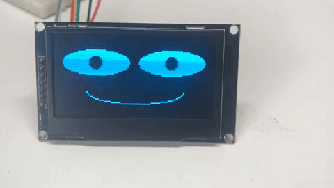

# A History of Low-Cost, Screen-Based Robot Faces

Before you draw your first pixel, it helps to know that you are following a well-worn path.
Several well-funded commercial robots pioneered the idea of using an animated screen — instead of
a mechanical face — to give a robot personality. Their successes, and their business failures,
shaped the low-cost approach this book teaches.

## Anki Cozmo (2016)

Cozmo was released by Anki, a San Francisco robotics and AI startup, on October 16, 2016, for
$180. Its face was a small blue-on-black display designed to look like a miniature CRT monitor,
and its personality was driven by a proprietary "emotion engine" that blended distinct eye
expressions with sound and body movement to mimic human emotional reactions. Cozmo became one of
the most in-demand toys of the 2016 holiday season and sold over 1.5 million units, proving that
an expressive screen face — not a humanoid mechanical face — was enough to make a robot feel alive
to a mass audience.

## Anki Vector (2018)

Vector, released October 13, 2018 for $249.99, was Anki's more capable follow-up to Cozmo. It kept
the same core idea — two animated digital eyes as the primary emotional interface — but let owners
customize the eye color through a companion app and added always-on voice interaction. Anki raised
roughly $250 million in venture funding across both products but shut down in April 2019 after
failing to secure additional financing, a cautionary lesson in how expensive full-custom robot
hardware and cloud services can be, even when the on-screen face itself is simple.

## Emotix Miko (2017)

Miko is a companion robot for children built by Emotix, a company founded in Mumbai, India, in
October 2014 by three IIT Bombay graduates. Billed as "India's first companion robot," Miko
launched into retail in 2017 after more than two years of pilots, focusing on education and
entertainment for kids rather than the more general-purpose ambitions of Cozmo and Vector. Miko's
screen-based face communicates emotion during learning activities, and the product line has
continued through several generations (Miko 3 and beyond) — showing that an affordable, emotionally
expressive screen face has a lasting place in children's educational robotics.

## Blue Frog Robotics Buddy (2015)

Buddy was announced by Blue Frog Robotics, a company based in Paris, France, which ran a
crowdfunding campaign on Indiegogo in September 2015 that raised $617,830 — more than six times its
goal. Buddy's face was an 8-inch tablet mounted on a wheeled, autonomously-moving base, controlled
by "emotional AI" software. Unlike Cozmo and Vector, Buddy took years longer than planned to ship,
illustrating how much harder a moving, autonomous robot is to deliver than a stationary one — a big
part of why this course keeps its own hardware scope deliberately small (a fixed display and a
handful of buttons, not wheels or a chassis).

## What These Robots Have in Common

Despite very different price points, target markets, and outcomes, all four robots made the same
core design bet: **a small number of moving, screen-based facial features (mainly the eyes) is
enough for people to read a robot's emotional state.** This matches published research on
minimalist robotic faces, which found that eyes, eyebrows, and a mouth account for the large
majority of the information people use to identify a facial expression — moving eyelids, ears, or
other embellishments are largely unnecessary. That research finding is exactly why this book can
teach you to build a genuinely expressive robot face with a $20 monochrome OLED display or a $10
color round display, a handful of `ellipse()` and `poly()` calls, and no moving parts at all.

## MicroPython FrameBuf Support Timeline for `ellipse()` and `poly()`

The `ellipse()` and `poly()` drawing methods that this book relies on to draw eyes, eyebrows, and
mouths were not always part of MicroPython. Here is the documented history of when frame buffer
drawing support arrived, based on the MicroPython project's own release tags and commit history:

| Date | Version / Milestone | What Changed |
|---|---|---|
| 2021-09-01 | v1.17 | `blit()` gains palette-based support for blitting between FrameBuffers of *different* pixel formats — the feature that later makes it possible to blit a monochrome glyph onto a color display |
| 2022-01-16 | v1.18 | FrameBuffer still supports only `fill`, `pixel`, `hline`, `vline`, `line`, `rect`, `fill_rect`, `text`, `scroll`, and `blit` — no `ellipse()` or `poly()` yet |
| 2022-06-16 / 2022-06-17 | v1.19 / v1.19.1 | Same drawing method set as v1.18; v1.19.1 was a same-week patch release and still has no `ellipse()` or `poly()` |
| 2022-08-19 | Unstable/development branch | Peter Hinch's `ellipse()` method and Matt Booth's `poly()` method are merged into the main MicroPython branch, along with a matching `fill` argument added to `rect()` for consistency |
| Late 2022 - early 2023 | Nightly/unstable builds | Development firmware builds already include `ellipse()` and `poly()` months before an official release ships them — this project's own [Getting Started](../../getting-started.md) guide shows a Raspberry Pi Pico booting a build labeled `v1.19.1-854-g35524a6fd` and dated `2023-02-07`, meaning 854 commits past the v1.19.1 tag, which is how these lessons were originally written and tested |
| 2023-04-26 | **v1.20.0** | **First official, stable MicroPython release** to include `ellipse()` and `poly()` as documented, supported FrameBuffer methods |
| 2024-11-29 | v1.24.1 | Bug fix: `FrameBuffer.ellipse()` no longer hangs in an infinite loop when both radii are 0; it now draws a single center pixel instead |

!!! note
    If you ever see old MicroPython code, forum posts, or tutorials that don't have `ellipse()` or
    `poly()`, or that work around their absence with `hline()`/`vline()` loops, you are probably
    looking at something written before April 2023 (v1.20.0). Always install v1.20.0 or later if
    you want to follow the lessons in this book exactly as written.

## References

1. [Cozmo — Wikipedia](https://en.wikipedia.org/wiki/Cozmo)
2. [Anki Vector Teardown — Fictiv](https://www.fictiv.com/teardowns/anki-vector-robot-teardown)
3. [What Happened To Anki? Here's Why It Shut Down](https://productmint.com/what-happened-to-anki/)
4. [Miko, India's first companion robot — YourStory](https://yourstory.com/2019/11/childrens-day-iit-mumbai-startup-emotix-miko)
5. [About Us — emotix, makers of Miko](https://www.emotix.in/about-us)
6. [BUDDY, the Companion Robot from Blue Frog Robotics, Raises More Than $600,000 on Indiegogo](https://www.prweb.com/releases/buddy_the_companion_robot_from_blue_frog_robotics_raises_more_than_600_000_on_indiegogo/prweb12949844.htm)
7. [Buddy: your first companion robot powered by emotional AI — Blue Frog Robotics](https://m.bluefrogrobotics.com/buddy-en/)
8. [MicroPython GitHub repository — release tags v1.17 through v1.24.1](https://github.com/micropython/micropython/releases)
9. [modframebuf.c commit history — MicroPython GitHub](https://github.com/micropython/micropython/blob/master/extmod/modframebuf.c)
10. Emotive Response to a Hybrid-Face Robot and Translation to Consumer Social Robots, Maitreyee Wairagkar et al., 2020 (see [references.md](../../references.md))
