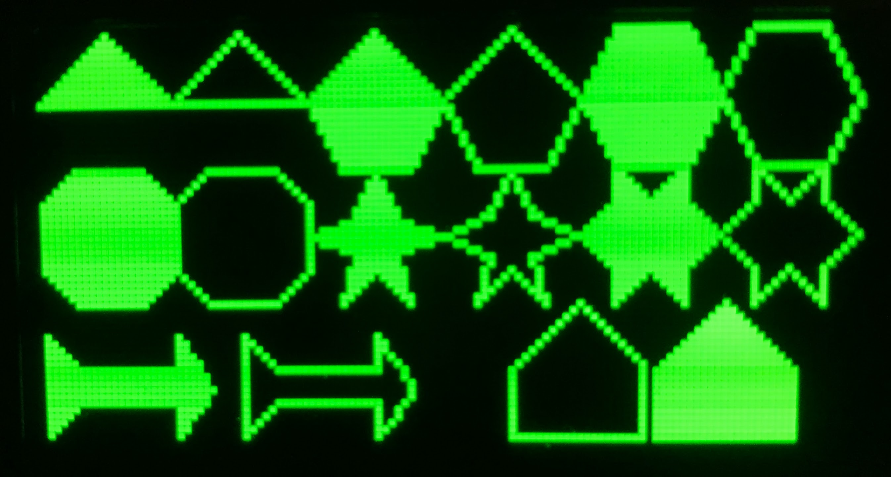
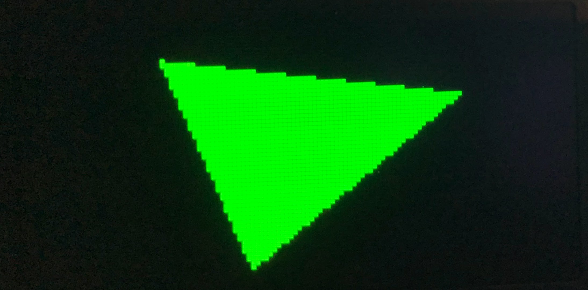

# Drawing Polygons



## Lesson Overview

In this a lesson about how to use the ```poly()``` function to do drawing on with MicroPython.  The ```poly()``` function is implemented as part of the Framebuf function in MicroPython.  This means that it will run on any display that uses frame buffers.  We think you will find ```poly()``` a very powerful and flexibile way to draw features on a face such as a nose or eyebrows.

## Drawing with the Polygon Function

Since v1.19.1-724 MicroPython includes a flexible way to draw any polygon of any
number of points either in outline or filled mode.  With this function, you
can quickly draw complex shapes such as triangles, hexagons, stars, rockets or houses.

To use the ```poly()``` function we must pass it an [array](https://docs.micropython.org/en/latest/library/array.html#module-array) of points.  The syntax for short array initialization is
as follows:

```
my_array = array('B', [30,10, 100,20, 50,60])
```

The letter "B" signals that each element will be an [unsigned byte](https://docs.micropython.org/en/latest/library/struct.html) which is enough for our purposes.  Many systems use an "h" which is a signed two-byte value which can be any integer in a range from -32,768 to 32,767.  Since our OLED screen is only a maximum of 128 the B is the most compact value, but remember that the max value is 255 and we can't store negative values in an unsigned byte.

```py
from machine import Pin
from array import array
import ssd1306

clock=Pin(2) #SCL
data=Pin(3) #SDA
RES = machine.Pin(4)
DC = machine.Pin(5)
CS = machine.Pin(6)

spi=machine.SPI(0, sck=clock, mosi=data)
oled = ssd1306.SSD1306_SPI(128, 64, spi, DC, RES, CS)

oled.fill(0)
# draw three points in a triangle to be filled using signed two-byte integers (h)
my_array = array('B', [30,10, 100,20, 50,60])
# at poing (0,0) draw a polygon with on bits and filled
oled.poly(0,0, my_array, 1, 1)
oled.show()
```

This will generate the following image:



## Sample Polygons

Here is an example program

```python
from machine import Pin
from utime import sleep, ticks_us
from array import array
import framebuf
import ssd1306

WIDTH = 128
HEIGHT = 64

# draw readability variables
ON = 1 # white
OFF = 0 # black
NO_FILL = 0 # just the border is drawn
FILL = 1 # all pixels within the polygon are drawn

clock=Pin(2) #SCL
data=Pin(3) #SDA
RES = machine.Pin(4)
DC = machine.Pin(5)
CS = machine.Pin(6)

spi=machine.SPI(0, sck=clock, mosi=data)
oled = ssd1306.SSD1306_SPI(WIDTH, HEIGHT, spi, DC, RES, CS)

oled.fill(0)


# basic filled triangle
my_array = array('B', [10,0, 20,10, 0,10])
oled.poly(0,0, my_array, ON, FILL)

# basic outline triangle
my_array = array('B', [30,0, 40,10, 20,10])
oled.poly(0,0, my_array, ON, NO_FILL)


# basic outline pentagon
my_array = array('B', [50,0, 60,10, 55,20, 45,20, 40,10])
oled.poly(0,0, my_array, ON, FILL)

my_array = array('B', [70,0, 80,10, 75,20, 65,20, 60,10])
oled.poly(0,0, my_array, ON, NO_FILL)


# basic outline hexagon
my_array = array('B', [85,0, 95,0, 100,10, 95,20, 85,20, 80,10])
oled.poly(0,0, my_array, ON, FILL)

my_array = array('B', [105,0, 115,0, 120,10, 115,20, 105,20, 100,10])
oled.poly(0,0, my_array, ON, NO_FILL)


# octagon
my_array = array('B', [05,20, 15,20, 20,25, 20,35, 15,40, 5,40, 0,35, 0,25])
oled.poly(0,0, my_array, ON, FILL)

my_array = array('B', [25,20, 35,20, 40,25, 40,35, 35,40, 25,40, 20,35, 20,25])
oled.poly(0,0, my_array, ON, NO_FILL)

# filled five point star
my_array = array('B', [50,20, 53,27, 60,30, 53,33, 55,40, 50,35, 45,40, 47,33, 40,30, 47,27])
oled.poly(0,0, my_array, ON, FILL)


# outlined five point star
my_array = array('B', [70,20, 73,27, 80,30, 73,33, 75,40, 70,35, 65,40, 67,33, 60,30, 67,27])
oled.poly(0,0, my_array, ON, NO_FILL)

# filled hexagon star
my_array = array('B', [85,20, 90,25, 95,20, 95,25, 100,30, 95,35, 95,40, 90,35, 85,40, 85,35, 80,30, 85,25])
oled.poly(0,0, my_array, ON, FILL)


# outlined hexagon star
my_array = array('B', [105,20, 110,25, 115,20, 115,25, 120,30, 115,35, 115,40, 110,35, 105,40, 105,35, 100,30, 105,25])
oled.poly(0,0, my_array, ON, NO_FILL)

# filled rocket
my_array = array('B', [0,45, 5,50, 20,50, 20,45, 25,53, 20,60, 20,55, 5,55, 0,60])
oled.poly(0,0, my_array, ON, FILL)

# solid rocket
my_array = array('B', [30,45, 35,50, 50,50, 50,45, 55,52, 55,54, 50,60, 50,55, 35,55, 30,60])
oled.poly(0,0, my_array, ON, NO_FILL)


# house outline
my_array = array('B', [80,40, 89,49, 89,60, 70,60, 70,50])
oled.poly(0,0, my_array, ON, NO_FILL)

# house fill
my_array = array('B', [101,40, 111,50, 111,60, 91,60, 91,50])
oled.poly(0,0, my_array, ON, FILL)

oled.show()

```

!!! Challenge
    1. Create a drawing with a rocket flying over a house
    2. Add your own shapes
    3. When would you use rect() and ellipse() instead of poly?
    4. Modify the triangle drawing to move the points with an animation.  Use an array of directions that reverse when the points reach the edge of the screen. [solution](https://github.com/dmccreary/robot-faces/blob/master/src/triangle-bounce.py)

## References

[MicroPython Framebuf Documentation](https://docs.micropython.org/en/latest/library/framebuf.html)
[MicroPython Array](https://docs.micropython.org/en/latest/library/array.html#module-array)