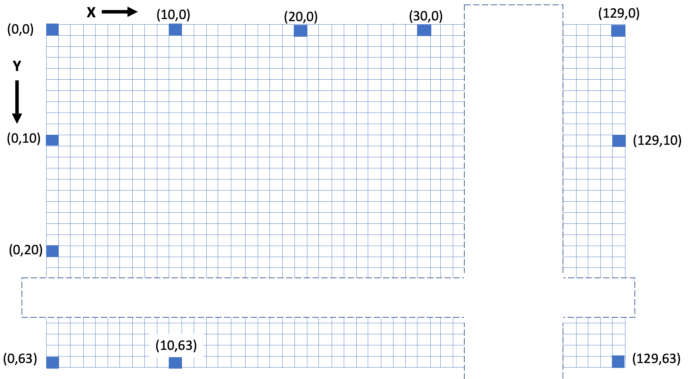

# Screen Coordinates



In these labs, our robot faces will use a low-cost OLED screen that is 128 pixels wide and 64 pixels high.  This screen is big enough to draw faces but small enough to be drawn quickly by our
microcontrollers.

The grid layout places the origin ```(0,0)``` in the upper-left corner of the screen.
The horizontal direction is always given first as the distance from the left edge
to the point.  This is called the X direction.

The distance from the top edges of the screen to any point is called the Y direction.

!!! Note
    Our graphics drawing uses the opposite vertical origin to the coordinate system taught in many math classes where the origin is in the lower-left corner of the grid.

In the figure above, note that the point in the upper right is (127,0)