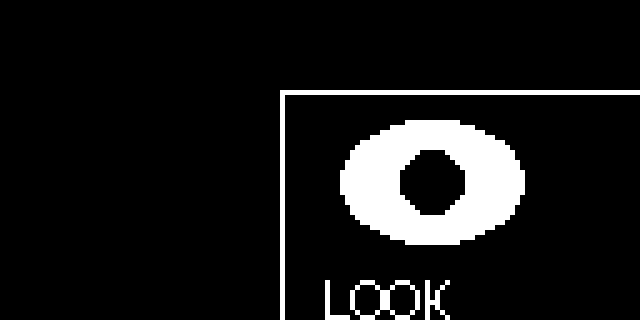

# Scrolling the Display

Every command so far has drawn something new. `scroll()` is different — it takes what is *already* in the frame buffer and slides all of it at once:

```py
display.scroll(xstep, ystep)
```

Positive `xstep` moves everything to the right, negative moves it left. Positive `ystep` moves everything down, negative moves it up. There are no coordinates and no color, because `scroll()` does not care what is on the screen. It just shifts every pixel by the same amount.

That makes it the cheapest kind of motion you can get. Sliding a whole face 2 pixels sideways takes one command, no matter how many shapes went into building that face.

## Sample Program Code

This program draws an eye and a label in the upper-left, shows it, waits a second, and then shifts the entire buffer 56 pixels right and 18 pixels down.

```py
# Test of the micropython scroll function
# oled.scroll(xstep, ystep)

from machine import Pin
from utime import sleep
import ssd1306

WIDTH = 128
HEIGHT = 64

clock=Pin(2) #SCL
data=Pin(3) #SDA
RES = machine.Pin(4)
DC = machine.Pin(5)
CS = machine.Pin(6)

spi=machine.SPI(0, sck=clock, mosi=data)
oled = ssd1306.SSD1306_SPI(WIDTH, HEIGHT, spi, DC, RES, CS)

WHITE = 1
BLACK = 0
NO_FILL = 0
FILL = 1

# draw an eye and a label near the top-left corner
oled.fill(BLACK)
oled.rect(0, 0, WIDTH, HEIGHT, WHITE, NO_FILL)
oled.ellipse(30, 18, 18, 12, WHITE, FILL)
oled.ellipse(30, 18, 6, 6, BLACK, FILL)
oled.text('LOOK', 8, 36, WHITE)
oled.show()

sleep(1)

# shift every pixel in the buffer 56 to the right and 18 down
oled.scroll(56, 18)
oled.show()
```

Here is the display before the scroll:


And here it is after:



## Two Things That Surprise People

Compare those two images carefully, because they show both of the gotchas at once.

First, **whatever slides off the edge is gone for good**. The border rectangle used to run all the way around the screen. After the scroll, its top and left edges have moved into the middle of the display and its right and bottom edges have fallen off entirely. Scrolling back by `(-56, -18)` will not bring them back — those pixels no longer exist anywhere.

Second, **the space left behind is not guaranteed to be clean**. The MicroPython documentation warns that `scroll()` may leave a footprint of the previous pixels in the vacated region. Some builds clear it, some smear a copy of the old content, and you should not write code that depends on either.

!!! mascot-warning "Never Trust the Vacated Region"
    { class="mascot-admonition-img" }
    If your scrolling animation leaves ghost trails behind it, this is why — and the fix is always to draw something into that region yourself rather than hoping it came up blank.

## Making a Clean Marquee

Because of those two rules, `scroll()` works best when you refill the vacated strip on every step. This loop slides the screen one pixel left each frame and paints a fresh black column into the gap that opens on the right:

```py
while True:
    display.scroll(-1, 0)
    display.fill_rect(127, 0, 1, 64, 0)  # blank the column that just opened up
    display.show()
    sleep(0.02)
```

| Goal | Call | Then clean up |
|--|--|--|
| Slide left | `scroll(-1, 0)` | Blank the rightmost column |
| Slide right | `scroll(1, 0)` | Blank the leftmost column |
| Slide up | `scroll(0, -1)` | Blank the bottom row |
| Slide down | `scroll(0, 1)` | Blank the top row |

## When Not to Use scroll()

For a robot face, `scroll()` is usually the wrong tool. Eyes that glance sideways need to move *within* a face that stays still, and `scroll()` cannot do that — it moves everything or nothing.

The right pattern for expressions is the one you already know: `fill(0)`, redraw the features at their new positions, then `show()`. Save `scroll()` for the jobs it is genuinely best at — scrolling text banners, waveform plots that slide as new samples arrive, and shake effects where the whole face really should move together.

!!! Challenge
    1. Build a marquee that scrolls a message all the way across the screen and wraps back around.
    2. Make a "shake" effect that jiggles the whole face left and right by 2 pixels when the robot is startled.
    3. Scroll the eye upward and watch what happens to the pixels that leave the top of the screen.
    4. Draw a graph that scrolls one pixel left per reading, plotting a new value in the rightmost column each time.

## References

[MicroPython Framebuf Documentation](https://docs.micropython.org/en/latest/library/framebuf.html)
