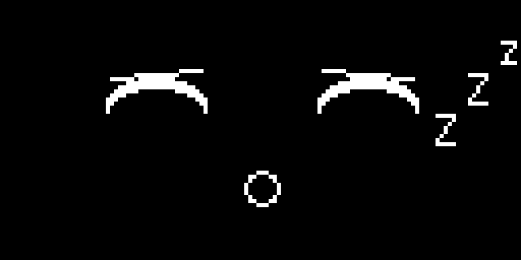

# Sleeping Faces

A robot that is charging, waiting, or just powered down for the night still has something to say — and drawing it to sleep is one of the friendliest ways to say it. Two closed eyes, a pair of relaxed eyebrows, a soft round mouth, and a trio of drifting `Z` characters turn a blank screen into a face that clearly needs a moment. No motors, no sensors, just pixels doing the work.

!!! mascot-welcome "Let's draw a nap"
    { class="mascot-admonition-img" }
    A sleeping face tells everyone nearby "give me a second" without a single word. Every pixel tells a story!

## Building on the Wink Trick

The [Winking with a Smile](../wink/index.md) lesson introduced a closed eye as an **arc** — the top half of an `ellipse()`, drawn with the quadrant mask `TOP_HALF` (a value of 3) instead of a full circle. A sleeping face reuses that exact trick, with one difference: both eyes close instead of just one.

```py
TOP_HALF = 3  # 1 (top right) + 2 (top left)
```

!!! mascot-thinking "One Eye or Two Changes Everything"
    { class="mascot-admonition-img" }
    The [Emotion Types](../emotion-types/index.md) lesson mentioned that tired and sleepy feelings belong on a robot face too. One closed eye reads as a wink; two closed eyes at the same time reads as asleep. Same arc, completely different meaning, just from how many eyes use it.

## Drooping Eyebrows

Eyebrows on a wide-awake face are usually level or lifted. On a sleeping face, gravity wins: the outer corner of each eyebrow sags down while the nose-side corner stays put, the same way real eyebrows relax when someone's muscles stop working to hold them up.

```py
EYEBROW_HALF_WIDTH = 11
EYEBROW_Y = EYE_Y - 5
EYEBROW_DROOP = 2  # outer corners sag, the way real eyebrows relax before sleep
```

```py
# left eyebrow: nose-side end stays level, outer end sags down
oled.line(LEFT_EYE_X + EYEBROW_HALF_WIDTH, EYEBROW_Y,
          LEFT_EYE_X - EYEBROW_HALF_WIDTH, EYEBROW_Y + EYEBROW_DROOP, WHITE)
```

!!! mascot-tip "Flat Is Calm, Drooping Is Sleepy"
    { class="mascot-admonition-img" }
    The [Basic Face Layouts](../basic-face-layouts/index.md) lesson showed that flat eyebrows read as calm. A small droop — just 2 pixels here — nudges that same calm face over the line into sleepy without looking sad or worried.

## A Small, Relaxed Mouth

A wide-awake mouth in this book is usually a `BOTTOM_HALF` arc for a smile. A sleeping mouth is calmer still: a small unfilled circle, like a quiet breath in and out, with none of the curve a smile or frown would add.

```py
MOUTH_Y = 46
MOUTH_RADIUS = 4

oled.ellipse(HALF_WIDTH, MOUTH_Y, MOUTH_RADIUS, MOUTH_RADIUS, WHITE, NO_FILL)
```

## Drawing the Zzz

The [Drawing Text](../text/index.md) lesson explained that every character in the built-in font is a fixed 8 by 8 pixels — there's no `text_size()` command to make one `Z` bigger than another. Instead of fighting that limit, this lesson works with it: three `Z` characters, stair-stepped up and to the right, mimic the way sleep marks float away from a sleeping face in cartoons.

```py
ZZZ_X = 106
ZZZ_Y = 26
ZZZ_STEP_X = 8
ZZZ_STEP_Y = 10

def draw_zzz(bob):
    oled.text('Z', ZZZ_X, ZZZ_Y + bob, WHITE)
    oled.text('Z', ZZZ_X + ZZZ_STEP_X, ZZZ_Y - ZZZ_STEP_Y + bob, WHITE)
    oled.text('z', ZZZ_X + ZZZ_STEP_X * 2, ZZZ_Y - ZZZ_STEP_Y * 2 + bob, WHITE)
```

The `bob` parameter shifts all three letters up or down together by the same amount — that's what makes the whole group drift gently instead of jumping around independently.

## Sample Program Code

This program draws closed eyes, drooping eyebrows, a relaxed mouth, and a floating `Zzz` — everything a sleeping face needs in one `draw_face()` call.

```py
# Sleeping face on a 128x64 monochrome OLED

from machine import Pin
from utime import sleep
import ssd1306

WIDTH = 128
HEIGHT = 64

clock = Pin(2)  # SCL
data = Pin(3)   # SDA
RES = machine.Pin(4)
DC = machine.Pin(5)
CS = machine.Pin(6)

spi = machine.SPI(0, sck=clock, mosi=data)
oled = ssd1306.SSD1306_SPI(WIDTH, HEIGHT, spi, DC, RES, CS)

WHITE = 1
BLACK = 0
NO_FILL = 0
FILL = 1

TOP_HALF = 3  # 1 (top right) + 2 (top left)

HALF_WIDTH = int(WIDTH / 2)

EYE_SPACING = 26
LEFT_EYE_X = HALF_WIDTH - EYE_SPACING
RIGHT_EYE_X = HALF_WIDTH + EYE_SPACING
EYE_Y = 22
EYE_RADIUS = 12
SLEEP_RADIUS_Y = 6
SLEEP_Y = EYE_Y + 3
STROKE = 3

EYEBROW_HALF_WIDTH = 11
EYEBROW_Y = EYE_Y - 5
EYEBROW_DROOP = 2  # outer corners sag, the way real eyebrows relax before sleep

MOUTH_Y = 46
MOUTH_RADIUS = 4

ZZZ_X = 106
ZZZ_Y = 26
ZZZ_STEP_X = 8
ZZZ_STEP_Y = 10
BOB_RANGE = 3


def draw_closed_eye(x):
    for offset in range(STROKE):
        oled.ellipse(x, SLEEP_Y + offset, EYE_RADIUS, SLEEP_RADIUS_Y,
                     WHITE, NO_FILL, TOP_HALF)


def draw_eyebrows():
    # left eyebrow: nose-side end stays level, outer end sags down
    oled.line(LEFT_EYE_X + EYEBROW_HALF_WIDTH, EYEBROW_Y,
              LEFT_EYE_X - EYEBROW_HALF_WIDTH, EYEBROW_Y + EYEBROW_DROOP, WHITE)

    # right eyebrow: mirror image of the left
    oled.line(RIGHT_EYE_X - EYEBROW_HALF_WIDTH, EYEBROW_Y,
              RIGHT_EYE_X + EYEBROW_HALF_WIDTH, EYEBROW_Y + EYEBROW_DROOP, WHITE)


def draw_mouth():
    oled.ellipse(HALF_WIDTH, MOUTH_Y, MOUTH_RADIUS, MOUTH_RADIUS, WHITE, NO_FILL)


def draw_zzz(bob):
    oled.text('Z', ZZZ_X, ZZZ_Y + bob, WHITE)
    oled.text('Z', ZZZ_X + ZZZ_STEP_X, ZZZ_Y - ZZZ_STEP_Y + bob, WHITE)
    oled.text('z', ZZZ_X + ZZZ_STEP_X * 2, ZZZ_Y - ZZZ_STEP_Y * 2 + bob, WHITE)


def draw_face(bob):
    oled.fill(BLACK)
    draw_closed_eye(LEFT_EYE_X)
    draw_closed_eye(RIGHT_EYE_X)
    draw_eyebrows()
    draw_mouth()
    draw_zzz(bob)
    oled.show()


draw_face(0)
```

Here's what that program draws on the display:



## Animating a Gentle Drift

A single frame of `Zzz` is a nice touch, but a sleeping face that never moves can start to look more broken than restful. The [Eye Scanner](../eye-scanner/index.md) lesson swept a pupil back and forth by looping `range()` up and then back down — this lesson uses that exact pattern, just on the `bob` value instead of an eye position.

```py
while True:
    for bob in range(-BOB_RANGE, BOB_RANGE):
        draw_face(bob)
        sleep(0.15)
    for bob in range(BOB_RANGE, -BOB_RANGE, -1):
        draw_face(bob)
        sleep(0.15)
```

`bob` climbs from `-3` to `3` and back again, so the whole `Zzz` group rises a few pixels, sinks back down, and repeats — a slow, steady drift instead of a static sticker glued to the corner of the screen.

!!! mascot-warning "Keep It Slow"
    { class="mascot-admonition-img" }
    A `sleep(0.15)` step is deliberately gentle. Speed this loop up and the calm drift turns into a jittery shake — the opposite of what a sleeping face is supposed to feel like.

## Things to Try

1. **Change `SLEEP_RADIUS_Y` from 6 to 3.** A flatter arc reads as an even deeper, heavier sleep.
2. **Set `EYEBROW_DROOP` to 0.** Flat, level eyebrows on closed eyes read as calm rest rather than a heavy, sleepy sag — compare the two side by side.
3. **Add a fourth, smaller `z`** further up and to the right of the existing three, and see how much farther the drift can travel before it starts to feel cluttered.
4. **Wake the robot up** by wiring a button, as in the [Interactions](../interactions/index.md) lesson, so pressing it swaps `draw_face()` for the wide-awake face from [Basic Face Layouts](../basic-face-layouts/index.md).
5. **Combine sleepy eyebrows with an open eye** from the [Ellipse](../ellipse/index.md) lesson to build a "fighting to stay awake" expression, where one eye keeps drooping shut.

!!! mascot-celebration "You just built a whole mood"
    { class="mascot-admonition-img" }
    Closed eyes, drooping brows, a quiet mouth, and a drifting `Zzz` — four small tricks, and your robot can now tell a room to keep it down. Great expression!

## References

- [MicroPython Framebuf Documentation](https://docs.micropython.org/en/latest/library/framebuf.html) — the full signatures for `ellipse()`, `line()`, and `text()`, including the quadrant mask parameter
- [Winking with a Smile](../wink/index.md) — where the closed-eye arc and its quadrant mask were first introduced
- [Drawing Text](../text/index.md) — the fixed 8 by 8 character grid that shapes how the `Zzz` is laid out
- [Eye Scanner](../eye-scanner/index.md) — the back-and-forth `range()` loop this lesson's drift animation reuses
- [Emotion Types](../emotion-types/index.md) — where tired and sleepy are named alongside the seven core emotions
