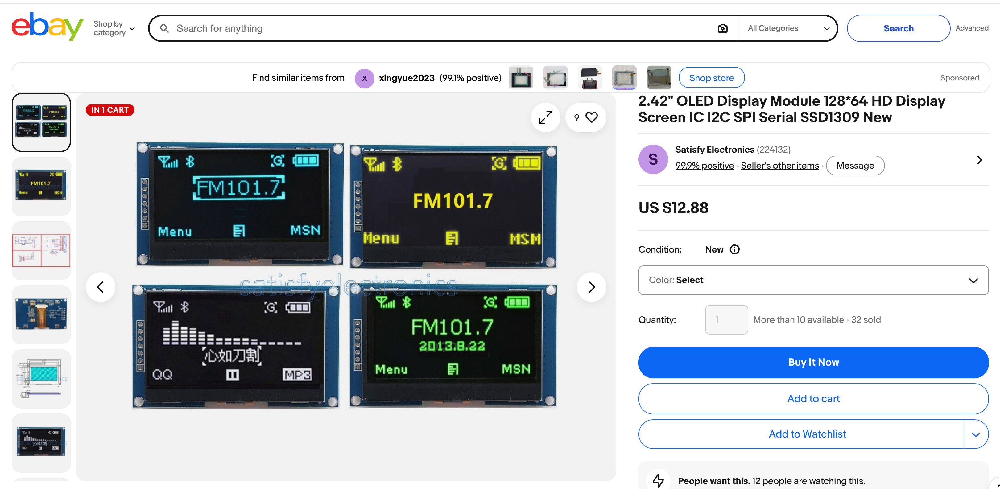
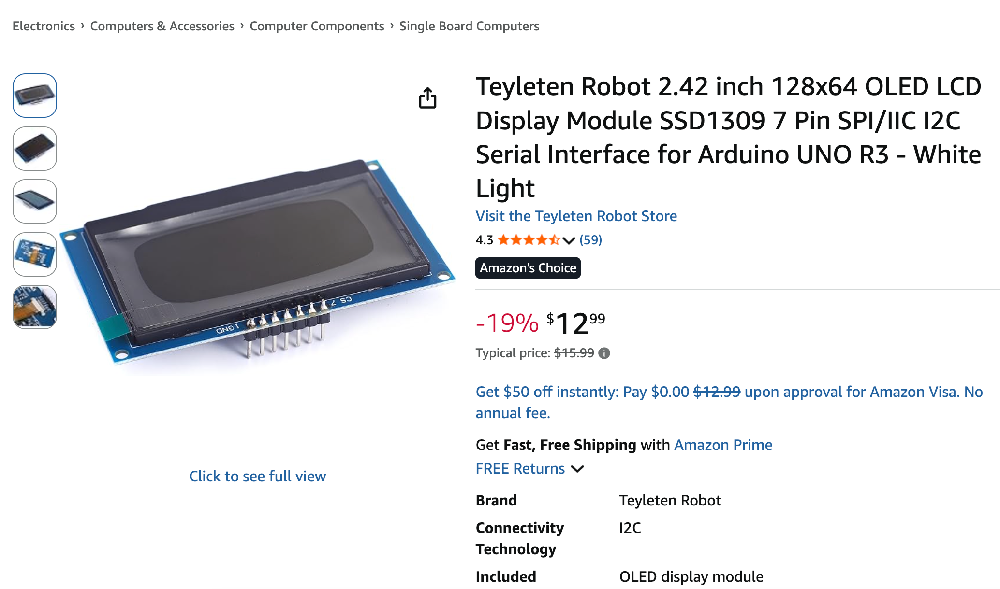
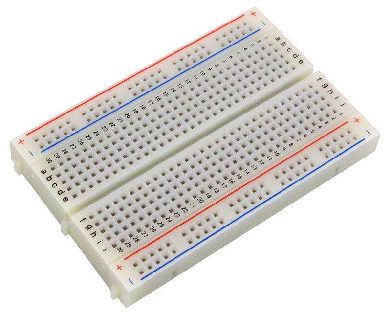
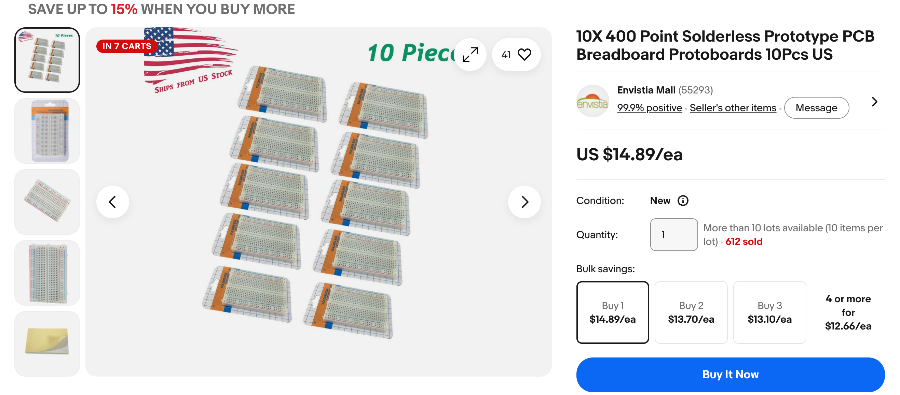

# Robot Faces Parts List

This is just a short list of parts that are commonly used in our labs.
You can get a detailed list of sensors and how to use them in the
full [Learning MicroPython](https://dmccreary.github.io/learning-micropython/).
Remember to use the search function of that site to get example code.

## Buying in Bulk for a Classroom (10-30 Students)

If you are outfitting a whole class where every student builds and keeps
their own robot face, a little bit of planning saves a lot of money and
class time. Here are the strategies that have worked best for us.

- **Standardize on one exact part number.** Different sellers of "the same"
  128x64 OLED often ship different driver chips (SSD1306 vs. SSD1309), and
  the MicroPython driver code is not identical between them. Pick one
  listing, buy every unit from that same listing, and your example code
  will work for the whole class without per-student debugging.
- **Order 10-20% spares.** Small SPI displays and jumper wires are the parts
  most likely to arrive DOA or get damaged by a reversed connector. For a
  class of 20, order enough for 22-24 students so a bad unit does not stop
  a lab.
- **Plan around shipping time, not just price.** AliExpress and eBay
  overseas listings are usually the cheapest per unit but can take 3-5
  weeks to arrive. Amazon and MicroCenter cost a bit more but ship in days,
  which matters if you are ordering the week before the unit starts.
  A common pattern: order the bulk of the kits from AliExpress 4-6 weeks
  ahead, and buy a handful of Amazon or MicroCenter units as fast-arriving
  spares/backups.
- **Look for multi-packs ("lots").** Search for listings like "10 pcs" or
  "lot of 20" rather than adding one item to your cart N times — sellers on
  AliExpress and eBay frequently price these lots noticeably lower per unit
  than the single-unit listing, and it is one shipment to track instead of
  many.
- **Buy heavy/bulky items locally when you can.** Breadboards and chassis
  kits are cheap but bulky to ship; a local MicroCenter or electronics
  supplier can be cheaper once shipping is factored in, and you avoid
  waiting on freight.
- **Check for educator/STEM discounts and grants.** Sites like
  [Adafruit](https://www.adafruit.com), [SparkFun](https://www.sparkfun.com),
  and [PiShop.us](https://www.pishop.us) sometimes offer classroom or bulk
  educator pricing on request. If your budget is tight, [DonorsChoose](https://www.donorschoose.org)
  and school PTA/STEM grants are common funding sources for a first-time
  class set of parts.
- **Organize kits before class starts.** Pre-bag one Pico, one display, one
  breadboard, jumper wires, and two buttons per student in a labeled
  snack-size bag or small parts bin. Handing out a finished kit takes
  seconds; handing out loose parts from a box takes the whole period.

## Microcontrollers

You can use almost any modern microcontroller that supports an SPI interface and has a MicroPython driver.  Here are some of our favorites.  They sell for as little as $3.99 USD at stores like MicroCenter.

### Raspberry Pi Pico

The Raspberry Pi Pico is a $3.99 microcontroller that supports SPI.  This allows you to test your
face drawing for under $25.  It has 260KB RAM which is more than enough for most displays, even color 240x240 color displays.

You can also use the popular ESP-32 MicroControllers that also run Python.  Just make sure that the Thonny (or similar) can be used to control the devices.

For a class set, [MicroCenter](https://www.microcenter.com) and [PiShop.us](https://www.pishop.us)
both regularly stock the Pico and often give a per-unit discount at
quantities of 10+. Buying from a single source for the whole class also
means every student's board has the same silkscreen labeling, which makes
giving wiring instructions much easier.

## Displays

### 128X64 SPI OLEDs

Sample listing on AliExpress and eBay

We love the under $20 128x64 OLED displays.  These displays have fast [SPI](./glossary.md#spi) drivers that will update the display in around 2 milliseconds.  The price vary from around $10 to $20 depending on the current tariffs and quantity.  The displays come in four colors:

1. White
2. Amber (Yellow)
3. Green
4. Blue (a favorite)

Here are some sample search links:

- [eBay search: 2.42 inch OLED 128x64 SSD1309 SPI](https://www.ebay.com/sch/i.html?_nkw=2.42+inch+OLED+display+128x64+SSD1309+SPI)
- [AliExpress search: 2.42 inch OLED 128x64 SSD1309 SPI](https://www.aliexpress.us/wholesale?SearchText=2.42+inch+OLED+display+128x64+SSD1309+SPI)
- [Amazon search: 2.42 inch OLED 128x64 SPI](https://www.amazon.com/s?k=2.42+inch+OLED+display+128x64+SPI)

[AliExpress 2.42 inch 2.42" OLED Display Module 128x64 LCD HD Screen Module SSD1309 7 Pin SPI/IIC I2C Serial Interface](https://www.aliexpress.us/item/3256806159669161.html)

Note that you can also get smaller 1" OLEDs and displays that use the slower I2C.  We like the larger 2.42" displays and the faster SPI bus.

**Buying tip:** search for "lot of 10" or "lot of 20" instead of adding a
single-unit listing to your cart multiple times — sellers usually price
these bulk lots lower per display, and you only have to track one shipment.
Since driver code differs slightly between the SSD1306 and SSD1309 chips,
buy every display for the class from the exact same listing so all
students run the same driver.

## Solderless Breadboard

We use a 400-tie 1/2 size breadboard for many of our robot faces labs.  There is also
room on these breadboards for two momentary press buttons for changing the mode or
a parameter.  We use $2 solderless mini breadboards to test our displays.

- [eBay search: QTY 400 tie solderless breadboard lot of 10](https://www.ebay.com/sch/i.html?_nkw=QTY+400+tie+solderless+breadboard+lot+of+10)

## Jumper Wires

We use M-F 20cm or 40cm jumper wires. The female ends connect to the display and the
male ends connect to the breadboard.  See the [Display Cable Harness](https://dmccreary.github.io/clocks-and-watches/setup/03-display-cable-harness/) for a guide to creating display cables
that make it easy for students to connect a display to a Raspberry Pi Pico on a breadboard.

## Robot Chassis

We use a standard "Smart Car" chassis to drive our cars.  These parts can be purchased for
around $5 each in quantity 10.

## Sensors

This course is not intended to be a complete guide to sensors, but here
are a few favorite sensors our students like to use.

### Momentary Push Buttons

We use momentary push buttons that are ideal for changing the mode of a robot.  They can be
purchased for about 10 cents in quantity 10.

### Potentiometers

These are ideal for allowing students to vary a parameter of a face such as the curvature or width
of a smile.

### Rotary Encoders

A rotary encoder is a nice way to cycle through modes or change parameters.

## Sample Per-Student Kit Budget

These are rough per-unit prices when buying in classroom quantities (10-30
units), so you can estimate a total budget before ordering. Actual prices
vary with tariffs, shipping method, and how many "lot" discounts you can
find.

| Part | Est. cost/student (bulk) | Qty for 20 students |
|---|---|---|
| Microcontroller (Pico) | $4 | 20 (+2 spare) |
| OLED display (128x64 SPI) | $10-15 | 20 (+3 spare) |
| Solderless breadboard | $2 | 20 |
| Jumper wires (set of ~10) | $1 | 20 sets |
| Momentary push buttons (x2) | $0.20 | 40 |
| Potentiometer | $0.50 | 20 |
| **Total per student** | **~$18-23** | |

For 20 students that is roughly **$360-460** total, plus a few dollars for
spares. Ordering the displays and Picos from AliExpress in bulk lots
typically lands at the low end of that range; sourcing everything from
Amazon or MicroCenter for fast shipping lands closer to the high end.

