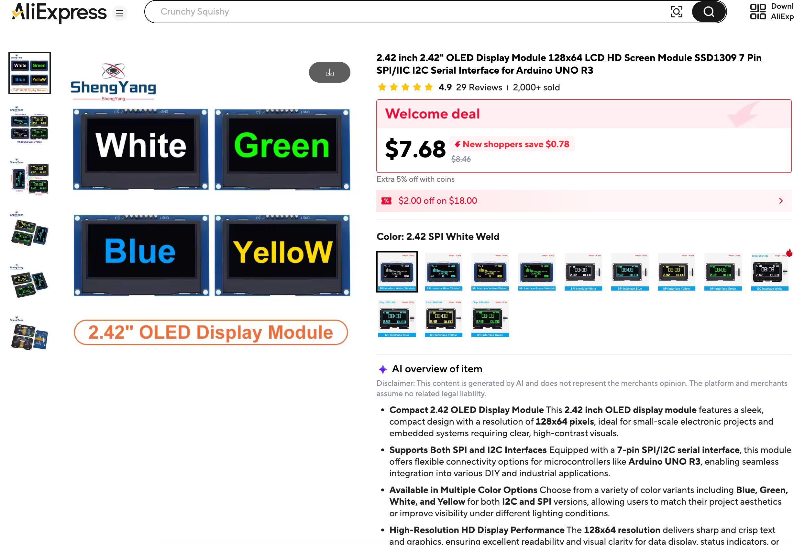

# Robot Faces Parts List

## Microcontrollers

You can use almost any modern microcontroller that supports an SPI interface and has a MicroPython driver.  Here are some of our favorites.  They sell for as little as $3.99 USD at stores like MicroCenter.

### Raspberry Pi Pico

The Raspberry Pi Pico is a $3.99 microcontroller that supports SPI.  This allows you to test your
face drawing for under $25.  It has 260KB RAM which is more than enough for most displays, even color 240x240 color displays.

You can also use the popular ESP-32 MicroControllers that also run Python.  Just make sure that the Thonny (or similar) can be used to control the devices.

## Displays

### 128X64 OLEDs

We love the under $20 128x64 OLED displays.  These displays have fast [SPI](./glossary.md#spi) drivers that will update the display in around 2 milliseconds.

[AliExpress 2.42 inch 2.42" OLED Display Module 128x64 LCD HD Screen Module SSD1309 7 Pin SPI/IIC I2C Serial Interface](https://www.aliexpress.us/item/3256806159669161.html)

## Robot Chassis

We use a standard "Smart Car" chassis to drive our cars.  These parts can be purchased for
around $5 each in quantity 10.

## Sensors

This course is not intended to be a complete guide to sensors, but here
are a few favorite sensors our students like to use.

### Momentary Push Buttons

We use momentary push buttons that are ideal for changing the mode of a robot.  They can be
purchased for about 10 cents in quantity 10.

### Potentiometers

These are ideal for allowing students to vary a parameter of a face such as the curvature or width
of a smile.

### Rotary Encoders

## Solderless Breadboard

We use $2 solderless mini breadboards to test our displays.

~

