# MicroSims

This book includes **47 interactive MicroSims** — self-contained, browser-based visualizations you can explore directly. Click any thumbnail to open the MicroSim.

<!-- This gallery is generated by generate-sims-index.py — edits here will be overwritten. -->

  <a href="ambiguous-expression-confusability-sorter/" title="Ambiguous Expression Confusability Sorter" style="display:block;border:1px solid #e3e7ec;border-radius:8px;overflow:hidden;text-decoration:none;color:inherit;box-shadow:0 1px 3px rgba(0,0,0,0.08);">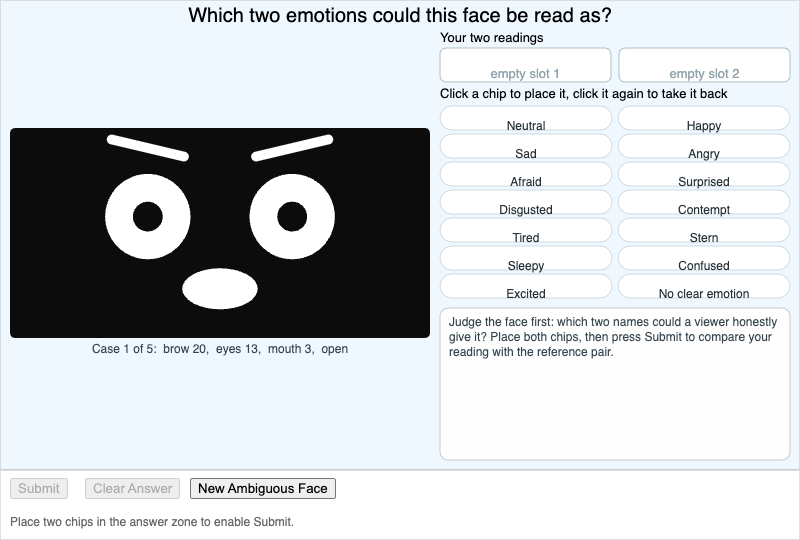Ambiguous Expression Confusability Sorter</a>
  <a href="bitwise-shift-visualizer/" title="Bitwise Operator and Shift Visualizer" style="display:block;border:1px solid #e3e7ec;border-radius:8px;overflow:hidden;text-decoration:none;color:inherit;box-shadow:0 1px 3px rgba(0,0,0,0.08);">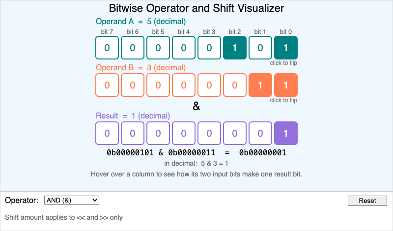Bitwise Operator and Shift Visualizer</a>
  <a href="blit-transparency-key-visualizer/" title="Blit Transparency Key Visualizer" style="display:block;border:1px solid #e3e7ec;border-radius:8px;overflow:hidden;text-decoration:none;color:inherit;box-shadow:0 1px 3px rgba(0,0,0,0.08);">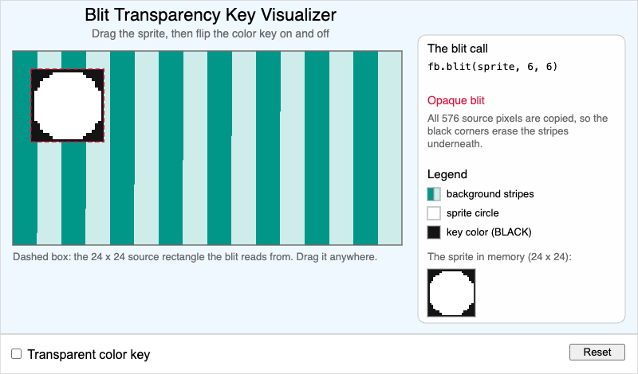Blit Transparency Key Visualizer</a>
  <a href="expression-parameter-matching-challenge/" title="Build This Expression Challenge" style="display:block;border:1px solid #e3e7ec;border-radius:8px;overflow:hidden;text-decoration:none;color:inherit;box-shadow:0 1px 3px rgba(0,0,0,0.08);">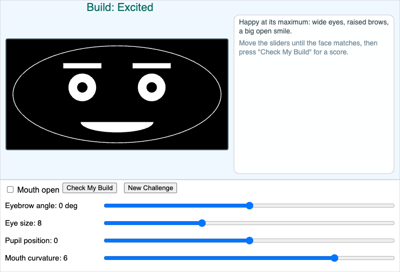Build This Expression Challenge</a>
  <a href="button-bounce-timeline-visualizer/" title="Button Bounce Timeline Visualizer" style="display:block;border:1px solid #e3e7ec;border-radius:8px;overflow:hidden;text-decoration:none;color:inherit;box-shadow:0 1px 3px rgba(0,0,0,0.08);">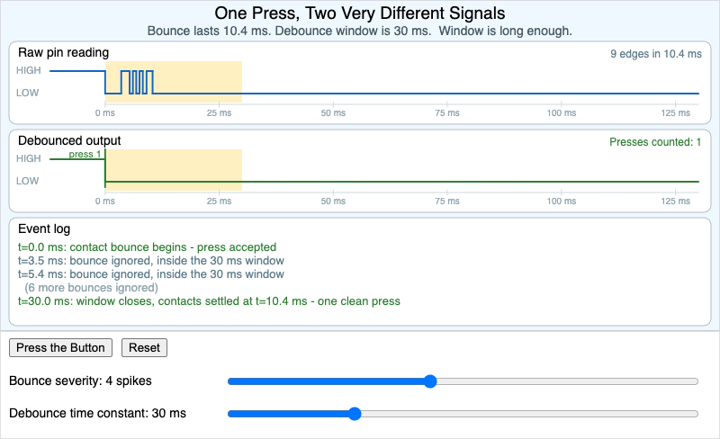Button Bounce Timeline Visualizer</a>
  <a href="capstone-planning-worksheet/" title="Capstone Planning Worksheet" style="display:block;border:1px solid #e3e7ec;border-radius:8px;overflow:hidden;text-decoration:none;color:inherit;box-shadow:0 1px 3px rgba(0,0,0,0.08);">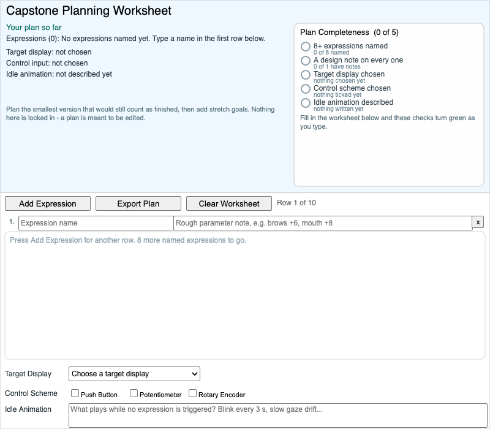Capstone Planning Worksheet</a>
  <a href="capstone-rubric-scoring-tool/" title="Capstone Rubric Scoring Tool" style="display:block;border:1px solid #e3e7ec;border-radius:8px;overflow:hidden;text-decoration:none;color:inherit;box-shadow:0 1px 3px rgba(0,0,0,0.08);">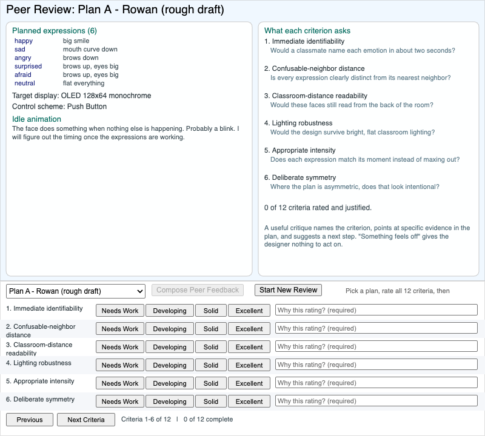Capstone Rubric Scoring Tool</a>
  <a href="circular-buffer-waste-visualizer/" title="Circular Buffer Waste Visualizer" style="display:block;border:1px solid #e3e7ec;border-radius:8px;overflow:hidden;text-decoration:none;color:inherit;box-shadow:0 1px 3px rgba(0,0,0,0.08);">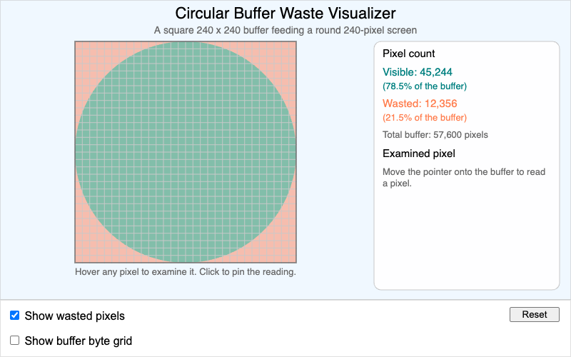Circular Buffer Waste Visualizer</a>
  <a href="color-wheel-emotion-picker/" title="Color Wheel Emotion Picker" style="display:block;border:1px solid #e3e7ec;border-radius:8px;overflow:hidden;text-decoration:none;color:inherit;box-shadow:0 1px 3px rgba(0,0,0,0.08);">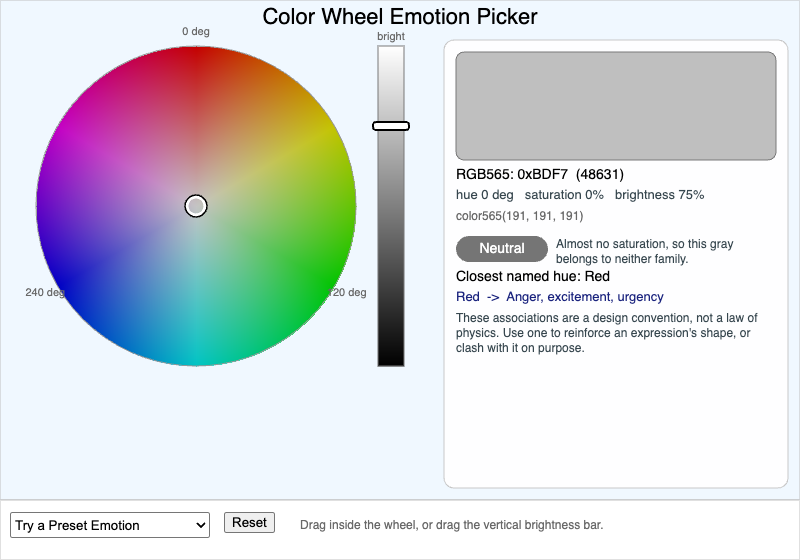Color Wheel Emotion Picker</a>
  <a href="computational-thinking-concept-map/" title="Computational Thinking Concept Map" style="display:block;border:1px solid #e3e7ec;border-radius:8px;overflow:hidden;text-decoration:none;color:inherit;box-shadow:0 1px 3px rgba(0,0,0,0.08);">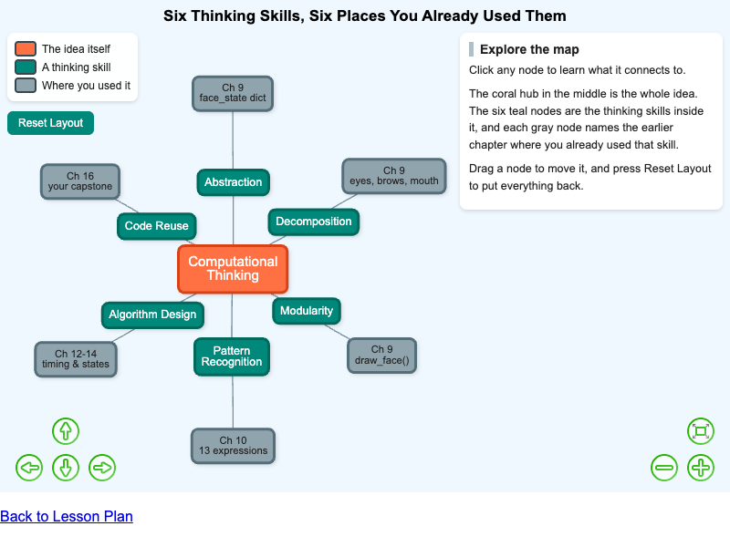Computational Thinking Concept Map</a>
  <a href="convex-concave-shape-classifier/" title="Convex vs Concave Shape Classifier" style="display:block;border:1px solid #e3e7ec;border-radius:8px;overflow:hidden;text-decoration:none;color:inherit;box-shadow:0 1px 3px rgba(0,0,0,0.08);">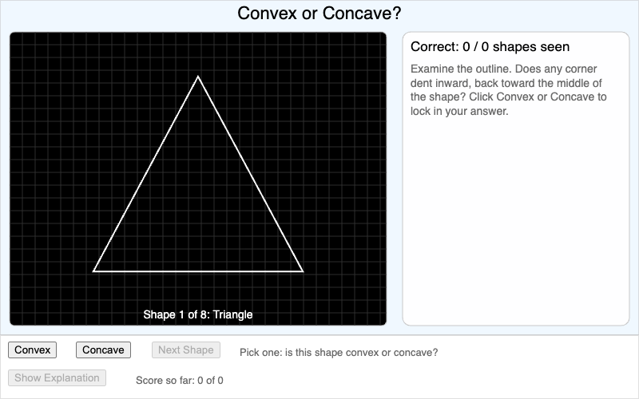Convex vs Concave Shape Classifier</a>
  <a href="coordinate-grid-explorer/" title="Coordinate Grid Explorer" style="display:block;border:1px solid #e3e7ec;border-radius:8px;overflow:hidden;text-decoration:none;color:inherit;box-shadow:0 1px 3px rgba(0,0,0,0.08);">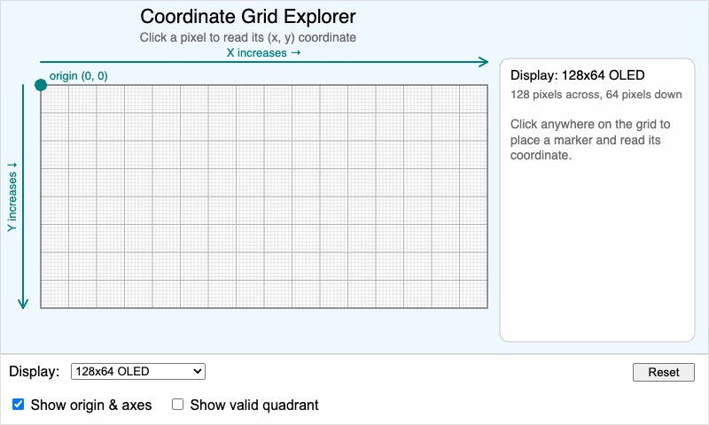Coordinate Grid Explorer</a>
  <a href="draw-call-benchmark-chart/" title="Draw Call Benchmark Chart" style="display:block;border:1px solid #e3e7ec;border-radius:8px;overflow:hidden;text-decoration:none;color:inherit;box-shadow:0 1px 3px rgba(0,0,0,0.08);">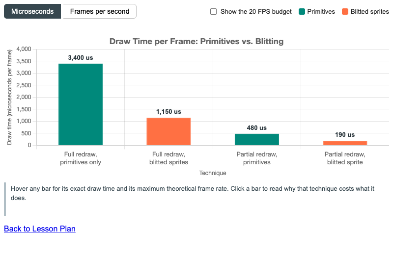Draw Call Benchmark Chart</a>
  <a href="draw-order-overdraw-stepper/" title="Draw Order and Overdraw Stepper" style="display:block;border:1px solid #e3e7ec;border-radius:8px;overflow:hidden;text-decoration:none;color:inherit;box-shadow:0 1px 3px rgba(0,0,0,0.08);">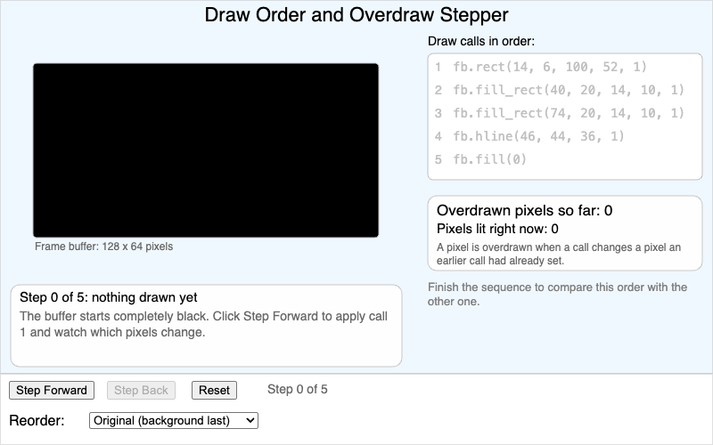Draw Order and Overdraw Stepper</a>
  <a href="ekman-emotion-feature-map/" title="Ekman Emotion Feature Map" style="display:block;border:1px solid #e3e7ec;border-radius:8px;overflow:hidden;text-decoration:none;color:inherit;box-shadow:0 1px 3px rgba(0,0,0,0.08);">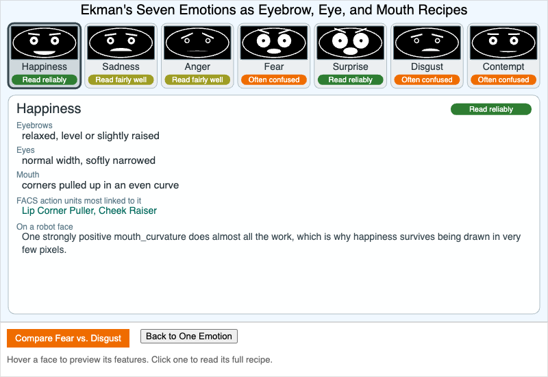Ekman Emotion Feature Map</a>
  <a href="encoder-quadrature-signal-visualizer/" title="Encoder Quadrature Signal Visualizer" style="display:block;border:1px solid #e3e7ec;border-radius:8px;overflow:hidden;text-decoration:none;color:inherit;box-shadow:0 1px 3px rgba(0,0,0,0.08);">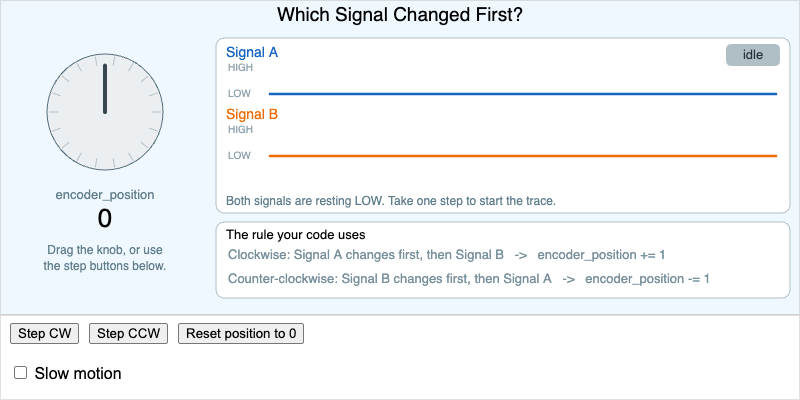Encoder Quadrature Signal Visualizer</a>
  <a href="expression-interpolation-keyframe-stepper/" title="Expression Interpolation Keyframe Stepper" style="display:block;border:1px solid #e3e7ec;border-radius:8px;overflow:hidden;text-decoration:none;color:inherit;box-shadow:0 1px 3px rgba(0,0,0,0.08);">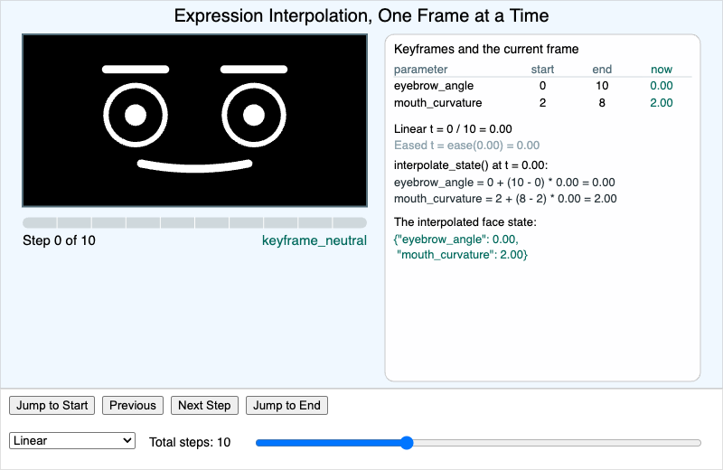Expression Interpolation Keyframe Stepper</a>
  <a href="expression-menu-live-simulator/" title="Expression Menu Live Simulator" style="display:block;border:1px solid #e3e7ec;border-radius:8px;overflow:hidden;text-decoration:none;color:inherit;box-shadow:0 1px 3px rgba(0,0,0,0.08);">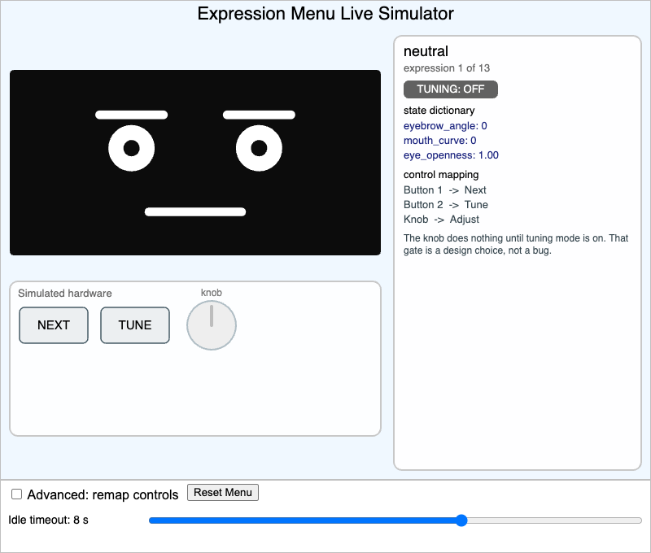Expression Menu Live Simulator</a>
  <a href="expression-recipe-flashcard-gallery/" title="Expression Recipe Flashcard Gallery" style="display:block;border:1px solid #e3e7ec;border-radius:8px;overflow:hidden;text-decoration:none;color:inherit;box-shadow:0 1px 3px rgba(0,0,0,0.08);">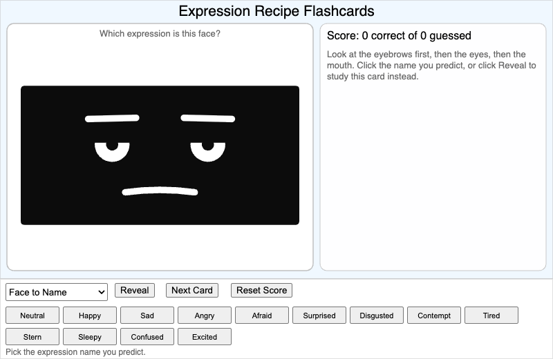Expression Recipe Flashcard Gallery</a>
  <a href="face-layout-grid-visualizer/" title="Face Layout Grid Visualizer" style="display:block;border:1px solid #e3e7ec;border-radius:8px;overflow:hidden;text-decoration:none;color:inherit;box-shadow:0 1px 3px rgba(0,0,0,0.08);">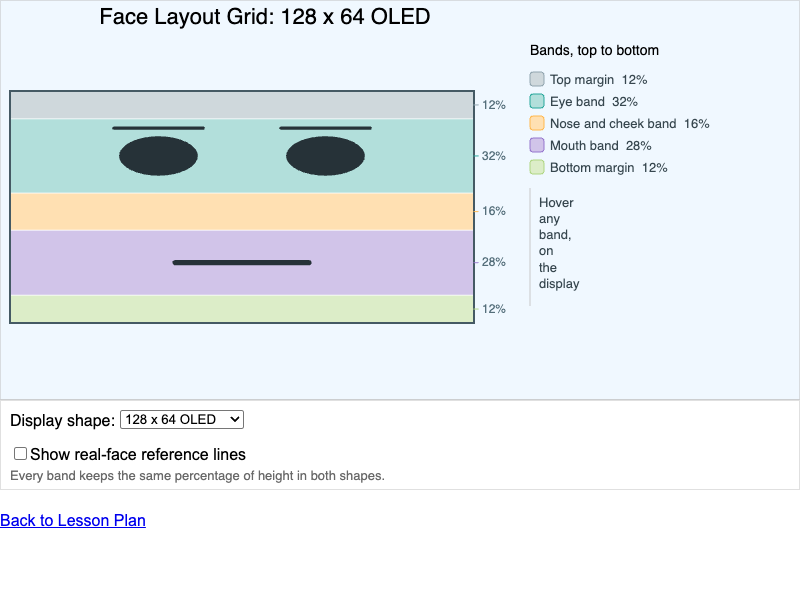Face Layout Grid Visualizer</a>
  <a href="face-parameter-slider-playground/" title="Face Parameter Slider Playground" style="display:block;border:1px solid #e3e7ec;border-radius:8px;overflow:hidden;text-decoration:none;color:inherit;box-shadow:0 1px 3px rgba(0,0,0,0.08);">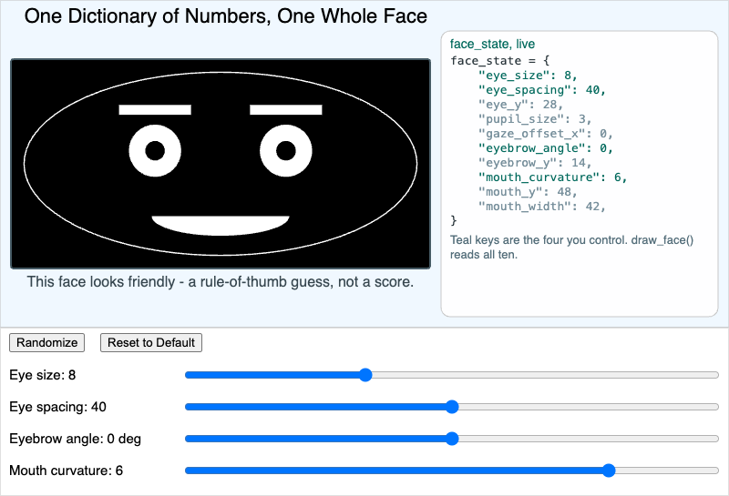Face Parameter Slider Playground</a>
  <a href="facial-symmetry-mirror-demonstrator/" title="Facial Symmetry Mirror Demonstrator" style="display:block;border:1px solid #e3e7ec;border-radius:8px;overflow:hidden;text-decoration:none;color:inherit;box-shadow:0 1px 3px rgba(0,0,0,0.08);">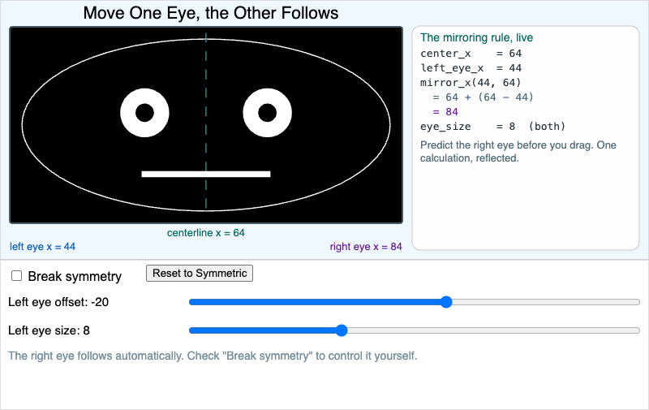Facial Symmetry Mirror Demonstrator</a>
  <a href="robot-design-approach-infographic/" title="Four Robots, Four Bets on a Screen Face" style="display:block;border:1px solid #e3e7ec;border-radius:8px;overflow:hidden;text-decoration:none;color:inherit;box-shadow:0 1px 3px rgba(0,0,0,0.08);">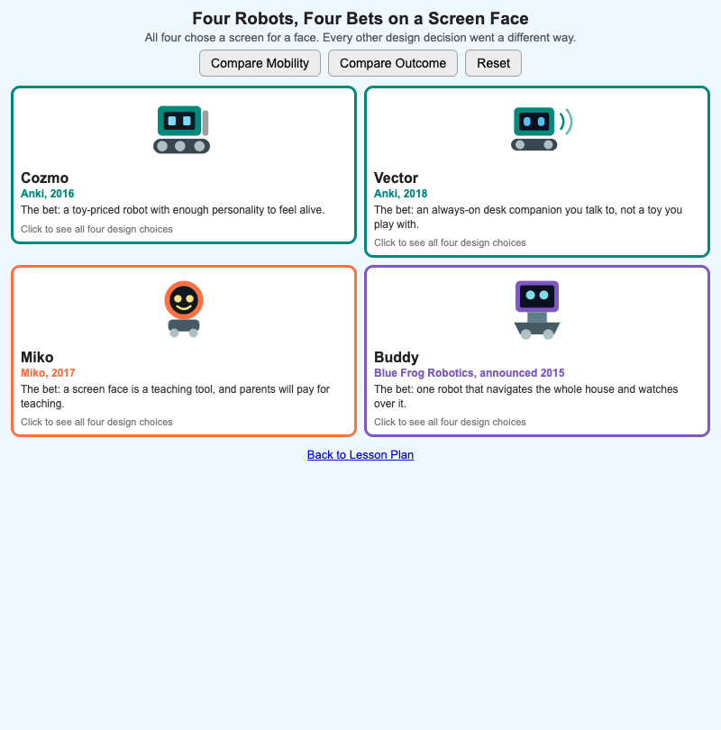Four Robots, Four Bets on a Screen Face</a>
  <a href="buffer-size-calculator/" title="Frame Buffer Size Calculator" style="display:block;border:1px solid #e3e7ec;border-radius:8px;overflow:hidden;text-decoration:none;color:inherit;box-shadow:0 1px 3px rgba(0,0,0,0.08);">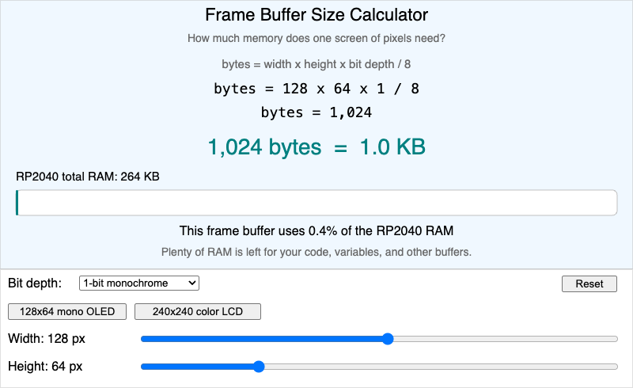Frame Buffer Size Calculator</a>
  <a href="framebuf-version-timeline-explorer/" title="FrameBuf Version Timeline" style="display:block;border:1px solid #e3e7ec;border-radius:8px;overflow:hidden;text-decoration:none;color:inherit;box-shadow:0 1px 3px rgba(0,0,0,0.08);">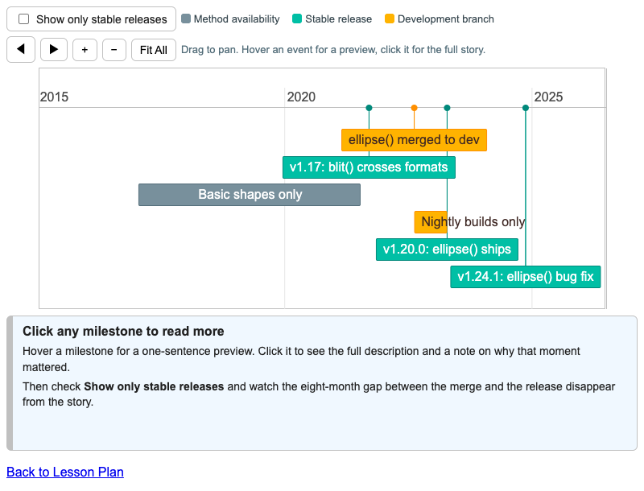FrameBuf Version Timeline</a>
  <a href="scope-call-stack-explorer/" title="Global vs Local Scope Call Stack Explorer" style="display:block;border:1px solid #e3e7ec;border-radius:8px;overflow:hidden;text-decoration:none;color:inherit;box-shadow:0 1px 3px rgba(0,0,0,0.08);">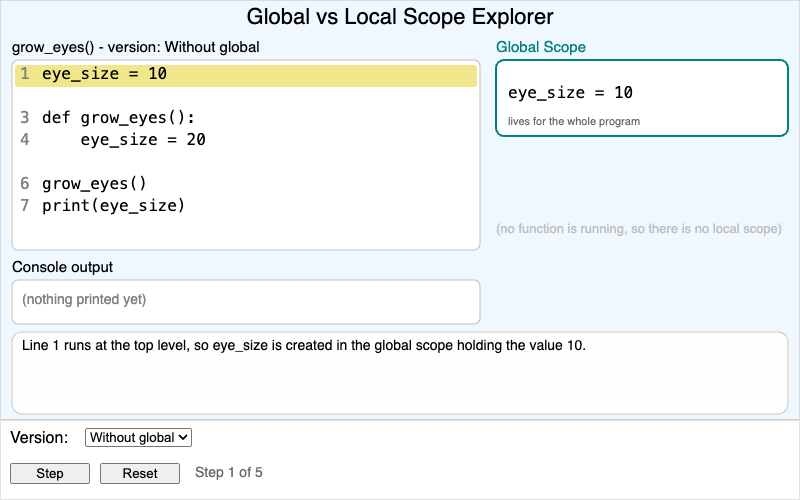Global vs Local Scope Call Stack Explorer</a>
  <a href="indentation-error-visualizer/" title="Indentation Error Visualizer" style="display:block;border:1px solid #e3e7ec;border-radius:8px;overflow:hidden;text-decoration:none;color:inherit;box-shadow:0 1px 3px rgba(0,0,0,0.08);">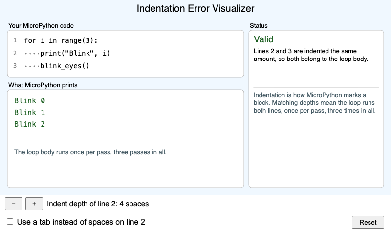Indentation Error Visualizer</a>
  <a href="breadboard-wiring-diagram/" title="Interactive Breadboard Wiring Diagram" style="display:block;border:1px solid #e3e7ec;border-radius:8px;overflow:hidden;text-decoration:none;color:inherit;box-shadow:0 1px 3px rgba(0,0,0,0.08);">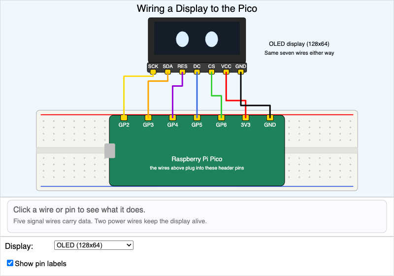Interactive Breadboard Wiring Diagram</a>
  <a href="collection-types-comparison-infographic/" title="List vs Tuple vs Dictionary Comparison" style="display:block;border:1px solid #e3e7ec;border-radius:8px;overflow:hidden;text-decoration:none;color:inherit;box-shadow:0 1px 3px rgba(0,0,0,0.08);">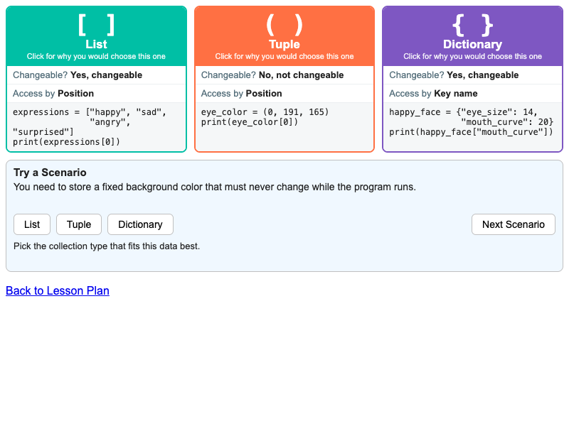List vs Tuple vs Dictionary Comparison</a>
  <a href="micropython-loop-tracer/" title="MicroPython Loop Tracer" style="display:block;border:1px solid #e3e7ec;border-radius:8px;overflow:hidden;text-decoration:none;color:inherit;box-shadow:0 1px 3px rgba(0,0,0,0.08);">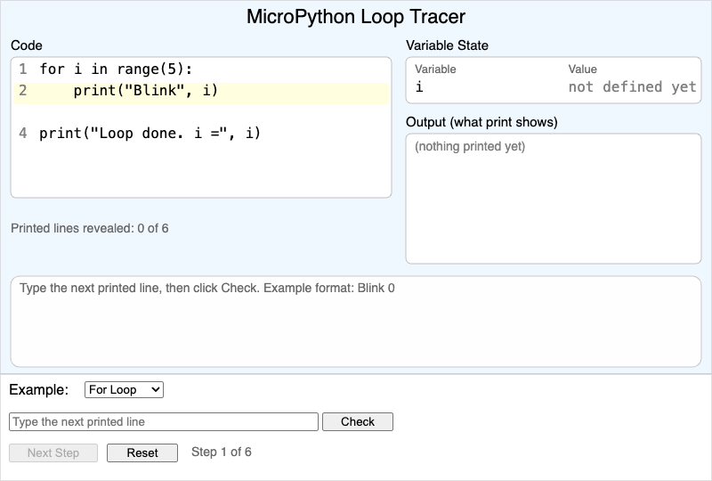MicroPython Loop Tracer</a>
  <a href="mode-state-transition-diagram/" title="Mode State Transition Diagram" style="display:block;border:1px solid #e3e7ec;border-radius:8px;overflow:hidden;text-decoration:none;color:inherit;box-shadow:0 1px 3px rgba(0,0,0,0.08);">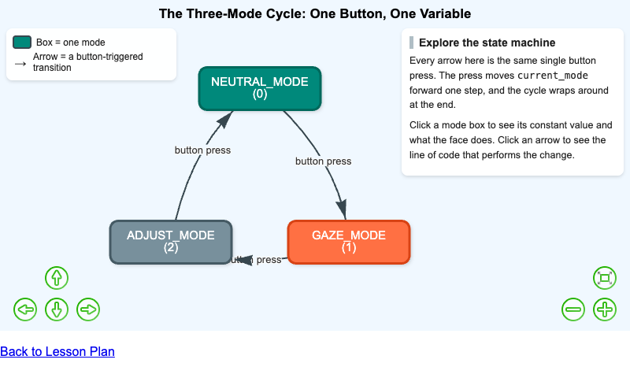Mode State Transition Diagram</a>
  <a href="ellipse-workaround-before-after-toggle/" title="Old Workaround vs. New ellipse() Call" style="display:block;border:1px solid #e3e7ec;border-radius:8px;overflow:hidden;text-decoration:none;color:inherit;box-shadow:0 1px 3px rgba(0,0,0,0.08);">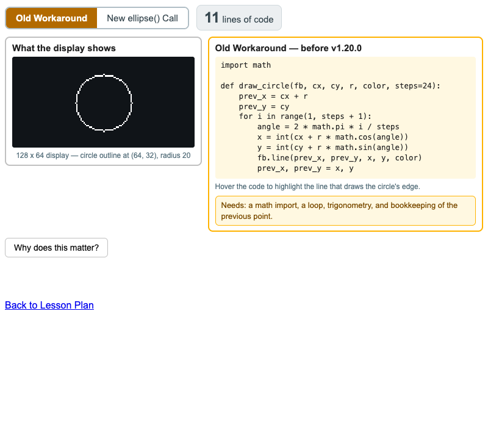Old Workaround vs. New ellipse() Call</a>
  <a href="pixel-drawing-sandbox/" title="Pixel Drawing Sandbox" style="display:block;border:1px solid #e3e7ec;border-radius:8px;overflow:hidden;text-decoration:none;color:inherit;box-shadow:0 1px 3px rgba(0,0,0,0.08);">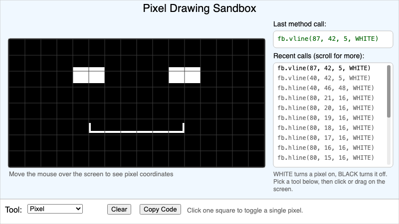Pixel Drawing Sandbox</a>
  <a href="polling-vs-interrupt-response-simulator/" title="Polling vs Interrupt Response Simulator" style="display:block;border:1px solid #e3e7ec;border-radius:8px;overflow:hidden;text-decoration:none;color:inherit;box-shadow:0 1px 3px rgba(0,0,0,0.08);">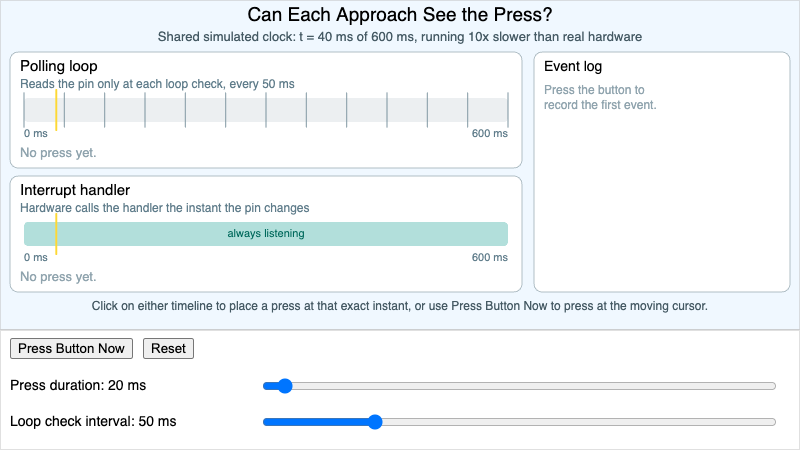Polling vs Interrupt Response Simulator</a>
  <a href="poly-point-array-builder/" title="Poly Point Array Builder" style="display:block;border:1px solid #e3e7ec;border-radius:8px;overflow:hidden;text-decoration:none;color:inherit;box-shadow:0 1px 3px rgba(0,0,0,0.08);">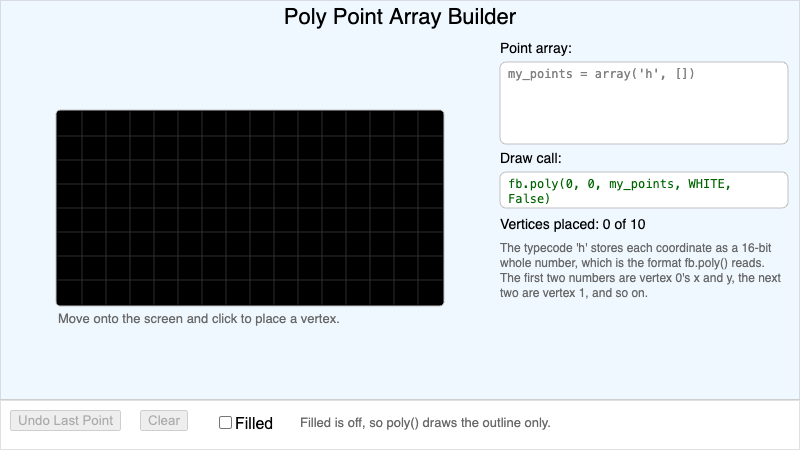Poly Point Array Builder</a>
  <a href="potentiometer-adc-mapping-visualizer/" title="Potentiometer ADC Mapping Visualizer" style="display:block;border:1px solid #e3e7ec;border-radius:8px;overflow:hidden;text-decoration:none;color:inherit;box-shadow:0 1px 3px rgba(0,0,0,0.08);">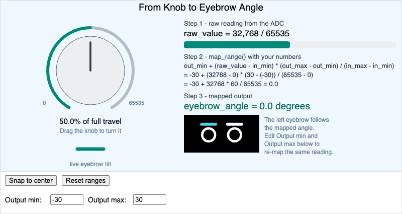Potentiometer ADC Mapping Visualizer</a>
  <a href="predict-return-value-tracer/" title="Predict the Return Value Tracer" style="display:block;border:1px solid #e3e7ec;border-radius:8px;overflow:hidden;text-decoration:none;color:inherit;box-shadow:0 1px 3px rgba(0,0,0,0.08);">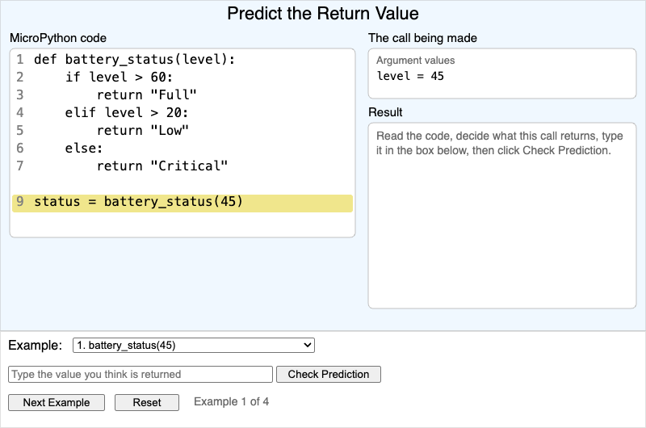Predict the Return Value Tracer</a>
  <a href="pull-up-resistor-simulator/" title="Pull-Up Resistor and Button Simulator" style="display:block;border:1px solid #e3e7ec;border-radius:8px;overflow:hidden;text-decoration:none;color:inherit;box-shadow:0 1px 3px rgba(0,0,0,0.08);">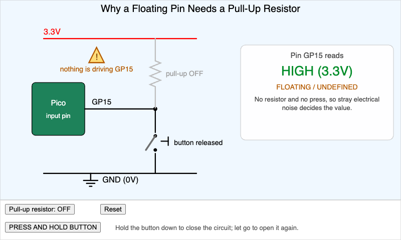Pull-Up Resistor and Button Simulator</a>
  <a href="quadrant-fill-code-explorer/" title="Quadrant Fill Code Explorer" style="display:block;border:1px solid #e3e7ec;border-radius:8px;overflow:hidden;text-decoration:none;color:inherit;box-shadow:0 1px 3px rgba(0,0,0,0.08);">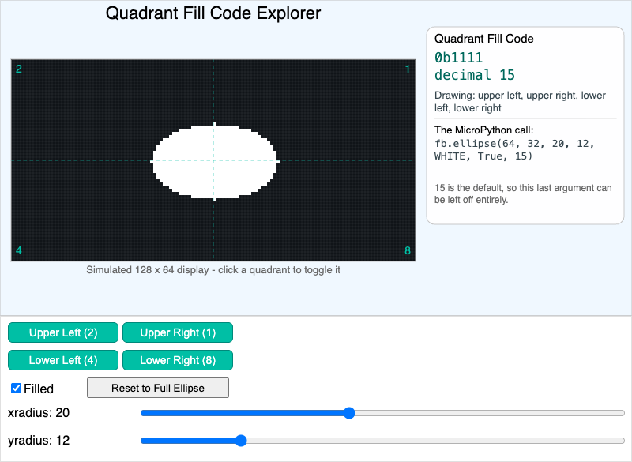Quadrant Fill Code Explorer</a>
  <a href="rgb565-bit-packing-visualizer/" title="RGB565 Bit-Packing Visualizer" style="display:block;border:1px solid #e3e7ec;border-radius:8px;overflow:hidden;text-decoration:none;color:inherit;box-shadow:0 1px 3px rgba(0,0,0,0.08);">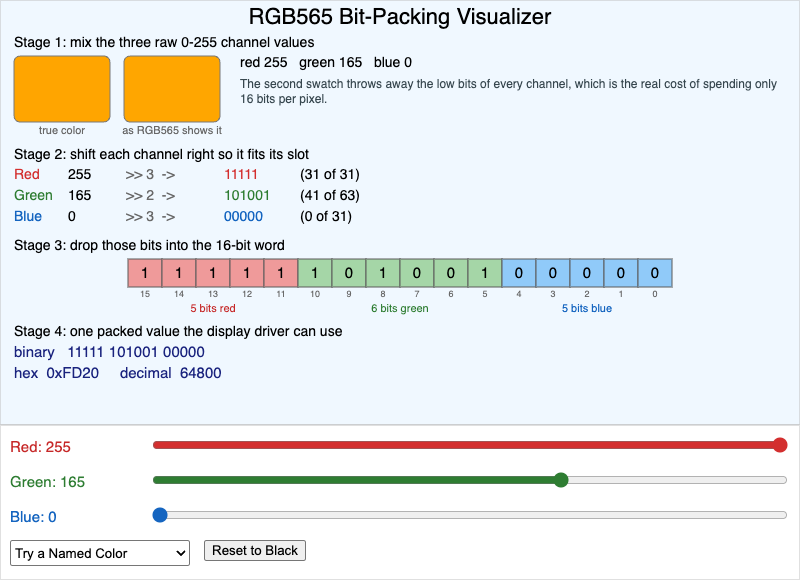RGB565 Bit-Packing Visualizer</a>
  <a href="robot-funding-price-outcome-chart/" title="Robot Price and Funding Comparison Chart" style="display:block;border:1px solid #e3e7ec;border-radius:8px;overflow:hidden;text-decoration:none;color:inherit;box-shadow:0 1px 3px rgba(0,0,0,0.08);">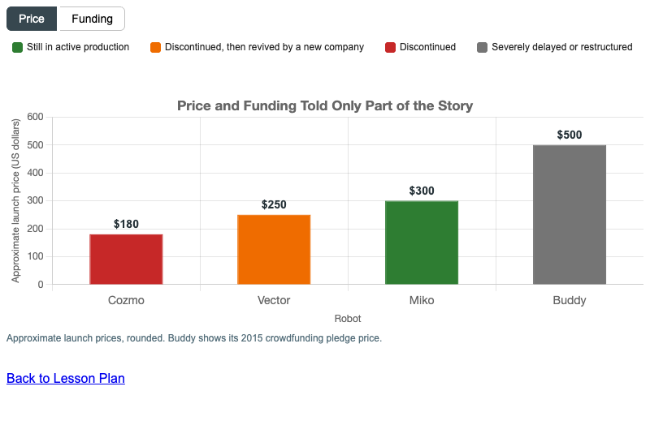Robot Price and Funding Comparison Chart</a>
  <a href="round-display-safe-area-planner/" title="Round Display Safe-Area Layout Planner" style="display:block;border:1px solid #e3e7ec;border-radius:8px;overflow:hidden;text-decoration:none;color:inherit;box-shadow:0 1px 3px rgba(0,0,0,0.08);">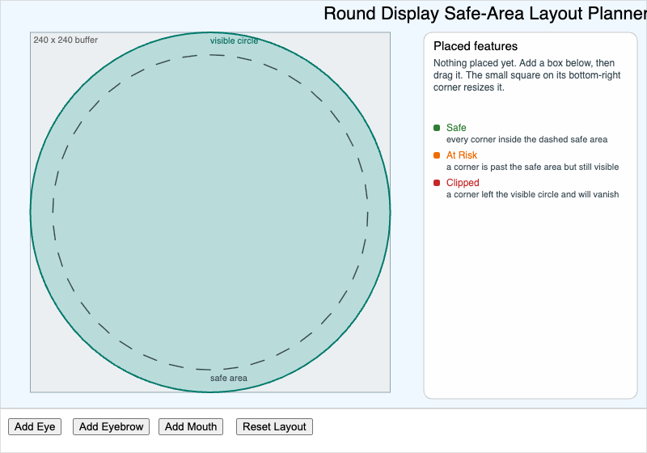Round Display Safe-Area Layout Planner</a>
  <a href="expression-rubric-rater/" title="Rubric Rater — Score This Expression" style="display:block;border:1px solid #e3e7ec;border-radius:8px;overflow:hidden;text-decoration:none;color:inherit;box-shadow:0 1px 3px rgba(0,0,0,0.08);">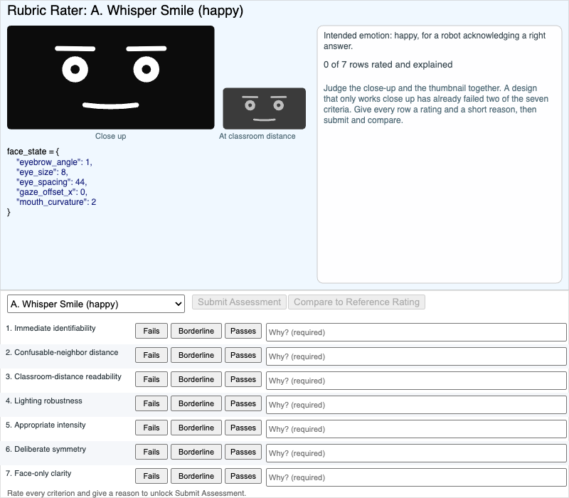Rubric Rater — Score This Expression</a>
  <a href="robot-face-timeline-explorer/" title="Screen-Based Robot Face Timeline" style="display:block;border:1px solid #e3e7ec;border-radius:8px;overflow:hidden;text-decoration:none;color:inherit;box-shadow:0 1px 3px rgba(0,0,0,0.08);">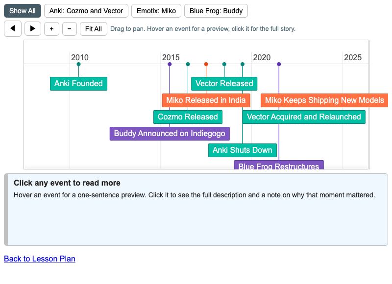Screen-Based Robot Face Timeline</a>
  <a href="sleep-vs-ticks-button-miss-simulator/" title="Sleep vs Ticks Button Miss Simulator" style="display:block;border:1px solid #e3e7ec;border-radius:8px;overflow:hidden;text-decoration:none;color:inherit;box-shadow:0 1px 3px rgba(0,0,0,0.08);">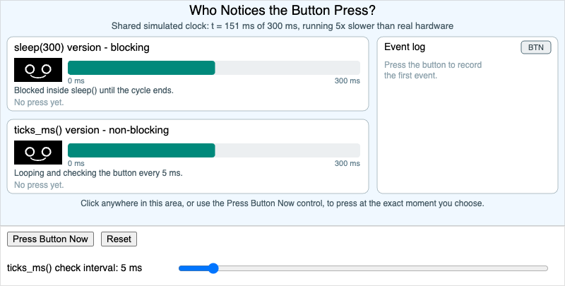Sleep vs Ticks Button Miss Simulator</a>
  <a href="spi-i2c-bus-explorer/" title="SPI vs I2C Bus Explorer" style="display:block;border:1px solid #e3e7ec;border-radius:8px;overflow:hidden;text-decoration:none;color:inherit;box-shadow:0 1px 3px rgba(0,0,0,0.08);">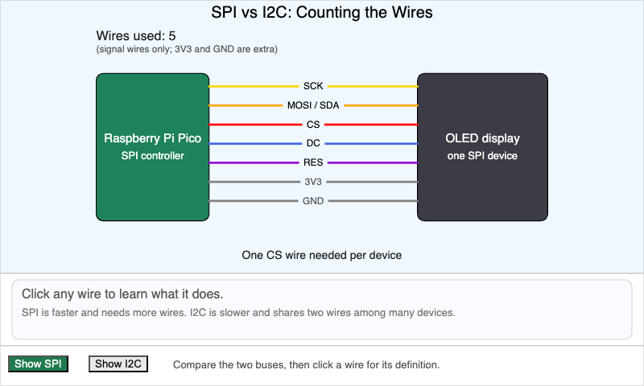SPI vs I2C Bus Explorer</a>
  <a href="valence-arousal-quadrant-plotter/" title="Valence-Arousal Quadrant Plotter" style="display:block;border:1px solid #e3e7ec;border-radius:8px;overflow:hidden;text-decoration:none;color:inherit;box-shadow:0 1px 3px rgba(0,0,0,0.08);">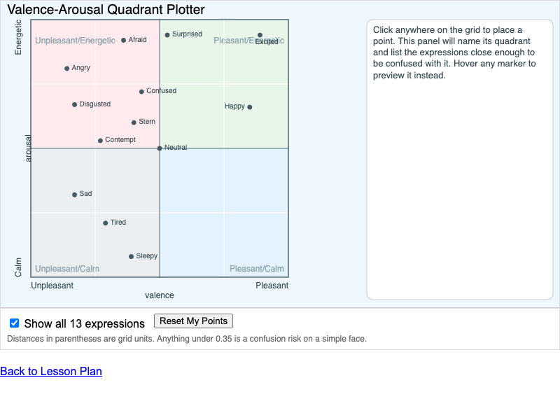Valence-Arousal Quadrant Plotter</a>

