# Bright Eyes, Closed Doors

Cover Image Prompt

(This is the Cover Image. Do not include this label in the image.)
Please generate a wide-landscape 16:9 graphic-novel cover in a polished
late-2010s technology-editorial illustration style. Do not depict logos,
trademarks, or readable brand names. In the center, show two small fictional
desktop robots inspired by the era but not reproducing any commercial product:
one white-and-red tracked robot with a square black face screen and cyan
animated eyes, and one charcoal-gray tracked robot with a rounded head,
gold-green animated eyes, a tiny lift arm, and a glowing back light. On the
left, the robots perform beneath warm launch-event spotlights as amazed
families watch; on the right, a teacher and four diverse high-school students
stand beside an open tool kit, a small microcontroller board, and a breadboard
display while a locked glass wall separates them from the commercial robots.
Include a charging dock, a fading battery icon, a cloud symbol breaking into
pixels, loose investment charts, and a hand-drawn open-source symbol on a
classroom whiteboard. Render the title “BRIGHT EYES, CLOSED DOORS” in large,
clean geometric lettering and the subtitle “A Robot Story About Delight,
Repair, and Trust” below it. Color palette: electric cyan, warm amber, charcoal,
white, and warning red. Emotional tone: wonder turning into thoughtful
resolve. Generate the image immediately without asking clarifying questions.

Narrative Prompt

This is a historically grounded educational case study for students in grades
9–12. It follows the 2016 launch of Anki's Cozmo, the 2018 launch of Vector,
and Anki's 2019 shutdown. The story celebrates the robots' expressive
animation, accessible programming tools, computer vision, and social presence
while examining limits that mattered to schools and makers: proprietary core
firmware, dependence on companion devices or company services, batteries that
were rechargeable but not designed for easy user replacement, difficult fleet
maintenance, and a venture-funded hardware business that could not continue.
It must not falsely imply that Cozmo lacked educational tools: its Python SDK,
Scratch-based Code Lab, and later Education Mode supported real classroom and
club use. The critique is that these openings did not give communities durable
control of the whole platform. A fictional teacher, Ms. Elena Rivera, and four
composite students carry the classroom thread. All image prompts avoid brand
names and exact product duplication while preserving the period, themes, and
visual contrast between polished consumer robots and open classroom hardware.

### Prologue – A Face That Looked Back

In 2016, a palm-sized robot looked up from a tabletop, narrowed its glowing
eyes, and seemed to form an opinion about the human watching it. Two years
later, its more independent sibling could recognize faces, respond to a wake
word, and find its own charger. These machines were engineering marvels—but
their story also became a warning: a robot can feel alive while the system
around it is surprisingly fragile.

## Panel 1: The Little Robot Wakes

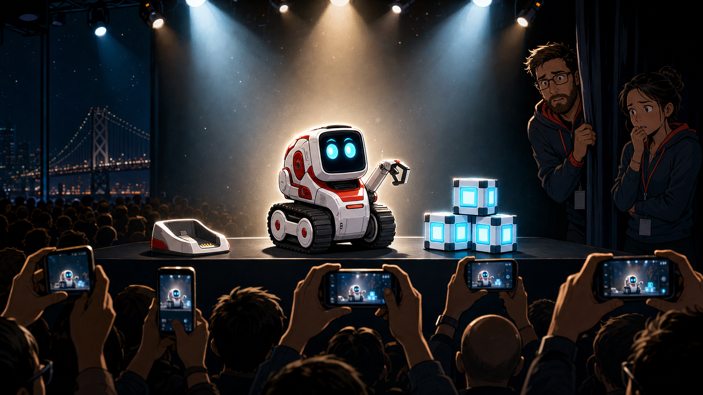

Image Prompt

(This is Panel 01. Do not include the panel number in the image.)
Please generate a wide-landscape 16:9 image in a polished late-2010s
technology-editorial graphic-novel style depicting panel 1 of 12. Do not
depict logos, trademarks, or readable brand names. Show a small fictional
white-and-red tracked desktop robot, distinct from any commercial product,
waking on a black presentation table in San Francisco in 2016. Its square
face screen displays two bright cyan eyes widening with curiosity. Include a
tiny lift arm, three glowing play cubes, rubber treads, a compact charging
cradle, a large audience silhouette, six smartphones raised for photos, and
two engineers watching nervously from the wings. Strong spotlights create a
halo around the robot while the background remains dark. Color palette:
electric cyan, glossy white, coral red, and deep navy. Emotional tone:
surprise, charm, and technological wonder. Generate the image immediately
without asking clarifying questions.

Cozmo arrived in 2016 and made advanced robotics look like play. Its tiny
screen needed only two animated eyes to suggest curiosity, frustration, pride,
and mischief. Motors, a camera, computer vision, sound design, and carefully
timed animation worked together so smoothly that people stopped seeing parts
and started seeing a character.

## Panel 2: Animation Becomes Personality

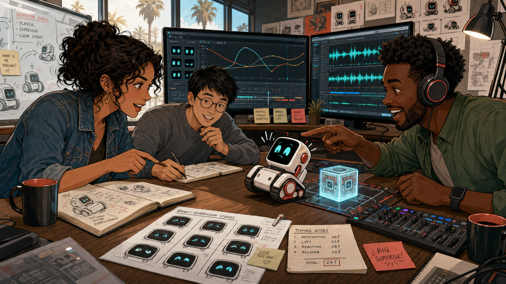

Image Prompt

(This is Panel 02. Do not include the panel number in the image.)
Please generate a wide-landscape 16:9 image in the same polished late-2010s
technology-editorial graphic-novel style depicting panel 2 of 12. Do not
depict logos, trademarks, or readable brand names. Show a design studio in
California in 2016 where an animator, a roboticist, and a sound designer
collaborate around a fictional white-and-red tracked robot. The animator is a
Latina woman in her thirties with curly dark hair and a denim jacket; the
roboticist is an Asian man with round glasses and a gray sweater; the sound
designer is a Black man wearing headphones and a green shirt. Include a
storyboard of eye shapes, motion curves on a monitor, a waveform display,
sketches of eyebrow-like screen poses, a cube interaction test, timing notes,
and the robot leaning backward in comic surprise. Color palette: cyan screens,
warm wood, coral accents, and graphite gray. Emotional tone: inventive,
playful, and intensely collaborative. Generate the image immediately without
asking clarifying questions.

The breakthrough was not one magical artificial intelligence. It was
coordination: eye shapes anticipated a movement, a chirp landed at the right
moment, and the little lift arm completed the gesture. Cozmo showed an entire
generation of students that an expressive robot face could be built from
simple shapes, good timing, and careful observation of human emotion.

## Panel 3: A Door Opens—Partway

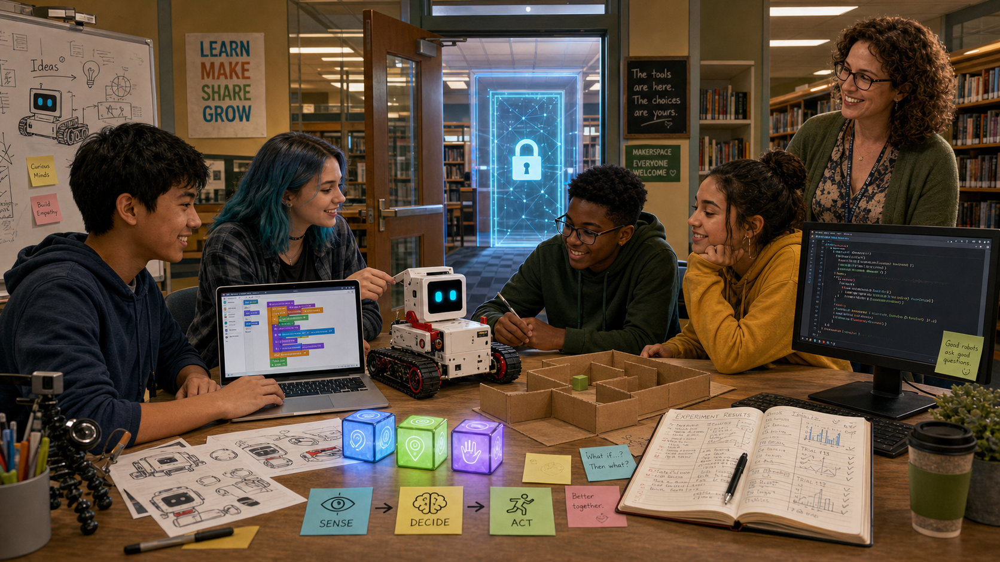

Image Prompt

(This is Panel 03. Do not include the panel number in the image.)
Please generate a wide-landscape 16:9 image in the same polished late-2010s
technology-editorial graphic-novel style depicting panel 3 of 12. Do not
depict logos, trademarks, or readable brand names. Set the scene in a public
library makerspace in 2017. Four diverse teenagers gather around a fictional
white-and-red tracked robot while a laptop shows colorful interlocking code
blocks and a second monitor shows short lines of text-based code with no
legible product names. Include a smiling librarian, a cardboard maze, three
interactive cubes, a webcam, printed robot-face sketches, sticky notes reading
“sense,” “decide,” and “act,” and an open notebook filled with experiment
results. A doorway behind them is open, but a second translucent door beyond
it bears an abstract padlock icon. Color palette: library amber, electric
cyan, paper white, and soft green. Emotional tone: empowerment mixed with a
hint of limitation. Generate the image immediately without asking clarifying
questions.

Anki did invite people to program Cozmo. A free Python SDK exposed impressive
high-level abilities, and Code Lab added a friendly block interface based on
Scratch. Makers, researchers, camps, and after-school clubs created real
projects—but access to useful behaviors was not the same as community
ownership of the firmware, app, hardware design, or long-term roadmap.

## Panel 4: Ms. Rivera Plans a Unit

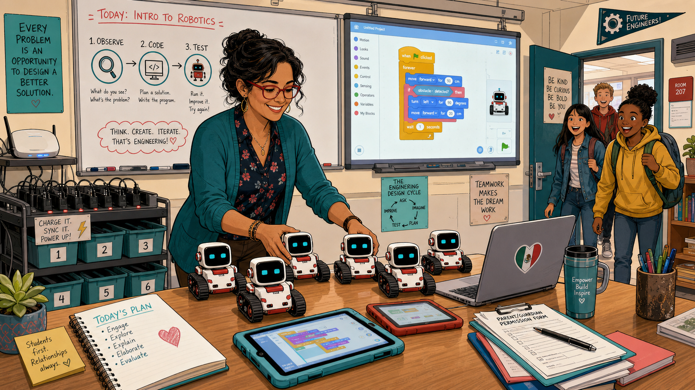

Image Prompt

(This is Panel 04. Do not include the panel number in the image.)
Please generate a wide-landscape 16:9 image in the same polished late-2010s
technology-editorial graphic-novel style depicting panel 4 of 12. Do not
depict logos, trademarks, or readable brand names. Show Ms. Elena Rivera, a
fictional Mexican American high-school robotics teacher in her early forties
with wavy dark hair, red glasses, and a teal cardigan, planning a lesson in a
Midwestern classroom in 2017. She smiles while arranging six fictional
white-and-red tracked robots beside tablets and laptops. Include a whiteboard
lesson flow labeled with simple icons for “observe,” “code,” and “test,” a
cart of charging docks, numbered storage bins, permission forms, a Wi-Fi access
point, a projected block-code workspace, and students entering with excited
expressions. Color palette: teal, cyan, warm beige, and coral. Emotional tone:
hopeful, organized, and energetic. Generate the image immediately without
asking clarifying questions.

Ms. Elena Rivera saw the educational promise immediately. Students could
connect code to motion, vision, sound, and expression in one memorable
machine. Yet a classroom is not a product demo: every robot needs charging,
pairing, compatible devices, accounts, updates, storage, and a lesson that
still works when thirty students arrive at once.

## Panel 5: The More Independent Sibling

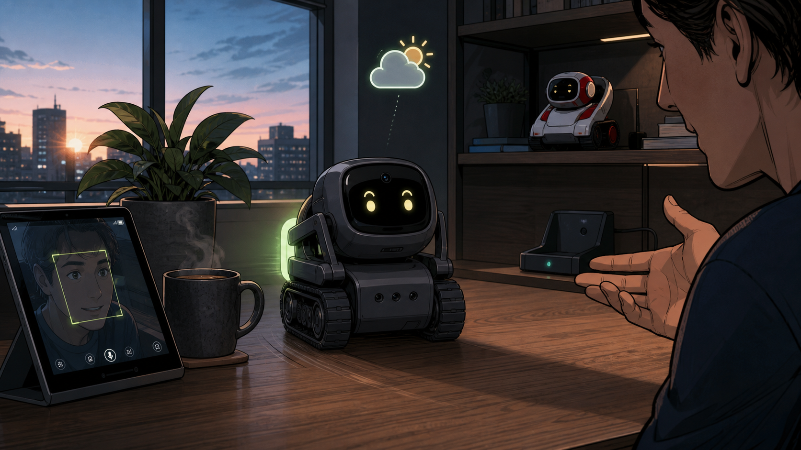

Image Prompt

(This is Panel 05. Do not include the panel number in the image.)
Please generate a wide-landscape 16:9 image in the same polished late-2010s
technology-editorial graphic-novel style depicting panel 5 of 12. Do not
depict logos, trademarks, or readable brand names. Set the scene in a modern
apartment in 2018. Show a small fictional charcoal-gray tracked desktop robot,
distinct from any commercial product, rolling away from its charging dock
toward a person who has just spoken. Its rounded black face screen displays
gold-green eyes, and its body includes a tiny lift arm, a camera aperture,
four microphone holes, rubber treads, and a softly glowing back light.
Include a face-detection outline reflected on a nearby tablet, a weather icon
floating as a visual metaphor, a houseplant, a coffee mug, a window at dawn,
and the white-and-red earlier robot resting on a shelf in the background.
Color palette: charcoal, gold-green, dawn blue, and warm walnut. Emotional
tone: capable, attentive, and quietly futuristic. Generate the image
immediately without asking clarifying questions.

Vector arrived in 2018 with more computing on board, a microphone array,
voice interaction, and the ability to return to its charger. It felt less
like a toy waiting for an app and more like a tiny roommate awake on the
desk. The engineering was bold: Anki had compressed perception, movement,
animation, and a social interface into a machine that fit in one hand.

## Panel 6: Makers Meet the Boundary

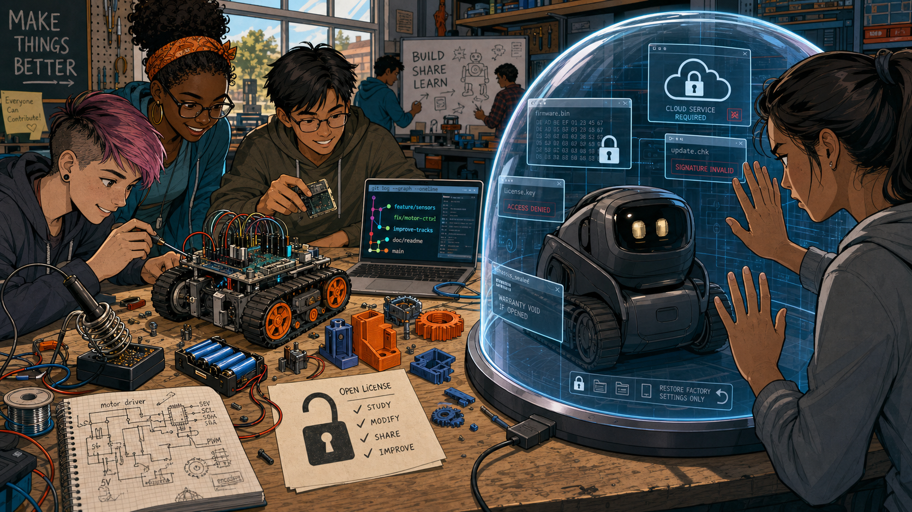

Image Prompt

(This is Panel 06. Do not include the panel number in the image.)
Please generate a wide-landscape 16:9 image in the same polished late-2010s
technology-editorial graphic-novel style depicting panel 6 of 12. Do not
depict logos, trademarks, or readable brand names. Show a community
makerspace in 2018 with a large workbench divided visually in two. On the
left, students freely modify an open microcontroller robot with exposed
headers, interchangeable battery holder, printed circuit diagrams, and
3D-printed parts. On the right, a fictional charcoal tracked consumer robot
sits intact beneath a transparent dome made of layered software windows and
abstract lock symbols. Include a soldering iron, multimeter, version-control
branch diagram, open license sheet, proprietary cloud icon, sealed chassis,
USB cables, and a student pressing both palms against the invisible boundary.
Color palette: maker-orange, cyan, charcoal, and cool glass blue. Emotional
tone: curiosity colliding with frustration. Generate the image immediately
without asking clarifying questions.

The maker movement asks a simple question: “Can we understand it, change it,
repair it, and share what we learn?” Cozmo's and Vector's SDKs offered useful
handles, but the community did not control the deepest layers when the robots
launched. That boundary mattered less during a successful demo and much more
when an app aged, a service changed, or a company stopped answering.

## Panel 7: Rechargeable, but Not Renewable

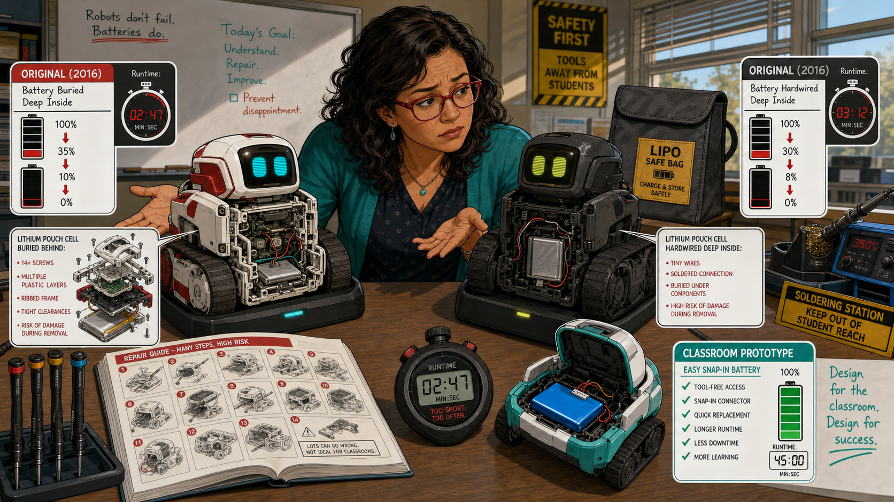

Image Prompt

(This is Panel 07. Do not include the panel number in the image.)
Please generate a wide-landscape 16:9 image in the same polished late-2010s
technology-editorial graphic-novel style depicting panel 7 of 12. Do not
depict logos, trademarks, or readable brand names. Show Ms. Rivera at a
classroom repair bench comparing two aging fictional tracked robots. Both sit
beside working charging docks, but their battery gauges fall rapidly from
full to empty. One transparent cutaway reveals a lithium pouch cell buried
behind many screws and nested plastic parts; the other shows a cell attached
by tiny wires deep inside the chassis. Include a safe battery storage bag,
precision screwdrivers, a soldering station pushed out of student reach, a
repair guide with twenty illustrated steps, a stopwatch showing a very short
run time, and an easy snap-in battery pack on an open classroom prototype for
contrast. Color palette: caution yellow, battery red, teal, and neutral gray.
Emotional tone: factual concern and preventable disappointment. Generate the
image immediately without asking clarifying questions.

The robots did have rechargeable lithium batteries—their docks made recharging
part of their charm. The problem was repairability: the batteries were sealed
inside and were not designed as simple, user-swappable classroom parts. As
cells aged and runtime collapsed, replacement demanded deep disassembly and,
for some repairs, soldering skills that a teacher could not reasonably require
from every student.

## Panel 8: Demo Day Becomes Troubleshooting Day

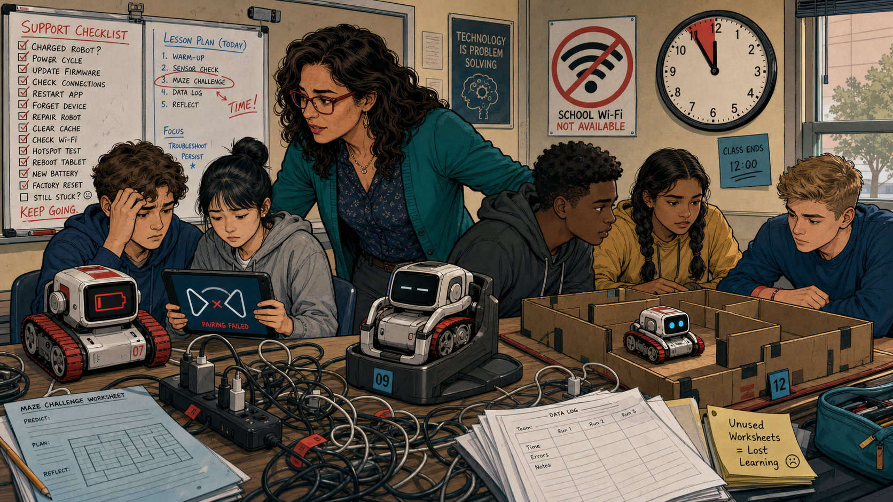

Image Prompt

(This is Panel 08. Do not include the panel number in the image.)
Please generate a wide-landscape 16:9 image in the same polished late-2010s
technology-editorial graphic-novel style depicting panel 8 of 12. Do not
depict logos, trademarks, or readable brand names. Show Ms. Rivera and four
recurring high-school students during a difficult class period in 2018. One
fictional robot shows a low-battery face, one tablet displays an abstract
pairing failure, another robot remains on its dock, and only one student team
has a robot moving through a cardboard maze. Include a wall clock with class
time nearly gone, tangled charging cables, a blocked school Wi-Fi icon,
device-number labels, an overflowing support checklist, unused lesson
worksheets, and Ms. Rivera calmly helping two groups at once. Color palette:
muted classroom beige, warning red, cyan, and tired blue. Emotional tone:
busy, sympathetic, and frustrating rather than chaotic. Generate the image
immediately without asking clarifying questions.

Some teachers and clubs integrated Cozmo successfully, and Education Mode
later addressed several practical needs. But enthusiasm could not erase fleet
management. A lesson built around a consumer app and specialized hardware was
harder to sustain than one built on ordinary files, replaceable parts, and
offline tools that a school could preserve for the next semester.

## Panel 9: The Mountain of Money

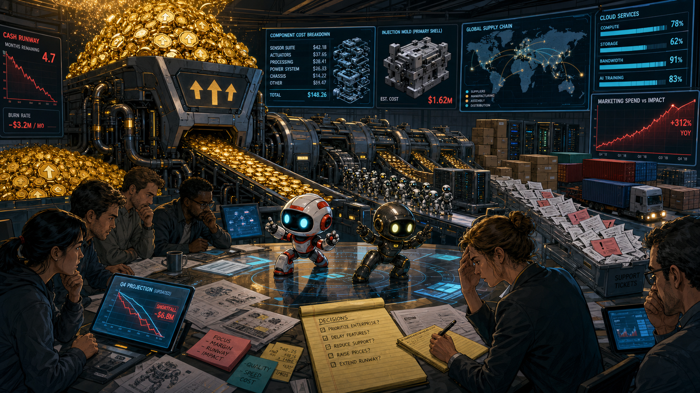

Image Prompt

(This is Panel 09. Do not include the panel number in the image.)
Please generate a wide-landscape 16:9 image in the same polished late-2010s
technology-editorial graphic-novel style depicting panel 9 of 12. Do not
depict logos, trademarks, or readable brand names. Show a metaphorical
late-2018 boardroom where a mountain of glowing investment tokens pours
through a machine labeled only with abstract upward arrows. At the far end,
the machine outputs tiny complex robots, retail boxes without branding,
server racks, support tickets, and shipping containers. Include engineers
reviewing component costs, an expensive injection mold, a world map of supply
chains, cloud-service meters, a steep marketing chart, a narrowing cash
runway, and two beloved fictional robots performing on the conference table.
Color palette: metallic gold, corporate navy, cyan, and warning crimson.
Emotional tone: impressive scale shadowed by financial pressure. Generate the
image immediately without asking clarifying questions.

Anki raised roughly $200 million in venture funding across its life. That
money paid for exceptional engineers, animators, custom hardware, manufacturing
tools, cloud systems, marketing, and global retail. But venture capital is not
the same as a sustainable loop: each complex robot had to generate enough
margin and continuing revenue to support the people and services behind it.

## Panel 10: The Lights Go Out

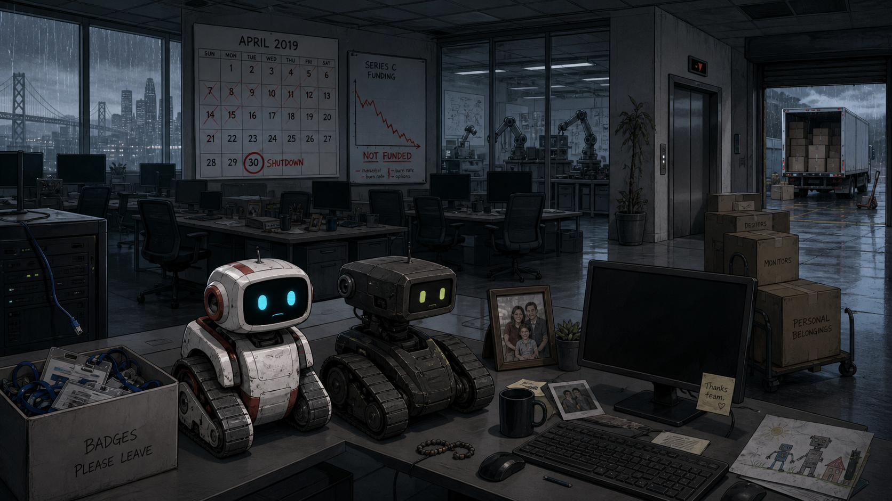

Image Prompt

(This is Panel 10. Do not include the panel number in the image.)
Please generate a wide-landscape 16:9 image in the same polished late-2010s
technology-editorial graphic-novel style depicting panel 10 of 12. Do not
depict logos, trademarks, or readable brand names. Show a San Francisco
robotics office after an abrupt shutdown in spring 2019. Rows of desks are
empty, monitors are dark, employee badges lie in a collection box, and moving
cartons sit beside an elevator. In the foreground, fictional white-and-red
and charcoal tracked robots remain awake on a desk, their screen eyes small
and uncertain. Include a calendar marked April 2019, a failed financing chart,
an unplugged server cable, family photos left beside keyboards, a silent
prototype lab behind glass, a loading dock with unsold boxes, and rain on the
windows. Color palette: desaturated blue-gray, faint cyan, cardboard brown,
and a thin line of red. Emotional tone: sudden loss, uncertainty, and empathy
for the people affected. Generate the image immediately without asking
clarifying questions.

In April 2019, a final financing effort failed and Anki shut down, laying off
its staff. The robots had not suddenly become less innovative, nor had their
owners stopped caring. The organization needed to keep hardware, software,
support, and services alive—and the capital that had accelerated the dream
could not guarantee its continuation.

## Panel 11: The Community Keeps a Spark

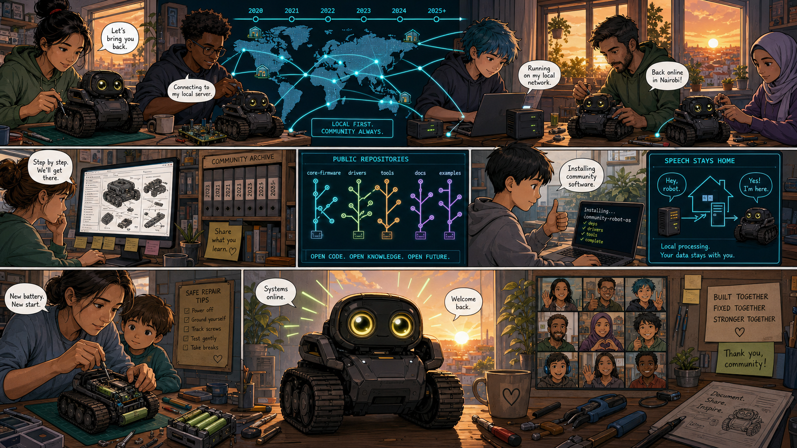

Image Prompt

(This is Panel 11. Do not include the panel number in the image.)
Please generate a wide-landscape 16:9 image in the same polished late-2010s
technology-editorial graphic-novel style depicting panel 11 of 12. Do not
depict logos, trademarks, or readable brand names. Show a global online
community from 2020 through the mid-2020s as a hopeful montage. Makers in
home workshops connect fictional charcoal tracked robots to small local
servers; another person studies a repair guide; a student installs community
software; and a parent carefully replaces a worn battery. Include a world map
linked by cyan lines, public code repositories with abstract branching icons,
a single-board computer, local speech bubbles that do not travel to a cloud,
precision tools, archived documentation, a resurrected robot opening its
bright eyes, and a sunrise beyond workshop windows. Color palette: hopeful
cyan, sunrise orange, charcoal, and fresh green. Emotional tone: determined,
resourceful, and communal. Generate the image immediately without asking
clarifying questions.

The story did not end with the shutdown. A later owner offered developer
programs and a local-server “escape pod,” while independent makers built
repair guides, archives, and community-controlled alternatives. Their work
proved the appetite for openness—but it also showed how much harder liberation
becomes when access, repair, and local operation are added after a product's
original design.

## Panel 12: The Classroom Builds for Tomorrow

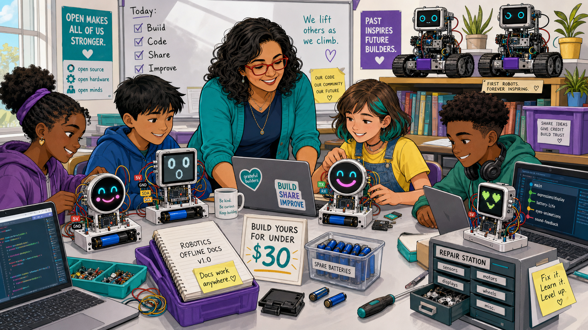

Image Prompt

(This is Panel 12. Do not include the panel number in the image.)
Please generate a wide-landscape 16:9 image in the same polished late-2010s
technology-editorial graphic-novel style depicting panel 12 of 12. Do not
depict logos, trademarks, or readable brand names. Show Ms. Rivera and the
four recurring diverse students in a bright present-day classroom building
their own expressive robot-face projects. Each project uses a small
microcontroller board, breadboard, inexpensive screen, clearly labeled wires,
and a snap-in rechargeable battery holder. One round color display smiles,
one monochrome display looks surprised, and students edit shared source code
on ordinary laptops. Include printed open licenses, a parts-price sign under
thirty dollars, spare batteries, a repair drawer, offline documentation,
version-control branches, and the two older fictional tracked robots watching
from a shelf as honored inspirations. Color palette: bright teal, purple,
sunny yellow, clean white, and cyan. Emotional tone: agency, gratitude, and
durable optimism. Generate the image immediately without asking clarifying
questions.

Ms. Rivera's students keep the best lesson from Cozmo and Vector: a few
well-drawn eyes can make a machine feel present. Then they add the lessons the
business story taught them—open code, common parts, offline operation,
replaceable power, exportable student work, and a budget that can survive
without another funding round. Innovation is not only what a robot can do on
launch day; it is who can keep learning from it years later.

### Epilogue – Delight Needs a Durable Foundation

Cozmo and Vector deserve to be remembered as breakthroughs in expressive
consumer robotics. Their creators made hard technology approachable and gave
teachers, students, researchers, and makers unusually powerful programming
tools. Their limits do not erase that achievement; they reveal the difference
between accessible features and an ecosystem a community can truly maintain.

| Challenge | How the Anki robots responded | Lesson for today |
|-----------|--------------------------------|------------------|
| Making a robot feel alive | Combined animated eyes, sound, motion, and timing | Expressiveness comes from coordinated design, not facial detail alone |
| Inviting students to program | Offered a Python SDK and Scratch-based Code Lab | A friendly API can turn research-grade abilities into student experiments |
| Supporting classrooms over many years | Relied on consumer devices, specialized hardware, and company stewardship | Schools need offline options, fleet tools, stable exports, and long support horizons |
| Aging rechargeable batteries | Used charging docks, but not simple user-swappable battery modules | Consumable parts should be safe, documented, available, and easy to replace |
| Surviving the end of a company | Later owners and independent communities rebuilt parts of the ecosystem | Local operation and open governance work best when designed in from the start |
| Converting venture capital into continuity | Built remarkable products but could not sustain the full hardware-software business | Funding accelerates work; maintainability and recurring value sustain it |

### Call to Action

When you design your robot face, ask two sets of questions. First: “Will
people understand and enjoy it?” Then: “Can another student open it, repair
it, change it, and learn from it after I am gone?” The strongest invention
answers yes to both.

---

*“Make the eyes expressive—but make the design explainable.”*  
—Ms. Rivera, fictional classroom voice

*“A product becomes a platform when its community can carry it forward.”*  
—The Classroom Makers, original story line

*“Design for the day after launch.”*  
—The Classroom Makers, original story line

---

## Accuracy Note

Cozmo and Vector both used rechargeable internal lithium batteries and shipped
with charging docks. This story critiques their lack of easy,
user-replaceable battery modules—not a lack of rechargeable batteries. Cozmo
also had meaningful educational pathways, including a Python SDK, Code Lab,
and Education Mode. The classroom critique concerns long-term integration,
repair, fleet management, and community control rather than claiming that no
teacher ever used the robot successfully.

## References

1. [Wikipedia: Cozmo](https://en.wikipedia.org/wiki/Cozmo) - Overview of the 2016 robot, its design, and reception
2. [Wikipedia: Anki (American company)](https://en.wikipedia.org/wiki/Anki_%28American_company%29) - Company history and product timeline
3. [Wikipedia: Social robot](https://en.wikipedia.org/wiki/Social_robot) - Background on robots designed for social interaction
4. [Google: Anki's Code Lab uses Scratch Blocks](https://blog.google/products-and-platforms/products/education/ankis-new-coding-app-uses-scratch-blocks-help-anyone-program-their-cozmo-robot/) - Contemporary announcement of the educational block-coding environment
5. [Cozmo SDK documentation](https://cozmosdk.anki.bot/) - Preserved documentation for the Python programming interface
6. [Cozmo Quick Start Guide](https://fccid.io/2AAIC00007/User-Manual/User-Manual-3173044.pdf) - Regulatory user guide documenting the internal rechargeable lithium-polymer battery and charging platform
7. [iFixit: Cozmo battery replacement](https://www.ifixit.com/Guide/Anki%2BCozmo%2BBattery%2BReplacement/146656) - Multi-step repair guide illustrating the difficulty of reaching the internal battery
8. [Axios: Anki shuts down despite $200 million in funding](https://www.axios.com/2019/04/29/robotics-startup-anki-shutting-down-despite-200m-in-funding) - Contemporary report on the 2019 shutdown and financing failure
9. [Digital Dream Labs: Vector developer tools](https://support.anki.bot/article/361-vector-developer-tools) - Documentation of later OSKR, Escape Pod, and developer-tool efforts
10. [Wire-pod project](https://github.com/kercre123/wire-pod) - Independent open-source local voice server created by the Vector community
11. [Vector Robot Review 2025: Should You Buy It Now, and What Happens If You Skip the Subscription?](https://keyirobot.com/blogs/buying-guide/vector-robot-review-2025-should-you-buy-it-now-and-what-happens-if-you-skip-the-subscription?srsltid=AfmBOor4ZK85rnRl-9kC_cfYYfF2p1DsPJ1qUB0XNnPGQXSegBEKFXUX)