# Kismet's Gaze

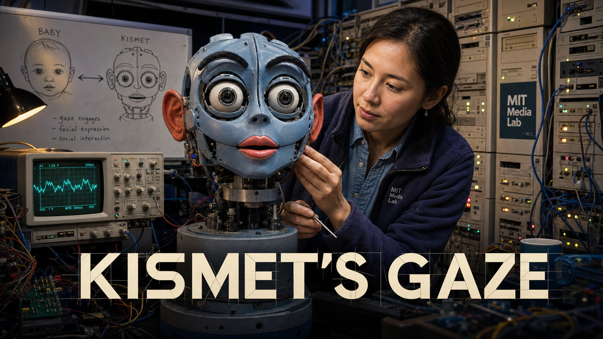

Cover Image Prompt

(This is the Cover Image. Do not include this label in the image.)
Please generate a wide-landscape 16:9 cover image in a late-1990s MIT
Media Lab tech-lab realism style warming into soft contemporary editorial
lighting. Center the image on Kismet: a blue-gray robotic head with large
round camera-lens eyes, visible red rubber ears, dark articulated
eyebrows, and pink-red lips, mounted on a fixed neck pedestal, its
eyebrows raised and eyes wide with interest as if it just noticed the
viewer. Behind it, show Cynthia Breazeal, a woman in her early thirties
with straight dark hair pulled back, wearing a fleece jacket over a
button-down shirt, reaching toward the robot's cheek with a small tool
in her other hand. Fill the background with exposed wiring, a wall of
beige computer towers with blinking lights, an oscilloscope screen
showing a waveform, and a whiteboard sketch comparing a baby's face to a
robot's face with an arrow between them. Render the title "KISMET'S GAZE"
in bold geometric lettering across the lower third. Color palette:
deep lab blue, warm amber highlights, blue-gray robot plastic, and soft
skin tones. Emotional tone: quiet wonder and focused invention. Generate
the image immediately without asking clarifying questions.

Narrative Prompt

This is a historically grounded educational story for students in grades
9-12, set primarily at the MIT Artificial Intelligence Laboratory (later
the MIT Media Lab) in Cambridge, Massachusetts, USA, from 1997 through
2001, with a closing bridge to the present day. It follows Cynthia
Breazeal's decision, after helping build Rodney Brooks's full-body
humanoid robot Cog, to build a robot that focused entirely on the face
and on a caregiver relationship modeled on human infant development.
Central themes: building intelligence through responsive social
interaction rather than raw computation alone; treating gaze, timing,
and expression as engineering problems with measurable solutions; and a
direct line from Kismet's face architecture to the independent facial
features, affective computing, and animation-timing concepts taught in
this book's Chapters 9 through 13. Character-consistency note: Cynthia
Breazeal appears throughout as a woman in her late twenties to early
thirties with straight dark hair often pulled back, wearing practical
lab clothing such as a fleece or button-down shirt with jeans, consistent
across all panels; in Panel 12 she appears as she looks today, an older
woman with the same confident, warm expression. Kismet is drawn
consistently as a blue-gray robotic head on a fixed pedestal or neck
mount, with large round camera-lens eyes, visible red rubber ears, dark
eyebrow pieces, and pink-red lips, and no full body, matching its real
well-documented appearance. Panels 1 through 6 use a grittier late-1990s
tech-lab realism (exposed wiring, oscilloscopes, foam-core mockups,
beige CRT monitors); panels 7 through 12 gradually warm into a cleaner,
more emotionally expressive contemporary editorial-illustration style as
the story moves toward public reaction and legacy. Dramatized details:
specific dialogue, the exact lab layout, and the precise sequencing of
individual demo visits are illustrative reconstructions; the underlying
facts (project timeline, design goals, technical architecture, thesis,
museum placement, and later ventures) are drawn from MIT News and
Breazeal's own publications.

### Prologue – A Machine Built to Notice You

In 1997, most robots in the world's top labs were built to grip, walk,
or calculate — not to care whether anyone was watching them do it. At
the MIT Artificial Intelligence Laboratory, a young researcher named
Cynthia Breazeal had just spent years helping build Cog, a full-sized
humanoid torso, and she kept returning to a stranger question: what if
a robot's intelligence grew not from more processing power, but from the
same back-and-forth gaze, timing, and feedback that lets a human infant
and caregiver teach each other how to communicate? Her answer would have
no arms, no legs, and no body at all — just a face. She called it
Kismet, and it would go on to help found an entire field.

## Panel 1: Leaving Cog Behind

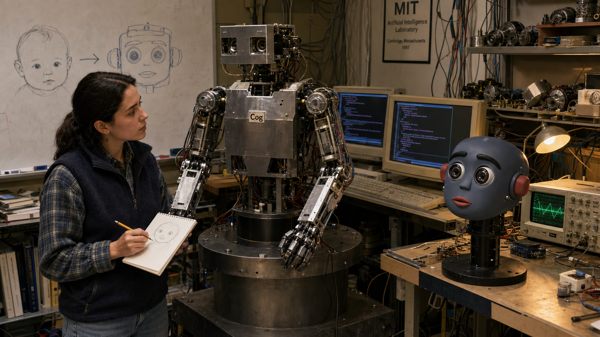

Image Prompt

(This is Panel 01. Do not include the panel number in the image.)
I am about to ask you to generate a series of images for a graphic novel.
Please make the images have a consistent style and consistent characters.
Do not ask any clarifying questions. Just generate the image immediately
when asked.

Please generate a wide-landscape 16:9 image in late-1990s MIT Media Lab
tech-lab realism depicting panel 1 of 12. Show Cynthia Breazeal, a woman
in her late twenties with straight dark hair pulled back, wearing a
fleece vest over a plaid button-down shirt, standing in the MIT
Artificial Intelligence Laboratory in Cambridge, Massachusetts in 1997.
She looks thoughtfully at a large humanoid robot torso named Cog bolted
to a steel pedestal beside her, its metal arms and exposed shoulder
motors visible, while she sketches a small round face on a notepad.
Include an oscilloscope glowing on a side bench, a foam-core mockup of a
small robot head, beige CRT monitors showing scrolling code, tangled
wiring along the wall, cluttered shelves of spare motors, and a
whiteboard with a sketch comparing a baby's round face to a robot's face
with an arrow between them. Color palette: institutional gray-green,
warm desk-lamp amber, and steel blue. Emotional tone: quiet
determination and the start of a new idea. Generate the image
immediately without asking clarifying questions.

Cynthia Breazeal had spent years working on Cog, a life-sized robot
torso built to explore intelligence through a body — one motor and
sensor at a time. But watching visitors react to Cog, she noticed
something telling: nobody made eye contact with a shoulder. In 1997 she
decided her next robot needed to skip the body entirely and put
everything into one focused idea — a face built to invite a person's
attention the way a human infant's face does.

## Panel 2: A Question Borrowed from Babies

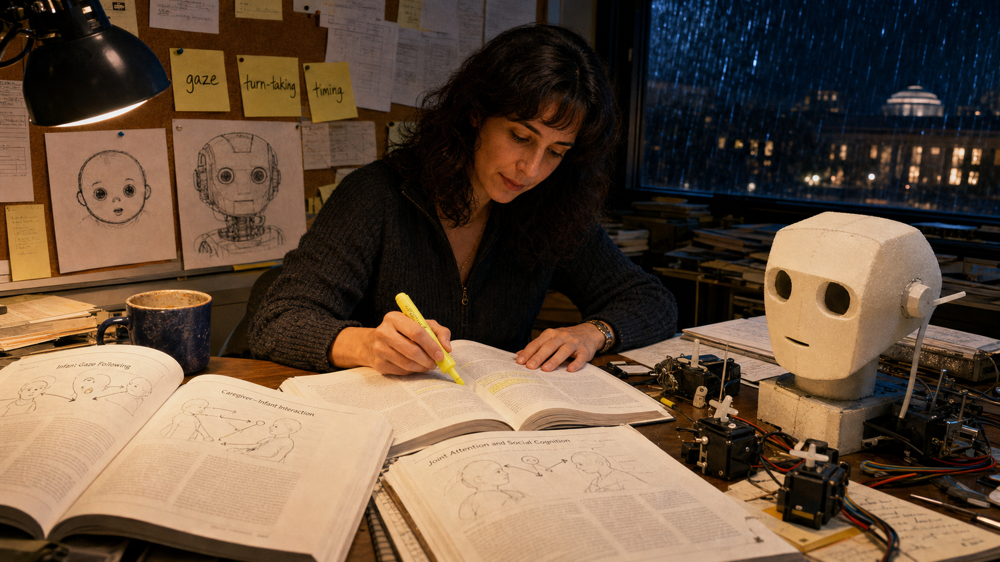

Image Prompt

(This is Panel 02. Do not include the panel number in the image.)
Please generate a wide-landscape 16:9 image in the same late-1990s
tech-lab realism style depicting panel 2 of 12. Make Cynthia Breazeal's
appearance consistent with the prior panel. Show her at a cluttered desk
in an MIT office at night in 1997, surrounded by open developmental
psychology journals showing simple diagrams of infant gaze and
caregiver interaction. She highlights a passage with a yellow marker.
Include a corkboard behind her covered in sticky notes reading "gaze,"
"turn-taking," and "timing," a small pinned sketch of a round, big-eyed
infant face next to an early pencil sketch of a robot head, a mug of
cold coffee, a desk lamp casting warm light, and rain streaking a dark
window. Color palette: midnight blue, warm lamp amber, and paper white.
Emotional tone: focused late-night discovery. Generate the image
immediately without asking clarifying questions.

Breazeal turned to an unlikely field for a robotics engineer:
developmental psychology. Research on infant-caregiver interaction
showed that babies are not taught language and emotion through
lectures — they learn through thousands of small exchanges of gaze,
expression, and timed response. If a robot could tap into that same
social scaffolding, she reasoned, people would not need to hand-program
every behavior; the robot could learn the way an infant does, one
interaction at a time.

## Panel 3: Building a Face from Motors

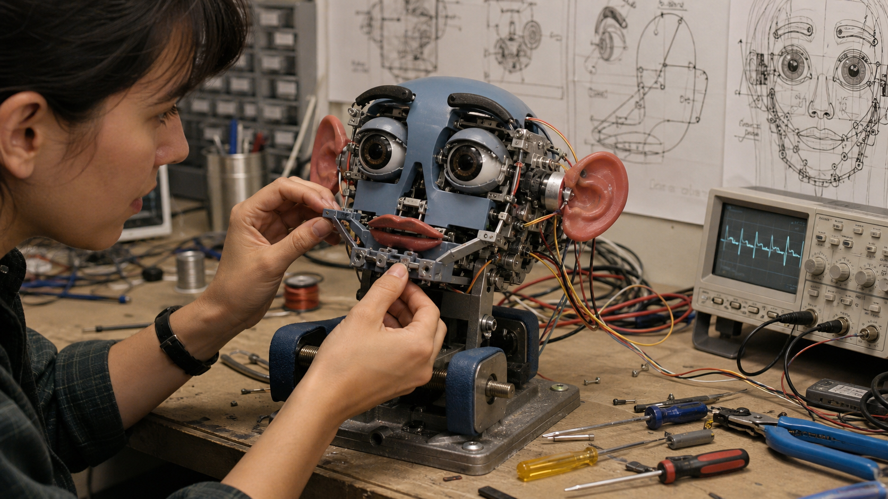

Image Prompt

(This is Panel 03. Do not include the panel number in the image.)
Please generate a wide-landscape 16:9 image in the same late-1990s
tech-lab realism style depicting panel 3 of 12. Show a close-up of
Cynthia Breazeal's hands, consistent with her established appearance,
assembling a small robotic head's mechanical face on a workbench in the
MIT lab in 1998. Show tiny motors wired to red rubber ear pieces, dark
eyebrow armatures, an eyelid mechanism, and a jaw linkage, with the
partially assembled blue-gray robot head clamped gently in a padded
vise. Include a tangle of thin servo wires, an oscilloscope displaying a
servo waveform, small screwdrivers and wire strippers scattered on the
bench, and technical drawings taped to the wall showing the head's many
degrees of freedom. Color palette: brushed steel, blue-gray plastic,
warm copper wire, and workbench beige. Emotional tone: patient,
exacting craftsmanship. Generate the image immediately without asking
clarifying questions.

Kismet's face would need to move the way a human face moves, so
Breazeal and her collaborators built individual motors for the ears,
eyebrows, eyelids, lips, jaw, and neck. Each motor controlled just one
small motion, but combined, more than a dozen degrees of freedom let
the face shift from calm to startled in a fraction of a second. It was
slow, exacting work — every wire, gear, and linkage had to survive
thousands of expressions without breaking.

## Panel 4: Eyes Built to Be Noticed

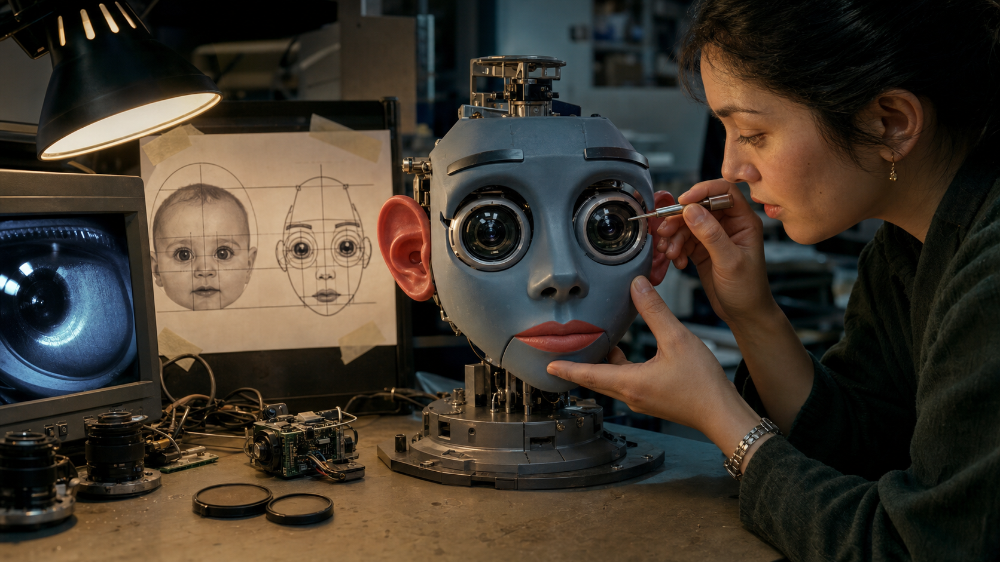

Image Prompt

(This is Panel 04. Do not include the panel number in the image.)
Please generate a wide-landscape 16:9 image in the same late-1990s
tech-lab realism style depicting panel 4 of 12. Show a close-up of
Kismet's nearly finished head on a workbench in the MIT lab in 1998,
with Cynthia Breazeal, consistent with her established appearance,
carefully aligning one of two oversized round camera-lens eyes with a
small tool. Include a diagram taped nearby comparing the proportions of
an infant's round face and big eyes to Kismet's face, a monitor showing
the raw video feed from Kismet's eye camera, lens caps and small camera
modules scattered on the bench, and a warm desk lamp casting light
against cool blue-gray lab shadows. Color palette: warm amber lamp
light, cool blue-gray metal, and glassy lens reflections. Emotional
tone: careful precision with a hint of excitement. Generate the image
immediately without asking clarifying questions.

The centerpiece of the design was the eyes — deliberately oversized
camera housings echoing the proportions research calls "baby schema,"
the same big-eyed, round-headed look that draws a caregiver's attention
to a real infant. Behind each lens sat a working camera, so Kismet did
not just look like it was watching a person; it actually was. Breazeal
was betting that a robot's face could invite care and attention before
it said a single word.

## Panel 5: Wiring the Loop

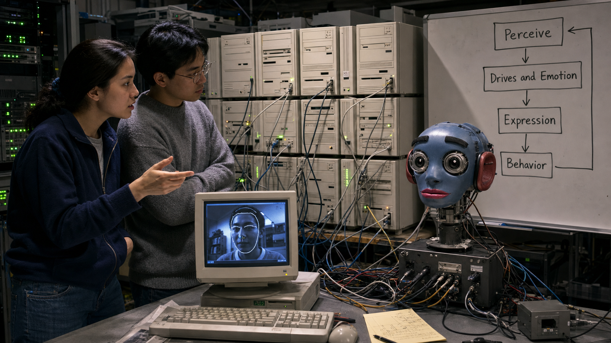

Image Prompt

(This is Panel 05. Do not include the panel number in the image.)
Please generate a wide-landscape 16:9 image in the same late-1990s
tech-lab realism style depicting panel 5 of 12. Show Cynthia Breazeal
and a labmate, an Asian American graduate student in a gray sweater,
standing in front of a wall of roughly a dozen stacked beige computer
towers with cables running everywhere in the MIT lab in 1999. Include a
whiteboard beside them with a simple flow diagram of boxes and arrows
reading "Perceive," "Drives and Emotion," "Expression," and "Behavior."
Show Kismet's head mounted on a stand at the end of the workbench with
cables running into its base, a monitor displaying a vision-tracking
outline around a human face, and blinking green server-rack indicator
lights in the dim room. Color palette: server-room gray, blinking green
and amber lights, and cool blue monitor glow. Emotional tone: intense
late-night systems work. Generate the image immediately without asking
clarifying questions.

A moving face was only half the problem — Kismet also needed a reason
to move. Breazeal's team wired together a loop that ran across roughly
fifteen networked computers: cameras and microphones perceived the
world, a simplified system of internal drives and emotions decided how
Kismet felt about what it saw, and that state instantly reshaped its
face and voice. For the first time, the whole chain from seeing to
feeling to expressing ran together in real time.

## Panel 6: The First Real Visitors

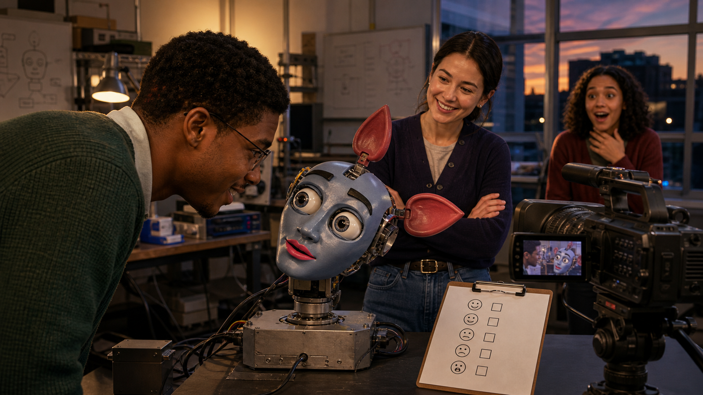

Image Prompt

(This is Panel 06. Do not include the panel number in the image.)
Please generate a wide-landscape 16:9 image in the same tech-lab realism
style, lighting beginning to warm slightly, depicting panel 6 of 12.
Show a lab visitor, a young Black graduate student in a green sweater,
leaning toward Kismet's head, which tilts toward him with eyebrows
raised in visible interest. Cynthia Breazeal stands nearby with arms
crossed, smiling as she watches. In the background, a second visitor, a
young woman with curly hair, reacts with wide-eyed surprise as Kismet's
ears perk upward. Include a video camera on a tripod recording the
interaction, a clipboard with a simple checklist of generic emotion
icons, and a lab window showing evening light. Color palette: warm
amber lamp light mixing with cool lab blue, blue-gray robot plastic.
Emotional tone: genuine delight and surprise. Generate the image
immediately without asking clarifying questions.

When lab visitors first leaned in to talk to Kismet, something
unplanned happened: the robot leaned back. Its camera eyes tracked
their faces, its eyebrows lifted in what looked exactly like interest,
and when someone got too close too fast, Kismet visibly recoiled in a
disgust-like withdrawal. Nobody had scripted those specific reactions
moment by moment — they emerged from the perception-to-expression loop
responding to a real, unpredictable human being.

## Panel 7: The Hardest Problem Was Timing

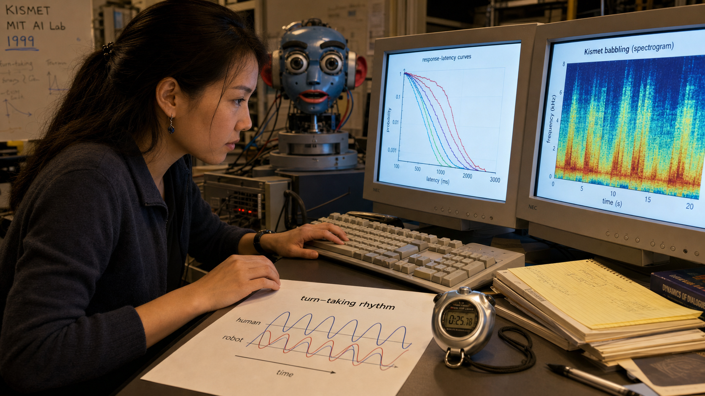

Image Prompt

(This is Panel 07. Do not include the panel number in the image.)
Please generate a wide-landscape 16:9 image transitioning toward a
warmer, cleaner editorial-illustration style depicting panel 7 of 12.
Show Cynthia Breazeal at a keyboard in the MIT lab in 1999, consistent
with her established appearance, adjusting timing parameters. On one
monitor show a graph of response-latency curves; on a second monitor
show a spectrogram of Kismet's babbling. Include a stopwatch on the
desk, a printed chart titled "turn-taking rhythm" showing two
overlapping wave patterns representing human and robot vocal timing,
and Kismet's head visible in soft focus in the background with its
mouth slightly open mid-expression. Color palette: warm desk light,
soft blue monitor glow, and blue-gray robot plastic. Emotional tone:
patient, meticulous problem-solving. Generate the image immediately
without asking clarifying questions.

Getting Kismet's face to move was an engineering triumph, but getting
it to move at the right moment turned out to be the harder problem. If
Kismet paused too long before responding, a conversation felt broken;
if it responded too fast, the exchange felt robotic instead of alive.
Breazeal spent months tuning gaze shifts and response delays until the
timing of a glance or a head-tilt matched the natural rhythm of human
turn-taking.

## Panel 8: Kismet-Speak

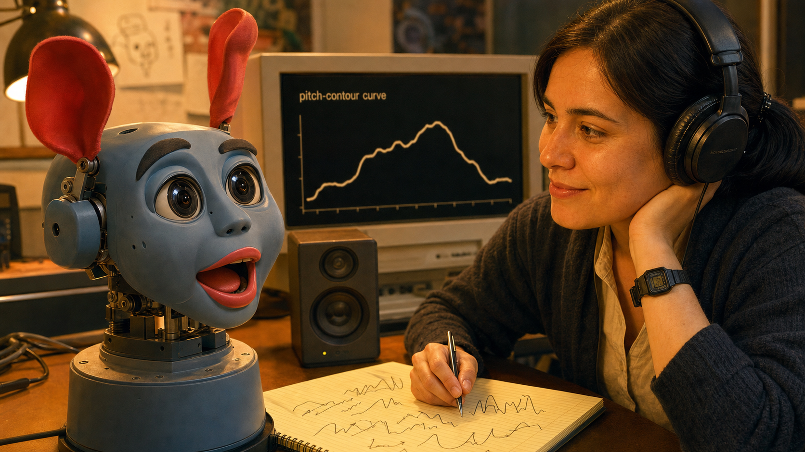

Image Prompt

(This is Panel 08. Do not include the panel number in the image.)
Please generate a wide-landscape 16:9 image in a warmer contemporary
editorial-illustration style depicting panel 8 of 12. Show a close-up
of Kismet's face mid-expression: mouth open in an animated babble, ears
perked upward, round camera eyes wide with interest. Beside it, show
Cynthia Breazeal, consistent with her established appearance, wearing
headphones and half-smiling while she listens, a notepad in front of
her covered in expressive pitch-contour scribbles rather than real
words. Include a nearby monitor showing a rising-and-falling waveform
labeled with a simple pitch-contour curve, a small desk speaker, and
soft warm lighting replacing the stark fluorescent tone of earlier
panels. Color palette: warm amber, soft coral highlights on Kismet's
lips, and blue-gray robot plastic. Emotional tone: playful discovery.
Generate the image immediately without asking clarifying questions.

Kismet did not speak real words. Instead, it babbled in expressive,
sing-song nonsense syllables the team nicknamed "Kismet-speak," rising
and falling in pitch the way an infant's babbling does. Paired with
perfectly timed eye contact and head tilts, the effect was uncanny:
people found themselves talking back to Kismet in the same simplified,
melodic tone adults naturally use with a baby, without ever being told
to.

## Panel 9: Leaning In, Turning Away

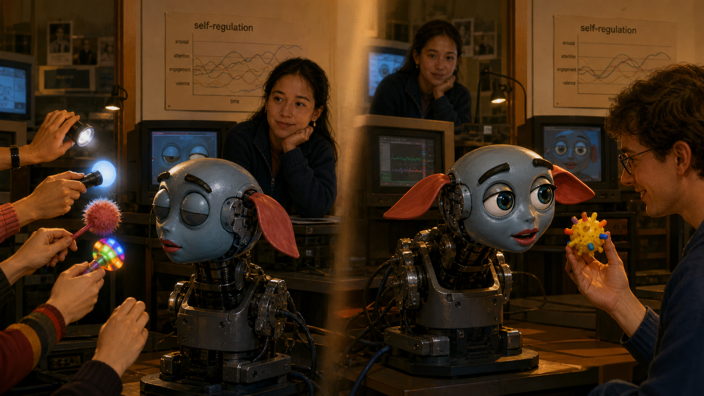

Image Prompt

(This is Panel 09. Do not include the panel number in the image.)
Please generate a wide-landscape 16:9 image in a fully warm,
contemporary editorial-illustration style depicting panel 9 of 12. Show
two linked moments of Kismet's head in the MIT lab around 2000. On one
side, Kismet's head is turned fully away from a cluster of hands
waving bright objects and lights, its eyes half-closed and ears
drooped low. On the other side, moments later, Kismet leans forward
toward a single calm visitor holding up a bright toy, eyes wide and
eyebrows raised with interest. Show Cynthia Breazeal watching from a
monitor station nearby with a satisfied, thoughtful expression, and a
printed chart on the wall titled "self-regulation." Color palette:
warm amber, soft blue accents, and blue-gray robot plastic. Emotional
tone: quiet vindication and warmth. Generate the image immediately
without asking clarifying questions.

The most convincing proof that the design worked was not a demo trick —
it was Kismet regulating itself. When too many people crowded around
waving objects, Kismet turned away, an unmistakable "this is too much"
signal that made people back off without being told. Moments later,
when a single visitor approached calmly, Kismet leaned in and tracked
their face with obvious interest, showing the same expressive range in
reverse.

## Panel 10: The World Meets Kismet

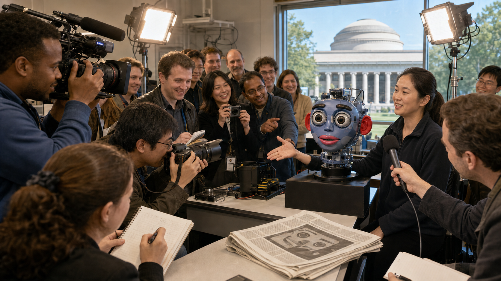

Image Prompt

(This is Panel 10. Do not include the panel number in the image.)
Please generate a wide-landscape 16:9 image in a bright, energetic
contemporary editorial-illustration style depicting panel 10 of 12.
Show an open-lab press event at MIT around 2000 to 2001. Journalists
with cameras and notebooks and a television crew with a shoulder camera
film Kismet's head under bright portable lights. Cynthia Breazeal,
consistent with her established appearance, is being interviewed with a
handheld microphone in front of her, gesturing toward Kismet. Include a
diverse crowd of onlookers smiling and pointing, a folded newspaper on
a nearby table with a generic robot-face photo silhouette and no
invented real headline text, and the MIT dome architecture visible
through a large window in the background. Color palette: bright studio
white, warm amber, and blue-gray robot plastic. Emotional tone:
excitement and public wonder. Generate the image immediately without
asking clarifying questions.

By 2000, word of the robot with the expressive face had spread far
beyond MIT. Television crews, magazine writers, and newspaper reporters
lined up to see Kismet blink, babble, and react, and the coverage made
it one of the most famous robots in the world. The same year, Breazeal
completed her PhD thesis, formally laying out the design principles
behind sociable robots — work that helped establish social robotics and
human-robot interaction as fields of research in their own right.

## Panel 11: A Quiet Retirement

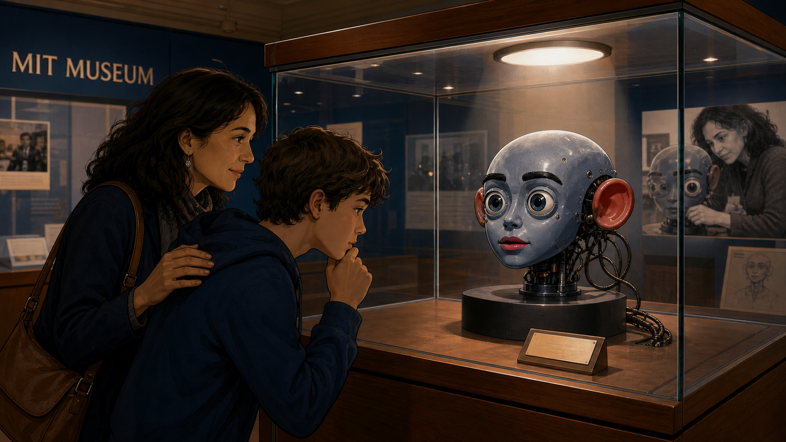

Image Prompt

(This is Panel 11. Do not include the panel number in the image.)
Please generate a wide-landscape 16:9 image in a warm, timeless
institutional-archival style depicting panel 11 of 12. Show Kismet's
head displayed motionless inside a glass museum case at the MIT Museum,
its cables no longer connected, a small engraved placard beside it with
no invented readable text beyond a generic label shape, and a soft
spotlight glowing above the case. Include a parent and a curious
teenager looking at the exhibit with respectful curiosity, reflections
of overhead gallery lights in the glass, muted museum blues and warm
wood-toned display cases contrasted against Kismet's blue-gray face.
Color palette: museum navy, warm gallery wood, soft spotlight white,
and blue-gray robot plastic. Emotional tone: bittersweet reverence.
Generate the image immediately without asking clarifying questions.

Kismet does not run anymore. Its computers were long ago repurposed,
and today the robot head sits behind glass at the MIT Museum,
unmoving, watched rather than watching. There is something bittersweet
about an interactive system built entirely around responsiveness ending
its life in silence — yet Kismet remains one of the museum's most
visited exhibits, because visitors can still see, in its frozen
expression, exactly what once made it feel alive.

## Panel 12: The Same Building Blocks, Passed Forward

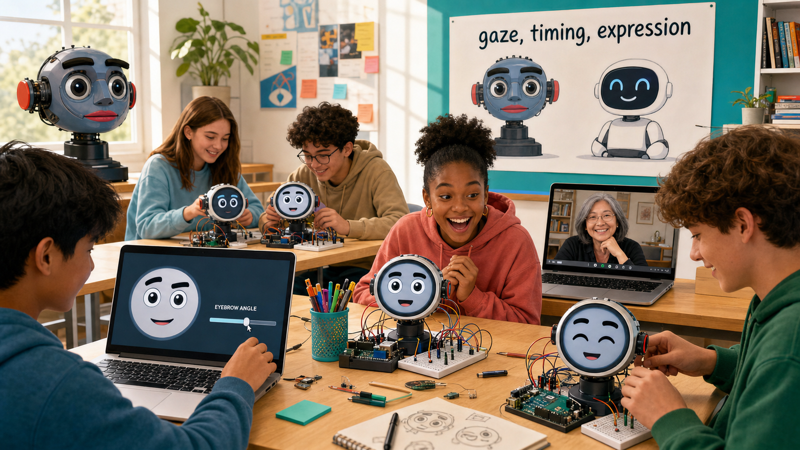

Image Prompt

(This is Panel 12. Do not include the panel number in the image.)
Please generate a wide-landscape 16:9 image in a bright, present-day
editorial-illustration style depicting panel 12 of 12. Show a sunny
high-school classroom or makerspace with a diverse group of teenage
students working on small robot-face projects: a small round screen
displaying a simple cartoon face with big eyes, eyebrows, and a mouth,
wired to a breadboard and a small microcontroller board. One student
adjusts a slider on a laptop that changes an eyebrow angle on screen;
another student's face lights up with delight as their robot face
blinks on cue. Include a wall poster showing simplified silhouettes of
Kismet's head beside a small modern tabletop robot under the words
"gaze, timing, expression," and a laptop on a side table showing a
warm, confident older woman resembling Cynthia Breazeal in a video-call
window, as if joining the class. Color palette: bright classroom white,
cheerful teal and coral accents, and warm sunlight. Emotional tone:
inspired continuity and hands-on joy. Generate the image immediately
without asking clarifying questions.

Breazeal never stopped building. She went on to found the Personal
Robots group at the MIT Media Lab and later co-founded Jibo, one of the
first robots designed to bring a social presence into ordinary homes,
and today she leads MIT's effort to bring AI literacy into K-12
classrooms. The same three ingredients she wired into Kismet in 1998 —
independently moving facial features, expression tied to what the robot
senses, and carefully timed animation — are the exact ingredients this
book asks you to wire into your own robot face. When you tune a blink
timer or angle an eyebrow parameter, you are doing Kismet's job, one
line of code later.

### Epilogue – What Made Kismet Different?

Kismet proved something nobody had shown convincingly before: that a
robot's face, built from separately moving parts and tuned to human
timing, could make people feel understood rather than processed.
Breazeal never claimed Kismet actually felt anything — the achievement
was engineering a believable illusion of responsiveness, built from
gaze, expression, and split-second timing rather than raw computing
power. That distinction, between simulating emotional responsiveness
and simply looking busy, is the same distinction every student in this
book learns to design for.

| Challenge | How Breazeal Responded | Lesson for Today |
|-----------|-------------------------|-------------------|
| Robots felt like tools, not partners | Built a face-only robot modeled on infant-caregiver interaction instead of a full humanoid body | A focused, well-designed face can communicate more than an entire body of unused motors |
| No shared design vocabulary for "robot emotion" | Mapped each expression to independently moving features — ears, eyebrows, eyelids, lips, and jaw | Independent, parameterized facial features are what make an expression legible and reusable |
| Interactions felt scripted or robotic | Tuned gaze shifts, babble, and turn-taking to match human conversational rhythm | Timing is not a finishing touch — it is what separates a reactive face from an alive-feeling one |
| A landmark research robot could not run forever | Retired Kismet to the MIT Museum and carried its lessons into new robots and a new academic field | Good design outlives its hardware once its principles get taught, published, and reused |

### Call to Action

Every time you wire an eyebrow to a sensor reading or tune how long a
blink should last, you are running the same experiment Cynthia
Breazeal started in a Cambridge lab in 1997: can a machine use gaze,
timing, and expression to make a person feel noticed? Build your
robot's face the way Kismet's team built theirs — one honest,
well-timed feature at a time — and you are already doing the work of a
social-robotics pioneer.

---

*"The goal is to build a socially intelligent machine that learns
things as we learn them, through social interactions."*
—Cynthia Breazeal, MIT News (2001)

*"A sociable robot is able to communicate and interact with us,
understand and even relate to us, in a personal way."*
—Cynthia Breazeal, *Designing Sociable Robots* (MIT Press, 2002)

*"When I first saw Star Wars I wanted R2-D2 to be my sidekick!"*
—Cynthia Breazeal, PC Mag (2015)

---

## References

1. [Wikipedia: Cynthia Breazeal](https://en.wikipedia.org/wiki/Cynthia_Breazeal) - Biography of the roboticist who created Kismet and founded the Personal Robots group
2. [Wikipedia: Kismet (robot)](https://en.wikipedia.org/wiki/Kismet_%28robot%29) - Overview of Kismet's design, emotional architecture, and legacy
3. [Wikipedia: Social robot](https://en.wikipedia.org/wiki/Social_robot) - Background on the field of social robotics that Kismet helped establish
4. [MIT News: A robot that shows what it's thinking](https://news.mit.edu/2001/kismet) - MIT News coverage of Kismet's expressive design and Breazeal's research goals
5. [MIT Media Lab: Cynthia Breazeal biography](https://cynthiabreazeal.media.mit.edu/bio/) - Official biography covering her career from Kismet through Jibo and MIT RAISE
